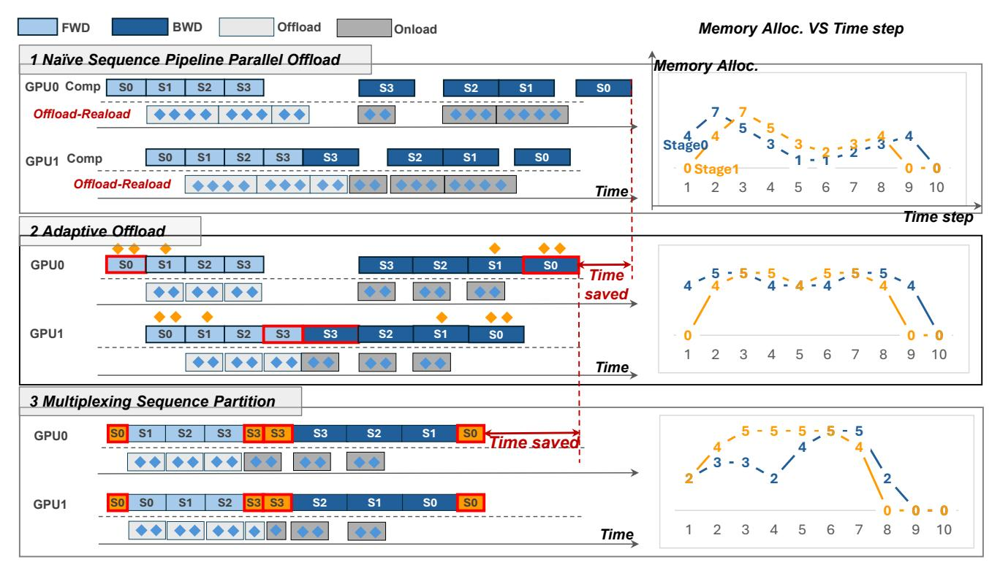

# 4 System Overview

To enhance the memory and computational performance for long-sequence training, we propose Sequence Pipeline Parallel Offload (SPPO), a novel LLM framework that introduces innovative sequence partitioning, offloading, and pipeline scheduling customization. As mentioned in Sections 3.2 and 3.3, existing offloading and pipeline solutions exhibit several challenges in processing subsequences. Therefore, in SPPO, we introduce two approaches to address them, respectively.

• Adaptive Offloading. The top part of Figure 8 shows the inefficient fixed offloading (Challenge 1), which has two pipeline stages and four subsequences and employs a full offloading strategy. The offloading time of  $s_0$  is too long, resulting in incomplete overlap with the computation. This not only delays the unloading of  $s_1$  and increases memory

> **[图片提取文字 (无描述)]:**
> 200 Gemm (ms) 3000 Flash Attention (ms) 150 2000 1000 100 (a) Gemm. & Attn. vs Chunk Size PP stage=4 3000 PP stage=2 2000 1000 0 [1K.128] 1256 5121 (128.1K) (64.1K) (27.4K) (16.8K) (8.16K) (4.32K) (2.6K) (1.128K) (b) Pipeline Bubble vs Chunk Size

**Figure 7.** The relationship between subsequence length and overall forward propagation and bubble time for one transformer layer with a hidden dimension of 4096 and a fixed sequence length of 128K. The x-axis (N, s) represents a sequence of 128K length that is partitioned into N parts, and each part has s tokens.

consumption, but also delays the backward pass of  $s_0$ , ultimately lengthening the end-to-end latency. To address Challenge 1, we introduce an adaptive offloading approach that effectively overlaps the offloading of activations with computation (Section 5). It refines the offloading ratio by sequence-aware offloading and optimizes the selection of offloaded activation by a two-level activation management strategy, as depicted in the middle part of Figure 8. Each subsequence tensor is divided into multiple tensor units, categorized based on their runtime lifespan and designated for either offloading or retention. At the intra-unit level, we implement two-level activation management to handle activations of varying lifespans. At the inter-unit level, we apply sequence-aware offloading, selectively deciding whether to offload tensors to CPU or retain them in GPU memory. Adaptive offloading optimizes training efficiency and reduces peak memory consumption from 7 to 5 units.

• Adaptive Pipeline. Despite improvements, pipeline bubbles remain an issue, as shown in Challenge 2 in the middle part of Figure 8. To further enhance pipeline efficiency, we introduce an **adaptive pipeline** mechanism. It applies a heuristic solver to determine the ideal number of subsequences N. To reduce pipeline bubbles, this adaptive pipeline incorporates multiplexing sequence partitioning, which refines subsequence partitioning to minimize resource waste without increasing memory overhead, as illustrated in the bottom part of Figure 8. By leveraging traditional sequence parallelism [20], we further partition the subsequence around pipeline bubbles into smaller sub-subsequences, distributing them across GPUs for parallel computation. For instance,  $s_0$  in stage 0 is split into two parts, allowing forward and backward passes to execute in parallel at the beginning and

> **[图片提取文字 (无描述)]:**
> **FWD** BWD Offload Memory Alloc. VS Time step Onload 1 Naïve Sequence Pipeline Parallel Offload Memory Alloc. GPU0 Comp S0 S3 Offload-Reaload GPU1 Comp 0 Stage1 Offload-Reaload Time! Time step 2 Adaptive Offload GPU0 **S3** saved GPU1 **S2** S2 SO Time→ 3 Multiplexing Sequence Partition **S3** S2 **S1 GPU0** GPU1 SO Time

**Figure 8.** System Overview. The top part illustrates a minimal case of SPPO, where all subsequence activations are fully offloaded to host memory. The middle part demonstrates an adaptive offloading strategy that optimizes the minimal case, incorporating sequence-aware offloading and a two-level activation management scheme. The bottom further enhances efficiency through multiplexed sequence partitioning, achieving an almost bubble-free pipeline. The right plot visualizes the GPU activation memory allocation over time steps.

end of runtime, thereby reducing bubble time in stage 1. Similarly,  $s_3$  in stage 1 is partitioned and computed in parallel, reducing bubble time in stage 0. SPPO automatically recognizes those subsequences near the bubble and re-segment them without incurring additional memory overhead.

**Workflow**. Given a specific sequence length and available hardware resources, SPPO operates the adaptive offloading and adaptive pipeline as follows. (1) It applies the FLOPs-based partitioning policy for balanced computation across pipeline stages instead of the length-based partition policy. Specifically, the adaptive pipeline adopts the *heuristic solver* to determine the optimal values for *N* and *PP*. (2) The adaptive offloading approach then leverages *sequence-aware offloading* to compute the offloading ratio for each subsequence and manages corresponding activations via *two-level activation management*. (3) If the pipeline scheduling still exhibits excessive bubble ratios, the adaptive pipeline applies *multiplexing sequence partitioning* to utilize these bubbles effectively, thereby enhancing training efficiency.

