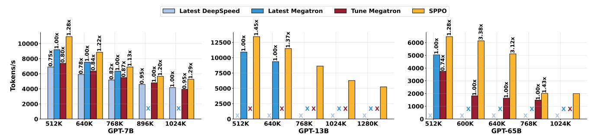
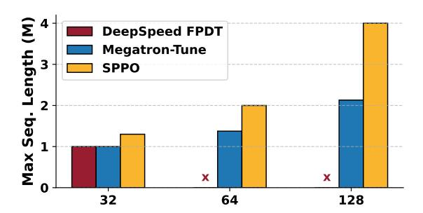

# 6 Adaptive Pipeline

#### 6.1 Heuristic Solver

Given the model, sequence length s, and the number of nodes, the objective is to search for a set of hybrid parallelism parameters (SP, PP, N) that minimize the time per iteration T. To reduce the search space for performance tuning, we leverage the following heuristics:

- Avoid cross-node sequence parallelism: Tensor parallelism incurs significantly larger communication overhead compared to pipeline parallelism within each device, making cross-node sequence parallelism inefficient.
- Avoid cross-node pipeline parallelism: The P2P communication bandwidth across nodes is typically limited, leading to performance degradation.
- Maintain near-balanced workloads: Empirical profiling (as shown in Figure 7) suggests that the optimal workload size per layer ranges from 2K to 16K.

Following these guidelines, we restrict N within the range of 2K to 16K per layer per device, facilitating efficient workload distribution and minimizing communication overhead.

#### 6.2 Multiplexing Sequence Partition

To address significant pipeline bubbles caused by reduced values of N, we propose a latency optimization strategy termed multiplexing sequence partitioning. Building on SPPO's adaptive offloading, our method introduces finer-grained partitioning of bubble-adjacent subsequences across distributed GPUs using the traditional Megatron sequence parallelism (Section 2.2). This approach effectively minimizes idle time in pipeline stages while avoiding additional memory overhead.

Formally, for a *PP*-stage pipeline processing *N* subsequences, the forward pass of each stage consists of three computation phases:

- Left-SP: Initial parallel computation phase leveraging distributed subsequences.
- **Steady**: Central computation phase optimized through adaptive offloading.
- **Right-SP**: Final parallel computation phase, continuing sequence parallelism.

Each phase is characterized by three properties: (1) execution paradigm, (2) subsequence identifier mapping, and (3) communication scope. The backward pass follows a similar

yet asymmetric structure. While the Left-SP and Right-SP phases extend SPPO with secondary sequence partitioning, the Steady phase maintains the core adaptive offloading optimization.

For pipeline stage  $i \in \{0, 1, ..., PP - 1\}$ , its phase characteristics are defined as follows:

**Definition 6.1** (Subsequence Identification Mapping). Given partition size  $PP \in \mathbb{N}$ , number of subsequences  $N \in \mathbb{N}$ , and stage index i, the phase-specific subsequence IDs I(i) are:

$$I(i) = \begin{cases} \{x \in \mathbb{N}_0 \mid 0 \le x \le PP - 1 - i\} & \text{(Left-SP)} \\ \{x \in \mathbb{N}_0 \mid PP - 1 - i \le x \le N - i\} & \text{(Steady)} \\ \{x \in \mathbb{N}_0 \mid N - i \le x \le N - 1\} & \text{(Right-SP)} \end{cases}$$

where  $\mathbb{N}_0$  denotes non-negative integers.

**Definition 6.2** (Inter-Stage Communication Scope). The communication range C(i) for stage i is:

$$C(i) = \begin{cases} \{x \in \mathbb{N}_0 \mid i \le x \le PP - 1\} & \text{(Left-SP)} \\ \{x \in \mathbb{N}_0 \mid 0 \le x \le PP - 1\} & \text{(Steady)} \\ \{x \in \mathbb{N}_0 \mid 0 \le x \le i\} & \text{(Right-SP)} \end{cases}$$
 (2)

Figure 8 illustrates this mechanism: Subsequence  $s_0$  in Stage 0 undergoes partitioning, enabling parallel execution of forward and backward passes during the initial and final phases. Simultaneously,  $s_3$  in Stage 1 is partitioned similarly, facilitating distributed computation and reducing bubble durations in adjacent stages. Our approach dynamically identifies critical subsequences near pipeline bubbles and performs memory-efficient repartitioning without reallocation.

Table 3 illustrates this partitioning scheme for PP=4 pipeline stages and N=8 subsequences. The Left-SP phase processes edge subsequences near pipeline boundaries, while the Right-SP phase manages terminal computations. The Steady phase handles central subsequences using standard pipeline parallelism. Sequence parallelism ranges exhibit complementary patterns across stages, ensuring efficient resource utilization and minimizing cross-stage dependencies.

#### 7 Evaluation

**Implementation.** SPPO is implemented using Python and CUDA and encompasses around 4000 lines of code (LOC) based on Megatron-LM. The codebase consists of 2845 LOC for SPPO optimized by adaptive offloading and 1155 LOC for multiplexing sequence partitioning. To achieve the highest bandwidth between GPU and host, we bind the Non-Uniform Memory Access node for each process and use page-locked memory for CPU buffers.

**Testbed.** SPPO undergoes a thorough evaluation in the training of Transformer-based models with the GPT architecture. The size of the models range from 7 billion to 65 billion, and detailed configurations can be found in Table 2. The training process occurs on a physical cluster comprising 16 GPU servers. Each server is equipped with 8 GPUs and

128 CPU cores, a total of 128 NVIDIA Ampere GPUs. Each GPU boasts 80GB of memory. The GPUs are interconnected through NVLink and NVSwitch, while inter-node communication is facilitated by four NVIDIA Mellanox 200 Gbps HDR InfiniBand. Each node has 2 TB of CPU memory, and the GPU-CPU communication bandwidth is 32 GB/s.

Baselines and Metrics. We benchmark SPPO against two state-of-the-art systems for long-sequence LLM training, namely DeepSpeed Ulysses [20] and Megatron-LM [25]. The evaluation metric is tokens per GPU per second (TGS) during training. By default, we enable activation checkpointing for baselines, allowing them to support longer sequence lengths. We strengthen DeepSpeed Ulysses [47] with ZeRO to reduce the memory footprint of weights, gradient, and optimizer states and with FPDT [61] to offload activations.

| Model #GPUs S |     | Mega. & SPPO |    | SPPO | Tune Mega. |    | DS |    |
|---------------|-----|-----------------|----|------|---------------|----|----|----|
|               |     |                 | SP | PP   | N             | SP | PP | SP |
| GPT-7B        | 32  | 512K            | 8  | 4    | 32            | 32 | 1  | 32 |
|               |     | 640K            |    |      | 64            |    |    |    |
|               |     | 768K            |    |      | 80            |    |    |    |
|               |     | 896K            |    |      | 128           |    |    |    |
|               |     | 1024K           |    |      | 160           |    |    |    |
| GPT-13B       | 64  | 512K            | 8  | 8    | 32            | 8  | 8  | -  |
|               |     | 640K            |    |      | 48            |    |    |    |
|               |     | 768K            |    |      | 64            |    |    |    |
|               |     | 1024K           |    |      | 80            |    |    |    |
|               |     | 1280K           |    |      | 160           |    |    |    |
| GPT-65B       | 128 | 512K            | 16 | 8    | 32            | 64 | 2  | -  |
|               |     | 600K            |    |      | 64            |    |    |    |
|               |     | 640K            |    |      | 80            |    |    |    |
|               |     | 768K            |    |      | 96            |    |    |    |
|               |     | 1024K           |    |      | 128           |    |    |    |

Table 4. Configurations for various GPT models.

#### 7.1 End-to-End Evaluation

Figure 10 illustrates the training throughput across various LLMs and sequence lengths. For fairness, we optimize the parallelism strategy for each system, as reported in Table 4. **Throughput and Scalability:** In our physical testbed, SPPO consistently outperforms DeepSpeed-Ulysses and Megatron-LM across various sequence lengths and model sizes, achieving speedups of ranging from 1.13× to 3.38×. A key advantage of SPPO is its ability to handle ultra-long sequences without out-of-memory (OOM) issues. In contrast, Megatron-LM struggles with sequences exceeding 896K for GPT-7B, while DeepSpeed-Ulysses fails to support sequence lengths beyond 512K for GPT-13B and GPT-65B.

**Memory Efficiency:** SPPO mitigates the memory pressure through nearly zero-overhead offloading and pipeline parallelism. It avoids costly activation recomputation, a limitation that significantly impacts Megatron-LM under the same parallelism strategy. For GPT-65B, SPPO supports sequence lengths of up to 1024K, whereas DeepSpeed-Ulysses is limited to 512K and Megatron-LM to 768K. This demonstrates SPPO's superior memory management capabilities.

> **[图片提取文字 (无描述)]:**
> Latest DeepSpeed Latest Megatron Tune Megatron SPPO m 12500 6000 10000 ă õ 0.80 m 5000 0.74× 10000 8000 0.78x 1. 0.84) 1.00x 1.20 0.95x 1.29x 4000 .95x 7500 6000 ě. 3000 .00x 5000 4000 2000 2000 2500 1000 XX XX XX 512K 768K 896K 1024K 768K 1024K 1280K 512K 768K 1024K 640K 512K 640K 600K 640K GPT-65B GPT-7B GPT-13B

Figure 10. End-to-end evaluation results of training models of different sizes and sequence lengths.

> **[图片提取文字 (无描述)]:**
> Fully offi0.91x + Adaptive offload 1.23x 3.38x iplexing Sequence Partition (a) Relative Speedup (GPT-13B model w/ S=512K) (b) Relative Speedup (GPT-65B model w/ S=640K)

Figure 11. Breakdown analysis

Model-Specific Performance: For GPT-7B, under the same parallelism strategy as the latest Megatron-LM, SPPO achieves a 1.13× to 1.29× speedup. At sequence lengths beyond 896K, Megatron-LM encounters OOM issues, while SPPO continues to deliver superior throughput. For GPT-13B, SPPO supports sequence lengths of up to 1280K, whereas Megatron-LM is limited to 768K. DeepSpeed-Ulysses cannot train GPT-13B at all due to model architectural constraints. For GPT-65B, SPPO achieves remarkable speedups of 3.38× and 3.12× over Megatron-LM at sequence lengths of 600K and 640K, respectively. DeepSpeed-Ulysses, on the other hand, is unable to scale effectively for GPT-65B beyond 512K.

**Limitations:** While SPPO shows superior performance, it is important to note that the baseline systems (DeepSpeed-Ulysses and Megatron-LM) have their own strengths in specific scenarios. For instance, Megatron-LM performs well for shorter sequence lengths (e.g., a GPT-7B model with a sequence length of 768K) despite employing activation recomputation. In such cases, SPPO offers only marginal improvements, as the computational workload of the GPT-7B model is insufficient to fully exploit offloading overlap.

## 7.2 Speedup Breakdown

To gain deeper insights into the key optimizations contributing to SPPO's benefits, we conduct a performance breakdown analysis to present the impact of each key technique. Figure 11 presents the normalized speedup performance against Megatron-LM. We have three key observations.

First, full CPU offloading alone does not always improve performance. While CPU offloading can optimize GPU memory efficiency, activation fully offloading overhead is nonnegligible in certain scenarios, as discussed in Section 5 and shown in Figure 11(a). SPPO only attains a relative speedup of 0.91 compared to SPPO w/o offload in a GPT-13B model with

a sequence length of 512K. However, full CPU offloading benefits the parallelism strategies that exhibit high communication efficiency but poor memory efficiency, as demonstrated in Figure 11(b). It achieves a relative speedup of 2.1  $\times$  in the GPT-65B model with a sequence length of 640K.

Second, adaptive offloading consistently improves training and memory efficiency over different scenarios. Empirically, it brings a relative speedup of  $1.23 \times \text{and} 3.38 \times \text{for GPT-}13B$  and GPT-65B, respectively, indicating its superiority in handling varying model sizes and sequence lengths.

Third, multiplexing sequence partitioning significantly enhances training efficiency. Its benefits are particularly pronounced when the bubble ratio is high, which is determined by the number of subsequences (N) and pipeline stages (P) used during training. MSP achieves a relative speedup of  $1.44 \times$  for the GPT-13B model and a remarkable speedup of  $3.48 \times$  for the GPT-65B model.

Overall, each optimization technique plays a pivotal role in SPPO, collectively contributing to the significant speedup demonstrated by our empirical results.

### 7.3 Sequence Length Scalability

To analyze the sequence length scalability of SPPO with fixed GPU resources, we progressively increase the per-GPU sequence length from 1K to 10K tokens until experiencing OOM issues. We adopt activation checkpointing in each layer for DeepSpeed and Megatron-LM. As shown in Figure 12, SPPO demonstrates clear advantages in sequence length scalability compared to the other two baselines.

Specifically, DeepSpeed-Ulysses partitions computation along with attention heads, making it less effective for models with a limited number of heads. For instance, the restricted number of heads in GPT-7B becomes a scalability bottleneck for DeepSpeed-Ulysses. This explains why

> **[图片提取文字 (无描述)]:**
> DeepSpeed FPDT Megatron-Tune SPPO

**Figure 12.** Scaling maximum sequence length with different number of GPUs in training GPT-7B model.

DeepSpeed-Ulysses gets a sharp decline in the maximum supported sequence length, dropping from 1K at 32 GPUs to 0 at 64 GPUs. Megatron-Tuned exhibits partial scalability (1 $\times$ , 1.375 $\times$ , 2.13 $\times$  at 32/64/128 GPUs). The activation recomputation hinders the linear scaling in sequence length.

In contrast, SPP0 is not constrained by the number of attention heads, achieving near-linear scalability. It can support sequence lengths of  $1.3\times$ ,  $2\times$ , and  $4\times$  the baseline at 32, 64, and 128 GPUs, respectively. At 128 GPUs, SPP0 outperforms Megatron-Tuned by 88% ( $4\times$  vs.  $2.13\times$ ). Moreover, SPP0 achieves higher speedup at more GPUs ( $4\times$  at 128 GPUs vs.  $2\times$  at 64 GPUs), indicating its ability to reduce communication overhead and enhance memory efficiency.

In sum, our empirical analysis of sequence length scalability highlights the critical role of parallelism strategies in long-sequence training. By decoupling from head-based partitioning, SPPO can flexibly adjust the configurations for parallelism strategies, enabling the training of sequences exceeding multi-million tokens. In contrast, existing LLM training systems face significant challenges in handling such extreme-scale scenarios.

#### 8 Related Work

**Systems for long-sequence training.** To address memory and computational limits, ColossalAI-SP [31] introduces sequence segmentation and parallelism alongside tensor and pipeline parallelism. Ring Attention [35, 36] further improves efficiency by using blockwise self-attention to distribute long sequences across devices while overlapping key-value communication. LightSeq [27] optimizes long-sequence modeling via load balancing and re-materialization-aware checkpointing. Some approaches integrate efficient self-attention mechanisms like FlashAttention [44, 58]. Megatron-LM [25] applies sequence parallelism selectively in Dropout and LayerNorm to reduce activation redundancy, while DeepSpeed-Ulysses [20] employs all-to-all collective communication to avoid increasing overhead with sequence length. Hybrid Sequence Parallelism [15] combines Ring Attention and DeepSpeed-Ulysses to enhance scalability and efficiency.

**Activation recomputation and swapping.** Capuchin [43] reduces memory footprint by combining recomputation and

swapping, considering tensor access patterns. MegTaichi [17] co-optimizes tensor partitioning, while Coop [63] minimizes memory fragmentation in recomputation. These approaches do not fully leverage LLM training characteristics for optimal overlapping and fragmentation reduction. ZeRO-Offload [49] offloads optimizer states to host memory, and vDNN [50] schedules prefetching and offloading for better overlap. SuperNeurons [59] balances offloading and recomputation by offloading compute-heavy activations while recomputing lighter ones. ZeRO-Infinity [48] utilizes NVMe SSDs for large-scale training but suffers from high CPU-GPU communication costs. With modern GPUs, effectively overlapping computation with communication remains a challenge.

Reducing pipeline bubbles. Several efficient micro-batch scheduling algorithms have been proposed to mitigate the pipeline bubbles in deep learning training. GPipe [19] introduces a fill-drain schedule but suffers from pipeline inefficiencies due to warm-up and cool-down phases. PipeDream [39] employs a 1F1B schedule to reduce bubbles by executing the backward pass immediately after the forward pass of a micro-batch. DAPPLE [12] improves upon this with an early backward schedule, while Interleaved 1F1B [53] extends 1F1B with multi-stage assignments per GPU. Chimera [29, 37] implements a bidirectional pipeline with weight duplication to further reduce bubbles. Zero Bubble [45] mitigates bubbles by splitting backward computation, leveraging 1F1B scheduling and parameter gradient computation. Breadth-First [26] processes all micro-batches simultaneously in looping pipeline placement to minimize communication overhead. TeraPipe [33] and Seq1F1B [54] focus on sequence-level partitioning to balance memory and efficiency. DynaPipe [23, 34] introduces adaptive scheduling for multi-task LLM training, optimizing memory usage and communication planning. DISTMM [18] launches doubled micro-batches to circumvent dependency barriers in multi-modal training, while GraphPipe [21] preserves DNN graph topology for concurrent execution, improving pipeline efficiency and memory consumption.

## 9 Conclusion

In this work, we introduce Adaptive Sequence Pipeline Parallel Offloading (SPPO), a novel framework designed to enhance the efficiency of long-sequence LLM training by addressing memory and computational resource limitations. By leveraging adaptive offloading and optimized pipeline scheduling, SPPO effectively balances memory usage and training speed, overcoming the inefficiencies of existing methods. Our experimental results demonstrate significant performance improvements, achieving up to 3.38× higher throughput compared to state-of-the-art frameworks while reducing GPU resource requirements. These advancements pave the way for scalable and efficient training of LLMs with extremely

long input sequences, enabling broader applications across AI research and industry.

