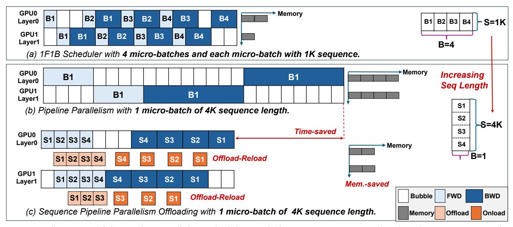
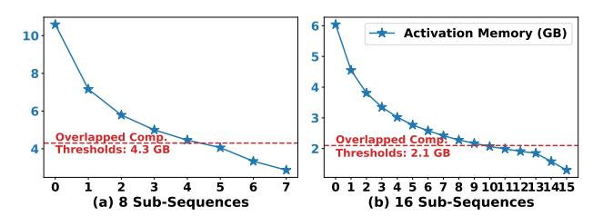
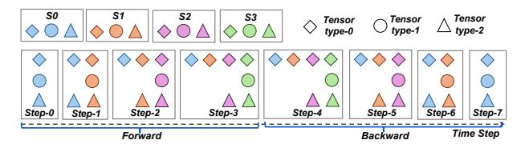

# 2.2 Distributed Parallelism Techniques

Distributed parallelism is widely adopted to expedite LLM training. It includes several key techniques, including data parallelism, tensor parallelism, pipeline parallelism, and sequence parallelism. Hybrid parallelism strategically combines multiple techniques to further accelerate training.

**Data Parallelism (DP)** [5, 32] segments the input data into smaller shards and distributes these shards across multiple GPUs along the batch dimension. Each GPU independently performs gradient computation, followed by gradient synchronization across GPUs with an all-reduce operation.

**Tensor Parallelism (TP)** [40] involves splitting model parameters of certain layers along certain dimensions across GPUs to parallelize the training process. In Megatron-LM [40], TP is employed to split linear layers by row or column dimensions, effectively reducing the GPU memory footprint of model weights while enhancing training efficiency.

Sequence Parallelism (SP) [15, 20, 25, 30, 36] divides the sequence along the sequence dimension and distributes subsequences across GPUs for parallel computation. Megatron-SP [25] leverages all-gather and reduce-scatter collectives to amortize the attention computations among GPUs and aggregate the computation results, thereby increasing the attention computation speed of long-sequence training.

**Pipeline Parallelism (PP)** [19, 39] partitions an LLM into several stages, distributing these pipeline stages across GPUs. During training, consecutive stages need to exchange gradients and activations. However, this dependency can result in significant GPU idle time, where computation waits for communication to complete, a phenomenon known as *pipeline bubbles*. Early works like GPipe [19] reduce pipeline bubbles via increasing the number of concurrent microbatches, albeit at the expense of higher peak memory usage. Subsequent works, including 1F1B [39] and TeraPipe [33], realize bubble reduction through careful scheduling policies.

These techniques can accelerate LLM training but require excessive GPU resources. As shown in Table 2, training sequences with lengths of 4 million tokens can require hundreds or even thousands of GPUs. Such high GPU demand primarily arises from the massive memory required for activations. For instance, training a GPT-65B model with an input

> **[图片提取文字 (无描述)]:**
> GPU0 Memory B1 B2 **B1** B3 B4 **B3 B4** B2 Layer0 **B1** B2 B3 B4 -S=1K GPU1 **B1** B2 **B2 B3** B4 **B4 B1** B3 Layer1 B=4 (a) 1F1B Scheduler with 4 micro-batches and each micro-batch with 1K sequence. → Memory GPU0 Increasing **B1 B1** Layer0 Seg Length GPU1 **B1 B1** Layer1 S1 (b) Pipeline Parallelism with 1 micro-batch of 4K sequence length. S2 -S=4K Time-saved **S3** GPU0 S1 S2 S3 S4 **S2 S4 S3 S1** Layer0 **S4** Memory B=1 S1 S2 S3 S4 Offload-Reload GPU1 S1 S2 S3 S4 **S4 S3 S2 S1** Layer1 Mem.-saved Bubble **FWD** BWD S1 S2 S3 Offload-Reload (c) Sequence Pipeline Parallelism Offloading with 1 micro-batch of 4K sequence length. Offload Memory Onload

**Figure 3.** Illustration of the pipeline parallelism scheduling with the increasing sequence length and our sequence pipeline parallel offloading scheduling.

| Model   | L  | h    | a  | $M_m$ | $M_a$ | #GPUs |
|---------|----|------|----|-------|-------|-------|
| GPT-7B  | 32 | 4096 | 32 | 120   | 16384 | 512+  |
| GPT-13B | 40 | 5120 | 40 | 234   | 52600 | 660+  |
| GPT-65B | 80 | 8192 | 64 | 1200  | 81920 | 1024+ |

**Table 2.** Training LLMs of varied sizes with sequence length of 4M tokens: memory footprint of model and activation in GB, and minimal number of A100 (80GB) GPUs required.

sequence length of one million tokens under sequence parallelism consumes 28.8 TB of activation memory, requiring at least 288 A100 GPUs to accommodate it. This underscores the critical need for an efficient approach to reduce memory consumption while maintaining training efficiency.

## 3 Motivation and Challenges

We first demonstrate that subsequence offloading and pipeline scheduling can provide potential memory and computational advantages over processing the entire sequence in long-sequence LLM training. Next, we investigate the impact of current subsequence offloading and pipeline schedule policies on the training efficiency. Unfortunately, neither of them can unlock the benefits offered by subsequence partitioning.

#### 3.1 Potential Benefits

A promising approach to optimizing long-sequence LLM training is to split a long sequence into many subsequences [20, 30, 33, 36]. Thus, we can opportunistically employ CPU offloading and pipeline scheduling over *subsequences* to unleash the potential memory and computation advantages.

• Benefit 1: *Subsequence offloading*. Subsequence partition can optimize the overlapping of GPU computation and CPU offloading in two aspects. First, by partitioning the sequence into subsequences, the costs of CPU offloading

> **[图片提取文字 (无描述)]:**
> Light Computation load Heavy G Flops-Based Partitioning Strategy SO Mem. stage-0 S2 **S3** SO **S1 S2** 8 4 Mem. A stage-1 **S3** SO \$1 **S2 S3** 8 **FWD** BWD Timé

**Figure 4. Background & motivation.** Imbalanced computation across subsequences with its FLOPs-based offloading policy and the following memory allocation in one step.

and GPU computation become dependent on the length of the subsequences rather than the entire sequence.

Second, the CPU offloading overhead can be further reduced with the growing CPU-GPU bandwidth. As shown in Figure 2, the growth rate of CPU-GPU bandwidth has outpaced computational gains by a factor of over 30. This significant improvement in bandwidth makes it promising to hide the overhead of offloading subsequence activations to the CPU without compromising training efficiency.

• Benefit 2: Subsequence pipeline schedule. Incorporating subsequence partitioning with pipeline parallelism can reduce pipeline bubbles and improve training efficiency. We use a 1F1B pipeline scheduler [39] to demonstrate this in Figure 3. The 1F1B scheduler decomposes input batches into multiple micro-batches and alternates forward/backward passes as illustrated in Figure 3 (a). However, under

> **[图片提取文字 (无描述)]:**
> Activation Memory (GB) 10 Overlapped Comp. Overlapped Comp. Thresholds: 4.3 GB Thresholds: 2.1 GB 1 2 3 4 5 6 7 8 9 101112131415 (b) 16 Sub-Sequences (a) 8 Sub-Sequences

**Figure 5.** Activation memory allocation across subsequences when applying the optimal strategy of partitioning the sequence to 8 and 16 subsequences, respectively. The model is LLaMA-65B, and the sequence length is 128K.

> **[图片提取文字 (无描述)]:**
> S0 Tensor Tensor Tensor Step-2 Step-6 Step-0 Step-3 Step-4 Step-5 Step-7 Step-1 Time Step Forward

Figure 6. Transformer-based model tensor access timeline.

long-sequence inputs, the micro-batch count collapses to one, thus 1F1B degenerating to the naive pipeline schedule shown in Figure 3 (b), thereby incurring larger pipeline bubbles. As illustrated in Figure 3 (c), subsequence partitioning enables the pipelining of GPU computations for one subsequence with another. This approach reduces pipeline bubbles and maximizes resource utilization, offering a more efficient pipeline schedule for long-sequence training.

