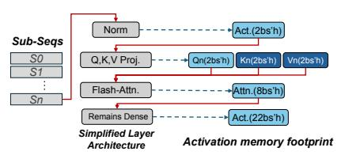
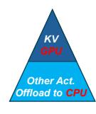

# 5 Adaptive Offloading

Traditional frameworks typically employ the same offloading strategy across layers or micro-batches. However, there exists an inherent imbalanced memory usage among different subsequences, which leads to imbalanced transmission time across GPUs and CPU that introduces extra transmission overhead. Besides, inside subsequences, different tensors may have different lifespans. SPPO allows each subsequence to find its best offloading strategy according to its following subsequence computation.

To search for the best offloading strategy for different subsequences, we first analyze the inner structure of the transformer layer and split the layer activation into finergrained activation units, each of which is a minimal group of tensors to be offloaded or saved in GPUs. Then, we construct the cost model and design the algorithms to find the best offloading ratio across different subsequences.

Below, we first introduce a **two-level activation management** scheme for inner tensors within a subsequence, and then present a **sequence-aware offloading** strategy.

#### 5.1 Two-Level Activation Management

Figure 9 (a) gives an example of how to perform the computation of subsequence  $s_N$  in a Transformer-based model, showing all skeletal tensors generated within a layer's forward pass of  $s_N$  and their sizes. Note that, for generative LLMs, due to the casual mask, after attention computation,  $Q_i$  will not be used in the forward pass anymore, while  $K_i$ 

> **[图片提取文字 (无描述)]:**
> Act.(2bs'h) Norm Sub-Segs Q,K,V Proj. Qn(2bs'h) Kn(2bs'h) Vn(2bs'h) ttn.(8bs'h) Flash-Attn. Sn Remains Dense Act.(22bs'h) Simplified Layer Activation memory footprint Architecture

> **[图片提取文字 (无描述)]:**
> Other Act. Offload to CP

(a) Skeletal tensors generated by one transformer layer with one sub-sequence

(b) Two-Level Activation
Management

**Figure 9.** An example of computation of  $s_N$  in a Transformer-based model and the skeletal tensors with its sizes.

and  $V_i$  need to participate in the following  $Q_N$  computation, where i < N.  $K_0$  and  $V_0$  are Type-0 tensors that are accessed continuously (Figure 6). Therefore, we cache  $K_i$  and  $V_i$  to GPU memory instead of offloading them to CPU. Caching all (K-V) pairs only consumes  $\sum_{i=0}^n 2Bs_iH = 2BSH$  bytes of GPU memory, while we will partially offload the remaining 36BSH bytes of tensors to CPU. The offloading ratio is determined by our sequence-aware offloading strategy in Section 5.2. The most important characteristic of the remaining activations is that they are needed by backward computation, so they just need to reside in GPU memory at least before the backward propagation of the subsequence begins. Figure 9 (b) shows the architecture of our activation management.

#### 5.2 Sequence-aware Offloading

This scheduling enables overlapping data transfer operations for the  $(i-1)^{th}$  subsequence with the computation of the  $i^{th}$  subsequence, thereby reducing end-to-end training time. However, incomplete offloading of the  $(i-1)^{th}$  subsequence before the completion of the  $i^{th}$  subsequence computation creates dual memory demands: the GPU must simultaneously store activation  $A_i$  and maintain an offloading buffer for  $A_{i-1}$ . As demonstrated in Figure 8 (top), this memory pressure peaks at 7 activation units when  $S_0$  offloading persists through  $S_2$  computation.

To address the imbalanced memory utilization, we introduce an adaptive offloading ratio  $\alpha \in [0,1]$  that controls the proportion of activations transferred to host memory. Given a FLOPs-optimized subsequence partition  $s = \{s_0, s_1, ..., s_N\}$  with  $s_0 \leq s_1 \leq ... \leq s_N$ , we assign corresponding offloading ratios  $\alpha = \{\alpha_0, \alpha_1, ..., \alpha_N\}$  where  $\alpha_0 \geq \alpha_1 \geq ... \geq \alpha_N$ . The memory dynamics during pipeline stage i follows:

$$M_i = M_{i-1} + A_i - (\alpha_{i-1} \cdot A_{i-1})$$

where  $M_i$  is the current GPU memory consumption,  $A_i$  is the activation volume of subsequence i, and  $\alpha_{i-1} \cdot A_{i-1}$  is the offloaded portion of previous activation

We optimize  $\alpha$  to maintain  $\alpha_i \cdot A_i = M_{\rm threshold}$ , ensuring the offloading time  $M_{\rm threshold}/BW_{\rm D2H}$  matches the balanced computation time  $T_{\rm balanced\_comp}$ . This constraint yields the relationship  $\alpha_{i-1} \cdot A_{i-1} = \alpha_i \cdot A_i$ . Peak memory  $M_{\rm max}$  occurs when  $\alpha_k = 1$  for final subsequence k, resulting in:

$$M_{\text{max}} = M_{k-1} = (1 - \alpha_{k-1}) \cdot A_{k-1}$$

| Component                         | Stage 0              | Stage 1                | Stage 2                   | Stage 3                      |
|-----------------------------------|----------------------|------------------------|---------------------------|------------------------------|
| Left Seq. IDs                     | {0, 1, 2}            | {0, 1}                 | {0}                       | Ø                            |
| Steady Seq. IDs Right Seq. IDs | {3, 4, 5, 6, 7} Ø | {2, 3, 4, 5, 6} {7} | {1, 2, 3, 4, 5} {6, 7} | {0, 1, 2, 3, 4} {5, 6, 7} |
| Left SP Range                     | {0, 1, 2, 3}         | {1, 2, 3}              | {2, 3}                    | Ø                            |
| Right SP Range                    | Ø                    | {0, 1}                 | {0, 1, 2}                 | {0, 1, 2, 3}                 |

**Table 3.** Illustration of multiplexed sequence partitioning for PP = 4 stages and N = 8 subsequences. SP ranges denote GPU allocations for parallel computation.

This formulation enables systematic memory optimization through our proposed scheduling algorithm.

