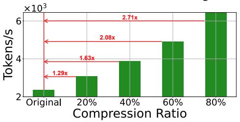

# 3.1 Heterogeneous Compression Ratio Allocation

Motivation: Since different weight matrices in LLMs often exhibit different levels of redundancy, applying a homogeneous compression ratio to all the weight matrices would incur high truncation loss for those with low redundancy (Zhong et al., 2024; He et al., 2024; Li et al., 2024). To demonstrate this, we use SVD-LLM to measure the truncation loss of the query matrix across different layers in LLaMA-3 8B on WikiText-2 dataset with 50% compression ratio. As shown in Figure 3, the truncation loss varies at different layers. For example, the query matrix in the 27th layer has a much higher truncation loss than that of the first layer, indicating the 27th layer should be compressed under a smaller compression ratio, while a larger com-

<span id="page-2-1"></span>> **[图片提取文字 (无描述)]:**
> $\times 10^7$ SVD-LLM uncation I **SVD-LLM V2** 25 30 Layer Index


Figure 3: Comparison between SVD-LLM and SVD-LLM V2 on the truncation loss of the query weight matrix across different layers in LlaMA-3 8B on WikiText-2 dataset with 50% compression ratio.

Algorithm 1 Pseudocode of Heterogeneous Compression Ratio Allocation in SVD-LLM V2

```
Input: M: Original LLM
               x: Input activation
                R: Target compression ratio
     Output: R_d: A list of allocated compression ratios
 1:
    procedure RATIO_ALLOCATION(M, S, R)
          G \leftarrow \mathbf{Group}(M)

 2:
 3:
          R_d \leftarrow \emptyset
                              ▶ Initialize the compression ratio list
 4:
          for g in G do
 5:
               L_G \leftarrow \emptyset
                                ▶ Initialize the loss list in the group
 6:
              for w in g do
                   L_{min} \leftarrow \mathbf{Theoretical\_Loss}(w, x, R)
 7:
 8:
                   L_G \leftarrow L_G \cup L_{min}
 9:
              end for
10:
               L_G \leftarrow 1/\mathbf{Log}(L_G)
                                                       \triangleright Normalize L_G
11:
               r \leftarrow \mathbf{Len}(L_G) \times R \times L_{min}/\mathbf{Sum}(L_G)
12:
               R_d \leftarrow R_d \cup r
                                            \triangleright Append r to the list R_d
13.
          end for
          return R_d
14:
15: end procedure
```

<span id="page-2-3"></span><span id="page-2-2"></span>pression ratio should be applied to the first layer. However, existing SVD-based LLM compression methods either overlook this variation or require resource-intensive operations to determine the specific compression ratios, making them impractical for compressing LLMs at larger scales. Therefore, it is essential to develop a more efficient approach to apply different compression ratios at different weight matrices to reduce the truncation loss.

**Key Design:** The pseudocode of the heterogeneous compression ratio allocation is listed in Algorithm 1. Specifically, given that different types of

weight matrices, such as query (Q) and key (K) in attention blocks, and Gate (G) and Up (U) in MLP blocks play different roles in an LLM, SVD-LLM V2 first groups the weight matrices across all the layers in the original LLM according to their types. Next, SVD-LLM V2 computes the theoretical minimum truncation loss of the weight matrices, i.e.,  $L_{min} = ||C - C'||_F$ , where C is the original matrix of WX and C' is its compressed version by SVD, respectively. It then inverses and normalizes  $L_{min}$  by  $1/\text{Log}(L_{min})$ . Finally, given the target model compression ratio R, the compression ratio of each weight matrix within a group is determined as Len $(L_G) \times R \times L_{min}/\text{Sum}(L_G)$ , where  $L_G$ denotes the list of theoretical truncation loss for all matrices within the same group, Len $(L_G)$  denotes the group size and  $Sum(L_{min})$  denotes the sum of the loss within this group. In this way, SVD-LLM V2 bypasses the need to measure end-toend perplexity to determine compression ratios, as done in ASVD and is time-consuming. Instead, it utilizes truncation loss, which is easy to obtain and thereby enhancing the efficiency of the algorithm. As shown in Figure 3, with the proposed heterogeneous compression ratio allocation scheme, SVD-LLM V2 effectively reduces the truncation loss (the blue area) with only a small increase of several small truncation losses (the yellow area).

In the next section, we describe the details of the proposed loss-optimized weight truncation.

#### 3.2 Loss-optimized Weight Truncation

Motivation: After determining the specific compression ratio for each weight matrix in the LLM, the next step is to truncate the weights according to their assigned compression ratios. To reduce truncation loss  $L = ||WX - W'X||_F$  during SVD compression, SVD-LLM first constructs the whitening matrix S by applying Cholesky decomposition on  $XX^T$ . It then performs SVD and truncation on WS. Although SVD-LLM has been theoretically proven to achieve the lowest truncation loss at a given compression ratio, our empirical study shows that its actual truncation loss is frequently above the theoretical minimum. This is mainly due to the numerical instability involved in performing the Cholesky decomposition on a large-scale matrix during truncation. Moreover, the Cholesky decomposition requires  $XX^T$  to be positive definite, which is often hard to satisfy.

To demonstrate this, we randomly select two weight matrices, A and B, in LLaMA-3 8B and

Algorithm 2 Pseudocode of Loss-optimized Weight Truncation in SVD-LLM V2

```
Input: W: Original weight matrix
              X: Input activation
              R: Target compression ratio
    Output: W': Compressed weight matrix
1:
   procedure WEIGHT_TRUNCATION(W, X, R)
2:
        S \leftarrow XX^T
                                     \triangleright Construct matrix S from X
        U_s, S_s, V_s \leftarrow \mathbf{SVD}(S) \triangleright \text{Perform SVD on matrix } S
3:
        D \leftarrow W \times U_s \times \sqrt{S_s}
                                               \triangleright Construct matrix D
5:
        U_{ws}, S_{ws}, V_{ws} \leftarrow \mathbf{SVD}(D)
                                                  ⊳ Perform SVD on
   \mathsf{matrix}\ D
        T_s \leftarrow \mathbf{Truncate}(S_{ws}, R)
                                                       ▶ Perform SVD
6:
   truncation on matrix S_{ws} based on compression ratio R
        W' \leftarrow U_{ws} \times T_s \times S_s^{-1} \times U_s^{-1}
7:
                                                       \triangleright Construc W'
        return W'
8:
9: end procedure
```

compute their truncation loss by SVD-LLM using 256 randomly selected data in the C4 dataset under compression ratios 20% and 60%. As shown in Table 1, because  $XX^T$  is not positive definite, SVD-LLM fails to compress matrix A. For matrix B, even when the compression ratio is as low as 20%, SVD-LLM still achieves a larger truncation loss in practice than in theory, and this difference even increases with increasing compression ratio.

SVD-based LLM compression methods such as Balco (Ji et al., 2024) have been proposed that utilize pooled covariance matrices to precisely estimate the feature distribution to reduce truncation loss. However, these methods cannot guarantee their theoretical optimality during SVD truncation. Therefore, it is necessary to design a new way to optimize the truncation loss for SVD compression.

<span id="page-3-0"></span>Table 1: Comparison of the normalized truncation loss (↓) between SVD-LLM and SVD-LLM V2 on two randomly selected weight matrices in LLaMA-3 8B using 256 calibration data on C4 under 20% and 60% compression ratios. Fail means the algorithm raises an error during the SVD compression.

|             | MATI   | RIX A  | MATRIX B                       |                      |  |
|-------------|--------|--------|--------------------------------|----------------------|--|
| RATIO       | 20%    | 60%    | 20%                            | 60%                  |  |
| Theoretical | 0.5982 | 2.3251 | 0.7351                         | 3.5245               |  |
| SVD-LLM     | Fail   | Fail   | 0.8961                         | 5.9834               |  |
| SVD-LLM V2  | 0.5982 | 2.3251 | <b>0.7351</b> (\$\dagger\$18%) | <b>3.5245</b> (\41%) |  |

**Key Design:** The pseudocode of the proposed loss-optimized weight truncation is provided in Algorithm 2. Different from SVD-LLM, SVD-LLM V2 bypasses the Cholesky decomposition, resulting in a more straightforward process with improved numerical stability. Specifically, given the input activation X, SVD-LLM V2 conducts SVD on  $XX^T$  to obtain the decomposed matrices  $U_s$ ,  $S_s$ ,  $V_s$ , where

 $S_s$  is the diagonal matrix with singular values. It then conducts another round of SVD on  $W \times U_s \times \sqrt{S_s}$  to obtain  $U_{ws}, S_{ws}, V_{ws}$ . The final compressed weight matrix W' can be obtained via  $U_{ws} \times \mathbf{Trunc.}(S_{ws}) \times S_s^{-1} \times U_s^{-1}$ , where  $\mathbf{Trunc.}(C)$  denotes the rank-k truncation of matrix C during SVD compression.

In the following, we provide a theoretical proof on why such truncation offers the same theoretical minimum truncation loss as SVD-LLM.

**Theorem 3.1.** If  $U_s, S_s, V_s$  are obtained by SVD decomposition of  $XX^T$  and  $U_{ws}, S_{ws}, V_{ws}$  are obtained by SVD decomposition of  $W \times U_s \times \sqrt{S_s}$ , the compressed weight matrix  $W' = U_{ws} \times \mathbf{Trunc.}(S_{ws}) \times V_{ws} \times \sqrt{S_s}^{-1} \times U_s^{-1}$  ensures the theoretical minimum truncation loss.

*Proof.* Since  $XX^T$  is the symmetric matrix, suppose that the singular vectors and values of input activation X is  $U_x, S_x, V_x$ , we have  $U_s = U_x$  and  $\sqrt{S_s} = S_x$ . Suppose  $S = U_s \times \sqrt{S_s}$ , thus  $S^{-1} = \sqrt{S_s}^{-1} \times U_s^{-1}$ , and we have:

$$S^{-1}X = \sqrt{S_s}^{-1}U_s^{-1}X = S_x^{-1}U_x^{-1}X$$
  
=  $S_x^{-1}U_x^{-1}U_xS_xV_x = Vx$  (2)

Therefore,  $S^{-1} \times X$  is orthogonal and  $||A \times S^{-1} \times X||_F = ||S^{-1} \times X||_F$ , and the final truncation loss could be derived as:

$$L^{2} = ||WX - W'X||_{F}^{2}$$

$$= ||WSS^{-1}X - U_{ws} \times \mathbf{Trunc.}(S_{ws}) \times V_{ws} \times S^{-1}X||_{F}^{2}$$

$$= ||(WS - U_{ws} \times \mathbf{Trunc.}(S_{ws}) \times V_{ws})S^{-1}X||_{F}^{2}$$

$$= ||WS - U_{ws} \times \mathbf{Trunc.}(S_{ws}) \times V_{ws}||_{F}^{2}$$

$$= ||\mathbf{SVD}(WS)||_{F}^{2} = ||\mathbf{SVD}(W \times U_{x} \times S_{x})||_{F}^{2}$$

$$= ||\mathbf{SVD}(W \times U_{x} \times S_{x} \times V_{x})||_{F}^{2}$$

$$= ||\mathbf{SVD}(WX)||_{F}^{2} = L_{min}^{2}$$
(3)

Therefore, the designed SVD truncation ensures the theoretical minimum truncation loss.  $\Box$ 

For a better demonstration, we also implement the new loss-optimized weight truncation by SVD-LLM V2 on LLaMA-3-8B. As shown in Table 1, SVD-LLM V2 achieves better numerical stability and lower truncation loss than SVD-LLM.

#### 4 Experiments and Analysis

**Baselines.** We compare SVD-LLM V2 against two groups of methods. (1) Three state-of-the-art SVD-based LLM compression methods: FWSVD (Hsu et al., 2022), ASVD (Yuan et al., 2023), and SVD-LLM (Wang et al., 2024b) (Section 4.1). (2) Other

types of LLM compression methods. These include three state-of-the-art pruning-based LLM compression methods: LLM-Pruner (Ma et al., 2023), SliceGPT (Ashkboos et al., 2024), and Block-Pruner (Zhong et al., 2024), and two state-of-the-art quantization-based LLM compression methods: PB-LLM (Yuan et al., 2024), and BiLLM (Huang et al., 2024) (Section 4.4).

Models and Datasets. To demonstrate the generability of our method, we evaluate the performance of SVD-LLM V2 on five models at various scales (LLaMA-7B, 13B, 30B, LLaMA3-8B (Touvron et al., 2023), OPT-6.7B (Zhang et al., 2022)) and ten datasets including two language modeling datasets (WikiText-2 (Merity et al., 2017) and C4 (Raffel et al., 2020)), six classification datasets (OpenbookQA (Mihaylov et al., 2018), WinoGrande (Sakaguchi et al., 2020), HellaSwag (Zellers et al., 2019), Arc\_e (Clark et al., 2018), PIQA (Bisk et al., 2020), MathQA (Amini et al., 2019)), and two generation datasets (TruthfulQA (Lin et al., 2022) and GSM8K (Cobbe et al., 2021)) with the LM-Evaluation-Harness framework (Gao et al., 2023).

Implementation Details. We randomly select 256 WikiText-2 samples as the calibration data. To mitigate the error raised by the Choleksy decomposition in SVD-LLM due to positive definite, we followed the implementation of SVD-LLM (Wang et al., 2024b) to add the small noise into the decomposed matrices. The compression ration in our experiments refers to the parameter reduction of LLM achieved through compression. All of the experiments are conducted on A100 GPUs.

#### <span id="page-4-0"></span>4.1 Performance Comparison

We first compare SVD-LLM V2 against state-of-theart SVD-based LLM compression methods from four aspects: (1) performance on different LLMs, (2) performance on LLMs with larger scales, (3) performance under different compression ratios, and (4) compression speed.

Performance on Different LLMs. We compare the performance between SVD-LLM V2 and the baselines on three different LLMs, including LLaMA-7B, OPT-6.7B, and LLaMA-3 8B under 20% compression ratio on ten datasets. As shown in Table 2, SVD-LLM V2 consistently achieves better and more stable performance than all the SVD-based LLM compression baselines across all three LLMs and all ten datasets. In particular, SVD-LLM V2 achieves

<span id="page-5-0"></span>Table 2: Performance of OPT-6.7B, LLaMA-7B, and LLaMA-3 8B compressed by SVD-LLM V2 and baselines under 20% compression ratio on two language modeling datasets (measured by perplexity  $(\downarrow)$ ), six classification datasets (measured by both individual and average accuracy  $(\uparrow)$ ), two generation datasets (TruthfulQA measured by BLEU score  $(\uparrow)$ , and GSM8K measured by Exact Match Accuracy  $(\uparrow)$ ). The best performance is marked in bold. The relative performance gain compared to the best-performing baseline is marked in green inside bracket.

|          | МЕТНОО     | WikiText-2↓              | C4↓                           | Openb. | ARC_e | WinoG. | HellaS. | PIQA | MathQA | Average↑          | TruthfulQA↑         | GSM8K↑              |
|----------|------------|--------------------------|-------------------------------|--------|-------|--------|---------|------|--------|-------------------|---------------------|---------------------|
| 7B       | Original   | 5.68                     | 7.34                          | 0.34   | 0.75  | 0.70   | 0.57    | 0.79 | 0.27   | 0.57              | 0.30                | 0.09                |
| A-7      | FWSVD      | 1727                     | 1511                          | 0.09   | 0.11  | 0.05   | 0.08    | 0.10 | 0.05   | 0.08              | 0.00                | 0.00                |
| Ž        | ASVD       | 11.14                    | 15.93                         | 0.29   | 0.53  | 0.64   | 0.41    | 0.68 | 0.17   | 0.45              | 0.21                | 0.04                |
| LLaMA-   | SVD-LLM    | 7.94                     | 15.84                         | 0.31   | 0.71  | 0.68   | 0.49    | 0.71 | 0.22   | 0.52              | 0.24                | 0.06                |
|          | SVD-LLM V2 | <b>7.12</b> (\\$10%)     | <b>10.47</b> (\$\dagger*34%)  | 0.32   | 0.72  | 0.70   | 0.52    | 0.75 | 0.24   | <b>0.54</b> (†4%) | <b>0.27</b> (+0.03) | <b>0.07</b> (+0.01) |
| ~        | Original   | 10.87                    | 12.50                         | 0.28   | 0.66  | 0.65   | 0.50    | 0.76 | 0.25   | 0.52              | 0.29                | 0.01                |
| OPT-6.7B | FWSVD      | 14559                    | 17898                         | 0.03   | 0.08  | 0.02   | 0.01    | 0.05 | 0.01   | 0.03              | 0.01                | 0.00                |
| Ĕ.       | ASVD       | 82                       | 102                           | 0.16   | 0.41  | 0.30   | 0.36    | 0.61 | 0.07   | 0.32              | 0.09                | 0.00                |
| 0        | SVD-LLM    | 16.04                    | 21.27                         | 0.21   | 0.56  | 0.59   | 0.47    | 0.73 | 0.21   | 0.46              | 0.22                | 0.00                |
|          | SVD-LLM V2 | <b>13.46</b> (\$16%)     | <b>17.72</b> (\$\dagger\$17%) | 0.25   | 0.61  | 0.62   | 0.49    | 0.74 | 0.22   | <b>0.49</b> (†7%) | <b>0.24</b> (+0.02) | <b>0.01</b> (+0.01) |
| 8B       | Original   | 6.14                     | 9.47                          | 0.35   | 0.80  | 0.73   | 0.60    | 0.80 | 0.40   | 0.61              | 0.49                | 0.45                |
| ٠        | FWSVD      | 4782                     | 8195                          | 0.01   | 0.04  | 0.01   | 0.02    | 0.02 | 0.01   | 0.02              | 0.00                | 0.00                |
| Ž        | ASVD       | 17.55                    | 28.41                         | 0.20   | 0.59  | 0.61   | 0.41    | 0.69 | 0.30   | 0.47              | 0.37                | 0.28                |
| LLaMA.   | SVD-LLM    | 11.82                    | 20.05                         | 0.29   | 0.77  | 0.64   | 0.51    | 0.72 | 0.30   | 0.54              | 0.45                | 0.31                |
| _        | SVD-LLM V2 | <b>8.01</b> (\dagger32%) | <b>11.72</b> (\dag{42%})      | 0.33   | 0.79  | 0.70   | 0.58    | 0.77 | 0.36   | 0.59 (†9%)        | <b>0.46</b> (+0.01) | 0.40 (+0.09)        |

up tp 42% perplexity reduction and 9% accuracy improvement with better generation ability compared to prior state-of-the-art method SVD-LLM on LLaMA-3 8B.

**Performance on LLMs with Larger Scales.** We compare the performance between SVD-LLM V2 and the baselines on LLaMA-13B and LLaMA-30B under 20% compression ratio on WikiText-2 and six classification datasets. As shown in Table 3, SVD-LLM V2 consistently outperforms all the baselines on both 13B and 30B model sizes.

<span id="page-5-1"></span>Table 3: Perplexity  $(\downarrow)$  on WikiText-2 and average accuracy  $(\uparrow)$  of six classification datasets of LLaMA-13B and LLaMA-30B under 20% compression ratio.

|            | LLAM                | A-13B      | LLAM               | A-30B      |
|------------|---------------------|------------|--------------------|------------|
| Метнор     | Perplexity↓         | Accuracy↑  | Perplexity↓        | Accuracy↑  |
| Original   | 5.09                | 0.59       | 4.10               | 0.61       |
| FWSVD      | 15.98               | 0.43       | 20.54              | 0.42       |
| ASVD       | 6.74                | 0.54       | 22.71              | 0.44       |
| SVD-LLM    | 6.61                | 0.55       | 5.63               | 0.57       |
| SVD-LLM V2 | <b>5.46</b> (\$17%) | 0.56 (†2%) | <b>4.71</b> (\16%) | 0.60 (†5%) |

### Performance under Different Compression Ra-

tios. We compare the performance between SVD-LLM V2 and the baselines on LLaMA-7B under compression ratio ranging from 20% to 80% on WikiText-2 and six classification datasets. As shown in Figure 4, SVD-LLM V2 consistently outperforms all baselines, and the performance gain compared to the best-performing baseline increases as the compression ratio increases.

Compression Speed. Besides measuring the per-

formance of the compressed LLMs, we also evaluate the compression speed. Specifically, we measure the A100 GPU hours used by SVD-LLM V2 and the baseline methods for compressing LLaMA-7B under 20% compression ratio. Our results show that FWSVD takes about 6 GPU hours, ASVD takes about 5.5 GPU hours, SVD-LLM takes about 15 minutes, and SVD-LLM V2 takes about 18 minutes to finish the compression. FWSVD requires gradient calculation, thus consumes a significant amount of time for compression. For the other methods, the main reason for such a variation is their respective techniques for allocating compression ratios among weight matrices. SVD-LLM assigns the same compression ratio to all weight matrices, enabling the fastest operation but sacrificing accuracy. ASVD, however, determines the compression ratio by regularly evaluating the end-to-end perplexity, which slows down its compression process. In contrast, SVD-LLM V2 allocates the compression ratio directly from its truncation loss, making it significantly faster than ASVD.

#### 4.2 Inference Speedup of SVD-LLM V2

To evaluate the inference speedup of models compressed by SVD-LLM V2, we measure the numbers of tokens generated per second from both the original LLaMA-7B and the model compressed by SVD-LLM V2 under different compression ratios on a single NVIDIA A100 GPU. For a fair comparison, we fix the batch size to 4, the prefill length to 1024, and the decoding length to 256. As shown in Figure 5,

<span id="page-6-0"></span>> **[图片提取文字 (无描述)]:**
> SVD-LLM V2 **FWSVD** → ASVD ── SVD-LLM Perplexity of 40% 80% 60% 40% 60% Compression Ratio Compression Ratio (a) Perplexity (b) Average Accuracy


Figure 4: Perplexity on WikiText-2 and average accuracy on six classification datasets of LLaMA-7B compressed by SVD-LLMV2 and other SVD-based LLM compression baselines under 20% to 80% compression ratios. The perplexity values of FWSVD and ASVD are larger than 100, thus are not shown in the figure.

<span id="page-6-1"></span>> **[图片提取文字 (无描述)]:**
> $\times 10^3$ 2.71x Tokens/s 2.08x 1.63x 1.29x Original 20% 40% 60% 80% Compression Ratio


Figure 5: Throughput (Tokens/s) achieved by original LLaMA-7B and its compressed version by SVD-LLM V2 under different compression ratios on a single NVIDIA A100 GPU. We fix the batch size to 4, prefill length to 1024, and decoding length to 256. The speedup over the original LLM is marked in red.

SVD-LLM V2 consistently achieves faster token generation speeds across all the compression ratios. More importantly, the speedup becomes more significant as the compression ratio increases, resulting in a speedup of 1.29x under 20% compression ratio, 1.63x under 40% compression ratio, 2.08x under 60% compression ratio, and 2.71x under 80% compression ratio.

<span id="page-6-2"></span>Table 4: Perplexity (↓) of compressed LLaMA-7B by SVD-LLM and SVD-LLM V2 with individual / both components under 20% compression ratio on WikiText-2.

| SVD-LLM | SVD-LLM V2 (A) | SVD-LLM V2 (T) | SVD-LLM V2    |
|---------|----------------|----------------|---------------|
| 7.94    | 7.91 (\1%)     | 7.43 (↓6%)     | 7.12 (\\$10%) |

#### 4.3 Ablation Study

SVD-LLM V2 has two key components, both of which optimize the truncation loss. In our ablation study, we first evaluate the individual contribution of each of the two components to the compression performance. Next, since both components fully utilize the whitening matrix S, which is calculated with a randomly selected calibration set, we evaluate the impacts of different calibration data on the

<span id="page-6-3"></span>> **[图片提取文字 (无描述)]:**
> 7.247.15Perplexity 7.09 7.06 2048 256 Number of data Seed for Random Sampling (b) Various Samping Seed (a) Various Data Number


Figure 6: Perplexity of LLaMA-7B under 20% compression ratio using calibration data sampled with different numbers or seeds from WikiText-2.

performance of SVD-LLM V2.

Component Sensitivity Study. We first evaluate the individual contribution of the two components (i.e., heterogeneous compression ratio allocation and loss-optimized weight truncation) of SVD-LLM V2. Let SVD-LLM V2 (A) denote the version of SVD-LLM V2 with heterogeneous compression ratio allocation only; and SVD-LLM V2 (T) denote the version of SVD-LLM V2 with loss-optimized weight truncation only. The results are shown in Table 4. We have two observations. (1) Both SVD-LLM V2 (A) and SVD-LLM V2 (T) outperform SVD-LLM. demonstrating the effectiveness of each of these two components alone in achieving superior compression performance. (2) SVD-LLM V2 outperforms SVD-LLM V2 (A) and SVD-LLM V2 (T), demonstrating the necessity of having both components.

Impact of Calibration Set. Next, we examine the impact of the calibration set on the compression performance of SVD-LLM V2. Specifically, we measure the changes in perplexity of LLaMA-7B compressed by SVD-LLM V2 under 20% compression ratio on WikiText-2 when using the default calibration set but with various numbers of data and sampling seeds. As shown in Figure 6, the changes in both data number and sampling seed in the calibration set incur no more than 1% fluctuation in the final performance, demonstrating that SVD-LLM V2 is not sensitive to the calibration set.

