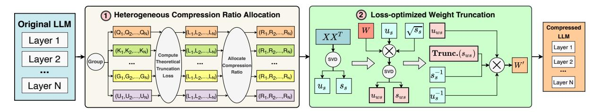

## SVD-LLM V2: Optimizing Singular Value Truncation for Large Language Model Compression

Xin Wang Samiul Alam Zhongwei Wan Hui Shen Mi Zhang
The Ohio State University

{wang.15980, alam.140, wan.512, shen.1780, mizhang.1}@osu.edu https://github.com/AIoT-MLSys-Lab/SVD-LLM

#### **Abstract**

Despite significant advancements, the practical deployment of Large Language Models (LLMs) is often hampered by their immense sizes, highlighting the need for effective compression techniques. Singular Value Decomposition (SVD) is a promising LLM compression technique. However, existing SVD-based compression methods fall short in reducing truncation losses, leading to less competitive performance in compressed models. In this work, we introduce SVD-LLM V2, a SVD-based LLM compression method that optimizes singular value truncation in SVD compression with two techniques. First, SVD-LLM V2 proposes to use theoretical truncation loss of weight matrices to assign a unique compression ratio to each weight matrix at different layers to accommodate weight redundancy heterogeneity. Second, SVD-LLM V2 proposes loss-optimized weight truncation to ensure that the truncated singular values result in a lower and more stable truncation loss in practice. We evaluate SVD-LLM V2 on ten datasets and five LLMs at various scales. Our results show SVD-LLM V2 outperforms state-ofthe-art SVD-based LLM compression methods. Our code is available at https://github. com/AIoT-MLSys-Lab/SVD-LLM.

#### 1 Introduction

Despite the outstanding performance Large Language Models (LLMs) exhibit in various tasks (Zhao et al., 2023; Gozalo-Brizuela and Garrido-Merchán, 2023; Wan et al., 2024b; Shen et al., 2024; Wan et al., 2025), the significant resources consumed limit their widespread accessibility (Wan et al., 2024a; Wang et al., 2024a; Zhou et al., 2024). Model compression (Zhu et al., 2023; Shen et al., 2025) is one effective approach to reduce resource consumption. To avoid resource-intensive retraining, LLM compression is often conducted in a post-training manner. Techniques such as LLM quantization (Yuan et al., 2024; Huang

> **[图片提取文字 (无描述)]:**
> Compression Ratio Truncation Loss L = 0.8961 P = 11.8 X SVD-LLM Homogeneous L = 0.7351 P = 8.01  $\checkmark$ SVD-LLM V2 Heterogeneous

Figure 1: Comparison between SVD-LLM V2 and SVD-LLM. We randomly select a weight matrix from LLaMA-3 8B and compare the normalized truncation loss and perplexity (PPL) under 20% compression ratio.

et al., 2024), unstructured pruning (Frantar and Alistarh, 2023), and structured pruning (Ma et al., 2023; Ashkboos et al., 2024; Zhong et al., 2024) have been proposed.

Low-rank approximation, such as Singular Value Decomposition (SVD) is also an effective technique for compressing LLMs. Compared with quantization and unstructured pruning, SVD compression is more hardware-friendly. Recently, a few SVD-based LLM compression methods have been proposed. At a high level, these methods all focus on reducing the truncation loss during SVD compression to reserve accuracy. Specifically, FWSVD (Hsu et al., 2022) reduces truncation loss by estimating weight importance and preserving more important weights. ASVD (Yuan et al., 2023) injects a scaling matrix to reduce the truncation loss but was not able to achieve theoretical minimum truncation loss at each LLM layer. SVD-LLM (Wang et al., 2024b), on the other hand, fills this gap by proposing a whitening matrix that obtains theoretical minimum truncation loss at each LLM layer, demonstrating superior performance.

Despite such advantage, SVD-LLM has two limitations. First, SVD-LLM applies a homogeneous compression ratio to all the weight matrices. This coarse-grained setup unfortunately overlooks the heterogeneity of weight redundancy across different LLM layers. Second, SVD-LLM utilizes Cholesky decomposition for weight truncation. However, Cholesky decomposition requires the ma-

trix being decomposed to be positive-definite, a condition that is challenging to fulfill in practice. Moreover, Cholesky decomposition introduces numerical instability throughout its iterative process. As a consequence, SVD-LLM could still lead to high truncation loss in practice.

In this paper, we propose SVD-LLM V2, a SVDbased post-training LLM compression method that effectively addresses the two limitations of SVD-LLM. First, to address the heterogeneity of weight redundancy across layers, SVD-LLM V2 uses the theoretical truncation loss of weight matrices at each layer as the guidance to assign a unique compression ratio to each weight matrix based on its type at different layers. Second, SVD-LLM V2 substitutes the Cholesky decomposition with two rounds of SVD for weight truncation, which we prove to achieve the theoretical minimum truncation under the optimized compression ratio. In doing so, SVD-LLM V2 is able to achieve better perplexity with lower truncation loss than SVD-LLM (Figure [1\)](#page-0-0).

We evaluate SVD-LLM V2 on ten datasets covering various language modeling, classification, and generation tasks as well as five LLMs with various backbones and scales. Our results demonstrate the superiority of SVD-LLM V2 with three key findings:

- SVD-LLM V2 consistently outperforms state-ofthe-art SVD-based LLM compression methods across all ten datasets and five LLMs.
- SVD-LLM V2 outperforms state-of-the-art structured pruning-based LLM compression methods with up to 28% lower perplexity under 7 GB memory budget. When comparing to state-of-the-art 1-bit quantization-based LLM compression methods, SVD-LLM V2 outperforms PB-LLM and achieves 5% lower perplexity. Moreover, by combining with 2-bit quantization, SVD-LLM V2 is able to outperform 1-bit BiLLM, demonstrating the promise of combining SVD and quantization-based methods for advancing the frontier of posttraining LLM compression.
- LLMs compressed by SVD-LLM V2 achieve inference speedup on real hardware. In particular, LLMs compressed by SVD-LLM V2 are able to achieve a throughput speedup of up to 2.71× compared to the original LLMs on a single NVIDIA A100 GPU.

## 2 Related Work

### 2.1 Large Language Model Compression

Large Language Models (LLMs) typically contain billions of parameters, making traditional model compression techniques impractical due to the need for resource-intensive retraining. To address this, post-training methods that bypass retraining during compression have been developed. These methods generally fall into four categories: unstructured pruning, structured pruning, quantization, and lowrank approximation. Unstructured pruning [\(Fran](#page-8-3)[tar and Alistarh,](#page-8-3) [2023\)](#page-8-3) sets the individual weight values to zero without changing the overall architecture. However, its irregular sparsity is feasible only for speedups or memory savings on certain hardware. In contrast, structured pruning [\(Ma et al.,](#page-8-4) [2023;](#page-8-4) [Ashkboos et al.,](#page-8-5) [2024;](#page-8-5) [Zhong et al.,](#page-9-9) [2024\)](#page-9-9) removes entire channels from LLMs, simplifying hardware implementation but often suffering from accuracy degradation. Quantization [\(Frantar et al.,](#page-8-7) [2022;](#page-8-7) [Zhao et al.,](#page-9-12) [2024\)](#page-9-12) reduces the precision of the weight matrices for compression. However, it often fails to provide the desired inference speedups [\(Lin](#page-8-8) [et al.,](#page-8-8) [2024b\)](#page-8-8) and offers a limited range of compression options—typically between 2 to 8 bits—which hinders optimal memory utilization. Recent efforts [\(Yuan et al.,](#page-9-8) [2024;](#page-9-8) [Huang et al.,](#page-8-2) [2024\)](#page-8-2) have explored 1-bit post-training quantization. Nevertheless, these approaches still suffer from accuracy drop, indicating that 1-bit quantization is still challenging in LLM compression.

#### 2.2 SVD for LLM Compression

Singular Value Decomposition (SVD) reduces matrix sizes by truncating the smallest singular values. It then constructs two smaller, lower-rank matrices to approximate the original matrix [\(Golub et al.,](#page-8-9) [1987\)](#page-8-9). SVD is also feasible for LLM [\(Hsu et al.,](#page-8-6) [2022;](#page-8-6) [Yuan et al.,](#page-9-10) [2023;](#page-9-10) [Wang et al.,](#page-9-11) [2024b;](#page-9-11) [Lin](#page-8-10) [et al.,](#page-8-10) [2024a\)](#page-8-10). To ensure better compression performance, existing post-training SVD-based LLM compression methods attempt to lower the truncation loss L in the form of Frobenius norm as follows during LLM compression:

$$L = ||WX - W'X||_F \tag{1}$$

where W is the weight matrix of the original LLM, X is the activation of W, and W′ is the compressed low-ranking weight matrix. For example, [Yuan et al.](#page-9-10) [\(2023\)](#page-9-10) propose ASVD, which scales the weight matrix using a diagonal matrix to normalize

> **[图片提取文字 (无描述)]:**
> 1 Heterogeneous Compression Ratio Allocation Loss-optimized Weight Truncation Original LLM Compressed  $u_s$  $u_{ws}$ (Q1,Q2,...,QN)  $(R_1, R_2, ..., R_N)$ LLM Layer 1 Layer 1  $\rightarrow$   $(K_1, K_2, ..., K_N)$  $\rightarrow$  (R1,R2,...,RN) (L1,L2,...,LN) Trunc. $(s_{ws})$ Layer 2 SVD Allocate Group Layer 2 Theoretical ... Compression Truncation SVD Ratio ....  $\rightarrow$  (G1,G2,...,GN)  $(R_1, R_2, ..., R_N)$ Loss Layer N Layer N  $u_s^ \cup$   $(U_1,U_2,...,U_N)$ + (R1,R2,...,RN)

Figure 2: Overview of SVD-LLM V2.

the impact of input channels on the weights to reduce the truncation loss. Wang et al. (2024b) make further advancement by whitening the input matrix to mitigate its impact on SVD truncation with the guarantee of minimal theoretical truncation loss. Despite these progresses, existing methods still suffer from high truncation loss in practice, leading to accuracy degradation.

#### 3 SVD-LLM V2

Figure 2 provides an overview of SVD-LLM V2. Specifically, SVD-LLM V2 groups the weight matrices across all the layers in the original LLM by type, such as query (Q) and key (K) in attention blocks, and Gate (G) and Up (U) in MLP blocks. It then computes the theoretical truncation loss of the weight matrices and assigns a unique compression ratio to each weight matrix within each group based on the computed truncation loss. Lastly, SVD-LLM V2 performs loss-optimized weight truncation to obtain the compressed LLM. Below, we describe the details of the two main components of SVD-LLM V2: (1) heterogeneous compression ratio allocation and (2) loss-optimized weight truncation.

