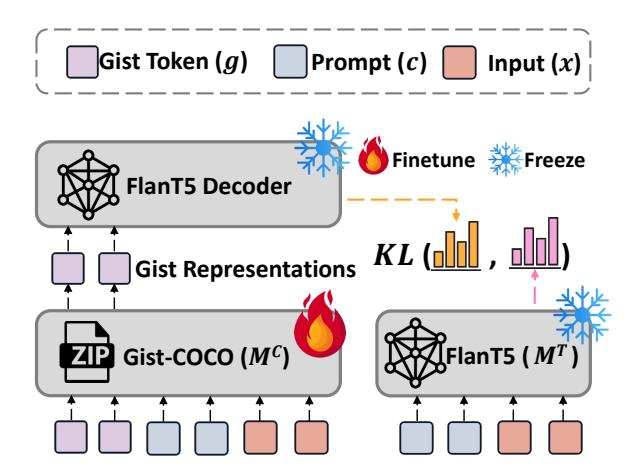

## Say More with Less: Understanding Prompt Learning Behaviors through Gist Compression

Xinze Li1 , Zhenghao Liu1\*, Chenyan Xiong2 , Shi Yu3 , Yukun Yan3 , Shuo Wang3 and Ge Yu1 1Department of Computer Science and Technology, Northeastern University, China 2Language Technologies Institute, Carnegie Mellon University, United States 3Department of Computer Science and Technology, Institute for AI, Tsinghua University, China Beijing National Research Center for Information Science and Technology, China

## Abstract

Large language models (LLMs) require lengthy prompts as the input context to produce output aligned with user intentions, a process that incurs extra costs during inference. In this paper, we propose the Gist COnditioned deCOding (Gist-COCO) model, introducing a novel method for compressing prompts which also can assist the prompt interpretation and engineering. Gist-COCO employs an encoderdecoder based language model and then incorporates an additional encoder as a plugin module to compress prompts with inputs using gist tokens. It finetunes the compression plugin module and uses the representations of gist tokens to emulate the raw prompts in the vanilla language model. By verbalizing the representations of gist tokens into gist prompts, the compression ability of Gist-COCO can be generalized to different LLMs with high compression rates. Our experiments demonstrate that Gist-COCO outperforms previous prompt compression models in both passage and instruction compression tasks. Further analysis on gist verbalization results suggests that our gist prompts serve different functions in aiding language models. They may directly provide potential answers, generate the chain-ofthought, or simply repeat the inputs. All data and codes are available at [https://github.](https://github.com/OpenMatch/Gist-COCO) [com/OpenMatch/Gist-COCO](https://github.com/OpenMatch/Gist-COCO).

## 1 Introduction

Large Language Models (LLMs), such as GPT-4 [\(Achiam et al.,](#page-8-0) [2023\)](#page-8-0) and LLaMA [\(Touvron](#page-9-0) [et al.,](#page-9-0) [2023\)](#page-9-0), have demonstrated their emergent capacity in handling various NLP tasks [\(Zhao et al.,](#page-10-0) [2023;](#page-10-0) [Wei et al.,](#page-10-1) [2022b\)](#page-10-1). To align user intentions with LLMs, existing work pays increasing attention to prompt engineering. They attempt to optimize prompts using LLMs themselves or manually craft prompts with meticulous care [\(Zhou et al.,](#page-10-2) [2022;](#page-10-2)

> **[图片提取文字 (无描述)]:**
> Who was the screenwriter for Travels with My Aunt? Answer: Peter Shine Travels with My Aunt is a 1972 American comedy film directed by George Cukor, written Jay Presson Allen and Hugh Wheeler, and starring Maggie Smith.... Who was the screenwriter for Travels with My Aunt? **Answer: Jay Presson Allen** Jay Presson Allen and Hugh Wheeler. Who was the screenwriter for Travels with My Aunt? **Answer: Jay Presson Allen**

Figure 1: The Motivation of Our Gist Conditioned Decoding (Gist-COCO) Model. The user respectively utilizes prompts and compressed prompts to guide the generation of LLMs.

[Cheng et al.,](#page-8-1) [2023;](#page-8-1) [Ye et al.,](#page-10-3) [2023\)](#page-10-3). Nevertheless, the challenge persists in deciphering user intentions from natural language by LLMs and providing explainable insights for prompt engineering.

As shown in Figure [1,](#page-0-0) users typically collect or compose detailed prompts to assist LLMs in generating answers, making them more tailored and precise. However, with each user query, LLMs must iteratively encode these prompts and compute their self-attention [\(Vaswani et al.,](#page-9-1) [2017\)](#page-9-1), leading to increased computational time and memory usage [\(Mu et al.,](#page-9-2) [2023\)](#page-9-2). Reducing the length of prompts is a potent strategy to optimize these prompts. Existing work utilizes the theory of selfinformation [\(Shannon,](#page-9-3) [1948\)](#page-9-3) to explain prompts and reduce them by filtering the contexts with low self-information in the prompts [\(Li,](#page-9-4) [2023\)](#page-9-4). [Mu et al.](#page-9-2) [\(2023\)](#page-9-2) further compress task instructions by utilizing gist tokens and employing the resulting gist

\* indicates corresponding author.

embeddings for instruction representation. Nevertheless, achieving interpretability and refinement in prompt compression, which is crucial for prompt engineering and understanding LLMs' behavior, remains challenging yet.

To alleviate the problem, this paper introduces the Gist COnditioned deCOding (Gist-COCO) model, which targets on compressing prompts and generalizing compression to different LLMs. Our Gist-COCO model is inspired by information theory [\(Grünwald,](#page-8-2) [2007\)](#page-8-2) and built upon an encoder-decoder based language model, such as FlanT5 [\(Chung et al.,](#page-8-3) [2022\)](#page-8-3). It employs an extra encoder model as a compression plugin module to compress prompts with inputs using a set of shorter gist tokens whose representations are utilized to replace the raw prompts of inputs. Specifically, these gist representations are contacted as prefixes with the input representations encoded by the vanilla encoder and fed into the vanilla decoder. Gist-COCO only finetunes the compression model to generate more effective gist representations, aiding the vanilla FlanT5 model in adhering closely to the raw prompts for the generation. Additionally, our Gist-COCO model incorporates a task disentangled gist modeling method to effectively compress various types of prompts, such as passages and instructions.

To generalize the compression capabilities of Gist-COCO across different LLMs, we propose the gist verbalization method, which can verbalize gist representations into some shorter gist prompts using the language model. By preprocessing the prompts with inputs using the compression module, the gist prompts refine the essential information from the raw prompts based on the inputs. Instead of using annotated summarization data to learn prompt compression [\(Vig et al.,](#page-9-5) [2022;](#page-9-5) [Xu et al.,](#page-10-4) [2023\)](#page-10-4), compression models, such as Gist [\(Mu et al.,](#page-9-2) [2023\)](#page-9-2) and Gist-COCO, compress prompts using gist tokens and optimize these gist representations using vanilla prompts from training data. Additionally, unlike baseline models [\(Mu et al.,](#page-9-2) [2023;](#page-9-2) [Chevalier et al.,](#page-8-4) [2023\)](#page-8-4), our Gist-COCO model freezes the parameters of language models and only finetunes the encoder model for compression, which can generalize its compression ability.

Our experiments demonstrate the effectiveness of the Gist-COCO model, surpassing prior prompt compression models in both passage and instruction compression tasks. Leveraging our gist verbalization method, Gist-COCO broadens its advantages to different language models, achieving an

exceptionally high compression rate. Besides, the results of gist verbalization show that gist prompts serve diverse roles in assisting language models to comprehend human instructions, such as encompassing the formation of answers, generating the thought, and copying parts of contents from inputs or instructions for reinforcement.

## 2 Related Work

Large Language Models (LLMs) [\(Brown et al.,](#page-8-5) [2020\)](#page-8-5), typically finetune through instruction learning methods [\(Chung et al.,](#page-8-3) [2022;](#page-8-3) [OpenAI,](#page-9-6) [2022;](#page-9-6) [Taori et al.,](#page-9-7) [2023;](#page-9-7) [Chiang et al.,](#page-8-6) [2023\)](#page-8-6), such as instruction tuning or Reinforcement Learning with Human Feedback (RLHF) [\(Ouyang et al.,](#page-9-8) [2022\)](#page-9-8), can enhance their ability to adhere to instructions or align with human preferences. Besides, finetuning language models on diverse instruction-response pairs enables language models to exhibit cross-task generalization [\(Wei et al.,](#page-10-5) [2022a;](#page-10-5) [Sanh et al.,](#page-9-9) [2021\)](#page-9-9). In this case, existing work focuses more on generating more instruction data [\(Wang et al.,](#page-10-6) [2023;](#page-10-6) [Wan et al.,](#page-9-10) [2023;](#page-9-10) [Mishra et al.,](#page-9-11) [2022\)](#page-9-11) or the task sensitive tasks [\(Kung et al.,](#page-8-7) [2023\)](#page-8-7) for supervised finetuning (SFT) LLMs.

To enhance the effectiveness of LLMs in downstream tasks, researchers are increasingly emphasizing prompt engineering [\(Liu et al.,](#page-9-12) [2023\)](#page-9-12). The prompts can serve as instructions to elucidate user intentions [\(Zhou et al.,](#page-10-2) [2022\)](#page-10-2) or provide the contextual knowledge to aid in the generation process [\(Izacard et al.,](#page-8-8) [2023;](#page-8-8) [Ram et al.,](#page-9-13) [2023;](#page-9-13) [Tonmoy](#page-9-14) [et al.,](#page-9-14) [2024;](#page-9-14) [Shi et al.,](#page-9-15) [2023\)](#page-9-15). However, the prompts have demonstrated that they potentially exert a substantial influence on the LLMs' outputs [\(Lu et al.,](#page-9-16) [2022\)](#page-9-16) and necessitate meticulous designs [\(Chen](#page-8-9) [et al.,](#page-8-9) [2023;](#page-8-9) [Kaddour et al.,](#page-8-10) [2023\)](#page-8-10).

To make prompts better guide the generation of LLMs, existing work focuses more on conducting more effective prompts in different ways. [Zhou](#page-10-2) [et al.](#page-10-2) [\(2022\)](#page-10-2) use LLMs for automatic instruction generation and selection. [Cheng et al.](#page-8-1) [\(2023\)](#page-8-1) propose the Black-box Prompt Optimization (BPO) method, which optimizes the prompts to bridge the gap between humans and LLMs. [Ye et al.](#page-10-3) [\(2023\)](#page-10-3) further add the task-agnostic prefix to enhance the instruction. Nevertheless, it remains unclear which aspects of these provided prompts are favored by LLMs for comprehending human intentions.

Studying the characteristics of prompts in prompting LLMs has garnered much attention from

researchers (Min et al., 2022; Beurer-Kellner et al., 2023). The researchers use the Turking Test (Efrat and Levy, 2020) and the negated prompts (Jang et al., 2023) to analyze the instruction understanding and following ability of LLMs. Instead of evaluating such an ability of LLMs, inspired by the minimum description length (MDL) principle (Grünwald, 2007), we focus more on interpreting the role of prompts from a compression view. Some existing work has shown effectiveness in prompt compression, e.g. distilling the prompt understandings from teacher models to student models (Snell et al., 2022), compressing the prompts using a set of gist tokens (Mu et al., 2023; Ge et al., 2023; Chevalier et al., 2023) and generating some brief summaries (Vig et al., 2022; Xu et al., 2023). Based on these works, we aim to compress prompts as gist representations according to the need of language models and further verbalize them into gist prompts to interpret and understand the role of prompts.

#### 3 Methodology

In this section, we first introduce prompt compression through the information theory (Sec. 3.1). We then describe our **Gist CO**nditioned de**CO**ding (Gist-COCO) model (Sec. 3.2). Finally, we show how to generalize the compression ability to different tasks and language models (Sec. 3.3).

#### 3.1 Preliminary of Prompt Compression

Given an input x, existing work usually uses lengthy task instructions (Wang et al., 2023; Chung et al., 2022) or retrieved passages (Yu et al., 2023b; Shi et al., 2023) as prompts, denoted as c, to aid LLMs for the generation. To reduce inference cost, Gist-COCO compresses the raw long prompt c into a few gist representations  $h^c = \{h_1^c, ..., h_N^c\}$ , serving as condensed context for LLM inference.

Inspired by the compression viewpoint of the minimum description length (MDL) principle (Grünwald, 2007) in information theory (Wu et al., 2023), a good model should be able to represent the data with shorter descriptions and also generalize well to unseen data (Wu et al., 2023). The MDL principle indicates that the best compression model  $M^{\ast}$  can make the correct prediction  $y^{\ast}$  based on a shorter codelength:

$$M_{\theta}^* = \arg\min_{\alpha} L(M_{\theta}) + L(y^*|M_{\theta}(c,x)), \tag{1}$$

where  $L(M_{\theta})$  is the codelength (model complexity) required by the model and  $L(y^*|M_{\theta}(c,x))$  is the

> **[图片提取文字 (无描述)]:**
> Gist Token (g)Prompt (c) Input (x)Finetune Freeze FlanT5 Decoder KL ( **Gist Representations** Gist-COCO (MC) FlanT5 ( $M^T$ )

Figure 2: Training of Gist-COCO. Gist-COCO is trained to emulate the output distribution based on uncompressed inputs by producing gist representations.

codelength to construct the correct prediction based on the compression result. The compression model  $M_{\theta}$  encodes the prompt c into a fixed number of hidden states  $h^{c}$ , given c with the input x:

$$h^c = \{h_1^c, ..., h_N^c\} \leftarrow M_\theta(c, x).$$
 (2)

As we fix  $|h_c| = N$ , the term  $L(M_\theta)$  becomes constant in Eq. 1 and our goal is to minimize  $L(y^*|M_\theta(c,x))$ . In the next section, we introduce  $M_\theta$  as well as its training and inference.

