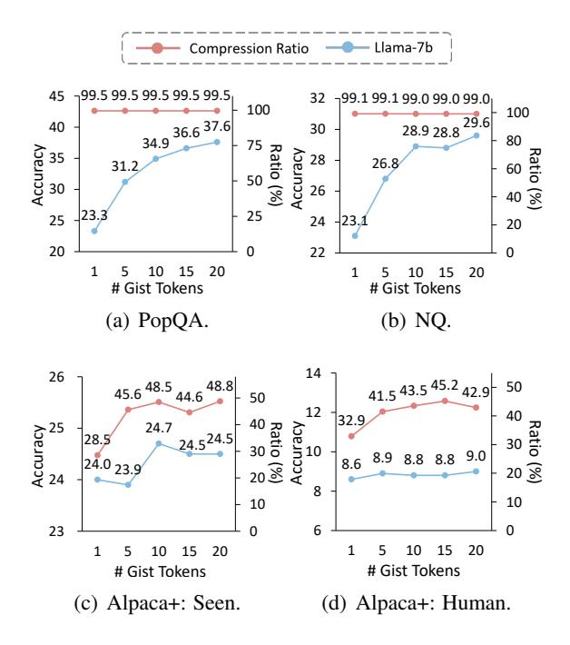
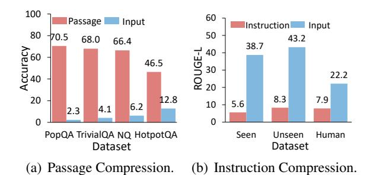
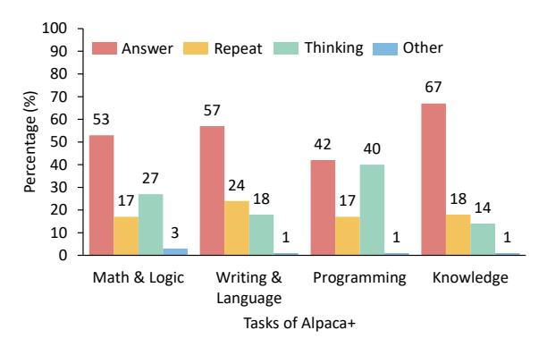

# 3.2 Prompt Compression via Gist Conditioned Decoding

Given the prompt c and input x, Gist-COCO is trained to minimize Eq. 1 to produce the optimal gist representations  $h^c = \{h_1^c, ..., h_N^c\}$  for the prompt c. As shown in Figure 2, we propose to leverage the soft labels from a vanilla language model  $M^T$  with raw prompts to estimate the codelength with the help of Kullback-Leibler (KL) divergence between the uncompressed distribution and the compressed one:

$$L(y^*|M_{\theta}(c,x)) \approx \text{KL}(P(y^*|h^c,x)||Q(y^*|c,x)),$$
 (3)

where  $P(y^*|h^c,x)$  is the generation probability given the gist representations calculated from FlanT5-Decoder, and  $Q(y^*|c,x)$  is the prior from the model given raw prompts, calculated from  $M^T$  (FlanT5):

$$\begin{split} P(y^*|h^c,x) &= \text{T5-Decoder}(h^c), \\ Q(y^*|c,x) &= M^T(c;x), \end{split} \tag{4}$$

where; denotes concatenation. The parameters of  $M^T$  are frozen during training.  $h_c$  is encoded by

the compression model  $M_{\theta}^{C}$ , which is initialized with the same parameters as the model  $M^{T}$ :

$$h^{c} \leftarrow M_{\theta}^{C}(c, x) = \text{T5-Encoder}(\{g_{1}, ..., g_{N}\}; c; x),$$
 (5)

where  $\{g_1, ..., g_N\}$  are the gist tokens to compress the prompt c, whose weights are initialized from the special tokens of the FlanT5 model.  $h^c$  are the encoded representations of  $\{g_1, ..., g_N\}$  using  $M^C$ .

During inference, following Eq. 5, we use the trained compression model  $M_{\theta}^{C}$  to compress the prompt to obtain gist representations  $h^{c}$ , and feed them with the encoded input x into the decoder to obtain the output:

$$y = \text{T5-Decoder}(h^c; \text{T5-Encoder}(x)).$$
 (6)

## 3.3 Compression Generalization for Different Prompts and Language Models

In this subsection, we generalize Gist-COCO to different tasks and language models by task disentangled gist modeling and prompt verbalization.

Task Disentangled Gist Modeling. We compress two types of prompts during modeling, including retrieved passages (Guu et al., 2020) and instructions (Mu et al., 2023), which are typically used in existing language models.

For instruction compression, we regard the task instruction as the prompt c and then use N instruction gist tokens  $\{g_1^i,...,g_N^i\}$  for compression:

$$h^c \leftarrow M^C(\{g_1^i, ..., g_N^i\}; c; x),$$
 (7)

where  $h^c = h^c(g^i)$ .  $h^c(g^i)$  represents the set of encoded representations of  $\{g_1^i,...,g_N^i\}$ . In the retrieval-augmented generation (RAG) models, we regard the concatenation of retrieved passages and task instructions as the prompt c. Then we use both N passage gist tokens  $\{g_1^p,...,g_N^p\}$  and N instruction gist tokens  $\{g_1^i,...,g_N^i\}$  for compression:

$$h^c \leftarrow M^C(\{g_1^p, ..., g_N^p\}; \{g_1^i, ..., g_N^i\}; c; x),$$
 (8)

where  $h^c = \{h^c(g^p); h^c(g^i)\}$ .  $h^c(g^p)$  and  $h^c(g^i)$  are the compressed representations of the passage gist tokens  $g^p$  and the instruction gist tokens  $g^i$ .

**Gist Verbalization.** To generalize the advantages of our Gist-COCO model to decoder-based language models, we use the vanilla FlanT5 decoder to decode the compressed hidden states  $h^c$  to get the gist prompts  $v = \{v_1, ..., v_k\}$ :

$$v = \text{T5-Decoder}(h^c).$$
 (9)

We can assess the compression effectiveness of our Gist-COCO model by replacing the prompt c with

| Split      | Dataset | Setting     | Total  |
|------------|---------|-------------|--------|
| Training   | NVI2    | Instruction | 94,481 |
| Training   | 10 0 12 | Passage     | 92,607 |
|            | PopQA   | -           | 14,267 |
|            |         | NQ          | 2,837  |
|            | KILT    | TrivialQA   | 5,359  |
| Evaluation |         | HotpotQA    | 5,600  |
|            |         | Seen        | 1,000  |
|            | Alpaca+ | Unseen      | 1,000  |
|            |         | Human       | 252    |

Table 1: Data Statistics.

the shorter gist prompts v when utilizing decoderbased language models. Besides, we can further observe and understand the effectiveness of prompt learning by analyzing the gist prompts v.

#### 4 Experimental Methodology

This section describes the datasets, evaluation metrics, baselines, and implementation details.

**Dataset.** In our experiments, we use different datasets to build the training and evaluation benchmarks. All data statistics are shown in Table 1.

Training. During training Gist-COCO model, we use Natural Instruction v2 (NVI2) (Wang et al., 2022) dataset to build the training set for compression. The training dataset consists of instruction compression and retrieved passage compression tasks. For instruction compression, we filter out the non-English tasks and reserve 1,053 tasks. We randomly sample up to a maximum of 90 instances from each task, resulting in a total of 94,481 pieces of data. For the retrieved passage compression, we selected 30 tasks from NVI2 dataset, amounting to a total of 92,607 pieces of data. These selected tasks usually require external knowledge and we use T5-ANCE (Yu et al., 2023a,b) to retrieve passages from MS MARCO (Nguyen et al., 2016) for augmenting the language model.

*Evaluation*. During evaluation, we use different datasets to estimate the effectiveness of retrieved passage compression and instruction compression.

Following previous work (Mu et al., 2023), we use Alpaca+ dataset (Mu et al., 2023) to evaluate the instruction compression effectiveness of Gist-COCO. The Alpaca+ dataset is a large instruction finetuning dataset, which combines both Self-Instruct (Wang et al., 2023) and Stanford Alpaca (Taori et al., 2023) datasets. To evaluate the effectiveness of retrieved passage compression, we use PopQA (Mallen et al., 2023) as well as NQ (Kwiatkowski et al., 2019), TrivialQA (Joshi

|              |                       |       |      | Passage Compression | Instruction Compression |         |        |       |
|--------------|-----------------------|-------|------|---------------------|-------------------------|---------|--------|-------|
| LLM          | Method                | PopQA | KILT |                     |                         | Alpaca+ |        |       |
|              |                       |       | NQ   | TrivialQA           | HotpotQA                | Seen    | Unseen | Human |
|              | No Prompt             | 8.8   | 4.4  | 9.2                 | 12.1                    | 20.3    | 22.0   | 9.7   |
|              | AutoCompressor (2023) | 8.3   | 4.8  | 9.4                 | 12.2                    | 20.3    | 22.7   | 7.8   |
|              | Gist (2023)           | 8.4   | 4.6  | 8.9                 | 12.1                    | 18.3    | 18.9   | 8.7   |
| FlanT5-base  | Gist (Ours) (2023)    | 9.4   | 5.7  | 11.4                | 11.6                    | 23.1    | 27.5   | 14.1  |
|              | Gist-COCO             | 31.0  | 22.9 | 50.9                | 17.2                    | 23.6    | 29.0   | 12.1  |
|              | Full Prompt           | 43.9  | 30.0 | 61.9                | 23.2                    | 23.9    | 29.8   | 15.2  |
|              | No Prompt             | 7.3   | 8.3  | 19.0                | 14.6                    | 19.2    | 18.4   | 10.3  |
|              | AutoCompressor (2023) | 5.8   | 8.4  | 19.1                | 14.7                    | 16.6    | 12.2   | 6.6   |
| FlanT5-large | Gist (2023)           | 9.1   | 8.2  | 18.9                | 14.6                    | 21.4    | 19.0   | 10.7  |
|              | Gist (Ours) (2023)    | 11.6  | 8.4  | 19.1                | 13.0                    | 24.3    | 29.4   | 15.7  |
|              | Gist-COCO             | 32.0  | 27.0 | 57.3                | 20.6                    | 25.7    | 30.1   | 14.0  |
|              | Full Prompt           | 46.0  | 34.4 | 67.1                | 27.5                    | 26.7    | 32.3   | 18.8  |

Table 2: Overall Performance of Different Prompt Compression Methods.

[et al.,](#page-8-17) [2017\)](#page-8-17) and HotpotQA [\(Yang et al.,](#page-10-11) [2018\)](#page-10-11) from KILT [\(Petroni et al.,](#page-9-21) [2021\)](#page-9-21) for evaluation, where we use the dev set for all tasks from KILT. The KILT-Wikipedia [\(Petroni et al.,](#page-9-21) [2021\)](#page-9-21) is regarded as the knowledge base for seeking knowledge. Then we use T5-ANCE [\(Yu et al.,](#page-10-10) [2023a](#page-10-10)[,b\)](#page-10-7) to retrieve passages from it for augmentation.

Baselines. In our experiment, we compare our Gist-COCO model with several baselines.

Two embedding based compression models are compared in our experiments, including AutoCompressor [\(Chevalier et al.,](#page-8-4) [2023\)](#page-8-4) and Gist [\(Mu et al.,](#page-9-2) [2023\)](#page-9-2). We directly use the AutoCompressor and Gist models to compress the prompts as representations and then train a linear layer to adapt the compressed representations to the FlanT5 model. AutoCompressor is an unsupervised model, which compresses long contexts into a set of summary vectors to facilitate different generation tasks. Different from AutoCompressor, Gist [\(Mu et al.,](#page-9-2) [2023\)](#page-9-2) is a supervised method, which finetunes the language models on the Alpaca+ instruction dataset and teaches the model to compress the instructions through the attention mask.

Besides, we also reimplement the Gist model, denoted as Gist (Ours), maintaining identical model architecture with [Mu et al.](#page-9-2) [\(2023\)](#page-9-2). We finetune this model using the same training dataset employed for our Gist-COCO model. Furthermore, we utilize the SEGENC model [\(Vig et al.,](#page-9-5) [2022\)](#page-9-5) as a baseline, which finetunes BART [\(Lewis et al.,](#page-9-22) [2020\)](#page-9-22) model using the query-focused summarization dataset.

Evaluation Metrics. Following previous work [\(Mu et al.,](#page-9-2) [2023\)](#page-9-2), we used the ROUGE-L metric to evaluate the performance of different models on instruction compression tasks. For the passage compression tasks, we use accuracy as an evalua-

tion metric, which is similar to [Yu et al.](#page-10-7) [\(2023b\)](#page-10-7). We conduct string matching between the generated answer and the golden answer.

Experimental Details. This part describes the experiment details of Gist-COCO model.

We initialize Gist-COCO model with FlanT5 base and FlanT5-large checkpoints from Hugginface Transformers [\(Wolf et al.,](#page-10-12) [2019\)](#page-10-12). During training, we use the top-1 ranked passage from retrieval as the prompt to enhance the generation results for these passage compression tasks. In our experiments, we set the learning rate as 1e-4 and the training epoch as 8. During inference, we use the top-5 ranked passages from retrieval as the prompt for all passage compression tasks.

## 5 Evaluation Results

In this section, we first evaluate the performance of Gist-COCO on passage and instruction compression tasks. Subsequently, we conduct ablation studies and further analyze the characteristics of learned gist representations. Finally, the case studies are presented.

#### 5.1 Overall Performance

The experiments show the effectiveness of Gist-COCO in the tasks of passage compression and instruction compression, utilizing both encoderdecoder-based language models and decoder-based language models for evaluation.

The representation-based prompt compression performance is shown in Table [2.](#page-4-0) In our experiments, we implement the Gist and AutoCompressor models by training a linear layer to adapt the compressed representations to the FlanT5 model. When compared to the fully finetuned compression model, Gist (Ours), they demonstrate comparatively less

|           |               |       |      | Passage Compression |          |       |         | Instruction Compression |       |       |  |
|-----------|---------------|-------|------|---------------------|----------|-------|---------|-------------------------|-------|-------|--|
| LLM       | Method        | PopQA |      | KILT                |          |       | Alpaca+ |                         |       |       |  |
|           |               |       | NQ   | TrivialQA           | HotpotQA | Ratio | Seen    | Unseen                  | Human | Ratio |  |
|           | No Prompt     | 22.8  | 20.5 | 61.7                | 18.2     | -     | 21.7    | 21.1                    | 4.6   | -     |  |
| Llama-7b  | SEGENC (2022) | 25.9  | 24.6 | 63.9                | 19.9     | 97.6% | 25.6    | 25.0                    | 8.1   | 22.9% |  |
|           | Gist-COCO     | 34.9  | 28.9 | 69.6                | 22.6     | 99.1% | 24.7    | 25.3                    | 8.8   | 35.9% |  |
|           | Full Prompt   | 43.3  | 33.5 | 75.1                | 25.4     | -     | 36.0    | 34.4                    | 12.5  | -     |  |
|           | No Prompt     | 26.0  | 24.0 | 67.8                | 20.9     | -     | 21.3    | 20.8                    | 6.2   | -     |  |
|           | SEGENC (2022) | 29.9  | 29.2 | 70.6                | 21.8     | 97.6% | 26.1    | 24.7                    | 8.6   | 22.9% |  |
| Llama2-7b | Gist-COCO     | 35.9  | 30.8 | 71.9                | 24.4     | 99.1% | 22.7    | 24.9                    | 8.4   | 35.9% |  |
|           | Full Prompt   | 45.2  | 35.0 | 75.4                | 27.9     | -     | 35.5    | 32.8                    | 12.3  | -     |  |
|           | No Prompt     | 27.6  | 27.2 | 72.9                | 22.0     | -     | 22.3    | 18.7                    | 4.0   | -     |  |
|           | SEGENC (2022) | 31.3  | 29.2 | 70.5                | 22.7     | 97.6% | 27.7    | 26.2                    | 9.5   | 22.9% |  |
| Llama-13b | Gist-COCO     | 36.9  | 30.8 | 74.5                | 24.4     | 99.1% | 24.8    | 26.0                    | 9.6   | 35.9% |  |
|           | Full Prompt   | 45.7  | 36.0 | 77.6                | 29.3     | -     | 37.6    | 38.0                    | 14.4  | -     |  |

Table 3: Effectiveness of Prompt Compression on Decoder-based Language Models.

effectiveness in assisting FlanT5 to comprehend the knowledge and user intent conveyed through the prompts. This suggests that representation-based compression models still require finetuning to tailor them to different language models, limiting the generalization ability of these baseline models.

The evaluation results show that Gist-COCO outperforms all compression baseline models, demonstrating its ability to learn more tailored gist representations for prompt compression. Notably, Gist-COCO achieves more than a 20% improvement on the passage compression task, showing its effectiveness in distilling some necessary information from the raw prompts to the gist representations. Different from the baseline models, such as Gist (Ours), Gist-COCO freezes the parameters of language models and only finetunes an additional encoder model specifically for prompt compression, which helps to preserve the capabilities of vanilla language models. It breaks the limitation of compression generalization by directly using the decoder module of vanilla language models to verbalize the gist representations into gist prompts for aiding different LLMs.

We then extend the evaluation of Gist-COCO's compression efficacy to decoder-based language models by using gist prompts (Eq. [9\)](#page-3-3) to replace raw prompts. The evaluation results are shown in Table [3.](#page-5-0) Overall, Gist-COCO enhances the generation accuracy of Llama-7b/13b by furnishing compressed prompts, demonstrating their ability to extract essential information from raw prompts. In comparison to the query-focused passage compression model, SEGENC, Gist-COCO achieves competitive or even superior performance in both passage and instruction compression tasks. This highlights the capacity of leveraging the language model itself for prompt compression and selecting

| Setting                     | #Token | PopQA | KILT | Alpaca+ |
|-----------------------------|--------|-------|------|---------|
|                             | 5      | 24.3  | 30.3 | 24.7    |
| Unified                     | 10     | 26.6  | 32.1 | 24.6    |
|                             | 20     | 30.9  | 35.8 | 26.5    |
|                             | 1      | 16.8  | 24.2 | 19.2    |
|                             | 5      | 27.4  | 33.1 | 24.7    |
| Gist-COCO (Disentangled) | 10     | 32.0  | 36.2 | 26.3    |
|                             | 15     | 34.5  | 37.2 | 26.8    |
|                             | 20     | 35.8  | 38.0 | 26.7    |

Table 4: Ablation Studies. We employ varying numbers of gist tokens to encode prompts as hidden states and feed them to FlanT5-large for evaluating the compression effectiveness.

informative contents in an unsupervised manner.

#### 5.2 Ablation Studies

This experiment conducts ablation studies to demonstrate the effectiveness of Gist-COCO with varying numbers of gist tokens and explores the impact of employing unified gist tokens. More ablation studies are shown in Appendix [A.2.](#page-11-0)

As shown in Table [4,](#page-5-1) we conduct the Unified and Gist-COCO (Disentangled) settings to train the model to compress the prompts into gist tokens, separately. In the unified setting, we utilize all gist tokens to compress both passages and instructions. Our Gist-COCO model uses disentangled gist tokens that are allocated in equal numbers for compressing passages and instructions. For example, the number of gist tokens in the decomposition setting is 5 signifies that we use 5 gist tokens to compress passages and another 5 gist tokens to compress instructions.

The evaluation results show that, disentangling the gist tokens for various compression tasks typically leads to improvements, highlighting the necessity of utilizing distinct gist tokens to represent various tasks. As the number of gist tokens increases,

> **[图片提取文字 (无描述)]:**
> - Llama-7b Compression Ratio ¬99.5 99.5 99.5 99.5 32 99.1 99.1 99.0 99.0 99.0 100 100 36.6 37.6 29.6 40 30 28.9 28.8 34.9 80 75 Accuracy 08 92 92 28 26.8 31.2 60 26 40 😪 25 25 24 20 20 0 22 0 1 5 15 20 10 1 5 10 15 20 # Gist Tokens # Gist Tokens (a) PopQA. (b) NQ. 14 26 41.5 43.5 45.2 42.9 45.6 48.5 50 12 40 32.9 Accuracy 25 24 Accuracy Ratio 24.7 24.524.5 28.5 8.8 24.0 8.6 20 🕏 20 8 8 10 10 23 6 0 1 5 10 15 20 1 5 10 15 20 # Gist Tokens # Gist Tokens (c) Alpaca+: Seen. (d) Alpaca+: Human.

Figure 3: Effectiveness of Gist Verbalization Results. We use different numbers of compression tokens.

the compression performance strengthens accordingly. This indicates that additional gist tokens can capture and convey more information from prompts and inputs, thereby enhancing the language model generation process. However, it's noteworthy that the performance improvement tends to plateau after reaching a gist token count of 10. Consequently, we opt for 10 as the optimal gist token count for compressing both passages and instructions.

Then we show the effectiveness of the verbalization outputs produced by Gist-COCO, as depicted in Figure 3, utilizing the Llama-7b model. Evaluation results indicate that the verbalized outputs from Gist-COCO consistently enhance the performance of Llama-7b as the number of gist tokens increases. Conversely, performance remains almost unchanged across instruction compression tasks. This illustrates that passages typically encompass more compressible information, while 10 gist tokens are adequate for instruction compression. Moreover, the compression ratio remains stable across different numbers of gist tokens, indicating that prompts are typically treated as short prefixes for language models, and certain tokens play a more crucial role in aiding language models.

## 5.3 Characteristics of Learned Gist Representations

In this experiment, by verbalizing these gist representations into gist prompts, we further analyze the

> **[图片提取文字 (无描述)]:**
> 100 60 Passage Input Instruction Input 80 50 70.5 68.0 43.2 66.4 38.7 Accuracy ob 09 1-40 30 46.5 22.2 Q 20 20 12.8 8.3 7.9 5.6 10 6.2 4.1 2.3 0 PopQA TrivialQA NQ HotpotQA Seen Unseen Human Dataset Dataset (b) Instruction Compression. Passage Compression.

Figure 4: Text Similarity between the Gist Verbalization Results with Inputs and Prompts.

> **[图片提取文字 (无描述)]:**
> Thinking Other Answer Repeat Percentage (%) Math & Logic Writing & Knowledge Programming Language Tasks of Alpaca+

Figure 5: Distribution of Categorizations of Gist Verbalization Results. We categorize Alpaca+ tasks into distinct groups and present the categorization outcomes of verbalization results across various tasks.

knowledge learned by gist tokens.

As shown in Figure 4, we first evaluate the text similarity between the gist prompts and both inputs and prompts. Regarding the passage compression tasks, the gist prompts exhibit a notably high resemblance to the passages rather than the inputs. This observation underscores that the primary objective of passage compression is to extract essential knowledge from the passage to facilitate question answering. In contrast, for the tasks in Alpaca+, the gist prompts demonstrate much higher similarity to the inputs. This suggests that our Gist-COCO model engages in a more profound analysis of the queries using the provided instructions.

Then we explore the roles of gist prompts across various tasks in Figure 5. We firstly employ GPT-3.5 to categorize the data within the Alpaca+dataset into four distinct groups: Match & Logic, Writing & Language, Programming, and Knowledge. Detailed categorization statistical information is shown in Appendix A.3. Subsequently, we randomly select 100 instances from each task group and assign labels to the sampled data using GPT-3.5. These labels include Answer, Repeat, Think-

|                         | Passage: Page 3 (film) Page 3 is a 2005 Indian drama film directed by Madhur Bhandarkar and             |
|-------------------------|---------------------------------------------------------------------------------------------------------|
|                         | produced by Bobby Pushkarna and Kavita Pushkarna about the Page 3 culture and media in the city         |
|                         | of Mumbai. It stars Konkona Sen Sharma, Atul Kulkarni, Sandhya Mridul, Tara Sharma, Anju                |
| PopQA                   | Mahendru, and Boman Irani. The film won three National Film Awards                                      |
|                         | Input: Who was the director of Page 3?                                                                  |
|                         | Compression: Madhur Bhandarkar                                                                          |
|                         | Passage:The screenplay by Robert E. Sherwood and Joan Harrison, and adaptation by                       |
|                         | Philip MacDonald and Michael Hogan, were based on the 1938 novel of the same name by                    |
| TriviaQA                | Daphne du Maurier. The film stars Laurence Olivier as the brooding                                      |
|                         | Input: The Alfred Hitchcock films Rebecca and The Birds were based on novels by which author?           |
|                         | Compression: Daphne du Maurier                                                                          |
| Instruction Compression |                                                                                                         |
|                         | Instruction: Classify this sentence into one of the topics: education, politics, technology, sports     |
| Knowledge               | Input: Apple's new Iphone was released today.                                                           |
|                         | Compression: technology                                                                                 |
|                         | Instruction: What is the best way to get from point a to point b? explain why you chose that method.    |
| Match & Logic           | Input: Point A: (0, 0) and Point B: (10, 10)                                                            |
|                         | Compression: The first step is to get to the point where you want to go.                                |
|                         | Instruction: You are given a programming problem and its implementation. Analyze the problem            |
|                         | and implementation and explain the algorithm and approach used to solve the problem.                    |
|                         | Input: Table: Person \n  Column Name   Type  \n   personId   int  \n   lastName   varchar  \            |
| Programming             | n   firstName   varchar                                                                                 |
|                         | Compression: SELECT T1.name FROM Person AS T1 JOIN Address AS T2 ON T1.name =                           |
|                         | T2.name JOIN Person AS T                                                                                |
|                         | Instruction: The topic of YouTube post has been described and based on the information, you need        |
|                         | to write a hook for starting the post. A catchy hook will keep readers interested so they keep reading. |
| Writing & Language      | Input: A video showing how to make a tasty cup of coffee.                                               |
|                         | Compression: A video showing how to make a tasty coffee.                                                |
|                         |                                                                                                         |

Table 5: Case Studies. The matched text phrases are highlighted.

ing, and Other. The "Answer" label denotes that the gist prompts provide potential answers to the input. The "Thinking" label signifies that the gist prompts serve as a form of thought process. Meanwhile, the "Repeat" label indicates that the gist prompts reiterate the content of queries or instructions.

The evaluation results indicate that directly generating answers is the predominant behavior across different tasks. It demonstrates that compression models usually serve as a form of information preprocessing to give the answer-like results to aid language models. Across all tasks, Gist-COCO tends to repeat prompts or inputs more frequently in the Writing & Language tasks, underscoring the significance of user intent in the task. Moreover, there is a preference for generating a chain of thought to aid Match & Logic and Programming tasks, highlighting the critical role of the thought process in dealing with these tasks [\(Wei et al.,](#page-10-13) [2022c;](#page-10-13) [Li et al.,](#page-9-23) [2023;](#page-9-23) [Huang et al.,](#page-8-18) [2023\)](#page-8-18).

#### 5.4 Case Studies

*Passage Compression*

Finally, we show several cases in Table [5](#page-7-0) to analyze the gist prompts of Gist-COCO.

In the first two cases, the gist prompts like "Madhur Bhandarkar" and "Daphne du Maurier" indi-

cate that the extracted segments from the passage can directly answer the question. It demonstrates the compression module's tendency to directly generate answers for simpler questions, highlighting its preprocessing capabilities. For the third and fourth cases, involving mathematical and programming tasks, strategic planning and critical thinking are necessary. Gist-COCO shows its effectiveness in generating preliminary thoughts or code snippets as prompts to assist language models in comprehending and solving such problems. It confirms that the chain-of-thought and program thought indeed have the ability to improve the model's effectiveness on these tasks. The final case illustrates a writing and language task, where the results indicate Gist-COCO's inclination to replicate the input, suggesting the continued challenge in verbalizing and analyzing such instructions.

## 6 Conclusion

This paper introduces Gist-COCO, a prompt compression approach utilizing gist conditioned decoding. Our experiments demonstrate that Gist-COCO surpasses existing compression models across various prompt compression tasks and extends its effectiveness to different language models. Further

analyses provide some opportunities to understand the prompt behaviors in language models, facilitating a deeper understanding of their functionality.

## Limitations

Although Gist-COCO has demonstrated considerable success in compression prompts, it encounters inherent limitations. Existing prompt compression is still difficult to achieve the same results as the original prompt with a high compression ratio, and there are still different degrees of information loss in the prompt compression process. To mitigate this, Gist-COCO attempts to increase the number of gist tokens, but the improvement is limited.

Besides, there are some instructions that are hard to compress, making Gist-COCO repeat the contents in the inputs. In this case, it is still challenging to interpret which contents can really assist the language models to follow the given instruction.

## References

- Josh Achiam, Steven Adler, Sandhini Agarwal, Lama Ahmad, Ilge Akkaya, Florencia Leoni Aleman, Diogo Almeida, Janko Altenschmidt, Sam Altman, Shyamal Anadkat, et al. 2023. [Gpt-4 technical report.](https://arxiv.org/abs/2303.08774)
- Luca Beurer-Kellner, Marc Fischer, and Martin Vechev. 2023. [Prompting is programming: A query language](https://dl.acm.org/doi/abs/10.1145/3591300) [for large language models.](https://dl.acm.org/doi/abs/10.1145/3591300) *Proceedings of the ACM on Programming Languages*, (PLDI):1946–1969.
- Tom B. Brown, Benjamin Mann, Nick Ryder, Melanie Subbiah, Jared Kaplan, Prafulla Dhariwal, Arvind Neelakantan, Pranav Shyam, Girish Sastry, Amanda Askell, Sandhini Agarwal, Ariel Herbert-Voss, Gretchen Krueger, Tom Henighan, Rewon Child, Aditya Ramesh, Daniel M. Ziegler, Jeffrey Wu, Clemens Winter, Christopher Hesse, Mark Chen, Eric Sigler, Mateusz Litwin, Scott Gray, Benjamin Chess, Jack Clark, Christopher Berner, Sam McCandlish, Alec Radford, Ilya Sutskever, and Dario Amodei. 2020. [Language models are few-shot learners.](https://proceedings.neurips.cc/paper/2020/hash/1457c0d6bfcb4967418bfb8ac142f64a-Abstract.html) In *Proceedings of NeurIPS*.
- Banghao Chen, Zhaofeng Zhang, Nicolas Langrené, and Shengxin Zhu. 2023. [Unleashing the potential](https://arxiv.org/abs/2310.14735) [of prompt engineering in large language models: a](https://arxiv.org/abs/2310.14735) [comprehensive review.](https://arxiv.org/abs/2310.14735) *ArXiv preprint*.
- Jiale Cheng, Xiao Liu, Kehan Zheng, Pei Ke, Hongning Wang, Yuxiao Dong, Jie Tang, and Minlie Huang. 2023. [Black-box prompt optimization: Aligning](https://arxiv.org/abs/2311.04155) [large language models without model training.](https://arxiv.org/abs/2311.04155) *ArXiv preprint*.
- Alexis Chevalier, Alexander Wettig, Anirudh Ajith, and Danqi Chen. 2023. [Adapting language models to](https://aclanthology.org/2023.emnlp-main.232) [compress contexts.](https://aclanthology.org/2023.emnlp-main.232) In *Proceedings of EMNLP*, pages 3829–3846.

- Wei-Lin Chiang, Zhuohan Li, Zi Lin, Ying Sheng, Zhanghao Wu, Hao Zhang, Lianmin Zheng, Siyuan Zhuang, Yonghao Zhuang, Joseph E Gonzalez, et al. 2023. [Vicuna: An open-source chatbot impressing](https://lmsys.org/blog/2023-03-30-vicuna/) [gpt-4 with 90%\\* chatgpt quality.](https://lmsys.org/blog/2023-03-30-vicuna/)
- Hyung Won Chung, Le Hou, Shayne Longpre, Barret Zoph, Yi Tay, William Fedus, Yunxuan Li, Xuezhi Wang, Mostafa Dehghani, Siddhartha Brahma, et al. 2022. [Scaling instruction-finetuned language mod](https://arxiv.org/abs/2210.11416)[els.](https://arxiv.org/abs/2210.11416)
- Avia Efrat and Omer Levy. 2020. [The turking test: Can](https://arxiv.org/abs/2010.11982) [language models understand instructions?](https://arxiv.org/abs/2010.11982)
- Tao Ge, Jing Hu, Xun Wang, Si-Qing Chen, and Furu Wei. 2023. [In-context autoencoder for context com](https://arxiv.org/abs/2307.06945)[pression in a large language model.](https://arxiv.org/abs/2307.06945)
- Peter D Grünwald. 2007. *[The minimum description](https://mitpress.mit.edu/9780262529631/the-minimum-description-length-principle/) [length principle](https://mitpress.mit.edu/9780262529631/the-minimum-description-length-principle/)*.
- Kelvin Guu, Kenton Lee, Zora Tung, Panupong Pasupat, and Ming-Wei Chang. 2020. [Retrieval aug](http://proceedings.mlr.press/v119/guu20a.html)[mented language model pre-training.](http://proceedings.mlr.press/v119/guu20a.html) In *Proceedings of ICML*, pages 3929–3938.
- Dong Huang, Qingwen Bu, and Heming Cui. 2023. [Codecot and beyond: Learning to program and test](https://arxiv.org/abs/2308.08784) [like a developer.](https://arxiv.org/abs/2308.08784)
- Gautier Izacard, Patrick Lewis, Maria Lomeli, Lucas Hosseini, Fabio Petroni, Timo Schick, Jane Dwivedi-Yu, Armand Joulin, Sebastian Riedel, and Edouard Grave. 2023. [Few-shot learning with retrieval aug](http://jmlr.org/papers/v24/23-0037.html)[mented language models.](http://jmlr.org/papers/v24/23-0037.html) *J. Mach. Learn. Res.*, 24:251:1–251:43.
- Joel Jang, Seonghyeon Ye, and Minjoon Seo. 2023. [Can](https://proceedings.mlr.press/v203/jang23a/jang23a.pdf) [large language models truly understand prompts?](https://proceedings.mlr.press/v203/jang23a/jang23a.pdf) [a case study with negated prompts.](https://proceedings.mlr.press/v203/jang23a/jang23a.pdf) In *Transfer Learning for Natural Language Processing Workshop*, pages 52–62. PMLR.
- Mandar Joshi, Eunsol Choi, Daniel Weld, and Luke Zettlemoyer. 2017. [TriviaQA: A large scale distantly](https://aclanthology.org/P17-1147) [supervised challenge dataset for reading comprehen](https://aclanthology.org/P17-1147)[sion.](https://aclanthology.org/P17-1147) In *Proceedings of ACL*, pages 1601–1611.
- Jean Kaddour, Joshua Harris, Maximilian Mozes, Herbie Bradley, Roberta Raileanu, and Robert McHardy. 2023. [Challenges and applications of large language](https://arxiv.org/abs/2307.10169) [models.](https://arxiv.org/abs/2307.10169)
- Po-Nien Kung, Fan Yin, Di Wu, Kai-Wei Chang, and Nanyun Peng. 2023. [Active instruction tuning:](https://aclanthology.org/2023.emnlp-main.112) [Improving cross-task generalization by training on](https://aclanthology.org/2023.emnlp-main.112) [prompt sensitive tasks.](https://aclanthology.org/2023.emnlp-main.112) In *Proceedings of EMNLP*, pages 1813–1829.
- Tom Kwiatkowski, Jennimaria Palomaki, Olivia Redfield, Michael Collins, Ankur Parikh, Chris Alberti, Danielle Epstein, Illia Polosukhin, Jacob Devlin, Kenton Lee, Kristina Toutanova, Llion Jones, Matthew Kelcey, Ming-Wei Chang, Andrew M. Dai, Jakob

- Uszkoreit, Quoc Le, and Slav Petrov. 2019. [Natu](https://aclanthology.org/Q19-1026)[ral questions: A benchmark for question answering](https://aclanthology.org/Q19-1026) [research.](https://aclanthology.org/Q19-1026) *Transactions of the Association for Computational Linguistics*, pages 452–466.
- Mike Lewis, Yinhan Liu, Naman Goyal, Marjan Ghazvininejad, Abdelrahman Mohamed, Omer Levy, Veselin Stoyanov, and Luke Zettlemoyer. 2020. [BART: Denoising sequence-to-sequence pre-training](https://aclanthology.org/2020.acl-main.703) [for natural language generation, translation, and com](https://aclanthology.org/2020.acl-main.703)[prehension.](https://aclanthology.org/2020.acl-main.703) In *Proceedings of ACL*, pages 7871– 7880.
- Jia Li, Ge Li, Yongmin Li, and Zhi Jin. 2023. [Structured](http://arxiv.org/abs/2305.06599) [chain-of-thought prompting for code generation.](http://arxiv.org/abs/2305.06599)
- Yucheng Li. 2023. [Unlocking context constraints of](https://arxiv.org/abs/2304.12102) [llms: Enhancing context efficiency of llms with self](https://arxiv.org/abs/2304.12102)[information-based content filtering.](https://arxiv.org/abs/2304.12102)
- Pengfei Liu, Weizhe Yuan, Jinlan Fu, Zhengbao Jiang, Hiroaki Hayashi, and Graham Neubig. 2023. [Pre](https://dl.acm.org/doi/full/10.1145/3560815)[train, prompt, and predict: A systematic survey of](https://dl.acm.org/doi/full/10.1145/3560815) [prompting methods in natural language processing.](https://dl.acm.org/doi/full/10.1145/3560815) *ACM Computing Surveys*, (9):1–35.
- Yao Lu, Max Bartolo, Alastair Moore, Sebastian Riedel, and Pontus Stenetorp. 2022. [Fantastically ordered](https://aclanthology.org/2022.acl-long.556/) [prompts and where to find them: Overcoming few](https://aclanthology.org/2022.acl-long.556/)[shot prompt order sensitivity.](https://aclanthology.org/2022.acl-long.556/) In *Proceedings of ACL*, pages 8086–8098.
- Alex Mallen, Akari Asai, Victor Zhong, Rajarshi Das, Daniel Khashabi, and Hannaneh Hajishirzi. 2023. [When not to trust language models: Investigating](https://aclanthology.org/2023.acl-long.546/) [effectiveness of parametric and non-parametric mem](https://aclanthology.org/2023.acl-long.546/)[ories.](https://aclanthology.org/2023.acl-long.546/) In *Proceedings of ACL*, pages 9802–9822.
- Sewon Min, Xinxi Lyu, Ari Holtzman, Mikel Artetxe, Mike Lewis, Hannaneh Hajishirzi, and Luke Zettlemoyer. 2022. [Rethinking the role of demonstrations:](https://doi.org/10.18653/v1/2022.emnlp-main.759) [What makes in-context learning work?](https://doi.org/10.18653/v1/2022.emnlp-main.759) In *Proceedings of EMNLP*, pages 11048–11064.
- Swaroop Mishra, Daniel Khashabi, Chitta Baral, and Hannaneh Hajishirzi. 2022. [Cross-task generaliza](https://doi.org/10.18653/v1/2022.acl-long.244)[tion via natural language crowdsourcing instructions.](https://doi.org/10.18653/v1/2022.acl-long.244) In *Proceedings of ACL*, pages 3470–3487.
- Jesse Mu, Xiang Lisa Li, and Noah Goodman. 2023. [Learning to compress prompts with gist tokens.](https://arxiv.org/abs/2304.08467)
- Tri Nguyen, Mir Rosenberg, Xia Song, Jianfeng Gao, Saurabh Tiwary, Rangan Majumder, and Li Deng. 2016. [Ms marco: A human-generated machine read](https://openreview.net/forum?id=rJ-Qj8-_ZH)[ing comprehension dataset.](https://openreview.net/forum?id=rJ-Qj8-_ZH) In *CoCo@ NIPs*.
- OpenAI. 2022. [Chatgpt.](https://openai.com/blog/chatgpt)
- Long Ouyang, Jeffrey Wu, Xu Jiang, Diogo Almeida, Carroll Wainwright, Pamela Mishkin, Chong Zhang, Sandhini Agarwal, Katarina Slama, Alex Ray, et al. 2022. [Training language models to follow instruc](https://proceedings.neurips.cc/paper_files/paper/2022/file/b1efde53be364a73914f58805a001731-Paper-Conference.pdf)[tions with human feedback.](https://proceedings.neurips.cc/paper_files/paper/2022/file/b1efde53be364a73914f58805a001731-Paper-Conference.pdf) *Advances in Neural Information Processing Systems*, pages 27730–27744.

- Fabio Petroni, Aleksandra Piktus, Angela Fan, Patrick Lewis, Majid Yazdani, Nicola De Cao, James Thorne, Yacine Jernite, Vladimir Karpukhin, Jean Maillard, Vassilis Plachouras, Tim Rocktäschel, and Sebastian Riedel. 2021. [KILT: a benchmark for knowledge](https://aclanthology.org/2021.naacl-main.200) [intensive language tasks.](https://aclanthology.org/2021.naacl-main.200) In *Proceedings of the 2021 Conference of the North American Chapter of the Association for Computational Linguistics: Human Language Technologies*, pages 2523–2544.
- Ori Ram, Yoav Levine, Itay Dalmedigos, Dor Muhlgay, Amnon Shashua, Kevin Leyton-Brown, and Yoav Shoham. 2023. [In-context retrieval-augmented lan](https://arxiv.org/abs/2302.00083)[guage models.](https://arxiv.org/abs/2302.00083)
- Victor Sanh, Albert Webson, Colin Raffel, Stephen Bach, Lintang Sutawika, Zaid Alyafeai, Antoine Chaffin, Arnaud Stiegler, Arun Raja, Manan Dey, et al. 2021. [Multitask prompted training enables](https://openreview.net/pdf?id=9Vrb9D0WI4) [zero-shot task generalization.](https://openreview.net/pdf?id=9Vrb9D0WI4) In *International Conference on Learning Representations*.
- Claude Elwood Shannon. 1948. [A mathematical theory](https://people.math.harvard.edu/~ctm/home/text/others/shannon/entropy/entropy.pdf) [of communication.](https://people.math.harvard.edu/~ctm/home/text/others/shannon/entropy/entropy.pdf) *The Bell system technical journal*, (3):379–423.
- Weijia Shi, Sewon Min, Michihiro Yasunaga, Minjoon Seo, Rich James, Mike Lewis, Luke Zettlemoyer, and Wen-tau Yih. 2023. [Replug: Retrieval-augmented](https://arxiv.org/abs/2301.12652) [black-box language models.](https://arxiv.org/abs/2301.12652)
- Charlie Snell, Dan Klein, and Ruiqi Zhong. 2022. [Learning by distilling context.](https://arxiv.org/abs/2209.15189)
- Rohan Taori, Ishaan Gulrajani, Tianyi Zhang, Yann Dubois, Xuechen Li, Carlos Guestrin, Percy Liang, and Tatsunori B Hashimoto. 2023. Stanford alpaca: An instruction-following llama model.
- SM Tonmoy, SM Zaman, Vinija Jain, Anku Rani, Vipula Rawte, Aman Chadha, and Amitava Das. 2024. [A comprehensive survey of hallucination mitigation](https://arxiv.org/abs/2401.01313) [techniques in large language models.](https://arxiv.org/abs/2401.01313)
- Hugo Touvron, Thibaut Lavril, Gautier Izacard, Xavier Martinet, Marie-Anne Lachaux, Timothée Lacroix, Baptiste Rozière, Naman Goyal, Eric Hambro, Faisal Azhar, et al. 2023. [Llama: Open and efficient foun](https://arxiv.org/abs/2302.13971)[dation language models.](https://arxiv.org/abs/2302.13971)
- Ashish Vaswani, Noam Shazeer, Niki Parmar, Jakob Uszkoreit, Llion Jones, Aidan N. Gomez, Lukasz Kaiser, and Illia Polosukhin. 2017. [Attention is all](https://proceedings.neurips.cc/paper/2017/hash/3f5ee243547dee91fbd053c1c4a845aa-Abstract.html) [you need.](https://proceedings.neurips.cc/paper/2017/hash/3f5ee243547dee91fbd053c1c4a845aa-Abstract.html) In *Proceedings of NeurIPS*, pages 5998– 6008.
- Jesse Vig, Alexander R. Fabbri, Wojciech Kryscinski, Chien-Sheng Wu, and Wenhao Liu. 2022. [Exploring](https://doi.org/10.18653/v1/2022.findings-naacl.109) [neural models for query-focused summarization.](https://doi.org/10.18653/v1/2022.findings-naacl.109) In *Findings of the Association for Computational Linguistics: NAACL*, pages 1455–1468.
- Fanqi Wan, Xinting Huang, Tao Yang, Xiaojun Quan, Wei Bi, and Shuming Shi. 2023. [Explore-instruct:](https://aclanthology.org/2023.emnlp-main.587) [Enhancing domain-specific instruction coverage](https://aclanthology.org/2023.emnlp-main.587) [through active exploration.](https://aclanthology.org/2023.emnlp-main.587) In *Proceedings of EMNLP*, pages 9435–9454.

- Yizhong Wang, Yeganeh Kordi, Swaroop Mishra, Alisa Liu, Noah A. Smith, Daniel Khashabi, and Hannaneh Hajishirzi. 2023. [Self-instruct: Aligning language](https://doi.org/10.18653/v1/2023.acl-long.754) [models with self-generated instructions.](https://doi.org/10.18653/v1/2023.acl-long.754) In *Proceedings of ACL*, pages 13484–13508.
- Yizhong Wang, Swaroop Mishra, Pegah Alipoormolabashi, Yeganeh Kordi, Amirreza Mirzaei, Atharva Naik, Arjun Ashok, Arut Selvan Dhanasekaran, Anjana Arunkumar, David Stap, Eshaan Pathak, Giannis Karamanolakis, Haizhi Gary Lai, Ishan Purohit, Ishani Mondal, Jacob Anderson, Kirby Kuznia, Krima Doshi, Kuntal Kumar Pal, Maitreya Patel, Mehrad Moradshahi, Mihir Parmar, Mirali Purohit, Neeraj Varshney, Phani Rohitha Kaza, Pulkit Verma, Ravsehaj Singh Puri, Rushang Karia, Savan Doshi, Shailaja Keyur Sampat, Siddhartha Mishra, Sujan Reddy A, Sumanta Patro, Tanay Dixit, and Xudong Shen. 2022. [Super-naturalinstructions: Gen](https://doi.org/10.18653/v1/2022.emnlp-main.340)[eralization via declarative instructions on 1600+ NLP](https://doi.org/10.18653/v1/2022.emnlp-main.340) [tasks.](https://doi.org/10.18653/v1/2022.emnlp-main.340) In *Proceedings of EMNLP*, pages 5085–5109.
- Jason Wei, Maarten Bosma, Vincent Y. Zhao, Kelvin Guu, Adams Wei Yu, Brian Lester, Nan Du, Andrew M. Dai, and Quoc V. Le. 2022a. [Finetuned](https://openreview.net/forum?id=gEZrGCozdqR) [language models are zero-shot learners.](https://openreview.net/forum?id=gEZrGCozdqR) In *The Tenth International Conference on Learning Representations, ICLR*.
- Jason Wei, Yi Tay, Rishi Bommasani, Colin Raffel, Barret Zoph, Sebastian Borgeaud, Dani Yogatama, Maarten Bosma, Denny Zhou, Donald Metzler, et al. 2022b. [Emergent abilities of large language models.](https://arxiv.org/abs/2206.07682) *Transactions on Machine Learning Research*.
- Jason Wei, Xuezhi Wang, Dale Schuurmans, Maarten Bosma, Fei Xia, Ed Chi, Quoc V Le, Denny Zhou, et al. 2022c. [Chain-of-thought prompting elicits rea](https://arxiv.org/abs/2201.11903)[soning in large language models.](https://arxiv.org/abs/2201.11903) *Advances in Neural Information Processing Systems*, pages 24824– 24837.
- Thomas Wolf, Lysandre Debut, Victor Sanh, Julien Chaumond, Clement Delangue, Anthony Moi, Pierric Cistac, Tim Rault, Rémi Louf, Morgan Funtowicz, et al. 2019. [Huggingface's transformers: State-of](https://arxiv.org/abs/1910.03771)[the-art natural language processing.](https://arxiv.org/abs/1910.03771)
- Zhiyong Wu, Yaoxiang Wang, Jiacheng Ye, and Lingpeng Kong. 2023. [Self-adaptive in-context learn](https://doi.org/10.18653/v1/2023.acl-long.79)[ing: An information compression perspective for in](https://doi.org/10.18653/v1/2023.acl-long.79)[context example selection and ordering.](https://doi.org/10.18653/v1/2023.acl-long.79) In *Proceedings of ACL*, pages 1423–1436.
- Fangyuan Xu, Weijia Shi, and Eunsol Choi. 2023. [Re](https://arxiv.org/abs/2310.04408)[comp: Improving retrieval-augmented lms with com](https://arxiv.org/abs/2310.04408)[pression and selective augmentation.](https://arxiv.org/abs/2310.04408)
- Zhilin Yang, Peng Qi, Saizheng Zhang, Yoshua Bengio, William Cohen, Ruslan Salakhutdinov, and Christopher D. Manning. 2018. [HotpotQA: A dataset for](https://aclanthology.org/D18-1259) [diverse, explainable multi-hop question answering.](https://aclanthology.org/D18-1259) In *Proceedings of EMNLP*, pages 2369–2380.
- Seonghyeon Ye, Hyeonbin Hwang, Sohee Yang, Hyeongu Yun, Yireun Kim, and Minjoon Seo. 2023.

- [Investigating the effectiveness of task-agnostic prefix](https://arxiv.org/abs/2302.14691) [prompt for instruction following.](https://arxiv.org/abs/2302.14691) In *NeurIPS 2023 Workshop on Instruction Tuning and Instruction Following*.
- Shi Yu, Zhenghao Liu, Chenyan Xiong, and Zhiyuan Liu. 2023a. [Openmatch-v2: An all-in-one multi](https://dl.acm.org/doi/abs/10.1145/3539618.3591813)[modality plm-based information retrieval toolkit.](https://dl.acm.org/doi/abs/10.1145/3539618.3591813) In *Proceedings of the 46th International ACM SIGIR Conference on Research and Development in Information Retrieval*, pages 3160–3164.
- Zichun Yu, Chenyan Xiong, Shi Yu, and Zhiyuan Liu. 2023b. [Augmentation-adapted retriever improves](https://doi.org/10.18653/v1/2023.acl-long.136) [generalization of language models as generic plug-in.](https://doi.org/10.18653/v1/2023.acl-long.136) In *Proceedings of ACL*, pages 2421–2436.
- Wayne Xin Zhao, Kun Zhou, Junyi Li, Tianyi Tang, Xiaolei Wang, Yupeng Hou, Yingqian Min, Beichen Zhang, Junjie Zhang, Zican Dong, et al. 2023. [A](https://arxiv.org/abs/2303.18223) [survey of large language models.](https://arxiv.org/abs/2303.18223)
- Yongchao Zhou, Andrei Ioan Muresanu, Ziwen Han, Keiran Paster, Silviu Pitis, Harris Chan, and Jimmy Ba. 2022. [Large language models are human-level](https://arxiv.org/abs/2211.01910) [prompt engineers.](https://arxiv.org/abs/2211.01910) In *The Eleventh International Conference on Learning Representations*.

|              | Setting      |        | Passage Compression |      |           |          |      | Instruction Compression |       |  |
|--------------|--------------|--------|---------------------|------|-----------|----------|------|-------------------------|-------|--|
| LLM          |              | #Token |                     |      | KILT      | Alpaca+  |      |                         |       |  |
|              |              |        | PopQA               | NQ   | TrivialQA | HotpotQA | Seen | Unseen                  | Human |  |
|              |              | 5      | 24.3                | 21.2 | 47.6      | 18.3     | 24.0 | 28.1                    | 14.0  |  |
|              | Unified      | 10     | 26.6                | 22.8 | 50.7      | 19.1     | 23.6 | 28.4                    | 13.3  |  |
|              |              | 20     | 30.9                | 26.0 | 56.6      | 20.8     | 24.3 | 29.6                    | 14.1  |  |
|              |              | 1      | 16.8                | 15.1 | 36.9      | 16.7     | 20.4 | 20.2                    | 10.4  |  |
| FlanT5-large |              | 5      | 27.4                | 23.7 | 52.4      | 19.3     | 24.8 | 27.4                    | 13.6  |  |
|              | Disentangled | 10     | 32.0                | 27.0 | 57.3      | 20.6     | 25.7 | 30.1                    | 14.0  |  |
|              |              | 15     | 34.5                | 27.8 | 58.8      | 21.3     | 25.4 | 31.3                    | 14.9  |  |
|              |              | 20     | 35.8                | 28.6 | 59.9      | 21.8     | 25.6 | 30.6                    | 15.2  |  |
|              |              | 5      | 29.2                | 25.9 | 67.4      | 21.5     | 24.5 | 24.9                    | 7.7   |  |
|              | Unified      | 10     | 31.0                | 25.4 | 66.2      | 21.1     | 24.0 | 24.9                    | 7.3   |  |
|              |              | 20     | 33.5                | 27.8 | 68.6      | 22.0     | 21.7 | 25.2                    | 7.9   |  |
|              |              | 1      | 23.3                | 23.1 | 62.8      | 19.4     | 24.0 | 23.8                    | 8.6   |  |
| Llama-7b     | Disentangled | 5      | 31.2                | 26.8 | 68.5      | 22.2     | 23.9 | 25.2                    | 8.9   |  |
|              |              | 10     | 34.9                | 28.9 | 69.6      | 22.6     | 24.7 | 25.3                    | 8.8   |  |
|              |              | 15     | 36.6                | 28.8 | 70.1      | 22.8     | 24.5 | 25.4                    | 8.8   |  |
|              |              | 20     | 37.6                | 29.6 | 70.3      | 22.8     | 24.5 | 25.4                    | 9.0   |  |
|              |              | 5      | 30.6                | 28.5 | 70.2      | 23.5     | 22.3 | 23.8                    | 7.6   |  |
|              | Unified      | 10     | 32.8                | 28.7 | 69.8      | 22.9     | 21.9 | 24.2                    | 7.6   |  |
|              |              | 20     | 34.4                | 29.7 | 71.2      | 24.1     | 21.6 | 24.5                    | 6.9   |  |
|              |              | 1      | 25.3                | 26.4 | 67.8      | 22.0     | 20.7 | 21.7                    | 7.5   |  |
| Llama2-7b    |              | 5      | 32.7                | 29.4 | 71.2      | 23.9     | 21.6 | 24.2                    | 7.4   |  |
|              | Disentangled | 10     | 35.9                | 30.8 | 71.9      | 24.4     | 22.7 | 24.9                    | 8.4   |  |
|              |              | 15     | 37.6                | 31.4 | 72.3      | 24.8     | 22.7 | 24.7                    | 7.8   |  |
|              |              | 20     | 38.4                | 31.4 | 72.7      | 24.7     | 22.0 | 25.1                    | 8.8   |  |
|              |              | 5      | 32.4                | 28.0 | 73.7      | 23.5     | 24.6 | 25.7                    | 8.6   |  |
|              | Unified      | 10     | 34.0                | 28.4 | 73.0      | 23.7     | 24.2 | 25.4                    | 8.0   |  |
|              |              | 20     | 35.8                | 29.8 | 74.4      | 24.1     | 23.4 | 26.1                    | 7.6   |  |
|              |              | 1      | 27.0                | 26.0 | 71.7      | 23.2     | 24.0 | 23.7                    | 9.0   |  |
| Llama-13b    |              | 5      | 34.0                | 29.3 | 74.0      | 24.0     | 24.7 | 25.6                    | 9.0   |  |
|              | Disentangled | 10     | 36.9                | 30.8 | 74.5      | 24.4     | 24.8 | 26.0                    | 9.6   |  |
|              |              | 15     | 38.4                | 30.8 | 74.3      | 24.6     | 24.6 | 25.8                    | 9.7   |  |
|              |              | 20     | 39.3                | 31.0 | 74.5      | 24.4     | 24.4 | 25.7                    | 9.6   |  |

Table 6: Additional Ablation Studies. For FlanT5-large, we employ the embedding-based compression modeling method, as well as verbalize the gist representations as prompts for other models.

## A Appendix

## A.1 License

We show the licenses of the datasets that we use. PopQA, MS MARCO and KILT use MIT license. Alpaca+ and NVI2 use Apache license. All of these licenses and agreements allow their data for academic use.

## A.2 Additional Ablation Studies on Gist-COCO

We conduct additional ablation studies to delicately explore the compression effectiveness on different models with different gist modeling methods.

As shown in Table [6,](#page-11-2) the disentangled gist modeling method is more effective than the unified gist modeling method, when generalizing the compression capabilities of Gist-COCO to different LLMs. With an increase in the number of gist tokens, there is an enhancement in gist verbalization performance. However, once the number of gist tokens surpasses 10, the rate of improvement slows

| Type Name                   | Total |
|-----------------------------|-------|
| Math & Logic Problems       | 504   |
| Writing & Language Problems | 956   |
| Programming Problems        | 273   |
| Knowledge                   | 519   |

Table 7: Data Statistics of Different Classifications of Alpaca+ Data.

down, impacting performances on certain tasks.

#### A.3 Data Classification of Alpaca+ Data

We employ ChatGPT-3.5 to categorize the data within the Alpaca+ dataset into four distinct groups. The data statistics are shown in Table [7.](#page-11-3)