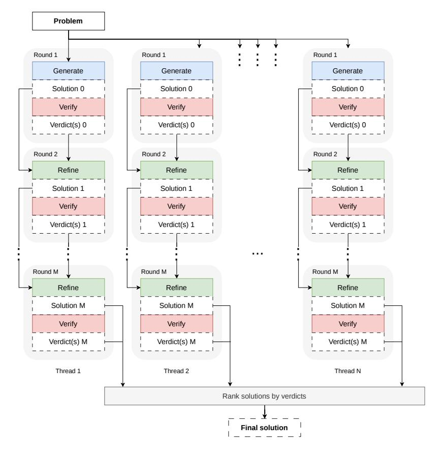
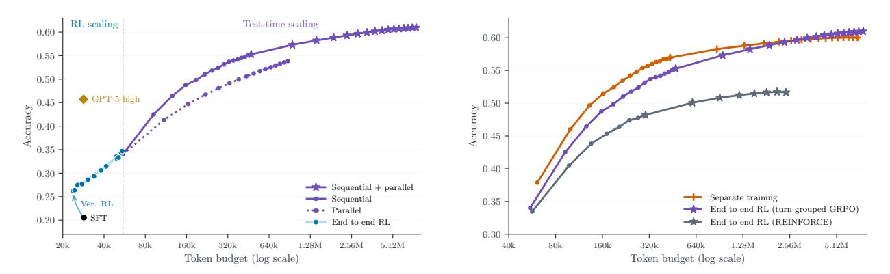

# **3 Scaling Reasoning Tokens via Parallel Thinking at Test Time**

To scale reasoning tokens beyond the compute wall identified in [Section 2.4,](#page-3-0) we introduce a parallel thinking framework that distributes the reasoning budget across independent threads, each executing multiple rounds of self-verification and self-refinement. Each individual generation remains short, sidestepping the quadratic attention bottleneck, while the total generated tokens extend by over an order of magnitude beyond what is feasible at training time. We describe the inference pipeline in [Section 3.1,](#page-4-1) the training procedure that aligns the model with this multi-round structure in [Section 3.2,](#page-5-0) and the resulting scaling behavior in [Section 3.3.](#page-7-0)

#### **3.1 Pipeline Overview**

We now detail the test-time inference procedure; see [Figure 5](#page-5-1) for an overview. Given a problem x, the parallel thinking system spawns N independent threads. Each thread executes up to M rounds, where each round consists of the following two steps:

- 1. **Generate/Refine**: In the first round, the model produces a candidate solution from scratch. In subsequent rounds, the model generates a refined solution conditioned on the previous attempt and a negative verification verdict from the previous round.
- 2. **Verify**: Given a solution y, the model produces V verdicts via V independent sampling calls, each containing a correctness judgment and its corresponding reasoning. If all V verdicts unanimously deem the solution correct, the thread terminates early.

The total reasoning token budget is at most N × M × Tround, where Tround is the average tokens per round, and is often less due to early termination. After all threads complete, the system selects a final answer from all solutions produced across all threads and rounds. Let yn,m denote the solution produced at round m of thread n, with verification verdicts vn,m,j ∈ {0, 1} for j = 1, . . . , V . Each solution is scored by its number of positive verdicts:

$$s_{n,m} = \sum_{j=1}^{V} v_{n,m,j}.$$
 (4)

The solution with the highest score is selected as the final answer, with ties broken by preferring earlier rounds and remaining ties broken randomly. We prefer earlier rounds because refinement can degrade correct solutions when guided by incorrect verdicts. Among equally scored solutions, the one requiring fewer refinement steps is more likely to be correct.

**Why self-verification?** Unlike mathematical reasoning where majority voting on final answers is effective [\[40\]](#page-11-4), competitive programming solutions are code and cannot be meaningfully compared by output equivalence alone. An alternative is to check candidates against brute-force solvers with self-generated unit tests [\[21\]](#page-10-10), but producing correct-by-construction test generators and reference solutions is itself a challenging problem. We

> **[图片提取文字 (无描述)]:**
> Problem Round 1 Round 1 Round 1 Generate Generate Generate Solution 0 Solution 0 Solution 0 Verify Verify Verify Verdict(s) 0 Verdict(s) 0 Verdict(s) 0 Round 2 Round 2 Round 2 Refine Refine Refine Solution 1 Solution 1 Solution 1 Verify Verify Verify Verdict(s) 1 Verdict(s) 1 Verdict(s) 1 Round M Round M Round M Refine Refine Refine Solution M Solution M Solution M Verify Verify Verify Verdict(s) M Verdict(s) M Verdict(s) M Thread 2 Thread 1 Thread N Rank solutions by verdicts Final solution

**Figure 5** The parallel thinking inference pipeline. The system spawns N independent threads. Each thread **generates** a candidate solution, then **verifies** it via V independent sampling calls, each producing a correctness judgment and reasoning. If all V verdicts unanimously deem the solution correct, the thread terminates early; otherwise, one negative verdict is randomly selected and the model **refines** the solution conditioned on the previous attempt and the selected reasoning. This verify-refine loop repeats for up to M rounds. After all threads complete, all solutions across threads and rounds are ranked by verification vote count, and the highest-scoring one is returned.

instead rely on self-verification, where the same model trained via verification RL, as shown in [Section 2.3,](#page-2-0) judges each candidate, providing both the ranking signal for selecting among candidate solutions and the feedback that drives refinement, with no external oracle required.

**Beyond independent threads.** Our pipeline can be naturally extended in several directions: (1) incorporating unit-test-based verification oracle alongside self-verification, as our preliminary experiments show this further improves performance; (2) using unit test execution signals, such as failing test cases, to directly guide solution refinement; (3) replacing the linear verify-refine chain with tree search over refinement paths, using verification scores to prune and expand branches [\[43,](#page-11-5) [49\]](#page-11-6); (4) crossing solutions and verification reasoning across threads via summarization, akin to a neural evolutionary algorithm [\[20,](#page-10-11) [28,](#page-10-12) [31\]](#page-10-13); and (5) combining the vote-count ranking with more fine-grained selection strategies such as pairwise comparison or learned ranking models. In this work, we focus on the simplest instantiation, i.e., independent threads with linear verify-refine chains, and show that it already yields strong scaling. We leave systematic exploration of the aforementioned richer strategies to future work.

#### **3.2 Training for Parallel Thinking**

**Separate training.** The simplest approach is rather to deploy the checkpoint produced by the verification RL followed by generation RL pipeline in [Section 2.3.](#page-2-0) However, its training context is misaligned with the multiround test-time pipeline in [Section 3.1.](#page-4-1) In particular, each capability is trained independently on single-round

contexts, whereas at inference the verifier must evaluate on-policy solutions from the current generator, and refinement must be conditioned on the verification critique of the current solution. This mismatch between training and inference contexts motivates end-to-end RL training on the full multi-round pipeline.

**End-to-end RL.** To close this train—test gap, we train the model end-to-end on the full multi-round pipeline via RL, starting from the verification RL checkpoint of Section 2.3. For each problem x, we sample a group of trajectories, each consisting of M rounds of alternating turns:

$$\tau = (\underbrace{y_{\text{gen}}^1, y_{\text{ver}}^1, \underbrace{y_{\text{ref}}^2, y_{\text{ver}}^2, \dots, \underbrace{y_{\text{ref}}^M, y_{\text{ver}}^M}_{\text{round } 1}), \tag{5}$$

where  $y_{\mathtt{role}}^i$  denotes the model output at round i with the given role. Each round consists of a generation or refinement turn followed by a verification turn. Unlike test time where each verification turn produces V independent verdicts, training uses a single verdict (V = 1) to reduce rollout cost. Early termination follows the same rule, i.e., refinement is skipped if the verdict deems the solution correct. We now describe the reward structure and policy optimization.

**Per-turn rewards.** Each turn t is optimized for its own immediate reward  $r_t$ , determined by its role:

$$r_t = \begin{cases} \exp(x, y_t) & \text{if } y_t \text{ is a generation or refinement step,} \\ \mathbb{1}[\operatorname{verdict}(y_t) = \exp(x, y_{t-1})] & \text{if } y_t \text{ is a verification step,} \end{cases}$$
 (6)

where  $\operatorname{exec}(x,y) \in \{0,1\}$  is the execution result of solution y against the test suite for problem x,  $\operatorname{verdict}(y_t) \in \{0,1\}$  is the binary correctness prediction extracted from the verification output  $y_t$ , and  $y_{t-1}$  is the solution being verified. In other words, generation and refinement are rewarded for producing correct code, while verification is rewarded for predicting correctness accurately. Training on multi-round rollouts aligns the context distribution with the test-time pipeline, i.e., each turn is optimized in the presence of all preceding turns, so the model learns to generate, verify, and refine in context.

Remark. Optimizing the policy based on the immediate reward of each turn makes the underlying problem a multi-task contextual bandit [8]. A natural extension is to propagate credit across turns via a discounted return  $R_t = \sum_{k=t}^T \gamma^{k-t} r_k$  with  $\gamma > 0$ , so that the return of each turn reflects downstream outcomes. For instance, a generation step would be rewarded not only for immediate correctness but also for producing solutions that are easy to diagnose via verification when incorrect, and the verifier would receive gradients that reflect how its feedback is used during refinement. Here, we adopt  $\gamma = 0$  for simplicity, because propagating credit across turns introduces additional hyperparameter sensitivity. We leave that direction to future work.

**Policy optimization.** Since generation, verification, and refinement have heterogeneous reward distributions, advantage normalization is non-trivial. We consider the following two approaches.

- REINFORCE with batch-level whitening. The advantage of turn t is  $A_t = (r_t \mu)/(\sigma + \delta)$ , where  $\mu$  and  $\sigma$  are the mean and standard deviation of all rewards  $\{r_k\}$  in the batch regardless of role. This treats all turns uniformly, but normalizing across roles with different reward distributions may distort their respective advantage and gradient signals.
- Turn-grouped GRPO. Standard GRPO [33] is a contextual bandit algorithm that computes advantages within a group of responses to the same prompt. Here, we extend it by computing advantages separately for each turn. The advantage of turn t in a given trajectory is

$$A_t = r_t - \mu_t, \quad \mu_t = \mathbb{E}_{\text{batch}}[r_t], \tag{7}$$

where  $\mu_t$  is the mean reward at turn t across all trajectories in the batch. Note that we do not divide by the turn-grouped standard deviation in Equation (7), as mean-centering alone suffices. Since each turn t maps to a fixed role, this calibrates the gradient signal per turn and role independently, avoiding the distortion from batch-level whitening.

In both cases, the policy is updated using the clipped surrogate objective [32]:

$$\mathcal{L}(\theta) = -\mathbb{E}_t \Big[ \min \big( \rho_t(\theta) A_t, \operatorname{clip}(\rho_t(\theta), 1 - \varepsilon, 1 + \varepsilon) A_t \big) \Big], \tag{8}$$

where  $\rho_t(\theta) = \pi_{\theta}(y_t \mid c_t)/\pi_{\theta_{\text{old}}}(y_t \mid c_t)$  is the importance sampling ratio between the current and previous policies,  $\varepsilon$  is the clipping parameter, and  $c_t$  denotes the context at turn t, comprising the problem statement and respective model outputs from preceding turns.

#### 3.3 Scaling Results

We now evaluate how parallel thinking scales with reasoning tokens. All experiments use the end-to-end RL model trained with turn-grouped GRPO from Section 3.2 with V=8 verdicts per verification step unless noted otherwise. The starting point for all test-time scaling curves is a single generation from the end-to-end RL checkpoint, at  $\sim 0.34$  accuracy and  $\sim 60 \text{K}$  tokens. Figure 6 (left) places RL training-time scaling and test-time parallel thinking on a unified token budget axis, and Figure 6 (right) isolates the effect of end-to-end RL. Additional ablations on the effect of varying the number of threads and verdicts are provided in Section A. A few observations are in order.

> **[图片提取文字 (无描述)]:**
> RL scaling Test-time scaling 0.60 0.60 0.55 0.550.50 Accuracy 0. GPT-5-high Accuracy 0.45 -0.35 0.40 0.30 → Sequential + parallel 0.25 -- Separate training - Sequential 0.35Ver. RL End-to-end RL (turn-grouped GRPO) · • Parallel 0.20 • SFT - End-to-end RL End-to-end RL (REINFORCE) 0.30 20k 40k 80k 2.56M5.12M40k 80k 160k 320k 640k 1.28M2.56M5.12M160k 320k 640k 1.28MToken budget (log scale) Token budget (log scale)

Figure 6 Left: Unified token budget axis spanning training-time RL scaling from 20K to 60K tokens and test-time parallel thinking with the end-to-end RL model from 60K to 7.6M tokens. Sequential refinement outperforms parallel generation at every token budget; combining both extends scaling beyond the sequential plateau and surpasses GPT-5-high by a wide margin. Right: Effect of end-to-end RL on sequential-plus-parallel scaling. Separate training initially outperforms end-to-end RL with turn-grouped GRPO due to stronger single-round generation, but the latter catches up by ~2M tokens and overtakes it at higher budgets. End-to-end RL with REINFORCE scales substantially worse.

Sequential refinement is more token-efficient than parallel generation. Sequential scaling fixes the number of threads to N=1 and increases the number of verify-refine rounds from M=1 to M=16. This reaches  $\sim 0.49$  by 160K tokens, surpassing GPT-5-high [36] at  $\sim 0.46$  within a few refinement rounds, and continues to climb to  $\sim 0.55$  at  $\sim 500$ K tokens before plateauing. This steep trajectory reflects the core advantage of sequential scaling, i.e., each refinement round is conditioned on verification feedback from the previous attempt, so the model can diagnose and correct specific errors adaptively rather than regenerating blindly.

Parallel scaling is less token-efficient but reduces wall-clock time. Parallel scaling fixes the number of rounds to M=1 and increases the number of threads from N=1 to N=16, with each thread generating a single solution that is then ranked by verification score. This consistently lags sequential refinement at the same token budget, e.g.,  $\sim 0.45$  versus  $\sim 0.49$  at 160K tokens. This gap is expected because parallel threads generate independently without leveraging verification feedback, so they behave like best-of-N with a learned ranker. The practical value of parallelism lies in wall-clock latency reduction rather than token efficiency, since all threads execute concurrently.

Combining sequential and parallel scaling yields the best results. Sequential-plus-parallel scaling first applies M=16 verify-refine rounds within each thread, then increases the number of threads from N=1 to N=16. At the full configuration of N=16 threads and M=16 rounds, accuracy reaches  $\sim 0.61$  at 7.6M tokens, well beyond the sequential-only plateau of  $\sim 0.55$ . This demonstrates that parallelism adds complementary value once sequential refinement within each thread has saturated, i.e., different threads explore different solution

&lt;sup>2Due to limited computational resources, we evaluate the REINFORCE checkpoint only up to N=8 threads and M=8 rounds. Even within this truncated range, it remains substantially below the other methods at comparable token budgets.

strategies, and verification-based ranking selects the best one across all threads and rounds. The full pipeline surpasses GPT-5-high [\[36\]](#page-10-6) by a substantial margin.

**End-to-end RL overtakes separate training at scale.** [Figure 6](#page-7-1) (right) compares the separately trained model from [Section 2.3](#page-2-0) with the end-to-end RL model under sequential-plus-parallel scaling. The separately trained model[3](#page-8-0) starts ∼4 points higher at 65.5K tokens, 0.38 versus 0.34, reflecting its stronger single-generation quality from independently optimized generation and verification stages. However, the end-to-end RL model catches up by ∼2M tokens and reaches ∼0.61 at the highest budgets, slightly exceeding the separately trained model at ∼0.60. While the final gap is modest, the scaling trajectory is qualitatively different. In particular, end-to-end training trades single-round quality for improved multi-round coherence, as the verifier learns to critique on-policy generations and the refiner learns to act on on-policy verification feedback, a coordination that separate training cannot achieve. [Figure 6](#page-7-1) (right) also shows that turn-grouped GRPO substantially outperforms REINFORCE with batch-level whitening at ∼0.61 versus ∼0.51 at the highest budgets, confirming that calibrating advantages per turn and role is important for multi-round training.

## **4 Related Work**

**RL for LLM reasoning.** Chain-of-thought (CoT) prompting [\[42\]](#page-11-0) establishes that LLMs benefit from generating intermediate reasoning steps before producing a final answer. RL extends this paradigm by training models to produce much longer and more effective reasoning traces. OpenAI o1 [\[29\]](#page-10-1) first demonstrates large-scale RL for reasoning, and later DeepSeek-R1 [\[7\]](#page-9-2) shows that RL alone can incentivize long CoT directly from a base model without any cold-start. DeepSeekMath [\[33\]](#page-10-3) introduces GRPO for mathematical reasoning, which we adapt as our core policy optimization algorithm. DeepSeekMath-V2 [\[34\]](#page-10-15) extends this line by training LLM verifiers for self-verifiable mathematical reasoning, relying on human annotations to supervise verification. Relevant work explores various RL recipes, including dynamic sampling, clip-higher, REINFORCE++, prolonged training schedules, entropy stabilization, and length control [\[1,](#page-9-6) [5,](#page-9-10) [14,](#page-9-11) [24,](#page-10-5) [46\]](#page-11-3). Kimi k1.5 [\[18\]](#page-10-16) employs a variant of online mirror descent for policy optimization and jointly trains on text and vision data for multimodal reasoning, while Qwen3 [\[45\]](#page-11-7) introduces hybrid thinking that dynamically switches between thinking and non-thinking modes. The influence of the base model on long CoT RL training is also studied, with work questioning whether RL genuinely expands reasoning beyond base model capabilities [\[47\]](#page-11-8), investigating how different base models respond to zero-RL training [\[48\]](#page-11-9), and analyzing the training dynamics of R1-Zero-like approaches [\[26\]](#page-10-17). Our work documents an empirical log-linear trend between accuracy and reasoning tokens during RL training on competitive programming, and introduces randomized clipping and verification RL warmup as two techniques that improve the observed trend.

**Test-time compute scaling.** Test-time compute can be scaled through several complementary mechanisms. Best-of-N sampling and majority voting [\[40\]](#page-11-4) generate multiple independent solutions, while tree search methods, including Monte Carlo tree search [\[15,](#page-9-12) [49\]](#page-11-6) and best-first search [\[43,](#page-11-5) [44\]](#page-11-10), explore branching paths. In competitive programming, AlphaCode [\[21\]](#page-10-10) pioneers competition-level code generation by generating up to one million samples per problem and clustering them by behavioral equivalence on generated test inputs, while AlphaCode 2 [\[10\]](#page-9-13) achieves improved performance by leveraging a stronger base model and learned scoring. Process reward models provide step-level supervision to guide search, using human annotations [\[22\]](#page-10-18), automated labeling [\[39\]](#page-11-11), or implicit rewards derived from outcome signals [\[6\]](#page-9-14). Recent work shows that optimally allocating test-time compute can be more effective than scaling model parameters [\[37\]](#page-10-2), and meta RL can further improve token efficiency at test time [\[30\]](#page-10-19). SCoRe [\[19\]](#page-10-20) and Goedel-Prover-V2 [\[23\]](#page-10-21) train self-correction via multi-turn RL. Seed-Prover [\[3\]](#page-9-15) scales test-time compute by decomposing proofs into lemmas cached in a reusable memory pool. Our parallel thinking framework combines parallel generation with sequential self-verification and self-refinement, and trains the model end-to-end on the multi-turn pipeline via RL.

3We use an earlier checkpoint from the separately trained pipeline with ∼0.38 accuracy and ∼65.5K average generation length, rather than the final checkpoint which exceeds 100K tokens and makes multi-round rollouts prohibitively slow. See [Figure 4](#page-4-0) (right) for the corresponding scaling curve.

