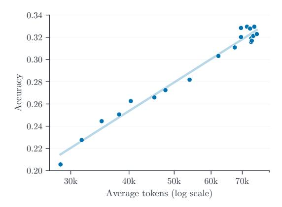
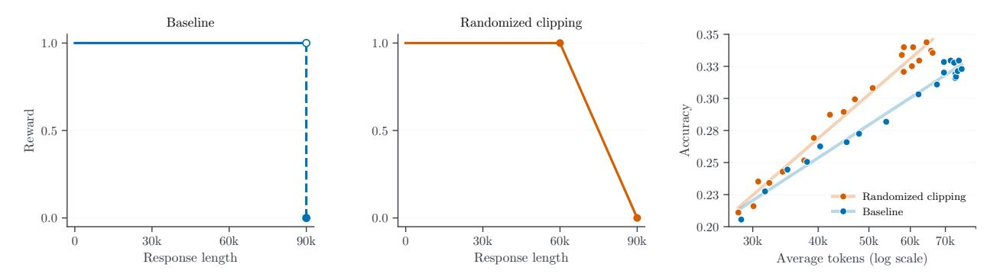
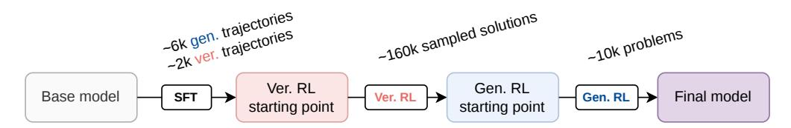
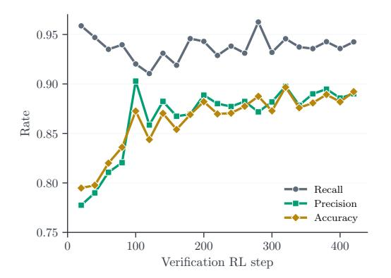
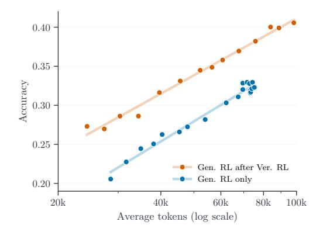

# **Abstract**

We study how to scale reasoning token budgets for competitive programming through two complementary approaches: training-time reinforcement learning (RL) and test-time parallel thinking. During RL training, we observe an approximately log-linear relationship between validation accuracy and the average number of generated reasoning tokens over successive checkpoints, and show two ways to shift this training trajectory: verification RL warmup raises the starting point, while randomized clipping produces a steeper trend in the observed regime. As scaling single-generation reasoning during RL quickly becomes expensive under full attention, we introduce a multi-round parallel thinking pipeline that distributes the token budget across threads and rounds of generation, verification, and refinement. We train the model end-to-end on this pipeline to match the training objective to the test-time structure. Starting from Seed-OSS-36B, the full system with 16 threads and 16 rounds per thread matches the underlying RL model's oracle pass@16 at pass@1 using 7.6 million tokens per problem on average, and surpasses GPT-5-high on 456 hard competitive programming problems from AetherCode.

**Date:** April 3, 2026

**Correspondence:** x.xiaxiao@bytedance.com

## **1 Introduction**

Scaling compute has been a central driver of progress in large language models and general AI systems [\[38\]](#page-10-0). Pre-training scaling laws are well established [\[12,](#page-9-0) [16\]](#page-9-1), and recent work has shifted toward scaling reasoning capabilities. On the training side, reinforcement learning (RL) has proven effective at incentivizing models to produce longer and more useful chain-of-thought reasoning traces [\[42\]](#page-11-0), as seen in systems such as OpenAI o1 [\[29\]](#page-10-1) and DeepSeek-R1 [\[7\]](#page-9-2). On the test-time side, agentic pipelines that orchestrate multiple generations, verification, and search offer a complementary way to spend additional reasoning compute without increasing single-generation length [\[11,](#page-9-3) [37\]](#page-10-2).

In this work, we study reasoning tokens scaling for competitive programming, a technical domain that remains challenging even for frontier models and provides unambiguous correctness signals through execution-based evaluation, making it an ideal testbed. Our contributions are the following:

• We identify an **empirical log-linear trend** between average generated reasoning tokens and validation accuracy during RL training, and use it as a descriptive lens to compare RL variants. In this view, verification RL warmup raises the starting point, while randomized clipping yields a steeper trend.

- We introduce a **parallel thinking** framework, a multi-turn test-time pipeline that scales reasoning tokens across turns rather than within a single generation, combining multi-thread generation, self-verification, sequential self-refinement, and verification-based ranking. We train the model end-to-end on the full multi-turn pipeline via RL, aligning the training objective with the test-time structure.
- Starting from Seed-OSS-36B [2], our full parallel thinking pipeline with 16 threads and 16 self-verifyrefine rounds achieves pass@1 accuracy matching the oracle pass@16 of the underlying RL model using 7.6 million tokens per problem on average, and surpasses GPT-5-high1 on 456 hard competitive programming problems from AetherCode [41].

#### 2 Scaling Reasoning Tokens via RL at Training Time

We begin by studying how reasoning tokens scale during RL training. After describing the baseline setup in Section 2.1, we present an empirical log-linear trend between reasoning tokens and accuracy in Section 2.2. This trend serves as a descriptive framework for comparing RL strategies. We then demonstrate in Section 2.3 two examples of improving the curve via verification RL warmup and randomized clipping. Finally, Section 2.4 discusses the training-time compute wall that motivates our test-time approach.

#### 2.1 Baseline Setup

We use Seed-OSS-36B-Base [2] as the base model and train on proprietary competitive programming problems collected from online platforms like Codeforces. For evaluation, we use AetherCode [41] as the validation set, which contains 456 competitive programming problems collected from premier programming competitions such as IOI and ICPC. Each solution is evaluated by execution against unit tests, receiving a reward of +1 if it passes all tests and 0 for any failure, including compilation error, wrong answer, and time limit exceeded. Responses that exceed the maximum context length are truncated and treated as incorrect.

Training uses asynchronous GRPO [33], which is built on an in-house infrastructure similar to open-source RL frameworks [13, 35, 50], and allows 1-step off-policy samples for improved training throughput. At each training step, the model generates 32 rollouts for a batch of 16 problems, receives rewards based on execution results, and updates the policy. Most RL runs use 256 or 512 A100 GPUs with maximum context length of 90K tokens. Before RL training, we perform supervised fine-tuning (SFT) on approximately 6K proprietary trajectories as a cold start. Total RL training data consists of approximately 10K problems.

#### 2.2 An Empirical Log-Linear Trend During RL Training

During RL training, the model progressively generates more reasoning tokens, consistent with prior observations in the literature [7, 24]. Across successive RL checkpoints, we observe that the relationship between the average generation length and validation accuracy is **log-linear**: accuracy increases linearly with the logarithm of the average token count, as shown in Figure 1.

We view this as an empirical regularity of our training setup rather than a universal law, and the plot should be interpreted as a compact summary of training dynamics in this regime. Still, the linear fit holds consistently across our different RL configurations and is stable enough to serve as a useful descriptive framework with several practical implications. First, it enables early comparison of RL recipes, i.e., rather than training to convergence, one can fit the log-linear scaling curve from early checkpoints and extrapolate to compare the start-

> **[图片提取文字 (无描述)]:**
> 0.34 -0.320.30 Accuracy 0.280.26 0.24 0.220.20 30k40k50k60k70kAverage tokens (log scale)

**Figure 1** Log-linear trend: validation accuracy scales linearly with the logarithm of the average number of reasoning tokens during RL training. Each point corresponds to a successive RL training checkpoint.

ing point and slope across different setups. Second, it provides a framework for diagnosing whether a new

&lt;sup>1GPT-5-high refers to GPT-5 evaluated with reasoning\_effort=high as described in the OpenAI GPT-5 System Card [36].

technique improves the intercept, the slope, or both, as we demonstrate in Section 2.3. Third, it can guide compute budgeting by predicting the accuracy gain from a target increase in reasoning tokens.

#### 2.3 Improving the Log-Linear Trend

We now illustrate two ways to improve the log-linear scaling curve. Randomized clipping steepens the slope by smoothing the hard reward boundary. Verification RL warmup raises the starting point before the generation RL stage described in Section 2.1. Other factors, such as the base model and the composition of the cold-start data, may also matter, but we do not explore them here.

Steepening the slope via randomized clipping. In the baseline generation RL setup from Section 2.1, each response is subject to a hard maximum token limit L. The reward for a prompt-response pair (x, y) is

$$R^{(L)}(x,y) := \operatorname{score}(x,y) \cdot \mathbb{1}[|y| \le L], \tag{1}$$

where  $score(x, y) \in \{0, 1\}$  is the execution result and |y| denotes the response length in tokens. For correct solutions, this is a step function in |y| as shown in Figure 2 (left), i.e., a response just below the limit receives full reward while one just above it receives none. The result is a sharp reward cliff near the boundary, with no gradual incentive to shorten near-limit responses.

> **[图片提取文字 (无描述)]:**
> Baseline Randomized clipping 0.35 -1.0 0.33 0.30 0.28 -Reward 0.5 -0.250.23 Randomized clipping - Baseline 0.0 0.0 -0.20 90k90k 60k60k 70k 30k 60k30k 30k 40k 50k Response length Response length Average tokens (log scale)

Figure 2 Randomized clipping replaces the hard reward cliff (left) with a smooth ramp (middle), producing a steeper log-linear scaling curve (right).

We propose randomized clipping (RC), which replaces the fixed cap with a random cap sampled from a distribution  $\mathcal{D}$ . In expectation, this turns the hard cliff into a smooth penalty as a function of response length. The effective reward becomes

$$R^{(\mathcal{D})}(x,y) := \mathbb{E}_{L \sim \mathcal{D}}[R^{(L)}(x,y)] = \operatorname{score}(x,y) \cdot \mathbb{P}_{L \sim \mathcal{D}}(|y| \le L) = \operatorname{score}(x,y) \cdot (1 - F_{\mathcal{D}}(|y|)), \tag{2}$$

where  $F_{\mathcal{D}}$  is the cumulative distribution function of  $\mathcal{D}$ . Because the penalty term  $1 - F_{\mathcal{D}}(|y|)$  multiplies  $\mathrm{score}(x,y)$ , it only affects correct solutions; incorrect solutions still receive zero reward regardless of length. This preserves the model's incentive to explore longer reasoning on difficult problems. Different choices of  $\mathcal{D}$  induce different smooth penalties: a Gaussian yields a sigmoid-shaped decay, a truncated exponential yields an exponential decay, and a uniform distribution yields a linear ramp. For simplicity, we use  $\mathcal{D} = \mathrm{Uniform}(a,b)$ , which gives the following piecewise linear reward:

$$R^{(\mathcal{D})}(x,y) = \operatorname{score}(x,y) \cdot \begin{cases} 1 & \text{if } |y| \le a, \\ \frac{b - |y|}{b - a} & \text{if } a < |y| < b, \\ 0 & \text{if } |y| \ge b, \end{cases}$$

$$(3)$$

We set b = 90000 to match the original hard limit and a = 60000 as a more economical budget within which most correct solutions already fit; see Figure 2 (middle). As shown in Figure 2 (right), RC steepens the log-linear scaling curve relative to the baseline, yielding better accuracy at a fixed reasoning token budget.

Remark. While prior work has explored explicit length penalties added to the reward [1, 25, 46], RC offers a principled perspective rooted in randomized smoothing techniques from zeroth order optimization [9, 27]: the effective penalty arises implicitly from randomizing the existing token limit, with the penalty shape controlled entirely by the choice of distribution  $\mathcal{D}$ .

Shifting the starting point via verification RL warmup. Before the generation RL described in Section 2.1, we first train the model on a verification task using RL: given a problem and a candidate solution, predict whether the solution is correct. Here, the model produces a chain-of-thought analysis that traces execution, tests edge cases, and constructs counterexamples before outputting a binary verdict, where only the final verdict is used for scoring. After RL training, verification takes on average approximately 10K tokens, reflecting the depth of reasoning required to catch subtle algorithmic errors such as off-by-one flaws in combinatorial formulas or data structure misuse. Figure 3 illustrates the full training pipeline.

> **[图片提取文字 (无描述)]:**
> -6k gen. trajectories -2k <mark>ver</mark>. trajectories ~160k sampled solutions \_10k problems Ver. RL Gen. RL Base model Final model Ver. RL Gen. RL starting point starting point

**Figure 3** Training pipeline: SFT cold start with generation and verification trajectories, followed by verification RL and generation RL.

In particular, the SFT cold start of verification RL uses approximately 6K generation trajectories alongside 2K verification trajectories created by rejection sampling from a generation RL checkpoint. Verification RL then trains on approximately 160K candidate solutions collected from previous generation RL runs, each automatically labeled correct or incorrect by execution against unit tests. The reward is +1 for a correct verdict and 0 otherwise, using the same RL configuration as generation training described in Section 2.1.

The verification RL training dynamics is shown in Figure 4 (left). Recall starts high at  $\sim 0.96$  and remains stable throughout training, while precision climbs steadily from  $\sim 0.78$  to  $\sim 0.89$ . This indicates that the SFT checkpoint already detects most correct solutions, but frequently misclassifies incorrect ones as correct. Verification RL primarily reduces these false positives. By step 420, accuracy reaches  $\sim 0.89$ .

The resulting verification RL checkpoint then serves as initialization for generation RL. As shown in Figure 4 (right), verification RL warmup shifts the log-linear scaling curve upward: generation RL initialized from the verification checkpoint achieves higher accuracy than generation RL alone at any given token budget. At the standard 90K maximum context length, generation RL without verification warmup plateaus at  $\sim 0.33$  once the average generation length reaches  $\sim 70 \, \mathrm{K}$  tokens, whereas the warm-started run reaches  $\sim 0.38$  using a similar number of tokens. Continuing the warm-started run with an extended 120K maximum context length allows it to keep improving beyond the original budget range while remaining consistent with the same overall trend. We hypothesize that verification training improves the model's ability to internally evaluate solution correctness, yielding a stronger starting point and thus a more favorable scaling trajectory for subsequent generation RL.

Remark. The success of verification RL warmup suggests a broader principle: incorporating data that exercises sub-capabilities useful for generation may further improve the generation scaling curve. We leave systematic exploration of this direction to future work.

#### 2.4 The Compute Wall

The empirical log-linear trend suggests that, within the range we observe, longer generations are associated with higher validation accuracy. However, directly pushing sequence length further during RL training quickly becomes impractical. With full attention, the computational cost scales quadratically with sequence length. At an average response length of  $\sim 100 \mathrm{K}$  tokens, a single RL training step takes approximately 4 hours on 256 A100s, making further scaling prohibitively expensive. Efficient attention mechanisms [4, 17] might alleviate this bottleneck, but this compute wall motivates our test-time approach described in the next section.

> **[图片提取文字 (无描述)]:**
> 0.950.90Rate 0.850.80 Recall Precision Accuracy 0.75100 200 300 400 Verification RL step

> **[图片提取文字 (无描述)]:**
> 0.400.35 Accuracy 0.30 0.25Gen. RL after Ver. RL Gen. RL only 0.2020k40k 80k 100k60k Average tokens (log scale)

**Figure 4** Verification RL warmup. **Left**: recall remains high while precision and accuracy improve during verification RL. **Right**: initializing generation RL from the verification checkpoint shifts the log-linear scaling curve upward.

