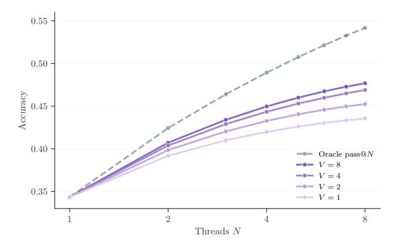
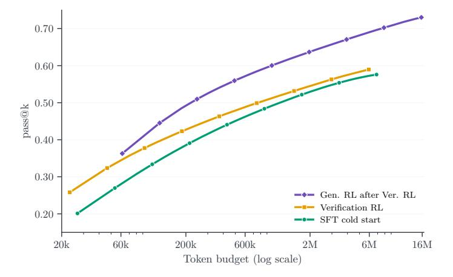

# **A Ablation on Number of Verdicts in Parallel Thinking**

In this section, we ablate how the number of verification verdicts V affects the accuracy of the parallel thinking pipeline described in [Section 3.](#page-3-2) All experiments use an early checkpoint of the end-to-end RL model trained with turn-grouped GRPO and fix M=1, i.e., no refinement, isolating the contribution of verification from sequential scaling.

[Figure 7](#page-12-1) shows accuracy as a function of threads N for V ∈ {1, 2, 4, 8} verdicts. Increasing V consistently improves accuracy at every thread count, but the gains are modest: at N=8, moving from V =1 to V =8 improves accuracy from ∼0.43 to ∼0.48, while the oracle pass@8 sits at ∼0.54. The persistent gap indicates that the verification capability to distinguish correct from incorrect solutions, rather than the number of ranking samples, is the primary bottleneck. Prolonged verification RL training and more diverse verification data, for instance, are promising directions for closing this gap. This observation also motivates the sequential refinement approach in [Section 3.3,](#page-7-0) which uses the diagnostic information in negative verdicts to improve solutions rather than only rank them.

> **[图片提取文字 (无描述)]:**
> 0.55 -0.50 -Accuracy 0.45 -0.40 -Oracle pass@N--- V = 8 -- V = 4 -0-V=20.35 ---- V = 1 Threads N

**Figure 7** Parallel scaling accuracy versus number of threads N for varying verdicts V ∈ {1, 2, 4, 8} (colored), with M=1, i.e., no refinement. More verdicts improve ranking quality, but the gap to the oracle pass@N (dashed) remains substantial, suggesting that verifier capability is the primary bottleneck.

### **B** Oracle Pass Rate Scaling

In this section, we evaluate the oracle pass@k scaling behavior of three key checkpoints in our training pipeline: (1) the SFT cold-start checkpoint, (2) the verification RL checkpoint, and (3) the generation RL checkpoint initialized from verification RL4, i.e., the full pipeline of Figure 3. We sample up to k=256 generations per problem, and the token budget is computed as k times the average generation length. Experimental results are shown in Figure 8 and two remarks are in order.

Verification RL improves per-sample quality but not coverage. The verification RL checkpoint, despite not being trained on generation, improves over SFT at low k, e.g.,  $\sim 0.26$  versus  $\sim 0.20$  at pass@1, consistent with our hypothesis in Section 2.3 that verification training transfers evaluative capabilities that benefit generation. However, the two checkpoints converge to  $\sim 0.57-0.59$  at pass@256, suggesting that verification RL increases per-sample success rate rather than expanding the set of reachable solutions by, e.g., avoiding common errors.

**Generation RL expands solution coverage.** The generation RL checkpoint maintains a substantial lead at  $\sim 0.73$  pass@256. Since the gap persists even at large k where sampling diversity is high, generation RL genuinely expands solution coverage beyond what SFT can reach at any sampling budget. This contrasts with the finding of [47], which observes that RL does not expand reasoning beyond the base model on mathematical reasoning tasks. A possible explanation is that competitive programming, with its combinatorially richer solution space and execution-based reward signal, provides a stronger training signal for RL to discover novel strategies outside the SFT distribution.

> **[图片提取文字 (无描述)]:**
> 0.70 -0.60 -0.50 - $\operatorname{pass@k}$ 0.40 -0.30 -Gen. RL after Ver. RL Verification RL 0.20 -SFT cold start 200k16M20k 60k600k2M6MToken budget (log scale)

Figure 8 Oracle pass@k versus token budget for three training stages: SFT cold start, verification RL, and generation RL after verification RL. Generation RL dominates at every token budget. The gap persists even at pass@256, indicating that RL can expand solution coverage beyond the SFT frontier rather than merely concentrating probability on existing solutions.

&lt;sup>4As in Section 3.3, we use an earlier generation RL checkpoint with ~0.38 accuracy and ~65.5K average generation length rather than the final one, which exceeds 100K tokens. See Figure 4 (right) for the corresponding scaling curve.

