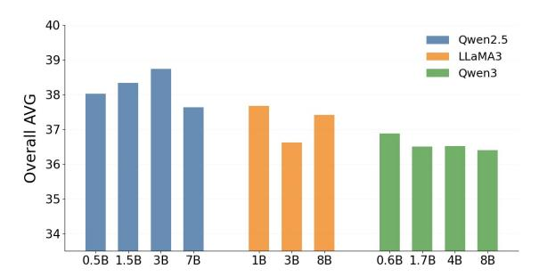

# 3.1.3 Cross-Lingual Generalization from English-Only Supervision

Despite using only English QA supervision during probe training, Sentinel generalizes effectively to Chinese LongBench tasks without additional supervision (Table [2\)](#page-4-1). Sentinel substantially outperforms Empty Context, Random Selection, and Raw Attention baselines across Chinese benchmarks, suggesting that the contextual utilization behaviors decoded by Sentinel are not tightly coupled to surface language statistics and can transfer robustly across

> **[图片提取文字 (无描述)]:**
> 40 Qwen2.5 39 LLaMA3 Qwen3 38 Overall AVG 36 35 34 0.5B 1.5B 3B 7B 18 3B 88 0.6B 1.7B 4B 8B

Figure 2: Impact of proxy model family and scale on Sentinel performance under a 2K-token context (Long-Bench Overall AVG)

languages under a unified probing framework.

## 3.2 Contextual Utilization Signals Across Proxy Scales

Sentinel achieves broadly comparable compression performance across proxy models of different scales and families (Figure [2\)](#page-5-1). While moderate scaling from compact to medium-sized proxies can provide small improvements, increasing proxy model size does not consistently yield further gains. We additionally observe that model family matters more than scale alone, with Qwen-based proxies consistently outperforming substantially larger Mistral-based proxies. These results suggest that Sentinel primarily relies on decoding queryconditioned contextual utilization behaviors rather than directly benefiting from stronger autoregressive generation capabilities.

Prior mechanistic studies have shown that certain contextual utilization behaviors are sparse, structured, and broadly shared across model scales [\(Wu](#page-9-9) [et al.,](#page-9-9) [2024;](#page-9-9) [Jin et al.,](#page-9-10) [2024\)](#page-9-10), suggesting that the utilization signals exploited by Sentinel may already emerge in compact instruction-tuned models.

At the same time, larger models can exhibit increasingly heterogeneous and multi-functional attention behaviors across heads and layers [\(Wu](#page-9-9) [et al.,](#page-9-9) [2024;](#page-9-9) [Zheng et al.,](#page-9-11) [2024\)](#page-9-11). Since Sentinel performs lightweight probing over head-wise attention patterns, larger proxy models do not necessarily provide more linearly decodable utilization signals. Overall, these observations suggest that effective context compression depends more on the accessibility of contextual utilization signals than on proxy model scale alone, enabling strong efficiency–performance tradeoffs using compact frozen proxies.

## 3.3 Ablation

We conduct ablation studies to analyze the source of Sentinel's compression behavior and to verify that its performance primarily arises from decoding model-internal contextual utilization signals, rather than from probe capacity, large-scale supervision, or specific attention heuristics.

By default, Sentinel is instantiated on Qwen-2.5- 0.5B-Instruct. Unless otherwise specified, all experiments use Qwen-2.5-7B-Instruct as the downstream LLM and are evaluated on LongBench.

## 3.3.1 Attention Feature Ablations

We analyze how contextual utilization signals are distributed across attention layers and heads by comparing different feature construction strategies. We compare three feature construction strategies: aggregating attention across all decoder layers, using only the final decoder layer, and selecting a compact subset of heads via mRMR [\(Ding and](#page-8-10) [Peng,](#page-8-10) [2005\)](#page-8-10). Experimental details are provided in Appendix [F.](#page-11-1)

As shown in the right panel of Figure [3,](#page-5-2) aggregating attention across all layers consistently achieves the strongest downstream compression performance. Using only the final decoder layer leads to a noticeable performance drop, while the selected-head variant preserves most of the performance with substantially fewer features. These results suggest that contextual utilization signals are broadly distributed across layers and cannot be reliably recovered from final-layer attention alone.

#### 3.3.2 Effect of Probing Data Size

We analyze whether Sentinel depends on largescale supervision by varying the amount of probing data used during probe training from 500 to 3000 QA examples.

As shown in the left panel of Figure [3,](#page-5-2) downstream performance remains nearly unchanged across probing set sizes. These results suggest that Sentinel does not learn compression behavior

> **[图片提取文字 (无描述)]:**
> 38.5 38 38.0 Overall AVG 37.5 37 37.0 36.5 36 36.0 500 1000 2000 3000 All Selected Last Layers Layer

Figure 3: Left: Robustness under different probing data sizes. Sentinel remains stable across probing sets ranging from 500 to 3000 samples. Right: Impact of different attention feature extraction strategies on downstream compression performance.

> **[图片提取文字 (无描述)]:**
> Retrieval Head Scores Logistic Regression Weights Owen2.5-0.5B-Instruct(24L×14H) Qwen2.5-0.5B-Instruct (24L × 14H) L23 L21 L20 38 L20 L19 L18 L19 L18 L17 L16 L15 L17 36 L16 9 AA Layer 113 Overall Raw Attention (0.5B) 0.2 Sentinel (0.5B) 28 --- Original Prompt 0.1 0.2 0.5 0.3 0.4 £ \$0 \$0 \$0 \$0 \$0 \$0 \$0 \$0 \$0 \$0 \$0 \$0 \$0 20 22 22 22 24 24 24 24 25 25 25 25 25 Compression Rate Attention Head Attention Head

Figure 4: Left: Robustness under different compression ratios on Qwen-2.5-7B-Instruct using a 0.5B proxy model. Right: Comparison between retrieval-oriented attention heads identified by prior retrieval-head analysis and headwise contextual utilization weights decoded by Sentinel probing.

| Method                | LongBench-En (2K Constraint) |          |       |        | LongBench-Zh (2K Constraint) | AVG      |        |         |
|-----------------------|------------------------------|----------|-------|--------|------------------------------|----------|--------|---------|
|                       | SingleDoc                    | MultiDoc | Summ. | En-AVG | SingleDoc                    | MultiDoc | Zh-AVG | Overall |
| Retrieval Head Top-7  | 33.71                        | 37.39    | 21.28 | 32.46  | 60.07                        | 18.51    | 39.29  | 35.88   |
| Retrieval Head Top-9  | 37.62                        | 43.82    | 22.17 | 34.54  | 58.84                        | 17.84    | 38.34  | 36.44   |
| Retrieval Head Top-14 | 36.53                        | 43.16    | 22.27 | 33.99  | 58.59                        | 18.53    | 38.56  | 36.28   |
| Sentinel              | 37.73                        | 46.16    | 23.03 | 35.64  | 62.24                        | 18.57    | 40.41  | 38.02   |

Table 3: Comparison between retrieval-head-based compression and Sentinel on LongBench under a 2K-token context constraint. Sentinel consistently outperforms sparse retrieval-head-based compression across English, Chinese, and overall averages.

from large-scale supervision. Instead, the probe primarily acts as a lightweight readout mechanism over contextual utilization signals already present in the frozen model. Even small probing sets are sufficient to support effective context compression. Detailed results are provided in Appendix [F.](#page-11-1)

## 3.3.3 Compression Ratio Variants

We evaluate whether Sentinel remains effective under increasingly aggressive compression ratios τ ∈ {0.1, 0.2, 0.3, 0.4, 0.5}, where smaller τ corresponds to more aggressive pruning.

As shown in the left panel of Figure [4,](#page-6-0) the Raw Attention baseline degrades substantially when τ < 0.4. In contrast, Sentinel remains stable across all compression levels and consistently outperforms the Raw Attention baseline. Notably, Sentinel surpasses the original prompt performance over a wide range of compression ratios, including the aggressive setting of τ = 0.2, suggesting that Sentinel effectively removes weakly utilized or distracting context under constrained context budgets. These results suggest that contextual utilization behavior cannot be reliably recovered from attention magnitude alone. Instead, lightweight probing over attention dynamics yields substantially more robust compression under aggressive pruning. Full task-level results are reported in Appendix [F.](#page-11-1)

