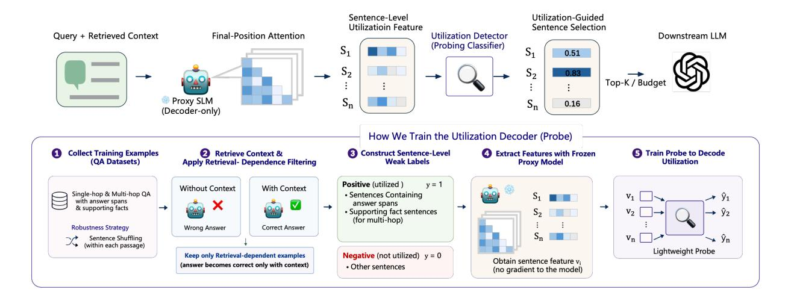

# Abstract

Retrieval-augmented generation (RAG) often suffers from long and noisy retrieved contexts. Existing context compression methods typically rely on heuristic relevance estimation or supervised compression models rather than on how LLMs utilize retrieved context during inference. We propose Sentinel, a lightweight sentence-level compression framework that decodes inference-time contextual utilization behaviors from head-wise attention patterns of frozen LLMs. To ground supervision in retrieval-dependent answering behavior, Sentinel trains a lightweight probe using QA examples where the model succeeds only when retrieved context is available. Sentinel performs compression using only a single nonautoregressive forward pass without dedicated compression training or autoregressive scoring. Empirically, we find that effective contextual utilization signals remain accessible even in compact proxy models. On LongBench, Sentinel with a 0.5B proxy model achieves up to 5× compression while attaining questionanswering performance competitive with compression methods built on 7B-scale models. Despite being trained only on English QA data, Sentinel also generalizes effectively to Chinese and out-of-domain settings.[1](#page-0-0)

## 1 Introduction

Large language models (LLMs) have achieved impressive performance across open-domain question answering, reasoning, and dialogue tasks [\(Brown et al.,](#page-8-0) [2020;](#page-8-0) [OpenAI,](#page-9-0) [2024\)](#page-9-0). To scale their capabilities to knowledge-intensive applications, Retrieval-Augmented Generation (RAG) has emerged as a powerful paradigm that augments model inputs with retrieved evidence from external corpora [\(Lewis et al.,](#page-9-1) [2020;](#page-9-1) [Guu et al.,](#page-8-1) [2020;](#page-8-1) [Shi et al.,](#page-9-2) [2024\)](#page-9-2). However, long retrieved contexts

are often noisy, redundant, or exceed model input limits, making context compression essential for both efficiency and effectiveness [\(Liu et al.,](#page-9-3) [2024;](#page-9-3) [Yoran et al.,](#page-9-4) [2024\)](#page-9-4).

Existing context compression methods can be broadly divided into two categories. Metric-based approaches estimate contextual utility using heuristic or model-derived importance signals, including query–context similarity and aggregated attention statistics[\(Jiang et al.,](#page-8-2) [2023,](#page-8-2) [2024a;](#page-8-3) [Li et al.,](#page-9-5) [2023;](#page-9-5) [Wang et al.,](#page-9-6) [2024;](#page-9-6) [Fang et al.,](#page-8-4) [2025\)](#page-8-4). While lightweight and training-free, these methods estimate relevance via heuristic or proxy importance scores, which are only indirectly related to the model's inference-time behavior. In contrast, datadriven approaches learn compression decisions using external supervision or generator feedback to optimize downstream task performance [\(Pan et al.,](#page-9-7) [2024;](#page-9-7) [Xu et al.,](#page-9-8) [2024;](#page-9-8) [Hwang et al.,](#page-8-5) [2024\)](#page-8-5). Although effective, these approaches treat context compression as an optimization problem external to the model's inference process, introducing additional training cost and often tying compression behavior to specific training objectives or generator feedback.

Recent mechanistic studies of Transformerbased LLMs have shown that decoder-only models exhibit structured context-utilization behaviors, with certain attention heads supporting query– context alignment and evidence retrieval [\(Wu et al.,](#page-9-9) [2024;](#page-9-9) [Jin et al.,](#page-9-10) [2024;](#page-9-10) [Huang et al.,](#page-8-6) [2025\)](#page-8-6). These findings suggest that LLMs actively form queryconditioned contextual utilization behaviors during inference rather than passively consuming retrieved context. However, prior mechanistic studies also suggest that attention heads can exhibit highly dynamic and context-dependent behaviors during inference [\(Wu et al.,](#page-9-9) [2024;](#page-9-9) [Zheng et al.,](#page-9-11) [2024\)](#page-9-11), making aggregated raw attention patterns an unreliable proxy for contextual utilization. Existing attentionbased compression methods nevertheless typically

1Our code is available at [https://github.com/](https://github.com/yzhangchuck/Sentinel) [yzhangchuck/Sentinel](https://github.com/yzhangchuck/Sentinel).

> **[图片提取文字 (无描述)]:**
> Sentence-Level Utilization-Guided Utilizatioin Feature Sentence Selection Query + Retrieved Context Final-Position Attention Utilization Detector Downstream LLM (Probing Classifier) S S 0.51  $S_2$ 0.83 Top-K / Budget Proxy SLM 0.16 (Decoder-only) How We Train the Utilization Decoder (Probe) Collect Training Examples Retrieve Context & Construct Sentence-Level Extract Features with Frozen Train Probe to Decode (QA Datasets) Weak Labels Utilization Apply Retrieval- Dependence Filtering **Proxy Model** Positive (utilized) v = 1Without Context With Context Single-hop & Multi-hop QA Sentences Containing with answer spans answer spans & supporting facts Supporting fact sentences (for multi-hop) Robustness Strategy Wrong Answer Correct Answer Sentence Shuffling (within each passage) Lightweight Probe Keep only Retrieval-dependent examples Negative (not utilized) y = 0Obtain sentence feature v. (answer becomes correct only with context) Other sentences (no gradient to the model)

Figure 1: Sentinel Framework Overview. Sentinel decodes query-aware context utilization from native attention behaviors of a frozen LLM. By probing sentence-level attention features aggregated at a single decoding step, Sentinel identifies relevant context without training compression models or performing full autoregressive generation.

aggregate attention magnitudes into heuristic relevance scores. In contrast, we view attention dynamics as behavioral traces that encode how the model utilizes retrieved context during inference.

We propose Sentinel, a lightweight framework that approaches context compression as a contextual utilization decoding problem. Instead of estimating heuristic relevance scores, Sentinel decodes how frozen LLMs utilize retrieved context during inference from head-wise attention patterns. To ground supervision in retrieval-dependent answering behavior, we train a lightweight probe using QA examples where the model succeeds only when retrieved context is available. Moreover, Sentinel extracts utilization signals from a single non-autoregressive forward pass, avoiding the iterative decoding or token-level scoring procedures required by many generation-based compression methods.

Empirically, Sentinel achieves up to 5× input compression on LongBench while attaining question-answering performance competitive with compression methods built on 7B-scale models using only a 0.5B proxy model. Although the probing classifier is trained solely on existing English QA data, the resulting compression strategy generalizes effectively to out-of-domain English LongBench tasks and exhibits robust cross-lingual transfer on Chinese benchmarks. Across multiple model families and scales, Sentinel exhibits broadly consistent compression behavior under a unified lightweight probing framework, suggesting that query-conditioned contextual utilization signals may emerge earlier than strong autoregressive generation capabilities.

#### Our contributions are as follows:

- We reinterpret context compression as a contextual utilization decoding problem grounded in inference-time context utilization behaviors of LLMs.
- We propose Sentinel, a lightweight probingbased framework that decodes contextual utilization from head-wise attention patterns of frozen LLMs using only a single nonautoregressive forward pass.
- We show that effective contextual utilization signals remain accessible across proxy model families and scales, enabling compact 0.5B proxy models to achieve compression performance competitive with 7B-scale methods.
- We demonstrate strong performance on longcontext benchmarks, where Sentinel consistently outperforms raw attention-based compression baselines while exhibiting robust cross-lingual generalization under aggressive compression.

## 2 Methodology

## 2.1 Context Compression as Contextual Utilization Decoding

Sentinel approaches query-aware context compression by decoding how LLMs utilize retrieved context during inference. Given a query q and a retrieved context C = {s1, s2, . . . , sn} composed of

sentences, Sentinel aims to select a subset  $C' \subseteq C$  that preserves the contextual information utilized by the model when answering the query.

Recent studies suggest that query-conditioned contextual utilization behaviors in decoder-only LLMs are reflected in their attention dynamics (Wu et al., 2024; Jin et al., 2024; Huang et al., 2025). Under appropriate prompting, the final prompt position can integrate information from the entire preceding context through causal self-attention (Jiang et al., 2024c), providing a compact representation of contextual utilization behavior.

We therefore feed the query and retrieved context into a compact decoder-only proxy model using a QA-style prompt and extract self-attention from the final prompt position. This design enables compression using a single non-autoregressive forward pass without iterative decoding or token-level generation scoring.

#### 2.2 Decoding Context Utilization via Probing

We decode context utilization by probing sentencelevel attention features extracted from the proxy model, without modifying or fine-tuning the model.

#### 2.2.1 Sentence-Level Attention Features

For each query–context input, we extract attention weights across transformer layers, heads, and input tokens from the final prompt position. Let L denote the number of transformer layers and H the number of attention heads per layer. The resulting attention tensor is denoted as  $\mathbf{A} \in \mathbb{R}^{L \times H \times T}$ , where T is the input length, and  $\mathbf{A}_{l,h,t}$  represents the attention weight assigned from the final prompt position to token t at layer t and head t.

For a sentence  $s_i$  containing token index set  $\mathcal{T}_i$ , we compute its normalized attention feature at layer l and head h as

$$a_i^{(l,h)} = \frac{\sum_{t \in \mathcal{T}_i} \mathbf{A}_{l,h,t}}{\sum_{t \in \mathcal{T}_c} \mathbf{A}_{l,h,t}} \tag{1}$$

where  $\mathcal{T}_C$  denotes the set of tokens originating from the retrieved context C, excluding prompt and query tokens. This normalization improves comparability across sentences by restricting attention mass to retrieved-context tokens.

The sentence-level feature vector for sentence  $s_i$  is then constructed as

$$\mathbf{v}_i = [a_i^{(1,1)}, \dots, a_i^{(L,H)}] \in \mathbb{R}^{LH}$$
 (2)

#### 2.2.2 Probing Context Utilization

To probe contextual utilization signals encoded in attention patterns, we train a lightweight probing classifier on top of the sentence-level representations.

We adopt logistic regression as a linear probe that maps each sentence feature vector  $\mathbf{v}_i \in \mathbb{R}^{LH}$  to a scalar utilization score:

$$\hat{y}_i = \sigma(\mathbf{w}^\top \mathbf{v}_i + b) \tag{3}$$

where  $\mathbf{w} \in \mathbb{R}^{LH}$  denotes the probe weight vector,  $b \in \mathbb{R}$  is a scalar bias term, and  $\hat{y}_i \in (0,1)$  represents the predicted utilization probability for sentence  $s_i$ .

A linear probe enables direct interpretation of head-wise contributions while reducing the risk of learning behaviors beyond those already encoded in the model.

