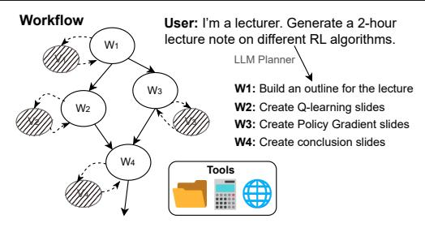
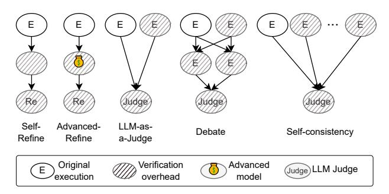

# 1 INTRODUCTION

Large language models (LLMs) are increasingly used across domains, from general-purpose tasks such as reasoning [\(Yao](#page-12-0) [et al.,](#page-12-0) [2023b;](#page-12-0) [Gou et al.,](#page-10-0) [2023\)](#page-10-0) and coding [\(Huang et al.,](#page-11-0) [2023;](#page-11-0) [Zhang et al.,](#page-12-0) [2024b\)](#page-12-0) to high-stakes applications like medical diagnosis [\(Ghezloo et al.,](#page-10-0) [2025\)](#page-10-0), scientific research [\(Aygun et al.](#page-10-0) ¨ , [2025\)](#page-10-0), and data center management [\(Zhaodong Wang & Zhang,](#page-12-0) [2025\)](#page-12-0). For complex tasks, a single inference often proves insufficient; instead, these tasks are decomposed into multiple LLM calls (i.e., subtasks) involving tool use, retrieval, and aggregation. This decomposition results in an *agentic workflow*, naturally modeled as a graph where nodes represent operations (e.g., API call or LLM inference) and edges capture information flow and dependencies.

Motivation. LLM inference is inherently error-prone and may produce incorrect results due to hallucinations, reasoning flaws, or inadequate context [\(Yao et al.,](#page-12-0) [2023a;](#page-12-0) [Boye](#page-10-0) [& Moell,](#page-10-0) [2025\)](#page-10-0). In agentic workflows, these errors are particularly problematic: mistakes made in the early nodes propagate down along the edges, amplifying as they go downstream, and contaminate the final output. To address this, researchers have proposed numerous verification methods, such as self-reflection [\(Madaan et al.,](#page-11-0) [2023\)](#page-11-0), debate [\(Du](#page-10-0) [et al.,](#page-10-0) [2023\)](#page-10-0), self-consistency [\(Wang et al.,](#page-12-0) [2023\)](#page-12-0), and LLMas-a-Judge [\(Zheng et al.,](#page-12-0) [2023\)](#page-12-0), to validate LLM outputs and improve the safety and reliability of LLM inferences. While effective, each verification incurs additional LLM calls, significantly increasing both latency along the critical path and monetary cost (e.g., up to 28.9× and 53.2× for instructionfollowing and coding benchmarks, respectively). Verifying only the terminal node in a workflow wastes compute resources and misses opportunities to stop error propagation early in the graph, and exhaustive verification across all nodes adds a prohibitively high overhead.

Challenges. Despite its importance, verification remains poorly understood, with several challenges limiting its deployment. First, identifying vulnerable nodes is difficult—existing frameworks offer little insight into how local errors affect final outcomes, leading to uninformed verifier

\* Yeonju Ro is affiliated with the University of Texas at Austin, but was at Microsoft Azure Research during this work. Correspondence to: Esha Choukse <esha.choukse@microsoft.com>, Yeonju Ro <yro@cs.utexas.edu>.

placement or costly end-to-end tuning (Niu et al., 2025; Zhang et al., 2024a; Hu et al., 2024; Sun et al., 2021). Second, verifier effectiveness and cost vary across tasks and node types, making it hard to balance accuracy and efficiency; expensive verifiers are not always the most cost-effective for a given accuracy. Third, verification can stall execution, as downstream nodes wait for verifiers to finish, creating bottlenecks and latency issues that undermine online responsiveness.

Our Work. We present Sherlock, an agent-serving framework that achieves cost-efficient and reliable execution of agentic workflows through selective verification and speculative execution. Unlike static strategies, Sherlock adapts to workflow structure and task context through a learningbased design. It first performs fault-injection-based vulnerability analysis (§5) to identify error-prone nodes and quantify their influence on final outputs, enabling globally informed verifier placement. The policies learned in this phase are topological, rather than graph-specific, allowing the application of Sherlock to dynamically generated agentic workflows. A learning-based selector (§6) then predicts the cost-optimal verifier per node via preference learning that models each verifier's relative utility considering performance and cost. Finally, a speculative execution runtime (§7) overlaps verification and computation to mask verifier latency, adaptively managing rollback to balance latency reduction and re-execution cost.

Sherlock enables executing complex and dynamically generated agentic workflows efficiently while maintaining high reliability and controllable verification cost. In summary, our key contributions are:

- Vulnerability-Guided Verifier Placement. We perform counterfactual fault injection—based vulnerability analysis to identify error-prone nodes and guide globally informed verifier placement across the workflow.
- Cost-Optimal Verifier Selection. We develop an intelligent, dynamic verifier selector that learns to choose the most cost-effective verifier for a given node, balancing accuracy improvement against verification cost.
- Speculative Verification Runtime. We introduce a speculative execution framework that overlaps verification and computation, supported by rollback and recovery mechanisms to ensure correctness under detected errors.
- End-to-end Evaluation. We integrate these components into *Sherlock*, a unified system that delivers both high reliability and low latency for complex agentic workflows. Compared to a non-verifying baseline, *Sherlock* delivers an 18.3% accuracy gain on average—best in class compared to verifying baselines, while achieving up to 48.7% execution time reduction and 26.0% cost reduction.

> **[图片提取文字 (无描述)]:**
> Workflow User: I'm a lecturer. Generate a 2-hour. lecture note on different RL algorithms. W1 LLM Planner W1: Build an outline for the lecture W2: Create Q-learning slides W2 W3: Create Policy Gradient slides W4: Create conclusion slides W4 Tools

Figure 1. Example agentic workflow where a user submits a task in natural language and an LLM-based planner generates a workflow composed of multiple subtasks (W1–W4). Each node may involve various tools (e.g., web search, file retrieval). In this work, we assume adding per-node verifiers (V1–V4).

> **[图片提取文字 (无描述)]:**
> Self-Advanced-LLM-as-Debate Self-consistency Refine Refine a-Judge Original Verification Advanced Judge LLM Judge overhead execution model

Figure 2. State-of-the-art LLM verifiers. Grey indicates extra LLM calls from verification, and each dollar emoji indicates an advanced model (more expensive). Judge indicates a judge LLM.

