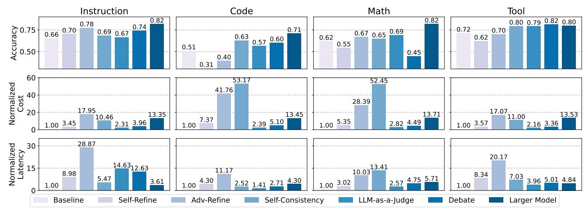

# 2 BACKGROUND

#### 2.1 Agentic Workflows

In an agentic workflow, a complex task is decomposed into *subtasks* that collectively form a *workflow*, typically represented as a graph. Each node in the workflow represents a *subtask* handled by an agent consisting of an LLM call, optionally augmented with tool invocations (e.g., web search or retrieval). Each edge represents the *output* (or history *context*) passed from the upstream node to its child node.

An agentic workflow can be statically defined using state-of-the-art agent programming frameworks such as Lang-Graph (LangChain, 2025) and Agent Framework (Microsoft, 2025). Recently, *dynamic* workflow generation methods (Sun et al., 2021; Niu et al., 2025; Hu et al., 2024; Zhang et al., 2024a) propose using *LLM planners* to constructs the workflow on demand from task descriptions. Figure 1 shows an example workflow generated from a user task.

#### 2.2 LLM Verifiers

LLM outputs and agent actions are error-prone, and may contain hallucinations or logical errors (Cemri et al., 2025; Lin et al., 2025), requiring additional *verifier* stages (Figure 2). *Self-refine* (Madaan et al., 2023) recalls the same model to critique and revise its output, while a stronger vari-

> **[图片提取文字 (无描述)]:**
> Code Math Instruction Tool 0.82 0.82 0.80 0.79 0.82 0.80 0.78 0.74 Accuracy 0.50 0.66 0.72 0.71 0.70 0.67 0.65 0.69 0.69 0.67 0.63 0.57 0.60 0.62 0.62 0.55 0.51 0.45 0.40 0.31 60 53.17 52.45 Normalized Cost 41.76 28.39 13.35 13.71 11.00 10.46 7.37 2.39 5.10 2.31 3.96 1.00 3.45 5.35 2.82 4.49 1.00 3.57 2.16 3.36 1.00 1.00 Normalized Latency 28.87 30 20.17 14.6312.63 10.03 8.98 8.34 7.03 5.47 3.96 5.01 4.84 2.71 4.30 1.00 3.02 4.30 3.61 2.52 1.41 1.00 1.00 1.00 Self-Refine Baseline Adv-Refine Self-Consistency LLM-as-a-Judge Larger Model Debate

Figure 3. Verifier Characterization. Comparison of different verifiers' performance across task categories. Latency and cost are normalized to baseline execution latency and cost.

ant (Advanced-Refine) delegates the critique to a larger external model that is more capable but costly. Self-consistency (Wang et al., 2023) instead relies on statistical agreement, sampling multiple answers and trusting the majority. LLM-as-a-Judge (Zheng et al., 2023) and Debate (Du et al., 2023) both introduce an external evaluator: the former compares independent responses, whereas the latter allows the models to argue and refine iteratively before judgment. Although we focus on these representative verifier types, Sherlock can seamlessly integrate new verifier paradigms as they develop.

