# 3 VERIFIER CHARACTERISTICS

#### 3.1 Verifier Overhead

While verifiers improve the reliability of LLM outputs, they also add measurable latency and cost. Figure 3 quantifies each verifier's accuracy gain, normalized cost, and latency across task categories1. Verification can increase inference latency and monetary cost by up to **28.9×** and **53.2×**, respectively, compared to execution without verification—largely due to additional LLM calls and token usage for feedback generation, judgment, or multi-round reasoning. These results represent the overhead for a *single verifier* applied to a single output. In agentic workflows with multiple intermediate nodes, verifying only the final node misses opportunities for early correction and efficient re-execution with verifier feedback, whereas verifying every node compounds overhead through repeated verification steps.

<u>Insight 1:</u> Verifiers bring significant cost and latency overhead, underscoring the need for principled verifier placement strategies in an agentic workflow.

> **[图片提取文字 (无描述)]:**
> Baseline -Self-Refine Adv-Refine -Self-Consistency -LLM-as-Judge -Debate -Larger Model -Different Tasks
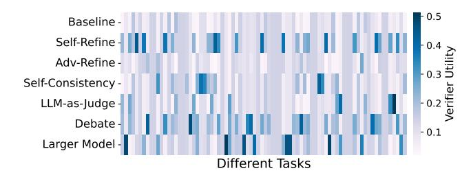

Figure 4. Verifier utility by task. Utility is computed as  $accuracy\_gain - \lambda \cdot cost$ , with higher values indicating better cost effectiveness. Detailed explanation on verifiers utility in §6.

## 3.2 Task-Dependent Accuracy-Cost Tradeoff

Figure 3 shows the tradeoff between accuracy and cost across verifiers. This relationship is *non-monotonic*: higher cost does not necessarily yield better accuracy. In some cases, excessive or misapplied verification can even *reduce* accuracy, as redundant checks introduce inconsistencies or conflicting judgments. Because verifier efficacy and cost vary substantially across tasks, certain verifiers provide meaningful accuracy gains, while others incur comparable or higher costs with only marginal improvement.

Figure 4 shows the utility for each task and verifier. Tasks within the same category can favor *different* cost-optimal verifiers, revealing fine-grained variability in their effectiveness. This heterogeneity makes a single global verifier configuration inefficient, underscoring the need for a cost-aware, task-specific verifier selection strategy that dynamically balances accuracy and efficiency at runtime.

Insight 2: Verifiers have distinct accuracy improvements and cost behaviors, which are highly task dependent.

&lt;sup>1Details on cost computation and benchmarks in Appx. A.

Figure 5. Verified Output Redundancy. Match rate denotes the proportion of verified outputs matching the originals.

#### 3.3 Verification Redundancy

We measure how often a verifier's revised output matches the original LLM output. Figure 5 reports the match rate across task categories. Most verifiers retain a large portion of original outputs, with match rates commonly above 0.6-0.8 for Instruction, Code, and Math tasks. Self-Refine and Adv-Refine show lower rates in Code and Tool tasks, indicating more frequent revisions, while Self-Consistency and LLM-as-a-Judge generally preserve high fidelity. The Tool category shows the most variation, with some verifiers dropping to 0.10-0.13, underscoring strong task dependence. Overall, verifications often introduce only minor changes—motivating *speculative execution*, where downstream subtasks proceed in parallel with verification to cut latency without sacrificing output quality.

<u>Insight 3:</u> Revised output after verification may not necessarily change from its original output.

> **[图片提取文字 (无描述)]:**
> Domain Online Phase Verifier onboarding phase Placement & Fault injection & Workflow Selection Error analysis Topological Execution vulnerability W1 Error estimator Traces Verifier cost & 2 Learned Cost SLO verifier accuracy gain analysis selector Speculative Execution 3 Rollback W1 3 Similarity-W2-3 controller based Similarity analysis W4 rollback policy
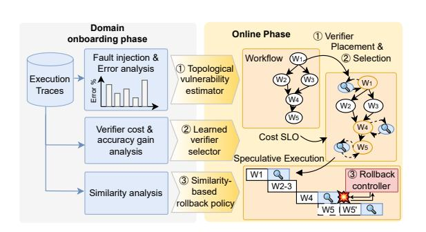

Figure 6. Overview of the Sherlock architecture.

#### 4 SHERLOCK OVERVIEW

Driven by the insights from our characterization (§3), we design *Sherlock*, a framework that enables reliable and efficient execution of agentic workflows by dynamically (1) identifying vulnerable nodes, (2) selecting and deploying the cost-optimal verifier for those nodes, and (3) enabling speculative execution to further reduce the performance overhead imposed by verifiers. To achieve this on dynamically generated agentic workflows, *Sherlock* only requires on-boarding for new *domains*, rather than for each new workflow.

**Online Phase.** As depicted in Figure 6, during the online

phase of *Sherlock*, a learned topological vulnerability estimator (§5) is used to decide the priority order of nodes for attaching verifiers, and a learned verifier selector (§6) is used to select the cost-optimal verifiers for each of those nodes. All of this is done to maximize the accuracy while meeting the cost budget SLO from the user. To minimize latency, *Sherlock* employs **speculative execution** (§7), a fast-path strategy that proceeds to subsequent nodes without waiting for verifier results. If a verifier later revises an output, the similarity between revised output and initial output is computed. If the similarity is lower than threshold, **selective rollback** of affected nodes is performed, trading off recomputation for reduced end-to-end latency. The aggressiveness of speculation and rollback is tunable, allowing adaptation to different reliability–performance trade-offs.

**Domain On-boarding Phase.** There are three learned parts in Sherlock: a topological vulnerability estimator, a verifier selector, and a similarity threshold to decide whether to rollback. For a new domain, Sherlock needs example workflows with representative execution traces that include the prompts, outputs generated per execution node, and the ground truth for the final output. Sherlock can then analyze these traces to characterize node-level fault patterns and verifier effectiveness. From these observations, a topologyaware verifier placement policy (§5) is derived, that prioritizes vulnerable nodes to verify within a given cost budget. In parallel, a **verifier selector** (§6) is trained, that learns to choose the most cost-efficient verifier for each task prompt and context. The selector is trained using Group Relative Policy Optimisation (GRPO) (Shao et al., 2024) on preference data defined by the trade-off between accuracy gain and verification cost. Furthermore, Sherlock quantifies the similarity between generated outputs and ground-truth execution traces, empirically establishing per-metric thresholds to decide when two answers can be considered equivalent.

*Sherlock* distills structural and empirical priors from onboarding into runtime policies that unify *offline* learning and *online* control, achieving Pareto-optimal trade-offs among accuracy, latency, and cost.

#### 5 IDENTIFYING ERROR-PRONE NODES

Given the substantial overhead of verifier execution (Insight 1), a natural question arises: which nodes in a work-

flow deserve such costly verification? To answer that question, we need to understand the fault propagation patterns of workflows. In this section, we define a fault model, introduce a fault injection method that emulates real-world agent failure modes to derive each node's vulnerability, and finally, propose a topological vulnerability estimator that allows dynamic application to new workflows.

#### 5.1 Fault Model for Agents

Accurate vulnerability estimation requires injected faults to closely replicate realistic failure modes and their empirical occurrence frequencies. Each node in an agentic workflow can be abstracted as a composition of four elements: (1) the context received from upstream nodes, (2) the node's objective or instruction prompt, (3) the agent executor (e.g., LLM generation or tool invocation), and (4) the node's output. We apply fault injection to (1), (2), and (4), to understand the importance of each executor node, leading to three primary classes of failure modes (Table 1):

- Behavioral deviation using prompt replacement: simulates behavior deviation by modifying the original task directive.
- *Context-loss*: simulates context-loss by removing full or partial conversation history from upstream.
- Execution faults using output replacement: simulates execution faults by replacing outputs with faulty or inconsistent ones.

Table 1 also presents the failure occurrence rates derived from prior work (Cemri et al., 2025), which analyzed large-scale execution traces of multi-agent workflows to quantify how often each failure class occurs in practice. We adopt their empirical distribution, after mapping their scenarios to our failure modes, to ensure our injected faults reflect realistic operational conditions2.

> **[图片提取文字 (无描述)]:**
> 0.70 0.64 0.5 0.33 0.33 0.30 0.24 0.24 0.23 temperature
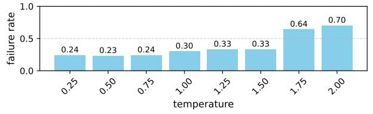

Figure 7. Failure rate by sampling configuration changes.

### 5.2 Fault Injection in Workflows

The fault injection begins by executing the pipeline under normal conditions to obtain the baseline output y. For any selected node n, we sample a fault from the fault model and generate a counterfactual outputs  $\{o'_n\}$  from that node.

Then the downstream computations are re-executed to yield an alternative final result y'. We quantify the deviation  $\Delta(y,y')$  for each fault using final accuracy metric, capturing how much the final outcome shifts due to the injected fault. Finally, we aggregate these deviations into an overall sensitivity score, defined as:

vulnerability\_estimate
$$(n) = \mathbb{E}_{\text{faults}}[\Delta]$$
.

This captures the expected degradation in pipeline correctness if node n were to experience errors, and serves as a basis for guiding verifier placement.

However, a unique confounding factor in LLMs is the stochasticity introduced by sampling configurations (e.g., temperature, Top-p, Top-k) (Troshin et al., 2025), which directly affects the observed failure rate (Figure 7). To eliminate this source of randomness, we fix the temperature to 0 during fault injection experiments.

> **[图片提取文字 (无描述)]:**
> Fan-In (# of Parents Nodes) Node Position Estimate 0.6 0.4 /ulnerability 0.27 0.21 0.26 0.18 0.22 0.2 0.18 0.14 0.0 Root Middle-nodes Leaf CoTCollection Humaneval **OMEGA**
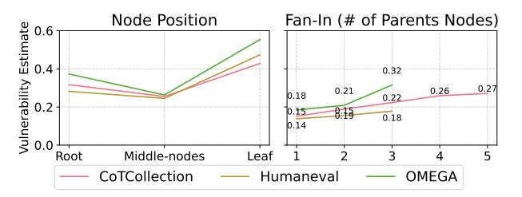

Figure 8. Error distribution by node position and parent count.

#### 5.3 Topological Error Distribution

Based on our fault model, we systematically inject faults into each node of the workflows generated by the LLM planner (Niu et al., 2025) while running a diverse set of benchmarks: *CoTCollection* (Kim et al., 2023), *OMEGA* (Sun et al., 2025) and *HumanEval* (Chen et al., 2021), resulting in 100+ different graphs and 15K+ execution traces. Figure 8 summarizes the aggregated error distribution across all experiments, highlighting how structural and positional properties of workflow nodes affect error propagation, leading to three key observations:

Position-wise Sensitivity. Terminal nodes are the most vulnerable to faults, followed by initial nodes, while intermediate nodes contribute least to end-to-end failure propagation. This occurs because downstream nodes can often correct intermediate errors, whereas terminal nodes lack recovery paths. Initial nodes are an exception as early misinterpretations of the instruction can cascade through the workflow.

**Fan-in Degree.** Fan-in degree (the number of incoming dependencies) shows a strong positive correlation with node vulnerability: nodes that aggregate multiple inputs are more likely to amplify or propagate upstream errors.

**Fan-out Degree.** We observe little to no correlation between fan-out (the number of child nodes) and the overall error

&lt;sup>2Frequencies are rescaled after excluding control-flow-related failures (e.g., step repetition, termination control), as well as verification-related failures, which we address in this paper.

Sherlock: Reliable and Efficient Agentic Workflow Serving with Selective Verification and Speculative Execution

| Failure Mode         | Example                                                                                                                      | Injected Fault     | Injected Fault Detail                                       | Frequency |
|----------------------|------------------------------------------------------------------------------------------------------------------------------|--------------------|-------------------------------------------------------------|-----------|
| Behavioral deviation | Misinterpretation of instruction or assigned role                                                                            | Prompt replacement | Modifying the original task directive                       | 28.63%    |
| Context-loss         | Loss of full or partial conversational history; missing inter-agent information                                              | Context dropping   | Removing full or partial conversation history from upstream | 18.68%    |
| Execution faults     | Erroneous reasoning; task derailment; incoherent reasoning-action sequence; runtime failure (e.g., syntax/formatting errors) | Output replacement | Replacing outputs with faulty or inconsistent ones          | 52.69%    |

Table 1. Mapping between failure modes, representative examples, corresponding injected faults, and their empirical frequencies.

magnitude (therefore not shown in the figure), suggesting that branching alone does not amplify vulnerability.

#### 5.4 Derived Topology-based Policy

Motivated by the observed error distribution in the domains of our tested benchmarks, we design a simple yet effective heuristic to guide verifier placement under a cost budget for verification. Our policy prioritizes nodes that contribute most to final output corruption (Algorithm 1). First, terminal nodes are always selected, as they directly determine the correctness of the final result. Next, initial nodes are prioritized to detect early-stage faults that propagate broadly. For intermediate nodes, higher fan-in leads to higher priority. Based on this priority, we decide which nodes to verify within the available budget by focusing on the most vulnerable nodes.

Although we observe that this policy is very robust, and generalizes well across the domains our benchmarks represent, the policy can be learned for each new domain. Furthermore, it can be extended to include more features like model-type, or node functionality, as per the domain's needs. However, it is important to keep it independent of any workflow-specific features, to allow dynamic agentic workflows in runtime.

## Algorithm 1 Topology-driven Verifier Placement

**Require:** Workflow graph G = (V, E), verifier budget k

- 1:  $order \leftarrow []$
- 2: order.append(terminal\_node)
- 3: order.append(initial\_node)
- $4: intermediates \leftarrow sort\_by\_fanin(intermediate\_nodes)$
- 5: order.extend(intermediates)
- 6:  $selected \leftarrow order[: k]$
- 7: return selected

## 6 COST-OPTIMAL VERIFIER SELECTION

After identifying the error-prone nodes to add verifiers, the next step is to select which verifier to attach at each node. Verifier behavior varies significantly across tasks (Figure 4), and their accuracy—cost relationship is highly non-linear: higher cost does not necessarily translate to higher accuracy (Insight 2). This task-dependent variability makes a single global configuration or rule-based verifier selection (e.g., building a lookup table) inefficient, motivating a learning-

based approach that adapts to node- and task-specific dynamics. We formalize the verifier selection problem and propose a runtime, learning-based method for dynamic workflows.

#### 6.1 Verifier Selection Problem

Given a node to verify, we formulate the verifier selection as a preference learning problem (Chu & Ghahramani, 2005), aiming to learn a policy that captures task-specific preferences among candidate verifiers. For a set of verifiers  $\mathcal{V} = \{v_1, v_2, \dots, v_N\}$  and their observed accuracy-cost pairs  $(P(v_i, \tau), C(v_i, \tau))$  on prompts  $\tau$  sampled from the dataset  $\mathcal{D}$ , we define a preference score for each verifier as

$$U(v_i, \tau) = P(v_i, \tau) - \lambda C(v_i, \tau), \tag{1}$$

where  $\lambda$  is a tunable hyperparameter that controls the trade-off between performance and cost.  $P(v_i,\tau)$  denotes the performance gain (i.e., accuracy improvement) achieved by verifier  $v_i$  on task  $\tau$ , and  $C(v_i,\tau)$  represents the additional computational cost incurred by using  $v_i$  on task  $\tau$ .

We formulate this as the Lagrangian relaxation of a constrained optimization problem. Intuitively,  $\lambda$  represents the *willingness to pay*—the marginal cost the system is willing to incur for improved performance. *Sherlock* allows users to balance accuracy and cost by tuning the parameter  $\lambda$ , which serves as a system-level knob to control this trade-off.

## 6.2 Preference-Based Policy Optimization

We train a policy model  $f_{\theta}(\cdot \mid \tau)$  that, given a task prompt  $\tau \in \mathcal{D}$ , outputs a probability distribution over the candidate verifiers  $\mathcal{V} = \{v_1, v_2, \ldots, v_N\}$ . Each probability  $f_{\theta}(v_i \mid \tau)$  represents the likelihood of selecting verifier  $v_i$  conditioned on the prompt  $\tau$ . We optimize the policy via Group Relative Policy Optimization (GRPO), which maximizes the expected log-likelihood of verifier selections weighted by their relative advantages:

$$J_{\text{GRPO}}(\theta) = \mathbb{E}_{\tau \sim \mathcal{D}} \left[ \sum_{i=1}^{N} A(v_i, \tau) \log f_{\theta}(v_i \mid \tau) \right]. \quad (2)$$

where the advantage term  $A(v_i,\tau)$  normalizes each verifier's preference score within the group:

$$A(v_i, \tau) = U(v_i, \tau) - \frac{1}{N} \sum_{j=1}^{N} U(v_j, \tau).$$
 (3)

In implementation, we minimize the negative objective,  $\mathcal{L}_{GRPO} = -J_{GRPO}$ , to perform gradient descent.

This formulation enables the model to learn verifier preferences that are robust to variations in task utility scales, allowing it to adapt to task-specific trade-offs between accuracy and cost. At inference time, given a new task prompt  $\tau$ , the Verifier Selector outputs a distribution  $f_{\theta}(v_i \mid \tau)$  over all candidate verifiers, from which the verifier with the highest predicted preference is selected for runtime deployment.

#### 6.3 Training Data and Model

Our training dataset  $\mathcal{D}$  consists of task prompts  $\tau_i$  (sampled from a diverse set of agentic benchmarks described in Appendix. A) paired with the observed accuracy and cost of all candidate verifiers  $\mathcal{V} = \{v_1, \dots, v_N\}$ . Each sample is represented as follows.

$$d_i = (\tau_i, \{P(v_j, \tau_i), C(v_j, \tau_i)\}_{j=1}^N)$$

Each prompt  $\tau_i$  is encoded into a feature vector  $x_i = \phi(\tau_i)$  using the pretrained distilbert-base encoder (Sanh et al., 2019). These representations serve as input features for the policy model  $f_{\theta}(\cdot \mid \tau)$ , while the preference scores determine the per-task relative advantages during optimization. The policy model  $f_{\theta}(\cdot \mid \tau)$  applies linear layers to the encoded features to produce logits over  $\mathcal{V}$ , which are normalized into a preference distribution that defines the model's selection policy.

#### 7 SPECULATIVE EXECUTION

Our characterization in §3 shows that verifier-revised outputs often remain semantically consistent with the model's original outputs (Insight 3). This reveals a key inefficiency in existing workflows: the system idles during verification even though most outputs are correct. To mitigate this, we introduce *speculative execution*, which overlaps verification of a node with its downstream nodes' computation to hide verifier latency, while being able to *rollback* when the verifier outcomes diverge.

Figure 9 shows an example of speculative execution. Once node W1 completes, *Sherlock* immediately launches its verifier in the background while concurrently executing child nodes (W2, W3). If verification later confirms that W1's output was correct, the speculative results are retained. Otherwise, they are rolled back to restore correctness.

When verification fails, it indicates that the speculative paths were executed with an incorrect intermediate output. In this case, *Sherlock* performs a **rollback** to the failed node, discarding all dependent speculative results (Figure 10). The verifier's corrected output is then propagated forward, and the invalidated nodes are rescheduled for execution.

> **[图片提取文字 (无描述)]:**
> Verify Verify Execute Verify Execute Execute (a) W1 W4 V1 W2 V2 V4 Verify Execute W1 W3 V3 V1 Execute Verify (b) W1 W3 V1 W2 Execute Verify V3 V2 W2 V2 Verify Execute W3 V3 W4 Verify Execute V4 W4 V4 Time Time to end execution Time to end verification
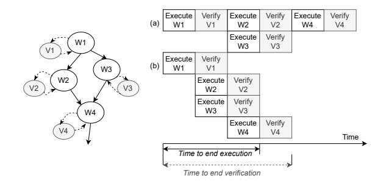

Figure 9. An example speculative execution timeline.

> **[图片提取文字 (无描述)]:**
> Execute Verify W1 Verify Execute W2 V2 Verify Execute Wз V3 Execute/ ecute Verify W4' W4 V4 Time
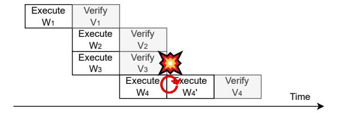

Figure 10. Rollback after verification.

## 7.1 When to Run Ahead: Trade-offs and Cost Model

Speculative execution introduces a fundamental **cost-latency trade-off**. By speculating deeper along the workflow, *Sherlock* overlaps more downstream computation with verification, reducing total latency but at the risk of wasting more compute when a rollback occurs. Hence, latency generally decreases at a higher speculative cost.

**Speculation Depth Bound.** In *Sherlock*, speculation is bounded by the verifier latency of the current node. Once the verifier for node i completes, the system either commits or discards all speculative results based on the verification outcome. This sets a hard bound on how far the pipeline can safely advance. We define the set of downstream nodes that can be speculated within this latency window as:

$$N_{\text{spec}} = \left\{ j \mid \sum_{k=i}^{j} \operatorname{lat}_{\text{exec}}^{(k)} < \operatorname{lat}_{\text{vrf}}^{(i)} \right\}. \tag{4}$$

That is, only nodes in the downstream region whose cumulative execution latency fits within the verifier's latency window are eligible for speculation.

**Budget-Constrained Speculation.** Within this bound, users can further tune a *speculation budget* B, which controls how much additional compute overhead is acceptable. The total speculative cost at node i must satisfy:

$$C_{\text{spec}}(d) \le B,$$
 (5)

The interplay between the verifier latency and cost budget defines the feasible speculation region or depth for each node in the workflow graph. **Cost Model.** To quantify speculative cost, we leverage the *match rate*  $m_i$ —the probability that the verifier agrees with the executor output (see Figure 5). Rollback occurs with probability  $(1-m_i)$ , incurring wasted compute across all speculated nodes within  $N_{\rm spec}$ . The expected speculative cost at node i is therefore:

$$C_{spec}^{i} = (1 - m_i) \cdot \sum_{j \in N_{spec}} \left( C_{exec}^{j} + C_{vrf}^{j} \right)$$
 (6)

This formulation ties speculation depth, verifier latency, and budget into a unified model, allowing *Sherlock* to reason about when speculation is beneficial and how aggressively to execute it.

**Parallel Downstream Execution.** The previous equations assume sequential downstream execution. In practice, nodes at the same depth may execute in parallel. We therefore refine the latency constraint as follows:

$$\sum_{l=1}^{d} \max_{j \in \mathcal{D}_l} \operatorname{lat}_{\operatorname{exec}}^{(j)} < \operatorname{lat}_{\operatorname{vrf}}^{(i)}, \tag{7}$$

where  $\mathcal{D}l$  is the set of nodes at depth l downstream of node i, and  $latexec^{(j)}$  denotes the execution latency of node j. The summation proceeds over depth levels up to d. Accordingly, the set of eligible speculative nodes is:

$$N_{\text{spec}} = \left\{ j \mid \sum_{l=1}^{\text{depth}(j)} \max_{k \in \mathcal{D}_l} \text{lat}_{\text{exec}}^{(k)} < \text{lat}_{\text{vrf}}^{(i)} \right\}. \tag{8}$$

## 7.2 Selective Rollback

When verification revises an output, *Sherlock* determines whether the speculative results can still be retained. If the verifier's revision is semantically equivalent to the original output, rollback is unnecessary. Otherwise, dependent nodes are reverted and re-executed.

To make this decision efficiently, *Sherlock* defines task-specific similarity metrics that quantify output equivalence. Because LLM responses are often verbose or stylistically diverse, simple string matching is too rigid to capture nuanced similarity (Bulian et al., 2022). While LLM-based evaluators can assess semantic similarity more accurately (Adlakha et al., 2024), they require additional inference calls and introduce substantial latency (i.e., each LLM call takes 2–3 seconds on average, whereas these metrics run in under 0.05 seconds). To avoid this overhead, *Sherlock* uses lightweight similarity metrics widely adopted in natural language evaluation (Song et al., 2024; Niwattanakul et al., 2013; Lin, 2004; Papineni et al., 2002; Makhoul et al., 1999).

In the offline analysis (Appx. C), we evaluate each metric's alignment with ground-truth answer equivalence using Spearman correlation and AUC (Table 5). ROUGE-L

| Component       | Model                   | Size | GPUs |
|-----------------|-------------------------|------|------|
| LLM-as-a-Judge  | Qwen2.5-Instruct        | 7B   | 1    |
| Debate          | Qwen2.5-Instruct        | 7B   | 1    |
| Advanced-Refine | Llama-3.3-Instruct      | 70B  | 4    |
| Judge Model     | Selene-1-Mini-Llama-3.1 | 8B   | 1    |

Table 2. LLM configurations used for different verifiers. Models of LLM-as-a-Judge and Debate indicate a secondary executor. The primary executor is Llama-3.1-Instruct-8B with 2 GPUs.

achieves the highest consistency for instruction-following and tool-use tasks ( $\rho\approx0.55,\,\mathrm{AUC}\approx0.85),\,\mathrm{while}$  all metrics collapse to random performance for code and math (AUC  $\approx0.5).\,$  Accordingly, at runtime, <code>Sherlock</code> retains speculative results when ROUGE-L exceeds a threshold for instruction-following and tool-use tasks, but conservatively defaults to full rollback for code and math tasks.

#### 8 EVALUATION

#### 8.1 Setup and Evaluation Methodology

**Setup and Models.** Our experiments run on a server with 8×NVIDIA A100 GPUs (80 GB each). We use vLLM (Kwon et al., 2023) to serve the models. For the base executor, we use meta-llama/Llama-3.1-8B-Instruct (Dubey et al., 2024) on 2 GPUs. Advanced-Refine verifier uses meta-llama/Llama-3.3-70B-Instruct (Dubey et al., 2024) running on 4 GPUs. The secondary executor for LLM-as-a-Judge and Debate verifier uses Qwen/Qwen2.5-7B-Instruct (Bai et al., 2023b) on 1 GPU. We use AtlaAI/Selene-1-Mini-Llama-3.1-8B (Alexandru et al., 2025) on 1 GPU as the judge model in LLM-as-a-Judge verifier.

Benchmarks. We evaluate *Sherlock* on representative agent benchmarks including CoTCollection (Kim et al., 2023), OMEGA (Sun et al., 2025), and LiveCodeBench (Jain et al., 2024). CoTCollection consists of instruction-following tasks that demand multi-step reasoning and planning capabilities. OMEGA is a math benchmark, and we specifically use its compositional subset, which requires integrating multiple reasoning skills learned in isolation. LiveCodeBench includes diverse code-related tasks such as code generation, code execution, and test output prediction. Each benchmark has a mix of instruction-following, coding, math, and tool-calling subtasks as shown in Figure 11 (right).

**Workflow Generation.** To generate a workflow, we use a state-of-the-art LLM planner, Flow (Niu et al., 2025), with customized prompts Appx. D.8. Figure 11 shows the generated workflow's characteristics per benchmark.

**Baselines** For each component, we compare *Sherlock* against the most relevant baselines. For verifier placement, we evaluate against even and random placement heuristics under the same cost budget. For verifier selection,

> **[图片提取文字 (无描述)]:**
> 1.00 1.00 1.00 \_ 100% 80% 0.75 0.75 0.75 trib 0.50 60% 0.50 0.50 40% 0.25 0.25 0.25 20% 0.00 0.00 0.00 CoTCollection OMEGA LiveCodeBench Weighted Avg Number of Nodes Depth Fan In Dataset CoTCollection LiveCodeBench OMEGA Instruction Math Code Tool
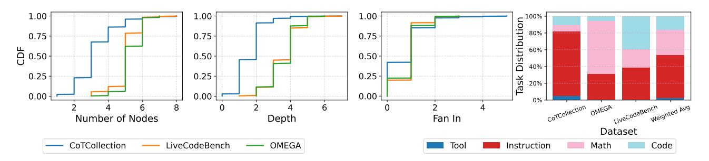

Figure 11. Benchmark characterization for topological properties of the node.

we compare with (1) *static* selections of the same verifier across the board, (2) *Aflow*, a Monte Carlo search-based approach (Zhang et al., 2024a) that incrementally expands workflows by adding new nodes such as debate and self-consistency modules during iterative search, (3) a *tabular* approach that selects the cost-optimal verifier for each task category, and (4) an *oracle*, that chooses the cheapest verifier that gives the correct answer for each node.

The *tabular* approach classifies each node into four categories: instruction-following, coding, math, or tool-use. We train a task classifier using microbenchmark prompts as inputs and their task categories as labels. We use ModernBERT as a classifier, which achieves near 98% task classification F1 score.

**Evaluation Metrics.** We evaluate *Sherlock* along three dimensions: accuracy, latency, and cost. For *accuracy*, we adopt the default metric in each benchmark, i.e., percentage points for CoTCollection and OMEGA, and pass@1 rate for LiveCodeBench. For *latency*, we define two complementary metrics: (1) *Time to End Execution* (Texec) measures how long it takes to finish all execution in one graph, reflecting the latency of *the fast path* that is achievable by speculative execution. (2) *Time to End Verification* (Tvrf) measures the total duration until the final verified output is available, representing the latency of *the slow path* that includes all verification stages. Figure 9 visualizes these two metrics. Finally, we compute the *verifier cost* according to a cost model (Appx. A.2) since we serve open-source models locally.

#### 8.2 Verifier Placement

We evaluate *Sherlock*'s topology-aware verifier placement (§5.4) by comparing it to random and evenly spaced placements under the same verification budget. All methods use the same verifier selection, isolating placement as the only variable. Figure 12 shows that *Sherlock* consistently achieves higher final accuracy with less budget. This demonstrates that *Sherlock* allocates verification resources more effectively than uninformed strategies by leveraging observed error distributions.

> **[图片提取文字 (无描述)]:**
> CoTCollection 0.7 0.6 0.5 0.4 LiveCodeBench 0.4 Accuracy 0.2 0.0 **OMEGA** 0.16 0.08 0.00 5 6 Number of Verifiers (Budget) Random Sherlock Even
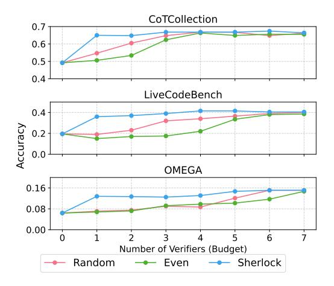

Figure 12. Accuracy improvement with different placement strategy. Sherlock uses the policy described in Section 5.4.

> **[图片提取文字 (无描述)]:**
> Oracle Baseline 0.90 Self-Refine Adv-Refine 0.85 Self-Consistency Average Task Accuracy Debate 0.80 Larger Model Larger Model Pareto Frontier Sherlock 0.75 LLM-as-a-Judge LLM-as-a-Judg Oracle Adv-Refine 0.70 Self-Consistency Baseline 0.65 Self-Refine 0.60 0.00 0.02 0.04 0.06 0.08 0.10 0.12 0.14 0.16 0.18 0.20 Average Cost Per 1K Problem [\$]
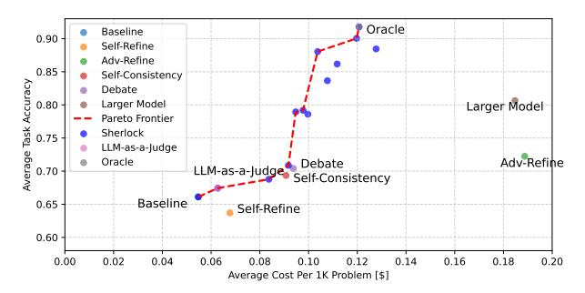

Figure 13. Accuracy-cost trade-off across verifier selections. Sher-lock (blue dots) lies on the Pareto frontier (red dashed line) and approaches the oracle, achieving high cost efficiency.

#### **8.3** Verifier Selection

Figure 13 shows the accuracy–cost trade-off achieved by *Sherlock*'s verifier selector (§6). Using the microbenchmark described in Appx. A, we train the selector and evaluate its accuracy and average cost per task based on the verifier it chooses. For each problem, we define the oracle verifier as the one that achieves the highest accuracy gain at the lowest cost. Compared to static verifier assignments, *Sherlock* consistently follows the Pareto frontier. It achieves higher accuracy for the same cost and approaches the accuracy of

the oracle (i.e., the best accuracy that can be achieved with the given set of executors and verifiers).

Using the cost-optimal verifier selector checkpoint, we evaluate the end-to-end accuracy of three agentic benchmarks with *Sherlock*. Figure 14 shows the final accuracy and total verification cost comparison. Compared to the tabular approach, *Sherlock* consistently achieves higher accuracy at a lower cost. We also compare *Sherlock* against AFlow (Zhang et al., 2024a), a Monte Carlo Tree Search–based framework for discovering agentic workflows. Across all tasks, *Sherlock* consistently delivers higher accuracy and lower cost, primarily due to its dynamic verifier selector that adapts flexibly to task characteristics.

> **[图片提取文字 (无描述)]:**
> Normalized Cost Accuracy Cost 10.0 0.60 0.45 7.5 -5.0 -0.30 0.15 2.5 0.00 CoTCollection LiveCodeBench OMEGA CoTCollection LiveCodeBench OMEGA Baseline Aflow Tabular Sherlock
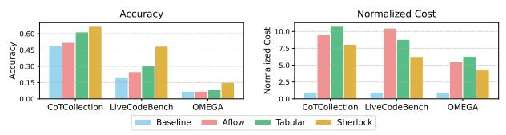

Figure 14. End-to-end comparison with the state-of-the-art approaches in final accuracy and verifier cost.

#### 8.4 Speculative Execution

Figure 15 shows the CDFs of *Sherlock*'s time to end execution ( $T_{\rm exec}$ ) and time to end verification ( $T_{\rm vrf}$ ) latencies (§7). Table 3 summarizes the latency reductions achieved through speculative execution. Speculative execution substantially reduces latency across all benchmarks, with the largest gains observed in **LiveCodeBench**, where mean  $T_{\rm exec}$  drops by **62.9%** and  $T_{\rm vrf}$  by **48.7%**. These results show that overlapping verification with downstream execution can effectively hide verifier delays, particularly in complex multi-step reasoning tasks. CoTCollection and OMEGA also show consistent  $T_{\rm exec}$  reductions exceeding **50%**, confirming that the benefit generalizes across diverse workflows and latency profiles.

> **[图片提取文字 (无描述)]:**
> CoTCollection 1.0 1.0 0.5 0.5 0.0 0.0 ) 40 0 Live<u>Co</u>deBench 10 20 30 10 20 30 40 1.0 1.0 CDF 0.5 0.5 0.0 0.0 60 20 40 60 80 100 20 40 80 100 0 0 OMEGA 1.0 1.0 0.5 0.5 speculate no-speculate 0.0 0.0 50 100 150 200 50 100 150 200 0 0  $T_{vrf}$  $T_{exec}$
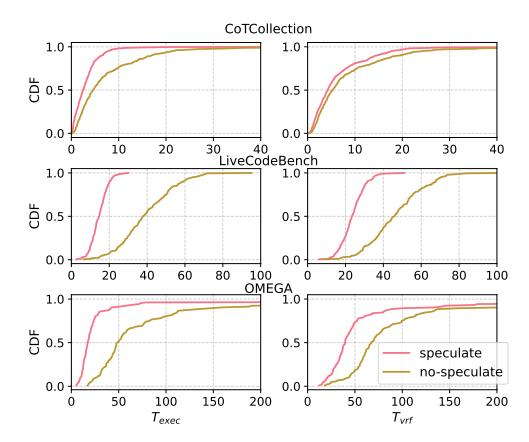

Figure 15. Comparison of Time to end execution ( $T_{\rm exec}$ ) and Time to end verification ( $T_{\rm vrf}$ ) regarding Sherlock speculation.

|               |                                                    | Mean           | P50            | P90            | P99            |
|---------------|----------------------------------------------------|----------------|----------------|----------------|----------------|
| CoTCollection | $T_{exec} \\ T_{vrf}$                              | 51.4% 21.9% | 44.8% 18.5% | 60.8% 24.9% | 67.7% 52.0% |
| OMEGA         | $\begin{array}{c} T_{exec} \\ T_{vrf} \end{array}$ | 53.4% 30.6% | 64.5% 41.1% | 72.7% 34.7% | 4.8% 5.5%   |
| LiveCodeBench | T exec T vrf              | 62.9% 48.7% | 61.3% 49.1% | 65.9% 53.3% | 62.1% 52.6% |

Table 3. Latency reduction with speculative execution.

### 9 RELATED WORK

Agentic Workflow Generation and Optimization. Recent work has explored automating agentic workflow generation to improve response quality through iterative search (Hu et al., 2024; Zhang et al., 2024a), LLM-based generation (Li et al., 2024; Liu et al., 2025b; Niu et al., 2025), and finetuning (Wu et al., 2025). This line of work is complementary to *Sherlock* and can benefit from *Sherlock*'s selective verification and speculative execution to balance accuracy, cost, and latency. Compared to iterative-search or fine-tuning-based approaches, *Sherlock* employs a lightweight strategy that combines heuristics and learned verifier selection for fast adaptability to online tasks. Compared to LLM-based workflow generators, *Sherlock* systematically augments generated workflows with its dynamic verification policies.

Serving Agentic Workflows. Murrakab (Chaudhry et al., 2025) highlights the inefficiency of existing agent-serving systems that treat workflows as opaque sequences of model and tool calls, tightly coupling agent logic with hardware and model choices. Circinus (Liu et al., 2025a) introduces an SLO-aware query planner for compound AI workloads, optimizing operator placement and configuration across heterogeneous infrastructure. Complementary to these, Parrot (Luo et al., 2025b), Autellix (Luo et al., 2025a), and AI Metropolis (Xie et al., 2024) explore scheduling and orchestration for multi-step agentic workflows. LLMSelector (Chen et al., 2025) further shows that end-to-end performance improves with stronger individual nodes in a workflow. Speculative Actions (Ye et al., 2025) and Conveyor (Xu et al., 2024) enable asynchronous execution of LLM actions and tool calls in the background. Sherlock is the first framework that holistically explores the trade-offs between cost, accuracy, and latency by exploiting speculative execution opportunities with intelligent verifier selection for agentic workflows.

#### 10 CONCLUSION

We presented *Sherlock*, a principled serving framework for agentic workflows that jointly optimizes latency, cost, and accuracy. *Sherlock* identifies and verifies error-prone nodes through counterfactual analysis and dynamic verifier selection, effectively balancing reliability and efficiency. To

further reduce verification overhead, it employs selective speculative execution and rollback, overlapping verification with downstream computation while controlling rollback cost. *Sherlock* also exposes user-configurable knobs to flexibly trade off reliability, latency, and cost on demand. Overall, *Sherlock* delivers up to 48.7% execution latency reduction and 26.0% cost reduction over baselines.

