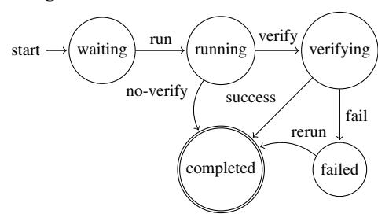

# B SPECULATIVE EXECUTION STATE MACHINE DIAGRAM

Internally, *Sherlock* manages workflow execution using a node-state machine. Each node begins in the waiting state, transitions to running during computation, and then to either verifying or completed, depending on whether verification is required. While a node is verifying, its child nodes may begin execution speculatively. If verification succeeds, the node transitions to completed; if verification fails, it transitions to failed, triggering rollback ([§7.2\)](#page-7-0). The full state transition diagram is shown in Figure 16 .

## FSM Definition:

- States: Q = {waiting, running, verifying, completed, failed}
- Alphabet: Σ = {run, verify, no-verify, success, fail, rerun}
- Initial state: q0 = waiting
- Accepting state: F = {completed}
- Transition function δ is defined as:

| Current State | Input     | Next State |  |  |
|---------------|-----------|------------|--|--|
| waiting       | run       | running    |  |  |
| running       | verify    | verifying  |  |  |
| running       | no-verify | completed  |  |  |
| verifying     | success   | completed  |  |  |
| verifying     | fail      | failed     |  |  |
| failed        | rerun     | completed  |  |  |

### State Diagram:

> **[图片提取文字 (无描述)]:**
> verify run waiting verifying running start no-verify success fail rerun completed failed

Figure 16. Finite State Machine definition and diagram

