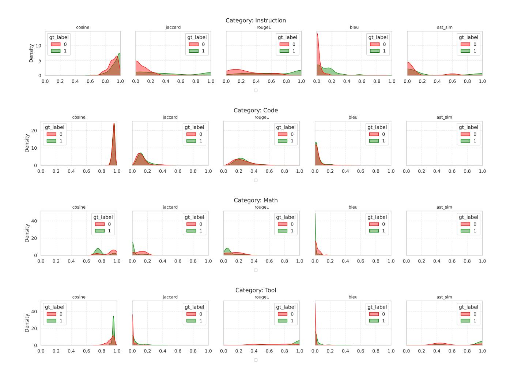

# C LIGHTWEIGHT SIMILARITY METRICS FOR PRACTICAL ROLLBACK

| Metric             | Instruction |       | Tool     |       | Code     |       | Math     |       |
|--------------------|-------------|-------|----------|-------|----------|-------|----------|-------|
|                    | Spearman    | AUC   | Spearman | AUC   | Spearman | AUC   | Spearman | AUC   |
| Cosine Similarity  | 0.314       | 0.687 | 0.368    | 0.717 | 0.028    | 0.516 | −0.324   | 0.262 |
| Jaccard Similarity | 0.411       | 0.740 | 0.272    | 0.620 | 0.134    | 0.577 | −0.436   | 0.237 |
| RougeL             | 0.556       | 0.828 | 0.668    | 0.877 | 0.099    | 0.557 | −0.205   | 0.349 |
| BLEU               | 0.381       | 0.723 | 0.267    | 0.618 | 0.057    | 0.533 | −0.449   | 0.230 |
| AST Similarity     | 0.200       | 0.589 | 0.427    | 0.712 | –        | 0.500 | –        | 0.500 |

Table 5. Spearman correlation and AUC of similarity metrics across task categories. Higher values indicate stronger alignment with ground-truth answer equivalence. ROUGE performs best for instruction and tool tasks, while all metrics fail for code and math (AUC ≈ 0.5).

To determine whether a verifier's revision is different enought to invalidate speculative executions on initial answer, we seek lightweight similarity metrics that can replace expensive LLM-based judges. Prior work commonly uses LLM evaluators [\(Adlakha et al.,](#page-10-0) [2024;](#page-10-0) [Bulian et al.,](#page-10-0) [2022\)](#page-10-0), but invoking them along the critical path adds substantial latency and cost. Instead, we examine a set of interpretable alternatives—cosine similarity, Jaccard similarity [\(Niwattanakul et al.,](#page-11-0) [2013\)](#page-11-0), ROUGE-L [\(Lin,](#page-11-0) [2004\)](#page-11-0), BLEU [\(Papineni et al.,](#page-11-0) [2002\)](#page-11-0), and AST similarity [\(Song et al.,](#page-12-0) [2024\)](#page-12-0).

We assess each metric's alignment with the ground-truth equivalence labels (collected once using an LLM judge for calibration) via Spearman correlation and area under the ROC curve (AUC), as summarized in Table 5. For instructionfollowing and tool-use tasks, ROUGE exhibits the strongest association with the ground-truth labels (ρ ≈ 0.56 − 0.77, AUC ≈ 0.83–0.88), indicating that lexical overlap reliably captures answer equivalence in these natural-language settings. In contrast, for code-generation and math-reasoning tasks, all metrics collapse to random or even negative correlation (ρ < 0.2, AUC ≈ 0.5), confirming that lightweight metrics do not sufficiently capture the semantic equivalence.

To further examine discriminative behavior, we visualize the kernel density estimation (KDE) of similarity scores for matching (gt label = 1) and non-matching (gt label = 0) pairs in Figure [17.](#page-16-0) While instruction and tool-use tasks show clear separation between the two distributions, code and math tasks exhibit substantial overlap—consistent with their near-random AUC values despite superficial shape differences in the KDE plots.

These findings collectively indicate that lightweight metrics can safely replace LLM judgment for natural-language tasks but fail to capture semantic equivalence in structured or symbolic domains. Consequently, we conservatively default to rollback for code and math categories, avoiding false equivalence caused by spurious surface-level similarity.

> **[图片提取文字 (无描述)]:**
> Category: Instruction rougeL bleu ast\_sim cosine jaccard gt\_label gt\_label gt\_label gt\_label gt\_label Density 2 0 **0** 0 0 0 1 1 1 1 1 0.8 0.0 0.2 0.4 0.6 8.0 0.0 0.2 0.4 8.0 1.0 0.0 0.2 0.4 0.6 0.8 1.0 0.0 0.2 0.4 0.6 1.0 0.0 0.2 0.4 0.6 0.8 0.6 1.0 Category: Code cosine jaccard rougeL bleu ast\_sim gt\_label gt\_label gt\_label gt\_label gt\_label **0 0 0** Density 10 **0 0** 1 \_\_\_\_1 \_\_\_1 1 1 0.8 0.0 0.2 0.4 0.6 0.8 1.0 0.2 0.6 0.8 1.0 0.2 0.6 0.8 0.0 0.2 0.4 0.6 0.8 1.0 0.0 0.2 0.4 0.6 1.0 0.0 0.4 0.4 1.0 Category: Math cosine jaccard rougeL bleu ast sim gt\_label gt label gt label gt label gt label 40 **0 0 0 0 0** Density **1 1** 1 1 1 0.8 0.0 0.4 0.8 0.0 0.2 0.4 0.6 0.8 1.0 0.0 0.2 0.6 0.8 1.0 0.2 0.0 0.2 0.4 1.0 0.2 0.6 1.0 0.4 0.0 0.6 0.8 1.0 Category: Tool rougeL cosine jaccard bleu ast sim gt\_label gt\_label gt\_label gt\_label gt\_label Density 20 0 0 **0** 0 0 1 1 1 1 1 0.2 0.2 0.4 0.6 0.8 0.0 0.2 0.4 0.6 0.8 1.0 0.0 0.4 0.6 8.0 1.0 0.0 0.2 0.6 0.8 1.0 0.0 0.2 0.4 0.6 0.8 1.0 0.0 1.0 0.4

Figure 17. Kernel Density Estimation (KDE) plots of similarity metrics across task categories. Each subplot compares the distributions of similarity scores for match with ground truth ( $gt \ \ \ \ \ \ \ \ \ \ \ \ \ \ \ \ \ \ \$ 

