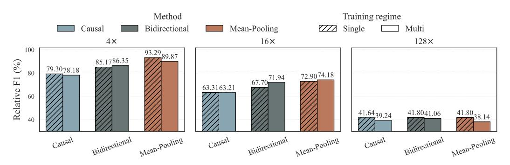

# **5.1 Baseline 1: Mean Pooling**

The first baseline compresses context representations via non-overlapping mean pooling over a bidirectionally-encoded sequence. [Figure 1c](#page-2-1) illustrates this approach. Given a document, we compute its representation with an encoder, and apply a non-overlapping mean pooling operator with window size *r*, the same size as the compression ratio, and stride *r* to generate continuous vectors as the output compression.

Formally, let *h* = (*h*1, . . . , *hL*) ∈ **R***L*×*d* denote the sequence of hidden states produced by the encoder. For a compression ratio *r* ∈ R, we partition the sequence into *k* consecutive, non-overlapping blocks:

$$S_k = \{(k-1)r + 1, \dots, \min(kr, L)\},\ k = 1, \dots, \lceil L/r \rceil.$$
 (3)

The compressed representation of length ⌈*L*/*r*⌉ is obtained by averaging within each block:

$$f_c(T,r) = (z_1, \dots, z_{\lceil L/r \rceil}) \in \mathbb{R}^{\lceil L/r \rceil \times d} ,$$
s.t.  $z_k = \frac{1}{|S_k|} \sum_{i \in S_k} h_i .$  (4)

The encoder is Transformer-based. Critically, we use a full self-attention mask during encoding, allowing each encoded vector to include information from the entire context, and thereby each compressed segment to aggregate information across the entire context. In practice, we initialize with an autoregressive LLM and remove the causal self-attention mask before learning.

This design introduces no additional parameters beyond those of the encoder backbone and the decoder LLM that uses the compressed representation, and has negligible computational overhead. By comparison, the compression-token method is slightly more expensive: it requires an encoder input of size *L* + *L*/*r*, while mean pooling processes only the original *L* tokens.

### **5.2 Baseline 2: Bidirectional Compression Tokens**

The widely-used causal compression-token approach (described in [Section 3\)](#page-1-1) appends *C* = ⌈*L*/*r*⌉ compression tokens to a context of length *L* and extracts their final hidden states as the compressed representation. This choice has an interesting implication, especially if aiming to support multiple compression ratios, as we additionally study in our experiments. The standard causal attention mask imposes a Matryoshka-style [\(Kusupati et al.,](#page-11-7) [2022\)](#page-11-7) constraint: compressed representations at smaller lengths must correspond to strict prefixes of those at larger lengths.

Our second baseline relaxes this restriction by allowing compression tokens to attend bidirectionally among themselves, while retaining causal attention over the original context. This modification, not explored in prior work despite its simplicity, makes the model aware of its compression budget, enabling ratio-specific information allocation while preserving shared computation and KV caching. We experiment with both the conventional causal mask and this bidirectional variant; the modification substantially improves performance [\(Section 6.1\)](#page-6-0).

In our implementation, we utilize only a single compression token type that is appended ⌈*L*/*r*⌉ times to the context, rather than having several distinct compression tokens. This enables compression to any arbitrary ratio while retaining equal parameter counts across ratio settings.

### **5.3 Training Objective**

Both baselines are trained via knowledge distillation. Each training instance comprises a context *T*, a prompt *P*, and a ground-truth answer *A* = (*a*1, . . . , *am*). At each step *i*, let  $Q_i = q(\cdot \mid T, P, A_{< i})$  denote the teacher's distribution given the full context. Similarly, let  $P_{\theta,i} = p_{\theta}(\cdot \mid \tilde{T}, P, A_{< i})$  be the student's distribution, where  $\tilde{T} = f_c(T, r)$  represents the compressed context at ratio r.

The distillation loss is the sum of the KL divergences between these step-wise distributions:

$$\mathcal{L}_{\mathrm{KD}}(T, P, A; r) = \sum_{i=1}^{m} \mathrm{KL}(Q_i \parallel P_{\theta, i}). \tag{5}$$

We also study a *multi-ratio training* regime where a single compressor handles multiple compression ratios simultaneously. For each training instance, we generate compressed representations for all  $r \in \mathcal{R}$ , pass each independently to the decoder, and sum the losses:

$$\mathcal{L}_{\text{multi}}(T, P, A) = \sum_{r \in \mathcal{R}} \mathcal{L}_{\text{KD}}(T, P, A; r) . \tag{6}$$

A single parameter update is applied after aggregating losses. Since encoder computation is shared across ratios, this is considerably more efficient than training separate models. Using only knowledge distillation, without a language modeling objective, enables direct comparison between the original model and each compressor.

## 5.4 Model Training

For each target LLM, we first finetune it on the training mixture using LoRA (Hu et al., 2022); this finetuned model is fixed as the teacher, ensuring performance differences stem from the compressor alone. Both encoder and decoder are initialized from the same LLM but trained with separate LoRA weights, always using instruction-tuned weights as the backbone. For multi-ratio training, we train on  $\{4\times, 8\times, 16\times, 32\times, 64\times, 128\times\}$  unless stated otherwise. A learned linear projection  $W \in \mathbb{R}^{d\times d}$  is applied to  $f_c(T,r)$  before passing to the decoder, as it slightly improves performance for both baselines.

**Long-Context Training** Our primary experiments use contexts up to 1K tokens. For longer inputs (up to 8K), we use a separate data mixture and a staged training procedure that extends context length while preserving short-context performance, using Qwen3-1.7B (pretrained at 32K). Full details are in Appendix A.3.

## 6 Experiments and Results

We evaluate the baselines from Section 5 using the suite from Section 4, comparing causal compression tokens, bidirectional compression tokens, and mean pooling. To demonstrate the suite's generality, we run experiments across six models spanning three families and four scales: Llama3.2-1B (Grattafiori et al., 2024), Gemma2-2B (Team et al., 2024), and Qwen3-0.6/1.7/4/8B (Yang et al., 2025a).

#### 6.1 Short-Context Results

Table 3 presents benchmark results across all models and compression ratios. We show the average  $F_1$  scores over all six evaluation datasets. Bar charts below the table summarize results as teacher-normalized  $F_1$  averaged across all models and datasets, showing the teacher with full context ("Original"), without context ("No Ctx"), and the compressors at each ratio under single- and multi-ratio training.

Mean pooling achieves the strongest results overall, particularly at ratios up to  $16\times$ . Adding bidirectional attention among compression tokens improves over the causal variant in most settings, with gains ranging from modest to over 11 F1 points depending on model and ratio. At extreme compression ( $128\times$ ), bidirectional tokens are competitive with or superior to mean pooling in several settings; Llama3.2-1B consistently shows this pattern. Bidirectional compression tokens benefit markedly from multi-ratio training, while mean pooling shows a modest trade-off. A plausible explanation is that the bidirectional attention pattern lets

|                                                                                                 | Original | 4                              | x                              | 16                             | бх                             | 12                             | 8x                             | No Ctx |
|-------------------------------------------------------------------------------------------------|----------|--------------------------------|--------------------------------|--------------------------------|--------------------------------|--------------------------------|--------------------------------|--------|
|                                                                                                 |          | Single                         | Multi                          | Single                         | Multi                          | Single                         | Multi                          |        |
| Baseline Systems LLMLingua2 (Qwen3-8B) ICAE (Mistral-7B)                                        |          | 42.40                          | 42.52                          |                                | 24.39                          |                                | 22.59                          |        |
| PCC Lite (GPT2-Large & Llama3.1-8B) PCC Large (Llama3.1-8B)                                  |          | 62.08 62.98                 |                                | 51.30 49.37                 |                                | 36.20 37.24                 |                                |        |
| Our Baselines                                                                                   |          |                                |                                |                                |                                |                                |                                |        |
| Qwen3-8B Compression-Tokens (Causal) Compression-Tokens (Bidirectional) Mean-Pooling   | 74.33    | 67.03 69.20 <b>71.66</b> | 65.90 69.57 <b>70.55</b> | 56.21 60.27 <b>63.85</b> | 58.41 63.01 <b>64.67</b> | 47.47 46.93 <b>47.90</b> | 44.76 <b>46.97</b> 45.92 | 23.06  |
| Qwen3-4B Compression-Tokens (Causal) Compression-Tokens (Bidirectional) Mean-Pooling            | 73.44    | 64.88 66.72 <b>70.39</b> | 62.53 68.15 <b>69.36</b> | 55.22 57.68 <b>61.79</b> | 54.28 60.48 <b>61.72</b> | 43.08 41.61 <b>43.62</b> | 40.83 <b>42.66</b> 41.05 | 19.79  |
| Qwen3-1.7B Compression-Tokens (Causal) Compression-Tokens (Bidirectional) Mean-Pooling          | 69.93    | 50.90 62.04 <b>66.43</b> | 57.73 62.60 <b>64.17</b> | 49.83 51.53 <b>55.43</b> | 48.68 54.11 <b>54.47</b> | 36.19 36.25 <b>36.72</b> | 35.34 <b>35.77</b> 33.48 | 14.00  |
| Qwen3-0.6B Compression-Tokens (Causal) Compression-Tokens (Bidirectional) Mean-Pooling | 65.36    | 54.40 55.59 <b>61.17</b> | 51.85 57.03 <b>58.36</b> | 41.57 44.82 <b>47.59</b> | 42.59 47.62 <b>47.64</b> | 28.86 29.69 <b>29.94</b> | 28.60 <b>29.51</b> 26.36 | 9.34   |
| Gemma2-2B Compression-Tokens (Causal) Compression-Tokens (Bidirectional) Mean-Pooling           | 71.96    | 63.35 64.76 <b>69.33</b> | 62.18 65.24 <b>68.09</b> | 55.07 56.39 <b>61.39</b> | 54.70 58.43 <b>61.04</b> | 44.46 44.73 <b>44.98</b> | 42.49 43.17 <b>43.71</b> | 21.64  |
| Llama3.2-1B Compression-Tokens (Causal) Compression-Tokens (Bidirectional) Mean-Pooling         | 65.82    | 56.31 57.91 <b>62.81</b> | 53.74 57.52 <b>60.56</b> | 47.51 <b>49.20</b> 47.28 | 46.96 50.06 <b>51.56</b> | 35.41 <b>36.43</b> 33.25 | 35.62 <b>36.25</b> 33.98 | 15.17  |

> **[图片提取文字 (无描述)]:**
> Training regime Method Causal Bidirectional Mean-Pooling Single Multi 16× 128× 4× 93.29 100 85.1786.35 Relative F1 (%) 79.3078.18 67.70 71.94 72.9074.18 63.3163.21 60 41.80 38.14  $41.64_{39.24}$ 41.8041.06 Mean-Pooling Bidirectional Bidirectional Mean-Pooling Mean-Pooling Causal Causal Bidirectional Causal

Table 3: Primary results. Values in the table are  $F_1$  scores macro-averaged across all datasets in our evaluation suite. **Original** stands for the teacher model's score when given the full context. **No Ctx** stands for the teacher model's score when not given any context at all. For each ratio, we display both single- and multi-ratio versions. For the baseline systems (top section), we include results for the compression ratios supported by these methods, unsupported ratios are left blank. The best method for each (model, ratio, single/multi-ratio training) setting is **bolded**. Bottom figures present aggregated views of the results in the table, but instead of  $F_1$  show the teacher-normalized  $F_1$  metric (Relative F1). Scores are obtained by averaging over all models listed in the table.

compression tokens "see" how many tokens are available, giving the model a clear signal about its compression budget; mean pooling, by contrast, must produce a one-size-fits-all representation at each position.

|                                    |                  | Single-Doc QA |                  |      | Multi-Doc QA |      |  |  |
|------------------------------------|------------------|---------------|------------------|------|--------------|------|--|--|
|                                    | 4x               | 16x           | 128x             | 4x   | 16x          | 128x |  |  |
| Baseline Systems                   |                  |               |                  |      |              |      |  |  |
| LLMLingua2 (Qwen3-1.7B)            | 20.7             | 12.5          | 8.9              | 29.4 | 22.4         | 21.8 |  |  |
| PCC Large (Llama3.1-8B)            | 17.2             | 5.6           | 2.4              | 28.0 | 11.4         | 7.2  |  |  |
| Our Baselines (Qwen3-1.7B)         |                  |               |                  |      |              |      |  |  |
| Compression-Tokens (Causal)        | 33.3             | 19.5          | 17.9             | 40.9 | 32.5         | 31.6 |  |  |
| Compression-Tokens (Bidirectional) | 35.9             | 30.5          | 19.1             | 43.0 | 38.2         | 32.1 |  |  |
| Mean-Pooling                       | 39.7             | 32.5          | 24.2             | 45.9 | 41.4         | 36.0 |  |  |
| Teacher Models (Qwen3-1.7B)        | (no compression) |               | (no compression) |      |              |      |  |  |
| w/o Context                        |                  | 10.1          |                  |      | 21.7         |      |  |  |
| w/ Context                         |                  | 43.3          |                  |      | 49.6         |      |  |  |

Table 4: LongBench-E QA results. Displayed metric is *F*1. We include contexts with up to a maximum of 8K tokens. The best method for each ratio-dataset setting is **bolded**.

