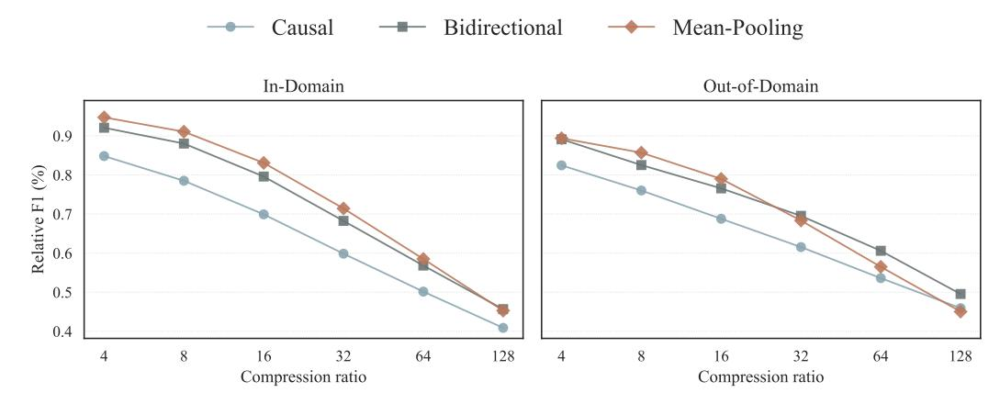
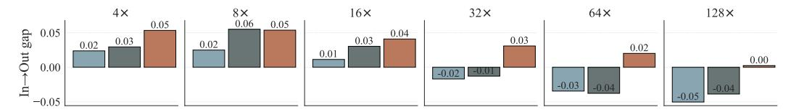

# **A.1 Data**

[Table 5](#page-14-0) provides a detailed list of our training data mixture. Evaluation dataset statistics appear in [Table 1](#page-3-0) and [Table 2](#page-3-2) in the main text. We use the summaries as contexts for NarrativeQA, instead of the full stories. For HotpotQA, we only use the two gold paragraphs as contexts, and remove the distractors.

We increase the training data diversity by randomly sampling a prompt template that fits the task, when training samples are composed of a context *C*, question *Q* and answer *A*. For example, for the extractive QA task, an example of a prompt template is: *"<C>\n Extract the answer from the text above. \n Question: <Q>\n Answer: <A>"*. Similar templates are defined for other tasks as well. We created approximately 100 prompt templates for each task. The full list of templates for each task is available along with our code.

### **A.2 Training Hyperparameters**

We ran initial hyperparameter exploration experiments using a text continuation task on a subset of the Dolma [\(Soldaini et al.,](#page-12-10) [2024\)](#page-12-10) dataset. We generally found that most hyperparameters did not significantly affect perplexity on a held-out evaluation set (a different Dolma subset), except for the learning rate, which had more substantial effects. We determined the number of steps based on our computational budget and the plateauing of the loss curve. We repeated this process for each compression method and chose our final set of hyperparameters to be identical across all methods, as we found them to be nearoptimal for all methods without statistically significant differences. We provide the final hyperparameters used to train all models, including the teacher and compressor models, in [Table 6.](#page-15-1)

| Dataset                                     | Avg. Context Tokens | #Samples | #Contexts |
|---------------------------------------------|---------------------|----------|-----------|
| BillSum (Kornilova & Eidelman, 2019)        | 2,278               | 5,000    | 5,000     |
| HotpotQA (all contexts) (Yang et al., 2018) | 1,338               | 5,000    | 5,000     |
| BookSum (Kryscinski et al., 2022)           | 3,670               | 4,055    | 3,430     |
| LongAlpaca (Chen et al., 2024)              | 6,943               | 3,918    | 3,564     |
| QuĂLITY (Pang et al., 2022)                 | 5,830               | 2,426    | 144       |
| QASPER (Dasigi et al., 2021)                | 4,756               | 2,331    | 769       |
| QMSum (Zhong et al., 2021)                  | 5,749               | 295      | 42        |
| Total                                       | 3,782               | 23,025   | 17,949    |

Table 7: Long context training datasets with average context length (tokens), number of samples, number of distinct contexts, and task category. The overall average context length is weighted by the number of samples.

| Hyperparameter      | Value  |
|---------------------|--------|
| LoRA r              | 16     |
| LoRA $\alpha$       | 16     |
| optimizer           | AdamW  |
| $\beta_1$           | 0.9    |
| $\beta_2$           | 0.95   |
| clip norm           | 1      |
| peak learning rate  | 2e-4   |
| final learning rate | 2e-5   |
| lr scheduler type   | cosine |
| warmup ratio        | 0.05   |
| weight decay        | 0.0    |
| steps               | 48,000 |
| batch size          | 32     |
| max context length  | 1024   |
| max answer tokens   | 256    |

Table 6: Hyperparameters for training all the models used in this work.

#### A.3 Long Context Experiments

**Data** We use the training datasets listed in Table 7 for long-context training. To preserve performance on short contexts, following Chen et al. (2024), we mix these with 2,000 samples from each of the original training datasets (Table 5). For evaluation, we use the LongBench-E variant of LongBench (Bai et al., 2024), which contains more samples with context lengths below 8K tokens; dataset statistics are provided in Table 2.

**Training Procedure** We employ a three-stage training procedure. First, the teacher model from the 1K-context experiments is further finetuned on the long-context data mixture, adopting a progressive training strategy (Yang et al., 2025b). Next, a compressor is trained using this teacher alongside the original 1K-context data mixture. Finally, the compressor undergoes additional training on the same long-context mixture used during teacher fine-tuning. We use the same hyperparameters as in Table 6, with two changes: (1) we reduce the number of steps to 4,800, and (2) we use a max context length of 8,192.

**Model Choice** We run the long-context experiments with Qwen3-1.7B since it was pretrained with a 32K context length and fits within our computational budget. Gemma2-2B, while of comparable size and with better performance, was pretrained with a context length of 8K, which is insufficient given that the contexts alone in our experiments reach 8K tokens, not including prompt and answer tokens.

> **[图片提取文字 (无描述)]:**
> Bidirectional Causal Mean-Pooling In-Domain Out-of-Domain 0.9 Relative F1 (%) 0.0 8.0 9.0 6.0 0.5 0.4 16 64 8 32 128 8 16 32 64 128 Compression ratio Compression ratio

(a) In-domain vs. out-of-domain performance across compression ratios.

> **[图片提取文字 (无描述)]:**
> 16× 128× 8× 0.06 64× 0.05 ıt gap 0.05 0.04 0.03 0.03 0.03 0.02 0.02 0.02 0.01 0.00 0.00 -0.02

(b) Performance drop (in–out gap) per method across compression ratios (in teacher-normalized Relative  $F_1$  units). Higher values mean a larger domain performance gap. Negative values mean that the out-of-domain performance is better than in-domain performance.

Figure 2: In-domain and out-of-domain comparison. (a) Line plots show performance on in-domain vs. out-of-domain datasets. (b) Bar plots show the in–out performance gap per method, which is the difference between in-domain and out-of-domain teacher-normalized  $F_1$  scores.

#### A.4 Computational Resources

All experiments in this paper (except for the baseline systems) were trained and evaluated on Google Cloud preemptible TPUs, and implemented using the JAX and Flax NNX libraries. Since training was only done on preemptible TPUs, it is hard to estimate the total training time for each experiment, as most of them were interrupted several times by preemption. As rough estimates, when using a v4-64 TPU and a 2B model trained for 48,000 steps and a batch size of 32: training a teacher model took 4 hours, training a multi-ratio compressor model took 23 hours, and training a single-ratio compressor model took 10 hours.

### B In-Domain vs. Out-of-Domain Experiments

We construct BenchPress with both in-domain QA datasets and out-of-domain QA datasets (Section 4.1). The training splits of the in-domain datasets are included in the training data mixture, while the out-of-domains datasets are not. It is expected that downstream performance will drop for out-of-domain datasets. Critical for our study, though, is the performance drop of the compressor itself. Figure 2a plots the in-domain and out-of-domain performance using the teacher-normalized  $F_1$  score for the Qwen3-8B model, averaged over the datasets in each category. We first observe that while the mean-pooling approach is superior for ratios up to  $16\times$  in all settings, its performance deteriorates as the compression ratio increases. To better understand the performance change due to the domain gap, we plot the differences between the in-domain and out-of-domain performance in Figure 2b. The performance gap is higher for low ratios, and lower for higher ratios. One possible explanation is that at low compression ratios the compressed representations still retain much of the original contextual signal, so the model is more sensitive to domain-specific distributional shifts; differences between in-domain and out-of-domain language patterns

thus manifest as a larger performance gap. By contrast, at higher compression ratios much of the fine-grained contextual detail is already lost to compression noise, which dominates over the domain gap. In this regime, both in-domain and out-of-domain datasets suffer similarly from the limited representational capacity, resulting in a smaller relative difference.

