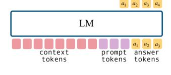
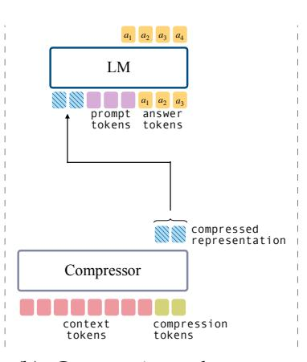
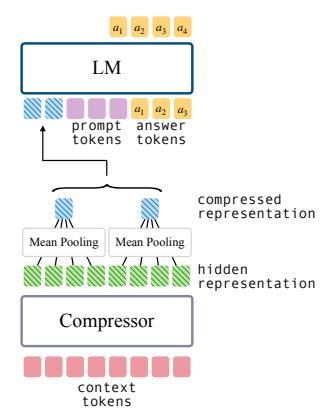

# 3 Background and Related Work

**Soft Context Compression** A dominant line of research on context compression uses *compression tokens*. As shown in Figure 1b, a sequence of length L is augmented with  $C = \lceil L/r \rceil$  additional tokens. The final hidden states at the compression-token positions form the compressed representation, which a decoder then conditions on alongside a downstream prompt. Training typically combines a language modeling objective with a distillation loss that encourages the compressor–decoder to approximate a teacher LLM with full context access (Figure 1a).

This problem is getting substantial research attention. We list here representative examples. AutoCompressors (Chevalier et al., 2023) introduce recursive compression with tied encoder–decoder weights. ICAE (Ge et al., 2024) freezes the decoder and trains only the encoder via autoencoding pretraining followed by task finetuning. COCOM (Rau et al., 2025) extends this to retrieval-augmented QA with lighter encoders and joint multi-context decoders. xRAG (Cheng et al., 2024) maps retrieval embeddings directly to the decoder's input space,

&lt;sup>1Some approaches use a fixed number of compression tokens with distinct learned embeddings per position.

> **[图片提取文字 (无描述)]:**
> context prompt answer tokens tokens tokens

> **[图片提取文字 (无描述)]:**
> $a_2 \ a_3 \ a_4$ LM  $a_1$ as az prompt answer tokens tokens compressed representation Compressor context compression tokens tokens

> **[图片提取文字 (无描述)]:**
> a az an LM a az prompt answer tokens tokens compressed representation Mean Pooling Mean Pooling hidden representation Compressor context tokens

- (a) Processing with a regular language model (no compression).
- (b) Compression tokens approach for context compression.
- (c) Mean-pooling baseline: no extra tokens; mean pooling of final hidden states.

Figure 1: Context processing strategies compared in our benchmark: (a) regular LM with full context, (b) compression tokens, and (c) our mean pooling baseline. The figure illustrates a compression ratio of 4×.

achieving single-token compression but with constraints on generality. PISCO [\(Louis et al.,](#page-11-0) [2025\)](#page-11-0) trains compressors on LLM-generated answers to improve RAG performance, while PCC [\(Dai et al.,](#page-9-1) [2025\)](#page-9-1) learns a converter to project compressed representations across model boundaries. GMSA [\(Tang et al.,](#page-12-1) [2025\)](#page-12-1) groups hidden representations with a layer semantic alignment module, which is related to our pooling study but relies on multi-stage reconstruction training and compression–decoder adapters.[2](#page-2-2)

Comparisons across these methods remain difficult due to inconsistent evaluation setups, metrics, and baselines, a gap we address with a standardized evaluation suite and simple, strong baselines.

**KV Cache Compression** In contrast to representing contexts as input embeddings, another line of work compresses the entire set of key–value (KV) states. Some approaches remove or compress less informative entries in the KV cache without additional training [\(Xiao](#page-12-2) [et al.,](#page-12-2) [2024;](#page-12-2) [Oren et al.,](#page-11-1) [2024;](#page-11-1) [Li et al.,](#page-11-2) [2024\)](#page-11-2), while others train the model to perform the compression explicitly [\(Qin et al.,](#page-12-3) [2024;](#page-12-3) [Nawrot et al.,](#page-11-3) [2024\)](#page-11-3). A different variant introduces compression tokens, but instead of retaining only the final hidden representation, all KV states are propagated to the decoder (e.g., [Zhang et al.,](#page-13-0) [2025;](#page-13-0) [Li et al.,](#page-11-4) [2025\)](#page-11-4). Although these methods provide higher-capacity compressed representations that are well suited for efficient long-context comprehension, their increased size of the compressed representations raises complex practical storage and networking challenges for RAG frameworks, where caching compressed representations could otherwise avoid recomputation.

**Hard Prompt Compression** An alternative approach is to compress contexts directly in the token space. This has been done by removing unimportant tokens or lexical units (e.g., [Li](#page-11-5) [et al.,](#page-11-5) [2023;](#page-11-5) [Jiang et al.,](#page-10-2) [2023;](#page-10-2) [Pan et al.,](#page-11-6) [2024\)](#page-11-6) or generating concise summaries that preserve salient details [\(Chuang et al.,](#page-9-3) [2024\)](#page-9-3). While these methods can be more interpretable and storage-efficient, they are inherently constrained by their reliance on explicit tokens.

