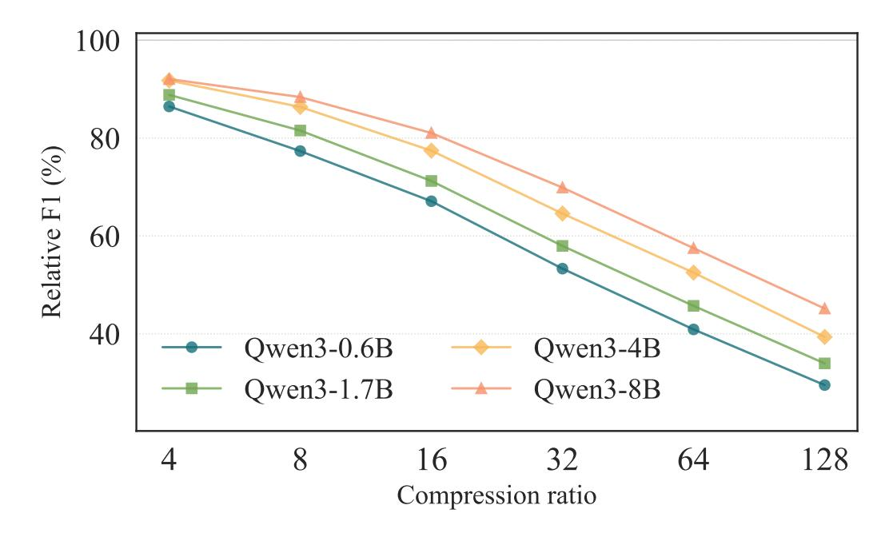

# **C Compression Scaling**

> **[图片提取文字 (无描述)]:**
> 100 80 Relative F1 (%) 60 40 Qwen3-0.6B Qwen3-4B Qwen3-1.7B Qwen3-8B 128 16 64 Compression ratio

Figure 3: Compression Scaling. We show the teacher-normalized *F*1 scores (Relative F1) across four Qwen3 model scales. The scores are averages of the scores of all datasets. We can clearly observe the benefits of scaling for LLM compressors.

LLM performance increases with scale [\(Hoffmann et al.,](#page-10-11) [2022\)](#page-10-11), but does compression quality scale similarly? A compressor improving at the same rate as its teacher would show constant teacher-normalized scores across scales. [Figure 3](#page-17-0) shows results for four Qwen3 scales under multi-ratio training. Compressors demonstrate desirable scaling: teacher-normalized *F*1 increases with model size, meaning the efficiency gains of compression are larger for larger models. Both baselines show this trend [\(Table 3\)](#page-7-0).

