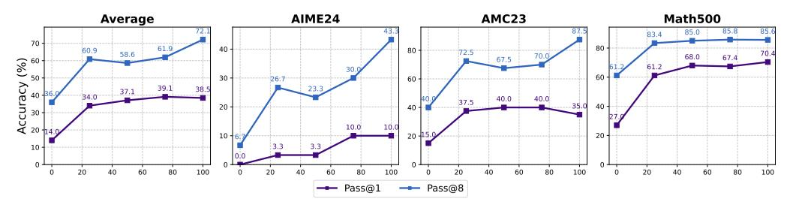
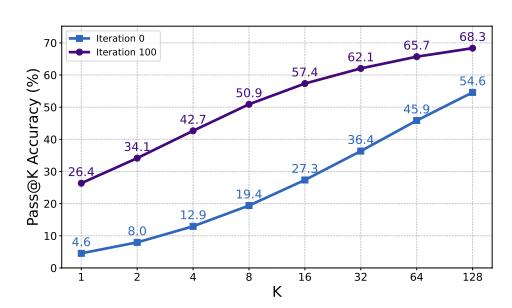
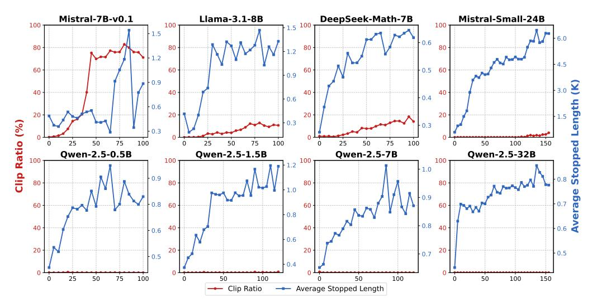
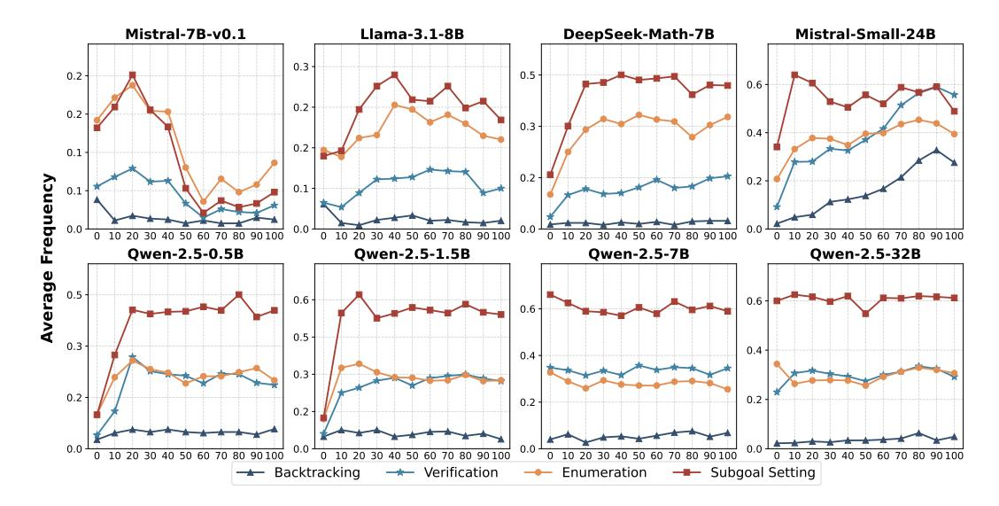
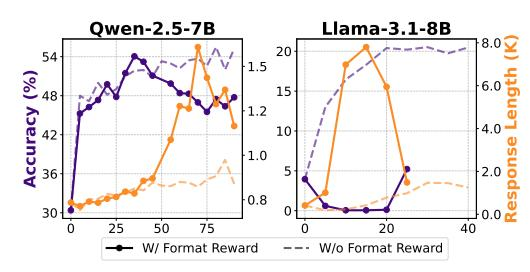
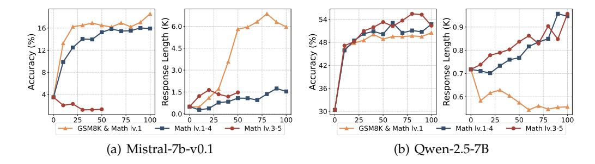
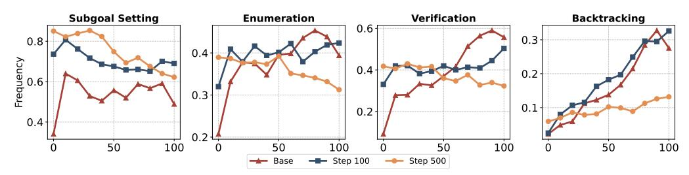
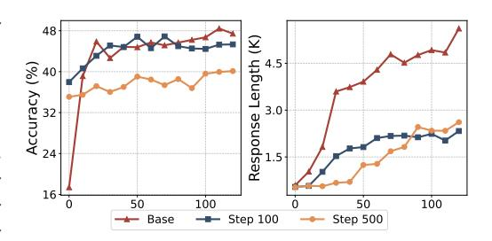

# **2 On Emerging Reasoning in Zero RL Training**

Existing research on zero RL training primarily focuses on Qwen2.5-series models, tracking only superficial metrics like accuracy and response length [\(Zeng et al.,](#page-13-0) [2025a;](#page-13-0) [Hu et al.,](#page-11-1) [2025;](#page-11-1) [Yu et al.,](#page-13-1) [2025\)](#page-13-1). However, Qwen2.5 models, due to their extensive use of synthetic data during pretraining, already exhibit instruction-following abilities and reflective behaviors, which may not represent base models in diverse scenarios. Additionally, an increase in response length does not necessarily indicate the emergence of cognitive behaviors and can sometimes result from meaningless repetition. To address these issues, this section explores zero RL training across various base models of different sizes and families. By monitoring a range of metrics beyond accuracy and response length, we aim to provide a more comprehensive and transparent understanding of zero RL training for open base models in the wild.

#### **2.1 Experimental Setup**

**Training Algorithm:** In our study, we follow the zero RL training recipe in [DeepSeek-AI](#page-10-0) [et al.](#page-10-0) [\(2025a\)](#page-10-0) using various open base models, employing the GRPO algorithm [\(Shao et al.,](#page-12-5) [2024\)](#page-12-5). Here, zero RL training refers to RL directly from the base model without any prior supervised fine-tuning (SFT). A detailed introduction to GRPO is provided in Appendix [A.](#page-14-0)

**Training Dataset:** We use the GSM8K [\(Cobbe et al.,](#page-10-2) [2021\)](#page-10-2) and MATH [\(Hendrycks et al.,](#page-11-4) [2021\)](#page-11-4) training datasets. In our experiments, we find that data difficulty is critical for successful zero RL ([§3.2\)](#page-8-0) and it is necessary to use data that aligns with the model's capability. To investigate this phenomenon, we categorize the data into three difficulty levels: Easy (GSM8K and MATH lv.1), Medium (MATH lv.1–4), and Hard (MATH lv.3–5), with each category containing roughly 8,000 problems.

**Reward:** We use a rule-based reward function that assigns +1 for correct answers and 0 for incorrect ones. Unlike prior works [\(Luo et al.,](#page-12-10) [2025;](#page-12-10) [Chen et al.,](#page-9-1) [2025\)](#page-9-1), we avoid format-based reward, which may hinder exploration, particularly for base models struggling with format adherence, as detailed in [§3.1.](#page-7-0)

**Models:** We conduct zero RL training experiments on Llama-3.1-8B, DeepSeek-Math-7B, Mistral-v0.1-7B, Mistral-Small-24b-Base-2501, and Qwen-2.5 (0.5B, 1.5B, 7B, 14B, 32B). As we perform experiments for a variety of models, under extremely simple settings with small, simple datasets and only correctness reward, we refer to our obtained models as *SimpleRL-Zoo* to represent a simple training recipe for a zoo of open base models. In our preliminary experiments, we observe that using complex prompts with models that have weak instruction-following capabilities often results in instability during training. Therefore, we apply simpler prompts to some models (Llama-3.1-8B, Mistral-v0.1-7B, and Qwen-2.5- 0.5B/1.5B). Examples of these prompts are shown in Figure [10](#page-16-1) in the Appendix.

| Model                              | GSM8K | MATH 500 | Minerva Math | Olympiad Bench | AIME24 (Pass@1) | AIME24 (Avg@32) | AMC23 | Avg. |
|------------------------------------|-------|-------------|-----------------|-------------------|--------------------|--------------------|-------|------|
| Llama, DeepSeek and Mistral Models |       |             |                 |                   |                    |                    |       |      |
| Mistral-v0.1-7B                    | 21.2  | 4.2         | 4.0             | 2.4               | 0.0                | 0.0                | 0.0   | 5.3  |
| $\hookrightarrow$ + SimpleRL-Zoo   | 75.0  | 15.8        | 6.6             | 4.1               | 0.0                | 0.2                | 10.0  | 18.6 |
| Llama-3.1-8B                       | 39.7  | 13.6        | 4.8             | 3.1               | 0.0                | 0.2                | 2.5   | 10.6 |
| $\hookrightarrow$ + SimpleRL-Zoo   | 79.2  | 23.0        | 9.6             | 5.3               | 0.0                | 0.2                | 15.0  | 22.0 |
| DeepSeek-Math-7B                   | 28.4  | 19.4        | 5.5             | 4.7               | 0.0                | 0.0                | 10.0  | 11.3 |
| $\hookrightarrow$ + SimpleRL-Zoo   | 78.5  | 39.6        | 21.0            | 12.6              | 3.3                | 0.6                | 20.0  | 29.2 |
| Mistral-Small-24B                  | 78.6  | 43.6        | 10.7            | 11.6              | 3.3                | 0.5                | 17.5  | 27.6 |
| $\hookrightarrow$ + SimpleRL-Zoo   | 92.0  | 70.6        | 36.8            | 36.6              | 16.7               | 13.1               | 45.0  | 49.6 |
| Qwen Series Models                 |       |             |                 |                   |                    |                    |       |      |
| Qwen-2.5-0.5B                      | 36.7  | 15.8        | 4.8             | 2.8               | 0.0                | 0.3                | 12.5  | 12.1 |
| $\hookrightarrow$ + SimpleRL-Zoo   | 49.5  | 34.4        | 10.3            | 8.9               | 0.0                | 0.7                | 22.5  | 20.9 |
| Qwen-2.5-1.5B                      | 55.7  | 29.6        | 6.6             | 6.5               | 0.0                | 0.1                | 12.5  | 18.5 |
| $\hookrightarrow$ + SimpleRL-Zoo   | 74.4  | 59.0        | 20.2            | 21.0              | 6.7                | 4.2                | 35.0  | 36.1 |
| Qwen-2.5-7B                        | 88.2  | 64.6        | 25.7            | 30.1              | 3.3                | 0.3                | 30.0  | 40.3 |
| $\hookrightarrow$ + SimpleRL-Zoo   | 91.7  | 78.2        | 38.6            | 40.4              | 20.0               | 15.6               | 62.5  | 55.2 |
| Qwen-2.5-Math-7B                   | 65.5  | 63.6        | 12.5            | 25.8              | 13.3               | 8.6                | 42.5  | 37.2 |
| $\hookrightarrow$ + SimpleRL-Zoo   | 90.2  | 80.2        | 37.5            | 39.0              | 40.0               | 24.0               | 70.0  | 59.5 |
| Qwen-2.5-14B                       | 91.6  | 65.4        | 24.3            | 33.5              | 6.7                | 3.4                | 37.5  | 43.2 |
| $\hookrightarrow$ + SimpleRL-Zoo   | 94.4  | 80.2        | 40.4            | 44.9              | 23.3               | 14.2               | 57.6  | 56.8 |
| Qwen-2.5-32B                       | 92.9  | 68.6        | 27.9            | 31.1              | 10.0               | 4.5                | 45.0  | 45.9 |
| $\hookrightarrow$ + SimpleRL-Zoo   | 95.9  | 82.4        | 42.6            | 46.4              | 36.7               | 27.2               | 67.5  | 61.9 |

Table 1: Detailed performance of various models across multiple benchmarks. The blue lines represent the models trained with our recipe. AIME is evaluated in two ways: Pass@1 (single run) and Avg@32 (average score from 32 runs). For AIME24 (Pass@1) and other benchmarks, baselines use greedy decoding, and models with SimpleRL-Zoo use temperature=1.0 and top-p=0.95. For AIME24 (Avg@32), we sample 32 responses per model with the same settings. Average scores are based on AIME (Pass@1) and other benchmarks.

**Benchmark:** We evaluate performance on standard mathematical reasoning benchmarks, including GSM8K (Cobbe et al., 2021), MATH 500 (Hendrycks et al., 2021), Minerva Math (Lewkowycz et al., 2022), and OlympiadBench (He et al., 2024), as well as on competition-level benchmarks such as AIME 2024 and AMC 2023.

For more experimental setup details, please refer to Appendix B.

#### 2.2 Evaluation Metrics

During training, we monitor standard metrics such as accuracy and response length across benchmarks. In our preliminary experiment, we observe that response length as a metric is quite superficial and cannot accurately reflect changes in the model's reasoning behavior. Therefore, we adopt the following metrics additionally:

Reasoning Behavior Ratio: To better understand the model's reasoning patterns throughout the training process, we adopt the cognitive behavior framework proposed by Gandhi et al. (2025) and use GPT-40 (Hurst et al., 2024) to identify reasoning-related behaviors, including "Backtracking", "Verification", "Subgoal Setting", and "Enumeration". We compare the consistency between GPT-40 and human annotations of reasoning-related behaviors in the Appendix E. We report the ratio of responses that contain such cognitive behaviors. While some recent studies suggest tracking reflection behavior using related keywords (Yeo et al., 2025; Xie et al., 2025) as monitoring signals, we argue that these keywords only exhibit only a weak correlation with high-level reasoning patterns like reflection and verification. As a result, they fail to adequately capture the development of these reasoning processes. We place the setting details, comparisons of different tracking methods, and reasoning behavior cases of different models in Appendix I.

Clip Ratio: In the early stages of training, the base model exhibits weak instructionfollowing ability and often fails to stop appropriately, resulting in irrelevant or excessively long outputs. After training collapses, the model may also generate repetitive or overly extended responses. Since the model has a fixed maximum context length, such outputs

> **[图片提取文字 (无描述)]:**
> AIME24 AMC23 Math500 Average 85.0 83.4 58.6 68.0 8 60 50 50 50 50 50 50 50 50 50 50 50 50 50 30.0 30 -Accuracy 39.1 37.1 40.0 40.0 37.5 10.0 10 -100 20 100 60 100 40 80 100 60 80 20 60 -- Pass@1 -- Pass@8

Figure 2: Pass@1 and Pass@8 accuracy over the training iterations of Mistral-Small-24B. The model is trained on the hard data (MATH levels 3–5) as described in §2.1. We evaluate its performance on three benchmarks: AIME24, AMC23, and Math500. The reported average score is the mean across these three benchmarks.

may be truncated during both training and evaluation. To monitor this issue, we define the proportion of truncated outputs as the "Clip Ratio".

**Average Stopped Length:** Generations that are truncated often result from issues such as repetitive patterns or incomplete reasoning, which typically do not contribute to effective trajectories. To account for this factor, we introduce a new metric to track the average length of responses that are stopped under normal conditions.

For more evaluation metrics details, please refer to Appendix C.

#### 2.3 Main Results

Zero RL Training Improves both Accuracy and Response Length Significantly: Figure 1 and Figure 11 in Appendix D illustrate a steady improvement in both response length and average accuracy across various benchmarks. Table 1 provides a detailed breakdown of the results. Despite using only 8K training samples, we observe significant performance gains for all models. The improvements cover competition-level tests like AIME 2024 and AMC 2023 for most cases. This demonstrates the remarkable generalization capabilities of zero RL training, enabling the model to effectively progress from easier to more challenging problems. In addition to the Qwen series models, we also significantly improve both performance and response length for other models that initially starts with low baselines. For instance, after just 80 training iterations, the DeepSeek-Math-7B's performance increases more than threefold, while its response length grows from around 300 to over 1200 tokens.

Zero RL Training also Demonstrates Strong Generalization Performance. We also evaluate the generalization ability of zero RL training using three benchmarks: IFEVAL (Zhou et al., 2023), MMLU (Hendrycks et al., 2020), and GPQA-Diamond (Rein et al., 2024). IFEVAL measures instruction-following capability, MMLU assesses the model's mastery of general knowledge, and GPQA-Diamond is a challenging benchmark that tests domain-specific expertise in chemistry, physics, and biology. Table 2 presents the changes in model performance on IFEval, MMLU, and GPQA-Diamond before and after training. Despite zero RL training being conducted on only 8K math reasoning-related examples, the model generalizes effectively across a range of tasks. Notably, it shows significant gains in instruction-following and general knowledge on IFEval and MMLU, as well as substantial improvements on the challenging GPQA-Diamond benchmark, which spans chemistry, physics, and biology.

**Steady Improvement of Pass@k Accuracy:** As shown in Figure 2, Mistral-Small-24B exhibits robust growth in pass@8. Furthermore, as training progresses, the model's pass@1 results eventually surpass the initial pass@8 results of the base model. By iteration 100, the two metrics differ by more than 30 absolute points on average. This suggests significant potential for further improvements in RL, as our training rolls out 8 responses for each query and pass@8 represents the model's ability to explore correct responses. Surprisingly, the gap between pass@1 and pass@8 does not diminish during training; instead, it widens as training progresses. Figure 3 shows that a significant gap in pass@k persists between the base model and the model after RL training, even at higher values of k – the gap is from 13

| Model                              | IFEVAL strict-prompt | MMLU Stem | MMLU | GPQA | Avg. |  |  |  |
|------------------------------------|-------------------------|--------------|------|------|------|--|--|--|
| Llama, DeepSeek and Mistral Models |                         |              |      |      |      |  |  |  |
| Mistral-v0.1-7B                    | 13.5                    | 26.1         | 28.0 | 23.2 | 22.7 |  |  |  |
| $\hookrightarrow$ + SimpleRL-Zoo   | 21.8                    | 28.1         | 34.6 | 30.3 | 28.7 |  |  |  |
| Llama-3.1-8B                       | 16.1                    | 27.1         | 28.7 | 22.7 | 23.6 |  |  |  |
| $\hookrightarrow$ + SimpleRL-Zoo   | 25.1                    | 40.7         | 44.5 | 20.2 | 32.6 |  |  |  |
| DeepSeek-Math-7B                   | 11.5                    | 21.6         | 22.7 | 19.2 | 18.7 |  |  |  |
| $\hookrightarrow$ + SimpleRL-Zoo   | 16.3                    | 47.4         | 45.5 | 27.3 | 34.1 |  |  |  |
| Mistral-Small-24B                  | 17.4                    | 30.9         | 31.7 | 20.2 | 25.0 |  |  |  |
| $\hookrightarrow$ + SimpleRL-Zoo   | 23.5                    | 73.9         | 78.8 | 45.0 | 55.3 |  |  |  |
| Qwen Series Models                 |                         |              |      |      |      |  |  |  |
| Qwen-2.5-0.5B                      | 9.6                     | 23.2         | 24.9 | 24.8 | 20.6 |  |  |  |
| $\hookrightarrow$ + SimpleRL-Zoo   | 14.4                    | 32.1         | 34.6 | 26.3 | 26.8 |  |  |  |
| Qwen-2.5-1.5B                      | 15.2                    | 33.1         | 35.4 | 24.8 | 27.1 |  |  |  |
| $\hookrightarrow$ + SimpleRL-Zoo   | 20.3                    | 42.1         | 45.2 | 28.8 | 34.1 |  |  |  |
| Qwen-2.5-7B                        | 21.3                    | 39.8         | 38.6 | 23.7 | 30.8 |  |  |  |
| $\hookrightarrow$ + SimpleRL-Zoo   | 25.9                    | 49.6         | 47.0 | 29.8 | 38.1 |  |  |  |
| Qwen-2.5-Math-7B                   | 14.1                    | 40.6         | 38.0 | 27.8 | 30.1 |  |  |  |
| $\hookrightarrow$ + SimpleRL-Zoo   | 17.0                    | 55.6         | 56.6 | 35.4 | 41.1 |  |  |  |
| Qwen-2.5-14B                       | 22.9                    | 59.8         | 63.5 | 24.8 | 42.7 |  |  |  |
| $\hookrightarrow$ + SimpleRL-Zoo   | 29.4                    | 76.3         | 79.1 | 50.0 | 58.7 |  |  |  |
| Qwen-2.5-32B                       | 24.6                    | 60.7         | 62.7 | 38.9 | 46.7 |  |  |  |
| $\hookrightarrow$ + SimpleRL-Zoo   | 31.2                    | 79.0         | 82.5 | 49.5 | 60.6 |  |  |  |

Table 2: Detailed performance of various models across IFEVAL, MMLU and GPQA. The blue lines represent the models trained with our recipe.

to 30 absolute points when we vary k up to 128. This suggests that zero RL training is not just reranking the model's output distribution within the top k candidates at a reasonably large range of k (Shao et al., 2024), instead, it enhances the model's fundamental reasoning abilities.

Growth in Response Length May be Unhealthy: Response length does not always reflect genuine growth in reasoning. In some cases, unstable training can cause models to generate excessive repetitive content until they hit the context length limit, artificially inflating response length without improving reasoning depth. For example, Figure 4 shows that while most models maintain a low clip ratio – below 5% of the data – when their average stopping length steadily increases, Mistral-7B-v0.1 exhibits a high clip ratio and significant fluctuations in stopping length. Upon closer inspection of its responses, we find that the responses consist of incoherent, mixed-language gibberish,

> **[图片提取文字 (无描述)]:**
> 68.3 Iteration 0 70 -65.7 Iteration 100 62.1 57.4 Pass@K Accuracy (%) 54.6 50.9 36.4 34.1 30-26.4 19.4 20-12.9 8.0 10 4.6 0 16 32 128 4 8 64

Figure 3: Pass@k of Mistral-24B based on the average results from AIME24 and AMC23.

suggesting that its thinking process is not genuinely expanding. We note that such patterns would not be captured by response length as in Figure 1. These findings indicate that most models demonstrate a meaningful increase in response length. This raises an important question: What exactly do models learn as their thinking time increases? We answer this question next.

#### 2.4 The "Aha Moment" - Quantifying Emergence of Reasoning Behaviors

Figure 5 illustrates the reasoning behavior ratio on OlympiadBench during model training. By comparing Figure 5 with Figure 4, we observe that fluctuations in the reasoning behavior ratio effectively account for variations in the average stopped length. Interestingly, we find that different models exhibit entirely distinct trends in reasoning behavior changes.

> **[图片提取文字 (无描述)]:**
> Mistral-7B-v0.1 Llama-3.1-8B DeepSeek-Math-7B Mistral-Small-24B 1.5 100 1 100 100 100 -- 1.5 6.0 0.6 80 80 1.2 4.5 60 60 0.5 60 0.9 - 0.9 40 0.4 - 0.6 Length -0.6 20 20 20 Clip Ratio (%) - 0.3 0.3 - 0.3 Stopped 75 100 150 25 50 75 100 25 50 100 25 50 75 50 100 Qwen-2.5-0.5B Qwen-2.5-1.5B Qwen-2.5-7B Qwen-2.5-32B 100 100 100 -1.0 0.9 80 80 80 rage 0.9 -0.70.8 60 60 60 60 -0.8 0.8 40 40 0.6 - 0.6 0.6 20 20 20 20 0.5 0.7 0.5 0.4 25 75 100 50 100 50 100 50 100 150 50 Clip Ratio Average Stopped Length

Figure 4: Average clip ratio and stopped length across training iterations for different models. We assess the models every five steps on a variety of math benchmarks, including GSM8K, MATH500, Minerva Math, and OlympiadBench, as well as competition-level benchmarks like AIME24 and AMC23. The red line indicates the clip ratio, while the blue line represents the stopped length. Per-benchmark results are in Figure 12 (Appendix D).

Smaller models, such as Qwen-2.5-0.5B and 1.5B, tend to prioritize learning the "Subgoal Setting" behavior, with its proportion increasing by approximately 4–5 times. Additionally, the proportions of "Verification" and "Enumeration" also show noticeable growth. In contrast, for other base models that inherently possess step-by-step reasoning capabilities, adjustments in "Subgoal Setting" during the RL training process are relatively minor.

DeepSeek-Math-7B, Llama-3.1-8B, and Mistral-Small-24B exhibit substantial increases in the proportions of "Enumeration" and "Verification" behaviors, rising from relatively low initial levels by approximately 3-4 times. This growth correlates closely with their changes in average stopped length, suggesting a shift in reasoning patterns over time. For instance, in Mistral-Small-24B, reflection-oriented behaviors such as "Verification" and "Backtracking" increase dramatically from nearly 0% to approximately 50%, indicating the emergence of reflection behavior from scratch. This shift suggests that the model progressively internalizes verification as part of its reasoning process, offering a promising trajectory for enhancement.

In contrast, Qwen-2.5-7B and 32B demonstrate strong reasoning behaviors from the outset, with minimal changes throughout training. This phenomenon aligns with their slow length adjustments (Figure 1) and suggests that Qwen models inherently possess robust reasoning capabilities. Rather than undergoing a structural shift in their reasoning processes, they primarily benefit from small increases in thinking time, which yield significant performance improvements. Finally, we observe that Mistral-7B-v0.1 consistently exhibits low reasoning behaviors with no noticeable growth, further supporting our earlier analysis in §2.3.

To intuitively illustrate the changes in reasoning behavior, we present examples of Mistral 24B's reasoning before and after training in Figures 22. Comprehensive case studies involving other models are available in Appendix I.3. In Figure 22, we observe that unlike the base model, the zero training model actively attempts to verify if its initial solution is valid by substituting it back into the original expression. Upon recognizing that the first solution does not meet the necessary conditions, the model explicitly initiates a backtracking approach, stating "let's try another possibility," eventually arriving at the correct answer.

#### 3 Key Factors Shaping Zero RL Training

In this section, we identify key factors that influence stability and performance during zero RL training, particularly when dealing with early-stage or weaker models. First, we explore how an over-reliance on format rewards restricts exploration. Next, we analyze how

> **[图片提取文字 (无描述)]:**
> Mistral-7B-v0.1 Llama-3.1-8B DeepSeek-Math-7B Mistral-Small-24B 0.3 0.2 0.5 0.6 0.2 0.2 0.3 0.4 0.2 0.1 0.2 -Average Frequency 0.2 0.1 0.0 0 10 20 30 40 50 60 70 80 90 100 0 10 20 30 40 50 60 70 80 90 100 0 10 20 30 40 50 60 70 80 90 100 0 10 20 30 40 50 60 70 80 90 100 Qwen-2.5-0.5B Qwen-2.5-1.5B Qwen-2.5-7B Qwen-2.5-32B 0.5 0.6 0.6 0.6 0.5 0.3 0.4 0.4 0.3 0.2 0.2 0.2 -0.2 0.0 0.0 0 10 20 30 40 50 60 70 80 90 100 0 10 20 30 40 50 60 70 80 90 100 0 10 20 30 40 50 60 70 80 90 100 0 10 20 30 40 50 60 70 80 90 100 Backtracking Subgoal Setting Verification Enumeration

Figure 5: The change in reasoning behavior over the training iterations across all models. As described in §2.2, we use GPT-40 to extract and track shifts in reasoning behaviors on OlympiadBench. We focus on four reasoning-related behaviors: "Backtracking", "Verification", "Subgoal Setting", and "Enumeration"

data difficulty impacts exploratory behavior, illustrating how exposure to varying levels of difficulty shapes the exploration dynamics. We also discuss the impact of exploration-related hyperparameters in Appendix G.

#### 3.1 Over-Reliance on Format Rewards

We find that enforcing strict formatting constraints, such as requiring the final answer to be enclosed in a latex command boxed, can hinder model's freely exploration and ultimately degrades performance. This is because many base models cannot follow the format constraint well in the initial stage, and imposing a format reward will penalize many correct explorations. We compare two reward functions: one without format constraints, which rewards responses solely based on answer correctness (our default design in §2.1), and another that strictly enforces formatting by penalizing responses with a reward of -1 if they fail to adhere to the required format.

Figure 6 illustrates weaker models like Llama-3.1-8B struggle under strict formatting requirements, leading to a rapid increase in response length early in training without performancec improvement. The model expends excessive effort on adhering to the format but fails to learn how to answer correctly, ultimately resulting in model collapse. Figure 6 (Left) further reveals that even stronger models, such as Qwen-2.5-7B, which initially comply with formatting constraints, suffer in later Figure 6: Accuracy and response length training stages. This includes both performance degradation and a significant reduc-

> **[图片提取文字 (无描述)]:**
> Qwen-2.5-7B Llama-3.1-8B 8.0 20 54 1.5 96 48 42 42 42 42 42 42 42 42 42 42 42 42 42 6.0 15 4.0 10 1.0 2.0 0.8 30-0.0 25 50 75 20 40 W/ Format Reward W/o Format Reward

with and without format rewards.

tion in CoT length. These findings highlight that: in a zero RL training setting, rather than imposing rigid formatting rules, we should prioritize maintaining response verifiability while allowing sufficient flexibility for exploration.

> **[图片提取文字 (无描述)]:**
> 54 € 6.0 € 0.91 16 Accuracy (%) ength 8.0 8 48 ⋅ racy Response Respor ₹ 36-1.5 30-100 100 50 100 50 100 - Math lv.1-4 GSM8K & Math Iv.1 Math Iv.1-4 Math Iv.3-5 GSM8K & Math Iv.1 Math Iv.3-5 (a) Mistral-7b-v0.1 (b) Qwen-2.5-7B

Figure 7: Comparison of accuracy and response length across different data difficulty levels. We examine three levels of data: Easy (GSM8K and MATH lv.1), Medium (MATH lv.1–4), and Hard (MATH lv.3–5), with each category containing approximately 8,000 problems.

> **[图片提取文字 (无描述)]:**
> Subgoal Setting **Enumeration** Verification Backtracking 0.6 +0.8 0.4 Frequency 0 9 0.2 0.4 50 100 100 50 100 50 100 - Step 100 Step 500 Base

Figure 8: Reasoning behavior ratio over RL training iterations after using different SFT steps as starting points. "Base" refers to the base Mistral-Small-24B model without any SFT, while "Step 100" and "Step 500" represent 100 and 500 steps of SFT, respectively. As described in §2.1, we use GPT-40 to track shifts in reasoning behaviors on OlympiadBench.

#### 3.2 Data Difficulty on Exploratory Behavior

Base models exhibit varying performance and CoT behaviors when trained on different RL data. Figure 7 compare the performance of Mistral-7B and Qwen-2.5-7B across Easy, Medium, and Hard datasets. We observe a clear trend: as data difficulty increases, Mistral-7B's performance progressively deteriorates. When faced with high-difficulty data (Hard: MATH levels 3-5), the model struggles to generate responses that receive positive feedback from the reward system. This failure results in a significant increase in response length without any corresponding improvement in accuracy, signaling a breakdown in the training process—often referred to as training collapse. Figure 7 Left demonstrates that Qwen-2.5-7B exhibits a pattern entirely opposite to Mistral-7B-v0.1. Specifically, as dataset difficulty decreases, both the model's average accuracy and response length decline, with the effect being most pronounced on the simplest dataset, where even response length decreases. This finding aligns with our previous analysis of Qwen-2.5-7B in §2.4, reinforcing the notion that Qwen inherently possesses strong reasoning capabilities. To further improve its response length, training should incorporate more challenging datasets to encourage deeper reasoning and extended thinking time. The analysis highlights that zero RL training data must align with the base model's inherent reasoning capabilities.

### 4 Revisiting Traditional SFT for RL-Driven Reasoning Emergence

As base models may not follow instruction well and pose a major challenge for zero RL training, one may wonder a simple SFT stage as a cold start may be helpful to learn to follow instructions well. In this section, we revisit the impact of traditional SFT methods (where the responses are not from long CoT models) as a cold start on RL training performance and reasoning behavior—notably, this was the most commonly used post-training pipeline with RL following an SFT stage, before DeepSeek-R1. Specifically, we use a subset of

the NuminaMath (Li et al., 2024) dataset derived from GSM8K and MATH, 1 containing approximately 15K high-quality short CoT responses. We conduct SFT using Mistral 24B and select models at 100 and 500 training steps as starting points for RL training.

Figure 9 illustrates how model accuracy and output length evolve during RL training when different initial models are used. Our results indicate that starting from SFT models initially boosts performance significantly; however, these models encounter notable limitations in their maximum achievable accuracy and response length compared to starting from the base model during RL training. Crucially, we observe that these limitations become increasingly pronounced as the number of initial SFT steps grows.

To further investigate how initial SFT affects the emergence of reasoning behaviors, we analyze how often specific reasoning behaviors appeared during training at different starting points, as shown in Figure 8. Our analysis reveals that initial SFT negatively impacts the development of critical reasoning behaviors. Specifically, models with 100 SFT steps exhibit reduced upper limits in essential reasoning behaviors such as "enumeration," "verification," and "backtracking," compared to the base model. Even more notably, models with 500 SFT steps experience significant declines in "enumeration" and "verification" behaviors in later training stages, highlighting a detrimental long-term effect of exten-

> **[图片提取文字 (无描述)]:**
> 48 Length (K) 40 (%) Accuracy (%) 3.0 Response 16-50 100 50 100 Base Step 100 Step 500

Figure 9: Accuracy and response length averaged on the six benchmarks over RL training iterations after running different SFT steps as starting points.

sive sft on reasoning capabilities. This prompts a reconsideration of whether traditional SFT inherently restricts model exploration, perhaps highlighting the need for future cold-start strategies to prioritize exploration capacity—whether by incorporating long CoT data (DeepSeek-AI et al., 2025a; Yeo et al., 2025) or designing SFT techniques (Li et al., 2025) that strike a balance between imitation and exploration—to enable sustained improvements in model reasoning performance.

#### 5 Conclusion

Our paper demonstrates the effectiveness of zero RL training across a diverse range of base models, yielding significant improvements in accuracy and response length. We provide strong evidence that zero RL training is not merely reranking, but rather a genuine enhancement. Furthermore, we identify key factors such as reward design, data difficulty, and models' inherent abilities that shape the emergence of advanced reasoning behaviors. Our findings also indicate that starting RL training from models with traditional SFT may limit the development of advanced reasoning behaviors. Overall, our work highlights key factors for effective zero RL training and offers insights for future model improvements.

#### References

Xingyu Chen, Jiahao Xu, Tian Liang, Zhiwei He, Jianhui Pang, Dian Yu, Linfeng Song, Qiuzhi Liu, Mengfei Zhou, Zhuosheng Zhang, et al. Do not think that much for 2+ 3=? on the overthinking of o1-like llms. *arXiv preprint arXiv:2412.21187*, 2024.

Zhipeng Chen, Yingqian Min, Beichen Zhang, Jie Chen, Jinhao Jiang, Daixuan Cheng, Wayne Xin Zhao, Zheng Liu, Xu Miao, Yang Lu, et al. An empirical study on eliciting and improving r1-like reasoning models. *arXiv preprint arXiv:2503.04548*, 2025.

Ethan Chern, Haoyang Zou, Xuefeng Li, Jiewen Hu, Kehua Feng, Junlong Li, and Pengfei Liu. Generative ai for math: Abel. https://github.com/GAIR-NLP/abel, 2023.

&lt;sup>1We also conduct experiments using general SFT dataset beyond math-related ones, which can be found in Appendix F and implies similar conclusion.

Karl Cobbe, Vineet Kosaraju, Mohammad Bavarian, Mark Chen, Heewoo Jun, Lukasz Kaiser, Matthias Plappert, Jerry Tworek, Jacob Hilton, Reiichiro Nakano, et al. Training verifiers to solve math word problems. *arXiv preprint arXiv:2110.14168*, 2021.

DeepSeek-AI, Daya Guo, Dejian Yang, Haowei Zhang, Junxiao Song, Ruoyu Zhang, Runxin Xu, Qihao Zhu, Shirong Ma, Peiyi Wang, Xiao Bi, Xiaokang Zhang, Xingkai Yu, Yu Wu, Z. F. Wu, Zhibin Gou, Zhihong Shao, Zhuoshu Li, Ziyi Gao, Aixin Liu, Bing Xue, Bingxuan Wang, Bochao Wu, Bei Feng, Chengda Lu, Chenggang Zhao, Chengqi Deng, Chenyu Zhang, Chong Ruan, Damai Dai, Deli Chen, Dongjie Ji, Erhang Li, Fangyun Lin, Fucong Dai, Fuli Luo, Guangbo Hao, Guanting Chen, Guowei Li, H. Zhang, Han Bao, Hanwei Xu, Haocheng Wang, Honghui Ding, Huajian Xin, Huazuo Gao, Hui Qu, Hui Li, Jianzhong Guo, Jiashi Li, Jiawei Wang, Jingchang Chen, Jingyang Yuan, Junjie Qiu, Junlong Li, J. L. Cai, Jiaqi Ni, Jian Liang, Jin Chen, Kai Dong, Kai Hu, Kaige Gao, Kang Guan, Kexin Huang, Kuai Yu, Lean Wang, Lecong Zhang, Liang Zhao, Litong Wang, Liyue Zhang, Lei Xu, Leyi Xia, Mingchuan Zhang, Minghua Zhang, Minghui Tang, Meng Li, Miaojun Wang, Mingming Li, Ning Tian, Panpan Huang, Peng Zhang, Qiancheng Wang, Qinyu Chen, Qiushi Du, Ruiqi Ge, Ruisong Zhang, Ruizhe Pan, Runji Wang, R. J. Chen, R. L. Jin, Ruyi Chen, Shanghao Lu, Shangyan Zhou, Shanhuang Chen, Shengfeng Ye, Shiyu Wang, Shuiping Yu, Shunfeng Zhou, Shuting Pan, S. S. Li, Shuang Zhou, Shaoqing Wu, Shengfeng Ye, Tao Yun, Tian Pei, Tianyu Sun, T. Wang, Wangding Zeng, Wanjia Zhao, Wen Liu, Wenfeng Liang, Wenjun Gao, Wenqin Yu, Wentao Zhang, W. L. Xiao, Wei An, Xiaodong Liu, Xiaohan Wang, Xiaokang Chen, Xiaotao Nie, Xin Cheng, Xin Liu, Xin Xie, Xingchao Liu, Xinyu Yang, Xinyuan Li, Xuecheng Su, Xuheng Lin, X. Q. Li, Xiangyue Jin, Xiaojin Shen, Xiaosha Chen, Xiaowen Sun, Xiaoxiang Wang, Xinnan Song, Xinyi Zhou, Xianzu Wang, Xinxia Shan, Y. K. Li, Y. Q. Wang, Y. X. Wei, Yang Zhang, Yanhong Xu, Yao Li, Yao Zhao, Yaofeng Sun, Yaohui Wang, Yi Yu, Yichao Zhang, Yifan Shi, Yiliang Xiong, Ying He, Yishi Piao, Yisong Wang, Yixuan Tan, Yiyang Ma, Yiyuan Liu, Yongqiang Guo, Yuan Ou, Yuduan Wang, Yue Gong, Yuheng Zou, Yujia He, Yunfan Xiong, Yuxiang Luo, Yuxiang You, Yuxuan Liu, Yuyang Zhou, Y. X. Zhu, Yanhong Xu, Yanping Huang, Yaohui Li, Yi Zheng, Yuchen Zhu, Yunxian Ma, Ying Tang, Yukun Zha, Yuting Yan, Z. Z. Ren, Zehui Ren, Zhangli Sha, Zhe Fu, Zhean Xu, Zhenda Xie, Zhengyan Zhang, Zhewen Hao, Zhicheng Ma, Zhigang Yan, Zhiyu Wu, Zihui Gu, Zijia Zhu, Zijun Liu, Zilin Li, Ziwei Xie, Ziyang Song, Zizheng Pan, Zhen Huang, Zhipeng Xu, Zhongyu Zhang, and Zhen Zhang. Deepseek-r1: Incentivizing reasoning capability in llms via reinforcement learning, 2025a. URL <https://arxiv.org/abs/2501.12948>.

DeepSeek-AI, Aixin Liu, Bei Feng, Bing Xue, Bingxuan Wang, Bochao Wu, Chengda Lu, Chenggang Zhao, Chengqi Deng, Chenyu Zhang, Chong Ruan, Damai Dai, Daya Guo, Dejian Yang, Deli Chen, Dongjie Ji, Erhang Li, Fangyun Lin, Fucong Dai, Fuli Luo, Guangbo Hao, Guanting Chen, Guowei Li, H. Zhang, Han Bao, Hanwei Xu, Haocheng Wang, Haowei Zhang, Honghui Ding, Huajian Xin, Huazuo Gao, Hui Li, Hui Qu, J. L. Cai, Jian Liang, Jianzhong Guo, Jiaqi Ni, Jiashi Li, Jiawei Wang, Jin Chen, Jingchang Chen, Jingyang Yuan, Junjie Qiu, Junlong Li, Junxiao Song, Kai Dong, Kai Hu, Kaige Gao, Kang Guan, Kexin Huang, Kuai Yu, Lean Wang, Lecong Zhang, Lei Xu, Leyi Xia, Liang Zhao, Litong Wang, Liyue Zhang, Meng Li, Miaojun Wang, Mingchuan Zhang, Minghua Zhang, Minghui Tang, Mingming Li, Ning Tian, Panpan Huang, Peiyi Wang, Peng Zhang, Qiancheng Wang, Qihao Zhu, Qinyu Chen, Qiushi Du, R. J. Chen, R. L. Jin, Ruiqi Ge, Ruisong Zhang, Ruizhe Pan, Runji Wang, Runxin Xu, Ruoyu Zhang, Ruyi Chen, S. S. Li, Shanghao Lu, Shangyan Zhou, Shanhuang Chen, Shaoqing Wu, Shengfeng Ye, Shengfeng Ye, Shirong Ma, Shiyu Wang, Shuang Zhou, Shuiping Yu, Shunfeng Zhou, Shuting Pan, T. Wang, Tao Yun, Tian Pei, Tianyu Sun, W. L. Xiao, Wangding Zeng, Wanjia Zhao, Wei An, Wen Liu, Wenfeng Liang, Wenjun Gao, Wenqin Yu, Wentao Zhang, X. Q. Li, Xiangyue Jin, Xianzu Wang, Xiao Bi, Xiaodong Liu, Xiaohan Wang, Xiaojin Shen, Xiaokang Chen, Xiaokang Zhang, Xiaosha Chen, Xiaotao Nie, Xiaowen Sun, Xiaoxiang Wang, Xin Cheng, Xin Liu, Xin Xie, Xingchao Liu, Xingkai Yu, Xinnan Song, Xinxia Shan, Xinyi Zhou, Xinyu Yang, Xinyuan Li, Xuecheng Su, Xuheng Lin, Y. K. Li, Y. Q. Wang, Y. X. Wei, Y. X. Zhu, Yang Zhang, Yanhong Xu, Yanhong Xu, Yanping Huang, Yao Li, Yao Zhao, Yaofeng Sun, Yaohui Li, Yaohui Wang, Yi Yu, Yi Zheng, Yichao Zhang, Yifan Shi, Yiliang Xiong, Ying He, Ying Tang, Yishi Piao, Yisong Wang, Yixuan Tan, Yiyang Ma, Yiyuan Liu, Yongqiang Guo, Yu Wu, Yuan Ou, Yuchen Zhu, Yuduan Wang, Yue Gong, Yuheng Zou, Yujia He,

- Yukun Zha, Yunfan Xiong, Yunxian Ma, Yuting Yan, Yuxiang Luo, Yuxiang You, Yuxuan Liu, Yuyang Zhou, Z. F. Wu, Z. Z. Ren, Zehui Ren, Zhangli Sha, Zhe Fu, Zhean Xu, Zhen Huang, Zhen Zhang, Zhenda Xie, Zhengyan Zhang, Zhewen Hao, Zhibin Gou, Zhicheng Ma, Zhigang Yan, Zhihong Shao, Zhipeng Xu, Zhiyu Wu, Zhongyu Zhang, Zhuoshu Li, Zihui Gu, Zijia Zhu, Zijun Liu, Zilin Li, Ziwei Xie, Ziyang Song, Ziyi Gao, and Zizheng Pan. Deepseek-v3 technical report, 2025b. URL <https://arxiv.org/abs/2412.19437>.
- Abhimanyu Dubey, Abhinav Jauhri, Abhinav Pandey, Abhishek Kadian, Ahmad Al-Dahle, Aiesha Letman, Akhil Mathur, Alan Schelten, Amy Yang, Angela Fan, et al. The llama 3 herd of models. *arXiv preprint arXiv:2407.21783*, 2024.
- Kanishk Gandhi, Ayush Chakravarthy, Anikait Singh, Nathan Lile, and Noah D Goodman. Cognitive behaviors that enable self-improving reasoners, or, four habits of highly effective stars. *arXiv preprint arXiv:2503.01307*, 2025.
- Chaoqun He, Renjie Luo, Yuzhuo Bai, Shengding Hu, Zhen Leng Thai, Junhao Shen, Jinyi Hu, Xu Han, Yujie Huang, Yuxiang Zhang, et al. Olympiadbench: A challenging benchmark for promoting agi with olympiad-level bilingual multimodal scientific problems. *arXiv preprint arXiv:2402.14008*, 2024.
- Dan Hendrycks, Collin Burns, Steven Basart, Andy Zou, Mantas Mazeika, Dawn Song, and Jacob Steinhardt. Measuring massive multitask language understanding. *arXiv preprint arXiv:2009.03300*, 2020.
- Dan Hendrycks, Collin Burns, Saurav Kadavath, Akul Arora, Steven Basart, Eric Tang, Dawn Song, and Jacob Steinhardt. Measuring mathematical problem solving with the math dataset. *arXiv preprint arXiv:2103.03874*, 2021.
- Jingcheng Hu, Yinmin Zhang, Qi Han, Daxin Jiang, and Heung-Yeung Shum Xiangyu Zhang. Open-reasoner-zero: An open source approach to scaling reinforcement learning on the base model. <https://github.com/Open-Reasoner-Zero/Open-Reasoner-Zero>, 2025.
- Aaron Hurst, Adam Lerer, Adam P Goucher, Adam Perelman, Aditya Ramesh, Aidan Clark, AJ Ostrow, Akila Welihinda, Alan Hayes, Alec Radford, et al. Gpt-4o system card. *arXiv preprint arXiv:2410.21276*, 2024.
- Aaron Jaech, Adam Kalai, Adam Lerer, Adam Richardson, Ahmed El-Kishky, Aiden Low, Alec Helyar, Aleksander Madry, Alex Beutel, Alex Carney, et al. Openai o1 system card. *arXiv preprint arXiv:2412.16720*, 2024.
- Albert Q. Jiang, Alexandre Sablayrolles, Arthur Mensch, Chris Bamford, Devendra Singh Chaplot, Diego de las Casas, Florian Bressand, Gianna Lengyel, Guillaume Lample, Lucile Saulnier, Lelio Renard Lavaud, Marie-Anne Lachaux, Pierre Stock, Teven Le Scao, Thibaut ´ Lavril, Thomas Wang, Timothee Lacroix, and William El Sayed. Mistral 7b, 2023. URL ´ <https://arxiv.org/abs/2310.06825>.
- Aitor Lewkowycz, Anders Andreassen, David Dohan, Ethan Dyer, Henryk Michalewski, Vinay Ramasesh, Ambrose Slone, Cem Anil, Imanol Schlag, Theo Gutman-Solo, et al. Solving quantitative reasoning problems with language models. *Advances in Neural Information Processing Systems*, 35:3843–3857, 2022.
- Jia Li, Edward Beeching, Lewis Tunstall, Ben Lipkin, Roman Soletskyi, Shengyi Huang, Kashif Rasul, Longhui Yu, Albert Q Jiang, Ziju Shen, et al. Numinamath: The largest public dataset in ai4maths with 860k pairs of competition math problems and solutions. *Hugging Face repository*, 13:9, 2024.
- Ziniu Li, Congliang Chen, Tian Xu, Zeyu Qin, Jiancong Xiao, Zhi-Quan Luo, and Ruoyu Sun. Preserving diversity in supervised fine-tuning of large language models. In *The Thirteenth International Conference on Learning Representations*, 2025. URL [https://openreview.net/](https://openreview.net/forum?id=NQEe7B7bSw) [forum?id=NQEe7B7bSw](https://openreview.net/forum?id=NQEe7B7bSw).
- Hunter Lightman, Vineet Kosaraju, Yuri Burda, Harrison Edwards, Bowen Baker, Teddy Lee, Jan Leike, John Schulman, Ilya Sutskever, and Karl Cobbe. Let's verify step by step. In *The Twelfth International Conference on Learning Representations*, 2023.

- Wei Liu, Junlong Li, Xiwen Zhang, Fan Zhou, Yu Cheng, and Junxian He. Diving into self-evolving training for multimodal reasoning. *arXiv preprint arXiv:2412.17451*, 2024.
- Zichen Liu, Changyu Chen, Wenjun Li, Penghui Qi, Tianyu Pang, Chao Du, Wee Sun Lee, and Min Lin. Understanding r1-zero-like training: A critical perspective. [https:](https://github.com/sail-sg/understand-r1-zero) [//github.com/sail-sg/understand-r1-zero](https://github.com/sail-sg/understand-r1-zero), 2025.
- Michael Luo, Sijun Tan, Justin Wong, Xiaoxiang Shi, William Y. Tang, Manan Roongta, Colin Cai, Jeffrey Luo, Tianjun Zhang, Li Erran Li, Raluca Ada Popa, and Ion Stoica. Deepscaler: Surpassing o1-preview with a 1.5b model by scaling rl, 2025. Notion Blog.
- Mistral AI. Mistral small 3, January 2025. URL <https://mistral.ai/news/mistral-small-3>.
- David Rein, Betty Li Hou, Asa Cooper Stickland, Jackson Petty, Richard Yuanzhe Pang, Julien Dirani, Julian Michael, and Samuel R Bowman. Gpqa: A graduate-level googleproof q&a benchmark. In *First Conference on Language Modeling*, 2024.
- Zhihong Shao, Peiyi Wang, Qihao Zhu, Runxin Xu, Junxiao Song, Xiao Bi, Haowei Zhang, Mingchuan Zhang, YK Li, Y Wu, et al. Deepseekmath: Pushing the limits of mathematical reasoning in open language models. *arXiv preprint arXiv:2402.03300*, 2024.
- Guangming Sheng, Chi Zhang, Zilingfeng Ye, Xibin Wu, Wang Zhang, Ru Zhang, Yanghua Peng, Haibin Lin, and Chuan Wu. Hybridflow: A flexible and efficient rlhf framework. *arXiv preprint arXiv:2409.19256*, 2024.
- Avi Singh, John D Co-Reyes, Rishabh Agarwal, Ankesh Anand, Piyush Patil, Xavier Garcia, Peter J Liu, James Harrison, Jaehoon Lee, Kelvin Xu, et al. Beyond human data: Scaling self-training for problem-solving with language models. *arXiv preprint arXiv:2312.06585*, 2023.
- Zhiqing Sun, Longhui Yu, Yikang Shen, Weiyang Liu, Yiming Yang, Sean Welleck, and Chuang Gan. Easy-to-hard generalization: Scalable alignment beyond human supervision. *arXiv preprint arXiv:2403.09472*, 2024.
- Kimi Team, Angang Du, Bofei Gao, Bowei Xing, Changjiu Jiang, Cheng Chen, Cheng Li, Chenjun Xiao, Chenzhuang Du, Chonghua Liao, et al. Kimi k1. 5: Scaling reinforcement learning with llms. *arXiv preprint arXiv:2501.12599*, 2025.
- Evan Wang, Federico Cassano, Catherine Wu, Yunfeng Bai, Will Song, Vaskar Nath, Ziwen Han, Sean Hendryx, Summer Yue, and Hugh Zhang. Planning in natural language improves llm search for code generation. *arXiv preprint arXiv:2409.03733*, 2024.
- Peiyi Wang, Lei Li, Zhihong Shao, RX Xu, Damai Dai, Yifei Li, Deli Chen, Yu Wu, and Zhifang Sui. Math-shepherd: Verify and reinforce llms step-by-step without human annotations. *arXiv preprint arXiv:2312.08935*, 2023.
- Jason Wei, Xuezhi Wang, Dale Schuurmans, Maarten Bosma, Fei Xia, Ed Chi, Quoc V Le, Denny Zhou, et al. Chain-of-thought prompting elicits reasoning in large language models. *Advances in neural information processing systems*, 35:24824–24837, 2022.
- Tian Xie, Zitian Gao, Qingnan Ren, Haoming Luo, Yuqian Hong, Bryan Dai, Joey Zhou, Kai Qiu, Zhirong Wu, and Chong Luo. Logic-rl: Unleashing llm reasoning with rule-based reinforcement learning. *arXiv preprint arXiv:2502.14768*, 2025.
- An Yang, Baosong Yang, Beichen Zhang, Binyuan Hui, Bo Zheng, Bowen Yu, Chengyuan Li, Dayiheng Liu, Fei Huang, Haoran Wei, et al. Qwen2. 5 technical report. *arXiv preprint arXiv:2412.15115*, 2024a.
- An Yang, Beichen Zhang, Binyuan Hui, Bofei Gao, Bowen Yu, Chengpeng Li, Dayiheng Liu, Jianhong Tu, Jingren Zhou, Junyang Lin, et al. Qwen2. 5-math technical report: Toward mathematical expert model via self-improvement. *arXiv preprint arXiv:2409.12122*, 2024b.
- Edward Yeo, Yuxuan Tong, Morry Niu, Graham Neubig, and Xiang Yue. Demystifying long chain-of-thought reasoning in llms. *arXiv preprint arXiv:2502.03373*, 2025.

- Qiying Yu, Zheng Zhang, Ruofei Zhu, Yufeng Yuan, Xiaochen Zuo, Yu Yue, Tiantian Fan, Gaohong Liu, Lingjun Liu, Xin Liu, Haibin Lin, Zhiqi Lin, Bole Ma, Guangming Sheng, Yuxuan Tong, Chi Zhang, Mofan Zhang, Wang Zhang, Hang Zhu, Jinhua Zhu, Jiaze Chen, Jiangjie Chen, Chengyi Wang, Hongli Yu, Weinan Dai, Yuxuan Song, Xiangpeng Wei, Hao Zhou, Jingjing Liu, Wei-Ying Ma, Ya-Qin Zhang, Lin Yan, Mu Qiao, Yonghui Wu, and Mingxuan Wang. Dapo: An open-source llm reinforcement learning system at scale, 2025. URL <https://arxiv.org/abs/2503.14476>.
- Weihao Zeng, Yuzhen Huang, Wei Liu, Keqing He, Qian Liu, Zejun Ma, and Junxian He. 7b model and 8k examples: Emerging reasoning with reinforcement learning is both effective and efficient. <https://hkust-nlp.notion.site/simplerl-reason>, 2025a. Notion Blog.
- Weihao Zeng, Yuzhen Huang, Lulu Zhao, Yijun Wang, Zifei Shan, and Junxian He. B-STar: Monitoring and balancing exploration and exploitation in self-taught reasoners. In *The Thirteenth International Conference on Learning Representations*, 2025b. URL [https:](https://openreview.net/forum?id=P6dwZJpJ4m) [//openreview.net/forum?id=P6dwZJpJ4m](https://openreview.net/forum?id=P6dwZJpJ4m).
- Yaowei Zheng, Richong Zhang, Junhao Zhang, Yanhan Ye, and Zheyan Luo. LlamaFactory: Unified efficient fine-tuning of 100+ language models. In Yixin Cao, Yang Feng, and Deyi Xiong (eds.), *Proceedings of the 62nd Annual Meeting of the Association for Computational Linguistics (Volume 3: System Demonstrations)*, pp. 400–410, Bangkok, Thailand, August 2024. Association for Computational Linguistics. doi: 10.18653/v1/2024.acl-demos.38. URL <https://aclanthology.org/2024.acl-demos.38/>.
- Jeffrey Zhou, Tianjian Lu, Swaroop Mishra, Siddhartha Brahma, Sujoy Basu, Yi Luan, Denny Zhou, and Le Hou. Instruction-following evaluation for large language models. *arXiv preprint arXiv:2311.07911*, 2023.

