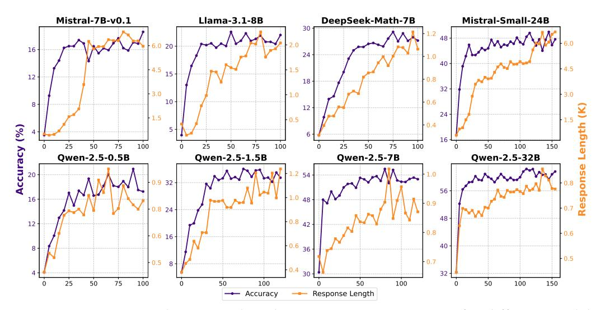

# SimpleRL-Zoo: Investigating and Taming Zero Reinforcement Learning for Open Base Models in the Wild

Weihao Zeng\*1 Yuzhen Huang\*1 Qian Liu\*2 Wei Liu1 Keqing He3 Zejun Ma2 Junxian He1

1HKUST 2TikTok 3Meituan https://github.com/hkust-nlp/simpleRL-reason

#### **Abstract**

DeepSeek-R1 has shown that long chain-of-thought (CoT) reasoning can naturally emerge through a simple reinforcement learning (RL) framework with rule-based rewards, where the training may directly start from the base models—a paradigm referred to as zero RL training. Most recent efforts to reproduce zero RL training have primarily focused on the Qwen2.5 model series, which may not be representative as we find the base models already exhibit strong instruction-following and self-reflection abilities. In this work, we investigate zero RL training across 10 diverse base models, spanning different families and sizes including LLama3-8B, Mistral-7B/24B, DeepSeek-Math-7B, Qwen2.5-math-7B, and all Qwen2.5 models from 0.5B to 32B. Leveraging several key design strategies—such as adjusting format reward and controlling query difficulty—we achieve substantial improvements in both reasoning accuracy and response length across most settings. However, by carefully monitoring the training dynamics, we observe that different base models exhibit distinct patterns during training. For instance, the increased response length does not always correlate with the emergence of certain cognitive behaviors such as verification (i.e., the "aha moment"). Notably, we observe the "aha moment" for the first time in small models not from the Qwen family. We share the key designs that enable successful zero RL training, along with our findings and practices. To facilitate further research, we open-source the code, models, and analysis tools.

> **[图片提取文字 (无描述)]:**
> Mistral-7B-v0.1 Llama-3.1-8B DeepSeek-Math-7B Mistral-Small-24B 1.2 48 6.0 20 16 24 1.0 40 4.5 4.5 1.5 15 12 0.8 18 32 - 3.0 1.0 - 3.0 0.6 10 8 12 . 24 1.5 0.5 -0.4Accuracy (%) 5 -16 75 100 100 75 100 150 25 50 25 50 75 25 50 50 100 Qwen-2.5-0.5B Qwen-2.5-1.5B Qwen-2.5-7B Qwen-2.5-32B 1.2 54 -1.0 0.9 32 -56 r 1.0 48 + 16 0.9 0.8 24 48 0.8 42 12 -0.8 0.6 r 0.6 16 -0.6 40 8 36 0.5 -0.70.5 8 0.4 30 32 100 100 100 150 25 50 75 50 50 50 100 Response Length Accuracy

Figure 1: Accuracy and response length across training iterations for different models, averaged on GSM8K, MATH500, Minerva Math, OlympiadBench, AIME24, and AMC23. Per-benchmark results are in Figure 11 (Appendix D). All training starts from base models.

 $\label{thm:contribution} $$ ^*Equal Contribution. Correspondence to Weihao Zeng (wzengak@connect.ust.hk), Yuzhen Huang (yhuanghj@cse.ust.hk), and Junxian He (junxianh@cse.ust.hk).$ 

