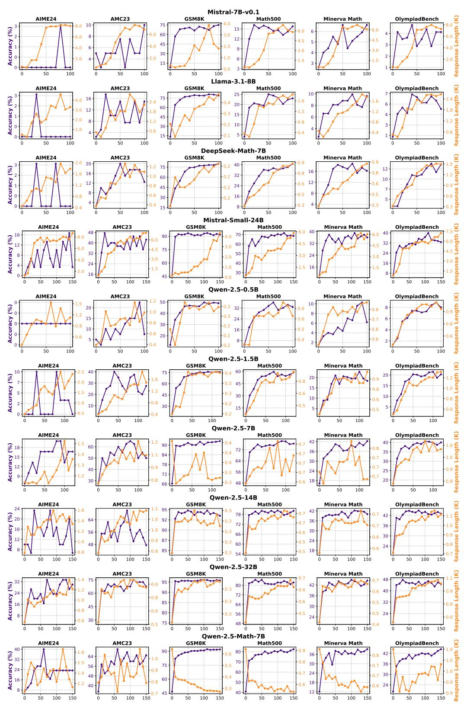
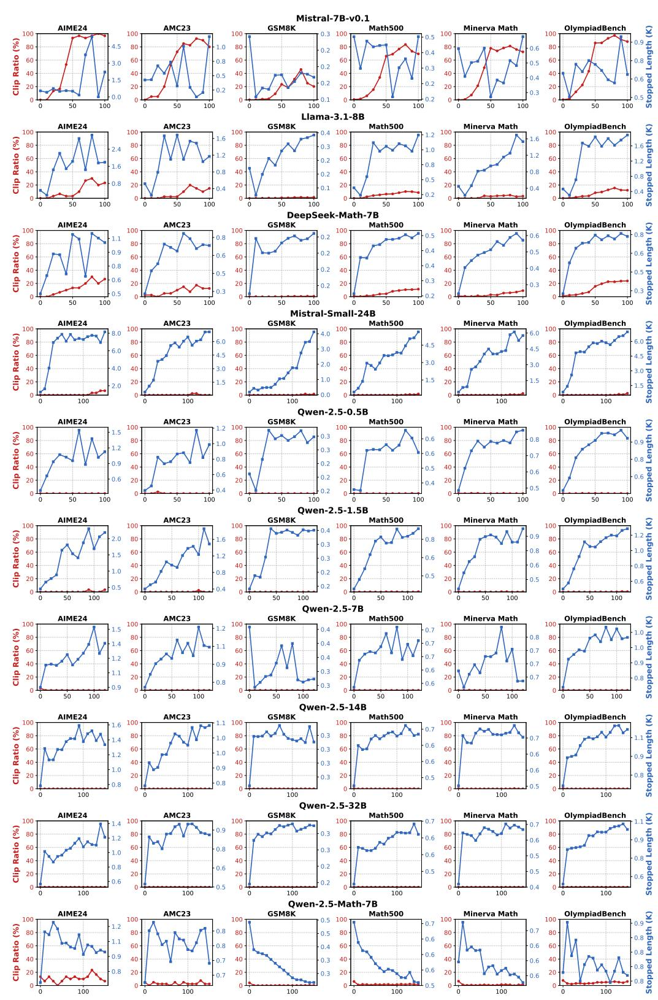
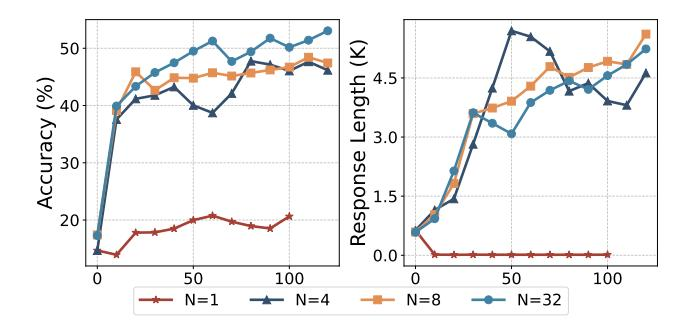
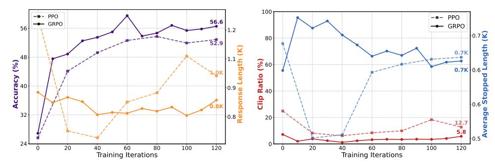
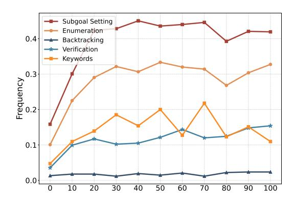
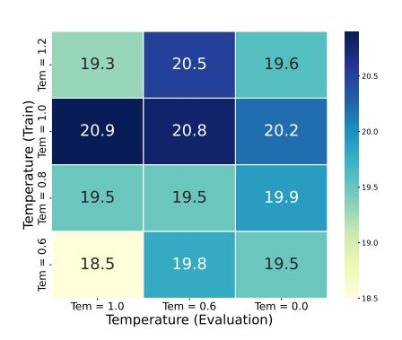

# **E Quantitative Behavior Validation**

We assess the consistency between GPT-4o labeled reasoning behaviors and human annotations by having human experts annotate 105 model outputs. Table [3](#page-19-1) below presents the prediction rates and agreement rate. The prediction rate reflects how frequently each reasoning behavior is identified, while the agreement rate is the proportion of data on which the labelers (Human and GPT-4o) make the same prediction.

> **[图片提取文字 (无描述)]:**
> Mistral-7B-v0.1 AIME24 GSM8K Math500 OlympiadBench AMC23 Minerva Math Accuracy (%) 6.0 4.5 4.0 2.0 4.0 3.0 Response 3.0 2.0 1.5 Llama-3.1-8B ength (K) AIME24 AMC23 GSM8K Math500 Minerva Math OlympiadBench Accuracy (%) 4.0 16 1.2 Response 2.0 0.8 0.8 DeepSeek-Math-7B GSM8K OlympiadBench AIME24 AMC23 Math500 Minerva Math 2.0 20 0.9 0.9 1.2 75 Accuracy (%) 0.8 1.6 16 0.2 0.6 0.6 8.0 0.2 0.5 0.5 0.6 0.2 Mistral-Small-24B AIME24 AMC23 GSM8K Math500 Minerva Math OlympiadBench Accuracy (%) 6.0 40 4.5 75 3.0 2.0 1.0 1.5 16 1.5 1.5 0.0 Qwen-2.5-0.5B Response Length (K) AIME24 AMC23 GSM8K Math500 Minerva Math OlympiadBench 1.2 Accuracy (%) 0.6 1.0 0.6 0.8 0.2 0.5 0.6 0.6 0.4 Qwen-2.5-1.5B 1.2 1.0 1.0 1.0 1.0 1.0 1.0 1.0 1.0 1.0 1.0 AIME24 AMC23 GSM8K Math500 Minerva Math OlympiadBench Accuracy (%) 0.6 0,5 Qwen-2.5-7B Length (K) AIME24 AMC23 GSM8K Math500 Minerva Math OlympiadBench 9 Accuracy (%) Qwen-2.5-14B GSM8K AIME24 AMC23 Math500 OlympiadBench Minerva Math 920 Accuracy (%) 816 821 1.0 9 0.9 0.8 0.7 0.7 1.0 90 0.6 30 0.9 87 0.5 0.3 0.8 85 ò Qwen-2.5-32B Response Length (K) AMC23 GSM8K Math500 OlympiadBench AIME24 Minerva Math Accuracy (%)
> 8 0.9 95 0.3 0.6 40 0.8 0.6 0.5 32 0.8 0.6 80 0.5 0.5 24 Qwen-2.5-Math-7B Response Length (K) GSM8K OlympiadBench AIME24 AMC23 Math500 Minerva Math 32 24 16 8 0.6 80 0.9 0.8 42 64 -8.0 0.7 36 0.5 0.7 24 0.7 30 0.6 24

Figure 11: A detailed evaluation of accuracy and response length throughout the training steps for various models. The x-axis represents the training steps, with the purple line showing the accuracy trend and the yellow line depicting the response length.

> **[图片提取文字 (无描述)]:**
> Mistral-7B-v0.1 AMC23 GSM8K AIME24 Math500 OlympiadBench Minerva Math Stopped Length (K) 0.3 0.5 Clip Ratio (% 0.6 0.2 0.8 0.5 0.2 0.3 0.5 0.4 0.2 0.2 0.3 Llama-3.1-8B Math500 1.6 1.2 Page 1.0.4 (K) 1.0.8 Page 1.0.4 (K) 1.0.8 Page 1.0.4 (K) 1.0.8 Page 1.0.4 (K) 1.0.8 Page 1.0.8 Page 1.0.8 Page 1.0.8 Page 1.0.8 Page 1.0.8 Page 1.0.8 Page 1.0.8 Page 1.0.8 Page 1.0.8 Page 1.0.8 Page 1.0.8 Page 1.0.8 Page 1.0.8 Page 1.0.8 Page 1.0.8 Page 1.0.8 Page 1.0.8 Page 1.0.8 Page 1.0.8 Page 1.0.8 Page 1.0.8 Page 1.0.8 Page 1.0.8 Page 1.0.8 Page 1.0.8 Page 1.0.8 Page 1.0.8 Page 1.0.8 Page 1.0.8 Page 1.0.8 Page 1.0.8 Page 1.0.8 Page 1.0.8 Page 1.0.8 Page 1.0.8 Page 1.0.8 Page 1.0.8 Page 1.0.8 Page 1.0.8 Page 1.0.8 Page 1.0.8 Page 1.0.8 Page 1.0.8 Page 1.0.8 Page 1.0.8 Page 1.0.8 Page 1.0.8 Page 1.0.8 Page 1.0.8 Page 1.0.8 Page 1.0.8 Page 1.0.8 Page 1.0.8 Page 1.0.8 Page 1.0.8 Page 1.0.8 Page 1.0.8 Page 1.0.8 Page 1.0.8 Page 1.0.8 Page 1.0.8 Page 1.0.8 Page 1.0.8 Page 1.0.8 Page 1.0.8 Page 1.0.8 Page 1.0.8 Page 1.0.8 Page 1.0.8 Page 1.0.8 Page 1.0.8 Page 1.0.8 Page 1.0.8 Page 1.0.8 Page 1.0.8 Page 1.0.8 Page 1.0.8 Page 1.0.8 Page 1.0.8 Page 1.0.8 Page 1.0.8 Page 1.0.8 Page 1.0.8 Page 1.0.8 Page 1.0.8 Page 1.0.8 Page 1.0.8 Page 1.0.8 Page 1.0.8 Page 1.0.8 Page 1.0.8 Page 1.0.8 Page 1.0.8 Page 1.0.8 Page 1.0.8 Page 1.0.8 Page 1.0.8 Page 1.0.8 Page 1.0.8 Page 1.0.8 Page 1.0.8 Page 1.0.8 Page 1.0.8 Page 1.0.8 Page 1.0.8 Page 1.0.8 Page 1.0.8 Page 1.0.8 Page 1.0.8 Page 1.0.8 Page 1.0.8 Page 1.0.8 Page 1.0.8 Page 1.0.8 Page 1.0.8 Page 1.0.8 Page 1.0.8 Page 1.0.8 Page 1.0.8 Page 1.0.8 Page 1.0.8 Page 1.0.8 Page 1.0.8 Page 1.0.8 Page 1.0.8 Page 1.0.8 Page 1.0.8 Page 1.0.8 Page 1.0.8 Page 1.0.8 Page 1.0.8 Page 1.0.8 Page 1.0.8 Page 1.0.8 Page 1.0.8 Page 1.0.8 Page 1.0.8 Page 1.0.8 Page 1.0.8 Page 1.0.8 Page 1.0.8 Page 1.0.8 Page 1.0.8 Page 1.0.8 Page 1.0.8 Page 1.0.8 Page 1.0.8 Page 1.0.8 Page 1.0.8 Page 1.0.8 Page 1.0.8 Page 1.0.8 Page 1.0.8 Page 1.0.8 Page 1.0.8 Page 1.0.8 Page 1.0.8 Page 1.0.8 Page 1.0.8 Page 1.0.8 Page 1.0.8 Page 1.0.8 Page 1.0.8 Page 1.0.8 Page 1.0.8 Page 1.0.8 Page 1.0.8 Page 1.0.8 Page 1.0.8 Page 1.0.8 Page 1.0.8 Page 1.0.8 Page 1.0.8 Page 1.0.8 Page 1.0.8 Page 1.0.8 Page 1.0.8 Page 1. AIME24 AMC23 GSM8K Minerva Math OlympiadBench 0.4 1.6 1.6 Clip Ratio (% 1.0 1.2 1.2 0.2 0.8 8.0 0.8 0.2 0.5 0.1 0.4 DeepSeek-Math-7B Math500 Stopped Length (K) AIME24 AMC23 GSM8K Minerva Math OlympiadBench 0.5 0.6 8.0 0.2 Clip Ratio (% 0.4 0.5 0.2 0.6 0.8 0.4 0.2 0.4 0.5 0.3 0.3 0.2 Mistral-Small-24B AIME24 GSM8K AMC23 Math500 Minerva Math OlympiadBench Stopped Length (K) 8.0 4.0 6.0 Clip Ratio (% 6.0 4.5 3.0 4.5 6.0 4.5 3.0 2.0 3.0 4.0 3.0 1.5 1.5 1.5 2.0 Qwen-2.5-0.5B GSM8K Stopped Length (K) AIME24 Math500 Minerva Math OlympiadBench 1.2 1.5 0.3 Clip Ratio (% 0.6 0.8 0.3 0.7 0.8 0.2 0.5 0.6 0.6 0.2 0.6 0.4 Qwen-2.5-1.5B 2tobbed Length (K) AIME24 AMC23 GSM8K Math500 OlympiadBench Minerva Math Clip Ratio (%) 0.9 0.8 0.3 0.8 1.2 0.6 0.3 0.6 1.0 0.8 0.2 0.5 0.5 Qwen-2.5-7B Stopped Length (K) AIME24 AMC23 GSM8K Math500 Minerva Math OlympiadBench 1.2 1.5 0.4 0.7 Clip Ratio (% 0.8 0.4 0.7 0.7 0.4 0.7 0.9 0.7 0.9 0.6 0.3 8.0 0.8 Qwen-2.5-14B AIME24 GSM8K Stopped Length (K) AMC23 Math500 Minerva Math OlympiadBench 0.7 Clip Ratio (%) 0.7 0.6 0.3 1.0 0.6 0.6 0.3 0.9 1.0 0.6 0.3 0.5 8.0 0.8 0.5 0 -Qwen-2.5-32B Math500 AIME24 AMC23 GSM8K Minerva Math OlympiadBench Stopped Length (K) 0.7 100 1.4 0.7 Clip Ratio (%) 0.9 0.3 0.6 0.6 0.8 0.3 0.6 0.5 0.2 0.8 0.6 0.5 0.5 0.6 0 -0.4 Qwen-2.5-Math-7B Math500 OlympiadBench AIME24 AMC23 GSM8K Minerva Math Stopped Length (K) 0.5 100 0.7 1.2 Clip Ratio (%) 0.7 8.0 0.5 0.6 0.6 0.4 0.6 0.9 0.3 0.6 0.6 0.3 0.7 0.6 0 -

Figure 12: A detailed evaluation of clip ratio and stopped length throughout the training steps for various models. The x-axis represents the training steps, with the red line showing the clip ratio trend and the blue line depicting the average stopped length.

| Behavior        | Score by GPT-4o (%) | Score by Human (%) | Raw Agreement (%) |
|-----------------|---------------------|--------------------|-------------------|
| Verification    | 78.10% (82/105)     | 85.71% (90/105)    | 90.48% (95/105)   |
| Backtracking    | 33.33% (35/105)     | 35.24% (37/105)    | 98.10% (103/105)  |
| Subgoal Setting | 66.67% (70/105)     | 74.29% (78/105)    | 90.48% (95/105)   |
| Enumeration     | 61.90% (65/105)     | 63.81% (67/105)    | 94.29% (99/105)   |

Table 3: The consistency between GPT-40 labeled reasoning behaviors and human annotations

| Init Model | GSM8K | MATH 500 | Minerva Math | Olympiad Bench | AIME24 (pass@1) | AMC23 | Avg. |
|------------|-------|-------------|-----------------|-------------------|--------------------|-------|------|
| 0 Step     | 92.0  | 70.6        | 36.8            | 36.6              | 16.7               | 45.0  | 49.6 |
| 10 Step    | 93.0  | 69.4        | 39.7            | 32.3              | 10.4               | 44.1  | 48.2 |
| 20 Step    | 92.6  | 65.2        | 34.2            | 30.7              | 6.7                | 38.4  | 44.6 |
| 200 Step   | 90.3  | 59.0        | 31.6            | 23.3              | 2.1                | 26.9  | 38.9 |
| 1000 Step  | 88.9  | 48.8        | 27.6            | 20.7              | 2.5                | 18.1  | 34.4 |
| 2000 Step  | 89.8  | 49.0        | 23.2            | 18.1              | 0.8                | 20.3  | 33.5 |
| 4000 Step  | 87.7  | 52.0        | 23.5            | 17.2              | 2.1                | 21.6  | 34.0 |

Table 4: Experimental results from multiple Mistral-Small-24B models, each fine-tuned with a different number of SFT steps on a general SFT dataset for RL. The "number of steps" refers to the number of SFT steps applied. The reported benchmarks reflect the performance metrics on various evaluation benchmarks, measured using the model that achieved the best average performance after 100 iterations of reinforcement learning training.

Our results indicate a generally good level of agreement between GPT-40 and human annotations. However, GPT-40 tends to be more conservative when labeling certain behaviors such as Verification and Subgoal Setting. Upon closer examination, we observe that in cases with long CoT containing multiple reasoning behaviors, the model often favors labeling more obvious behaviors like Enumeration, while overlooking subtler ones.

### F Impact of General SFT on the Performance of Reinforcement Learning

We also investigated the general SFT setting beyond math-related datasets. In this setup, we first conducted SFT on Mistral-Small-24B using the widely adopted OpenHermes-2.5 dataset.3 We implement with LLaMA-Factory (Zheng et al., 2024) and adopt common hyperparameters of SFT, including 512 examples per batch with a constant learning rate of 1e-5. For consistency with our other experiments, we fine-tuned the model using the Qwen chat template. After SFT, we preserved multiple checkpoints at different training steps, and nearly 800 steps correspond to 1 epochs on the SFT dataset. We then performed reinforcement learning on these models using identical hyperparameters as in our zero-RL training experiments.

Table 4 presents our findings, with performance reported as the best results achieved during RL training up to 100 iterations. The results demonstrate an inverse relationship between SFT steps and subsequent RL performance: models with more SFT steps showed diminished performance after RL training. While the average performance after 10 SFT steps remained comparable to the base model, it still exhibited some negative effects. More significantly, models with more than 20 steps showed substantially reduced RL potential. Therefore, we conclude that RL training produces the best performance gain when applied directly to the base model without any supervised fine-tuning, i.e., the zero RL training.

&lt;sup>3https://huggingface.co/datasets/teknium/OpenHermes-2.5

> **[图片提取文字 (无描述)]:**
> Length (K) 50 Accuracy (%) 3.0 Response 1.5 20 0.0 100 100 50 N=1N=4 N=32 N=8

Figure 13: Comparison of accuracy and response length using different sampling numbers N = 1, 4, 8, 32. The training data is the Hard part (MATH lv.3–5) with the same setting in main results, as described in § 2.1.

### G Impact of Exploration-Related Hyperparameters

In this section, we examine the effects of exploration-related hyperparameters on "zero-training." Drawing inspiration from Zeng et al. (2025b); Liu et al. (2024), we focus on two key factors: sampling size (the number of responses per query) and sampling temperature.

**Sampling Size:** We examine how varying sampling sizes  $N \in \{1, 4, 8, 16, 32\}$  influence the training process using the Mistral 24B model; these results are presented in Figure 13. Our analysis reveals a clear trend: as N increases, the model's average performance notably improves, and variability in response lengths becomes significantly more stable. For example, after 100 training steps, the scenario with N=32 achieves an average accuracy approximately 6 points higher than that with N=8. Conversely, smaller sampling sizes (N=1 and N=4) cause training instability and potential collapse, indicated by rapid growth in generated length without corresponding accuracy improvements. We hypothesize that larger sample sizes enable the model to explore a broader and more diverse training space, which stabilizes advantage estimation and sustains continuous performance improvement.

Sampling Temperature: We conduct research on Qwen-2.5-0.5B to analyze the impact of sampling temperature during both training and evaluation on model performance. The results, presented in Figure 16, indicate that training with higher temperatures generally leads to better average performance. For instance, models trained with temperatures of 1.0 and 1.2 outperform those trained with 0.8 and 0.6. Additionally, we find that the optimal evaluation temperature depends on the training temperature. Specifically, models trained at higher temperatures require higher sampling temperatures during evaluation, as using greedy sampling often results in repetitive outputs. Conversely, models trained at lower temperatures perform best when evaluated with lower sampling temperatures.

#### H SimpleRL-Zoo For Qwen2.5-Math-7B

In this section, we conduct experiments on Qwen2.5-Math-7B (Yang et al., 2024a) using the "hard part" data, as described in § 2.1, which consists of only 8K examples from MATH lv3-5. We apply both the PPO and GRPO algorithms to train our base model, and the overall evaluation results across training steps are shown in Figure 14. The final performance and response length for both algorithms converge to similar values, with GRPO slightly outperforming PPO. While the performance continues to improve, the response length does not exhibit a similar trend. Specifically, the stopping length for both algorithms remains relatively unchanged, and fluctuations in the average response length are primarily attributed to changes in the clip ratio. There are two main reasons for this behavior: First, the maximum context length for Qwen2.5-Math-7B is 4K, which is limited compared to other models with context lengths exceeding 8K, leading to a high clip ratio. Second, as a math-specific model, Qwen2.5-Math-7B already performs very well on MATH, the dataset

> **[图片提取文字 (无描述)]:**
> 100 -m - PPO --- PPO 56.6 - GRPO → GRPO 56 0.7 🔽 80 52.9 Accuracy (%) <del>8</del> 60 0.7K 0.6 Ratio 0.9 32 0.8 💆 20 24 40 60 80 Training Iterations 40 60 80 Training Iterations 20 40 80 100 120 80 100 120

Figure 14: Comparison of accuracy and response length between PPO and GRPO on Qwen2.5-Math-7B. The base model is trained using 8K examples from MATH lv3-5, with the same settings described in § 2.1.

we used for training, so it may not face enough challenge to further extend its response length. Therefore, we hypothesize that more challenging data might be needed to push this capable model further.

### I Reasoning Behavior Analysis

We apply Gandhi et al. (2025)'s cognitive behavior framework to perform a detailed analysis of how model reasoning behaviors change during "zero training." We first describe our analysis setup, then compare reflection keyword tracking against this framework to monitor reflective behaviors. Finally, we use case studies to illustrate how the reasoning behaviors of various models evolve during training.

#### I.1 Setup

We use GPT4-o to identify and analyze the following key reasoning behaviors exhibited in the model's responses, with the prompt shown in Figure 17:

- (1) **Backtracking**: The model actively identifies errors during response generation and explicitly revises previously used methods.
- (2) **Verification**: The model systematically checks intermediate results to ensure correctness.
- (3) **Subgoal Setting**: The model decomposes complex problems into smaller, manageable steps.
- (4) **Enumeration**: The model exhaustively considers multiple cases or possibilities to solve problems.

Note that we replaced "Backward Chaining" with "Enumeration," as the former was not relevant to our task.

#### I.2 Comparison of Different Reasoning Behavior Tracking Methods

Using DeepSeek Math's "zero-training" process as an example, we compare two different methods for monitoring reasoning behavior. The first method tracks the occurrence of specific keywords in the model's responses, such as "recheck," "rethink," "try again," "wait," "alternatively," "retry," and "however." The second method employs (Gandhi et al., 2025)'s cognitive framework for evaluation. Figure 15 illustrates the observed changes in reasoning behavior according to these two approaches. During the training process, we observe that the proportion of specified keywords in the DeepSeek math model's responses remains consistently low, exhibiting minimal variation. Conversely, reasoning behaviors identified by the cognitive framework demonstrate a significant upward trend.

> **[图片提取文字 (无描述)]:**
> Subgoal Setting Enumeration 0.4 Backtracking Verification Keywords Frequency 5.0 5.0 0.1 0.0 0 10 20 30 40 50 60 70 80 90 100

Figure 15: Changes in reflection behavior identified by different methods.

> **[图片提取文字 (无描述)]:**
> Tem = 1.2 20.5 19.3 19.6 20.5 Temperature (Train) Tem = 0.8 Tem = 1.0 20.9 20.2 20.8 20.0 19.5 19.5 19.5 19.9 Tem = 0.6 -19.0 19.8 18.5 19.5 -18.5 Tem = 0.6Tem = 1.0Tem = 0.0Temperature (Evaluation)

Figure 16: Impact of training and evaluation temperatures on Qwen-2.5-0.5b's average final performance (x-axis: evaluation temp, y-axis: training temp).

To understand this intriguing discrepancy, we manually review the reasoning behaviors recorded by the cognitive framework. Our analysis reveals that many of these reasoning behaviors do not necessarily involve the predefined keywords. For instance, in Figure 18, the observed reasoning behaviors include Verification and Backtracking, neither of which contains the specified keywords. This indicates that keywords alone cannot effectively distinguish or capture the nuanced differences between such behaviors. Similarly, in Figure 19, the reasoning process involves implicit verification steps, including recalculating intermediate results such as the dot product and magnitudes before determining the cosine of the angle. Again, these subtle verification steps are not represented by the designated keywords. In Figure 21, the reasoning involves considering multiple possible scenarios or outcomes. This type of exploratory reasoning is also inadequately captured by keyword-based approaches. These examples collectively illustrate that relying solely on keyword presence is insufficient for accurately identifying and differentiating complex reasoning behaviors within model responses.

#### I.3 Reasoning Behavior Variations Across Different Models

We present cases illustrating notable improvements in model reasoning behavior during training (Figure 5). Specifically, these improvements are demonstrated in the following models: Mistral 24B (Figure 22 and Figure 23), Qwen 2.5-0.5B (Figure 24, Figure 25 and Figure 26), Qwen 2.5-1.5B (Figure 27 and Figure 28), DeepSeek-math-7B-base (Figure 18, Figure 19, Figure 20 and Figure 21), and Llama 3.1-8B (Figure 29 and Figure 30).

