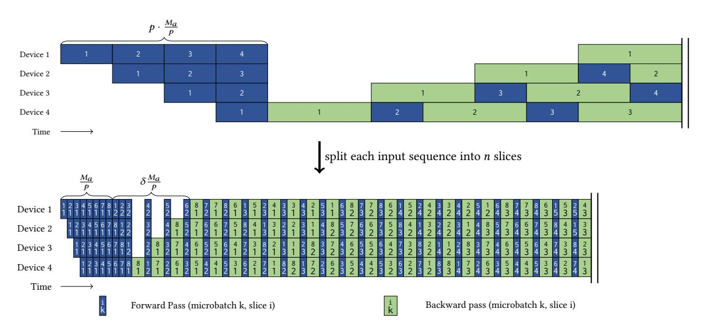
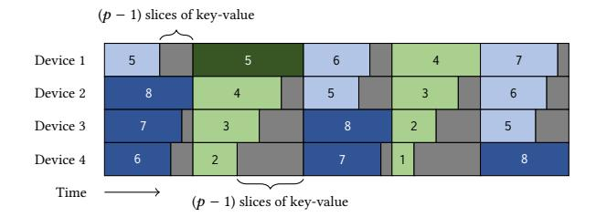

# 2.2 Pipeline Parallelism

Pipeline Parallelism [\[9,](#page-10-1) [12,](#page-11-2) [17,](#page-11-16) [22,](#page-11-3) [26](#page-11-17)[–28,](#page-11-5) [33,](#page-11-7) [34\]](#page-11-6) splits a model across its layers, assigning distinct layers to different devices for simultaneous processing. However, this method can result in bubbles, which are caused by uneven workload distribution or periods of inactivity while waiting for gradient synchronization. To mitigate the problem of bubbles in pipeline parallelism, several studies have investigated solutions focusing on asynchronous updates. However, it carries the potential risk of affecting model performance. In this paper, we only consider synchronous pipeline parallelism .

Memory Consumption. GPipe [\[12\]](#page-11-2) requires accumulating the activations for all microbatches until the backward pass is completed for the first microbatch, leading to high peak memory consumption. Terapipe [\[22\]](#page-11-3) exploits the autoregressive nature of LLMs through its token-level scheduling, but it inherits GPipe's critical memory limitation: accumulating all activations throughout the pipeline.

PipeDream-Flush [\[27\]](#page-11-4) and DAPPLE [\[9\]](#page-10-1) introduces the 1F1B pipeline schedule, which divides each iteration into three phases: warm-up phase, steady phase, and cool-down phase. The warm-up phase aims to bring all pipeline devices into a working state. To ensure the availability of backward operations, activations generated during the warm-up phase are accumulated. Subsequently, all pipeline devices enter the 1F1B state during the steady phase, where the number of activations consumed by backward is equal to the number of activations produced by forward, thus maintaining

Table 2: Comparison between pipeline schemes.

| Pipeline Scheme                   | Activation Memory              |     | Bubble Fraction                                     |     |  |
|-----------------------------------|--------------------------------|-----|-----------------------------------------------------|-----|--|
| GPipe                             | 𝑚 𝑝                         | ↑↑  | 𝑝 − 1 𝑚                                          | –   |  |
| TeraPipe                          | 𝑚 𝑝                         | ↑↑  | 𝑝 − 1 𝑛𝑚                                         | ↓↓  |  |
| PipeDream-Flush (default 1F1B) | 1                              | –   | 𝑝 − 1 𝑚                                          | –   |  |
| Interleaved 1F1B                  | 𝑝 − 1 1 + 𝑣𝑝             | ↑   | 𝑝 − 1 𝑣𝑚                                         | ↓↓  |  |
| ZB-V                              | 1                              | –   | 2(𝑝 − 1)   † 0, 3𝑚                   | ↓   |  |
| V-Half                            | 1 1 + 2 𝑝          | ↓   | 1 𝑝 𝑝   † , + 2𝑚 3 2𝑚 | ↑   |  |
| SlimPipe                          | 1 2(𝑝 − 1) + 𝑝 𝑛𝑣𝑝 | ↓↓↓ | 𝑝 − 1 < ‡ 𝑛𝑣𝑚                              | ↓↓↓ |  |

† It increases with longer context length and the upper bound is approximate.

stable device memory usage. This results in an accumulation of microbatch activations. Although the 1F1B schedule eliminates the dependence of activation accumulation on , it fails to achieve inverse scaling with increasing . In contrast, SlimPipe attains nearzero memory overhead, with activation memory consumption scaling inversely with .

Zero Bubble Pipeline Parallelism [\[33,](#page-11-7) [34\]](#page-11-6) introduces a novel V-shape pipeline schedule that effectively balances memory utilization across pipeline devices. Through the V-shape schedule, ZB-V maintains the same peak memory overhead as 1F1B, while V-Half and V-Min reduce the peak memory to 1/2 and 1/3 of that of 1F1B, respectively. However, the activation memory consumption remains a constant that does not decrease with increasing .

Bubble Fraction. Gpipe treats the entire computation of a microbatch across all layers in a pipeline stage as an atomic computation unit. This coarse granularity results in the pipeline stages experiencing significant warm-up bubbles.

To address the issue of bubble overhead, several works have approached the problem from both the model and input data perspectives. Instead of treating the entire batch as the computation unit, TeraPipe breaks down the computation into smaller units at the token level. This approach allows for more fine-grained scheduling and reduces the idle periods between pipeline stages. On the other hand, interleaved 1F1B [\[28\]](#page-11-5) builds upon the 1F1B schedule and approaches the problem from the model perspective. In interleaved 1F1B, each device can undertake computations for several discrete subsets of layers rather than a single continuous sequence of layers. SlimPipe synergistically combines fine-grained model and input data sharding to minimize warm-up bubble overhead. To address workload imbalance caused by causal attention among slices, we propose a novel context redistribution mechanism that dynamically balances computational load across pipeline stages, effectively eliminating imbalance bubbles.

It will be ( − 1) ( + 1) , with extremely long context length.

ZB-V [34] innovatively splits backward into two parts: one for input gradient and the other for parameter gradient, theoretically eliminating bubbles. However, assuming the forward, input gradient, and parameter gradient computation costs for a microbatch are  $T_f$ ,  $T_b$ , and  $T_w$ , respectively, bubbles can only be avoided if  $T_f = T_b = T_w$ , which is impossible for Transformer models with attention blocks. For attention block, theoretically,  $T_b = 2 \times T_f \gg T_w = 0$ . When accounting for modern optimizations like Flash Attention and the inherent MFU disparity between forward/backward passes, the situation further deteriorates. Given that the computational complexity of attention is quadratic with respect to context length, the attention component tends to dominate the entire training process in long-context scenarios. This leads to significant challenges for ZB-V in long context training.

In summary, SlimPipe outperforms other pipeline parallelism methods in terms of memory efficiency, achieving near-zero memory overhead. It also demonstrates excellent performance in reducing pipeline bubbles. The results are presented in Table 2. It is worth emphasizing that in long-context training, SlimPipe's advantages become even more pronounced.

#### 2.3 Activation Rematerialization

Activation Checkpointing [5, 18] is a memory optimization technique that reduces memory usage by strategically releasing activation. When applied across a sequence of layers, this method retains only the initial layer's input for the backpropagation. During the backward pass, intermediate outputs are recalculated as needed for gradient computation. This strategy significantly reduces the memory footprint of activations, thereby freeing up memory resources to accommodate larger models. Various instruments [2, 15, 30] automate the decision-making process, fine-tuning strategies to optimize runtime efficiency while staying within a predefined memory limit. Meanwhile, a recent work [48] introduces the concept of the Pareto frontier for activation checkpointing strategies in the context of LLM training. According to this approach, the strategy is developed by training models along the Pareto frontier, optimizing the trade-off between memory consumption and runtime efficiency.

**Activation Offloading** [38, 41], similar to activation checkpointing, is another memory optimization technique. It achieves memory savings by swapping activations that are temporarily not needed from device memory to host or NVMe memory, and then swapping them back to device memory when they are required.

## 3 Challenges in Long Context LLM Training

**Immense Memory Overhead.** Current training of long-context LLMs faces substantial memory pressure, which drives the need for hybrid parallelism. The memory pressure consists of model states due to the large model size and activations due to the long context. Taking a 70B parameter Llama model and 1M context length as an example, even when using full recomputing with t=8, the total activation memory consumption is 160 GiB, which far exceeds the 80 GiB memory limit of mainstream GPUs. The calculation is as follows: 1048576 (context length)  $\times$  8192 (hidden dimension)  $\times$  80 (number of layers)  $\times$  2 (bytes per *bfloat16*)  $\div$  8 (tensor parallelism size).

Limited Global Batch Size. Long context LLMs training maintains a relatively fixed global tokens size per iteration. This practice is to ensure the model performance. The concept of critical batch size has been introduced by [24]. Exceeding this size by inflating the global tokens size can result in excessive noise reduction, thereby adversely affecting the model's performance. This means that as the context length continues to increase, the global batch size will scale inversely. The reduction in global batch size directly decreases the number of microbatches (*m*), as evidenced by Table 2, which proportionally increases the warm-up bubble overhead.

**Imbalanced Model Partition.** The vocabulary size is essentially large in recent LLMs. For example, the Llama 3 [8] models have a vocabulary size of 128,000, and the Gemma [43] models even have one of 256,128. Most PP schemes simply assign the vocabulary to the last pipeline device. This sort of uneven model partitioning not only brings considerable memory overhead, but also creates substantial workload imbalance among PP devices.

#### 4 Methods

In this section, we delve into the particular methods used by SlimPipe. First, we introduce how fine-grained pipeline parallelism with *uniform slicing* saves both memory and warm-up bubble time. We also provide a theoretical analysis to reveal the characteristics of our newly designed pipeline scheme. Next, we discuss the issue of workload imbalance among pipeline devices due to uniform slicing and causal attention. After that, we demonstrate how *attention context exchange* addresses the issue of workload imbalance. Finally, we employ *vocabulary parallelism* to equally distribute the computation and memory of the output layer among pipeline devices.

#### 4.1 Pipeline Schedule with Uniform Slicing

4.1.1 Unifrom Slicing. Pipeline Parallelism [12, 26] accumulates several forward passes on each device to warm up the pipeline. These prefilled passes bring significant activation memory, especially on lower-rank devices of the pipeline. The long input sequence could be split into short slices to reduce the activation memory of each forward pass. And the straightforward approach to split a sequence is uniform slicing. However, the equal slice length will lead to unequal computation time between slices. The reason is the causal attention mechanism [22], by which a latter query attends to former keys and values, but not vice versa. We will discuss and solve this issue later in Section 4.2. Despite that issue, uniform slicing has the following substantial advantages over non-uniform slicing:

- The maximum amount of accumulated memory is better constrained.
- (2) The fixed slice length makes it more feasible for other techniques (e.g., context parallelism) to divide at the sequence dimension.
- (3) Slices are prevented from being too short to maintain sufficient arithmetic intensity.

4.1.2 Slice-wise Scheduling. Firstly, we split the input sequence into n equal-length slices, where n is a multiple of p. To effectively calculate the causal attention slice by slice, we deploy the KV cache technique [31]. Remarkably, the KV cache imposes no memory

> **[图片提取文字 (无描述)]:**
> Device 1 2 Device 2 2 Device 3 2 Device 4 2 Time split each input sequence into n slices  $\frac{M_a}{p}$  $\delta \frac{M_a}{p}$ Device 1 Device 2 Device 3 Device 4 Time Backward pass (microbatch k, slice i) Forward Pass (microbatch k, slice i)

Figure 4: The top figure shows the default 1F1B schedule. The bottom figure shows the SlimPipe schedule, where each microbatch is broken into multiple (in this case, 8) slices.  $M_a$  represents the total activation size of one microbatch. n and p indicate the number of slices per sequence and the PP size, respectively. The activation memory accumulated during the warm-up phase on device 1 reduces from  $M_a$  to  $(1+\delta)\frac{M_a}{p}$ , where  $\delta=2(p-1)/n$ . In the mean time, the warm-up bubble shrinks by about n times.

> **[图片提取文字 (无描述)]:**
> ∇ Figure 9 ∇ Figure 7 Device 2 Device 3 Device 4 Time Forward Pass (slice i, stage 2) Backward Pass (slice i, stage 1) Forward Pass (slice i, stage 1) Backward Pass (slice i, stage 2)

Figure 5: SlimPipe in its interleaving form. Each device is assigned 2 stages. Dark colors show the first stage and light colors show the second stage. For simplicity, the microbatch number is not labeled and the number in the box is the slice number. Note that there are only two microbatches in this pipeline, each split into 8 slices. Whereas in the classic interleaved 1F1B pipeline, at least 4 (the PP size) microbatches are required. More details are depicted in Figure 7 and Figure 9.

overhead on the accumulated activation. Because the keys and values are deliberately retained for gradient calculation in backward passes.

Next, we apply uniform slicing to the 1F1B pipeline scheme [26]. The 1F1B schedule is adopted with some vital adjustments. To perform backpropagation [39] for slices in one sequence, respectively, their backward passes are scheduled in reverse order of forward passes. Paired with this last-in first-out schedule, we release the corresponding portion of KV cache immediately once a backward pass is finished. This ensures that the crucial invariant of maximum accumulated memory is maintained through the 1F1B steady phase. In addition, we put more forward passes ahead to align forward and backward passes separately. The crafted pipeline scheme is depicted in Figure 4.

Furthermore, we smoothly extend our pipeline scheme to an interleaving form [28], by assigning multiple small stages to each

device. As illustrated in Figure 5, uniform slicing and stage interleaving synergize well with each other. The accumulated activations and warm-up bubbles are further reduced.

4.1.3 Theoretical Analysis. As annotated in Figure 4, although the number of forward passes in the warm-up phase is increased, the total accumulated activation is actually decreased. Given that n is equal to or greater than p, the total accumulated activation size

$$M_{acc} = (1+\delta)\frac{M_a}{p}, \quad \delta = \frac{2(p-1)}{n}$$
 (1)

is much smaller than  $M_a$ . It is even approaching  $M_a/p$  as n continues increasing, as if virtually divided by the PP size. Moreover, the bubble time during warm-up and cool-down phases is reduced by about n times. In fact, the bubbles shrink super-linearly due to the causal attention mechanism. As a result, the bubble fraction is less than  $\frac{p-1}{nm}$ . When attention dominates the computation time (with an extremely long context length), the bubble fraction

> **[图片提取文字 (无描述)]:**
> Activation Memory 1/4 p 2p 3p 4p 5p 6p Number of Slices

> **[图片提取文字 (无描述)]:**
> **Bubble Fraction** 1.6 m = 21.2 0.8 0.4 2p 3p 4p 5p 6p Number of Slices (p = 4)

(a) Activation memory reduced by SlimPipe across different PP sizes.

(b) Bubble fraction reduced by SlimPipe across different microbatch numbers. The PP size is fixed to 4

Figure 6: SlimPipe reduces both activation memory and bubble fraction. (a) The activation memories are equally large without uniform slicing (default 1F1B), and are decreasing from 1 towards 1/p separately as the number of slices increases. (b) The bubble fraction are quite large without uniform slicing (default 1F1B), and are decreasing to near-zero as the number of slices increases.

will become  $\frac{(p-1)p}{(n+1)nm}$ . Besides these benefits, the overall communication volume of default 1F1B has not been changed. The two significant characteristics of SlimPipe are depicted in Figure 6. With a fairly large value of n, the activation memory and bubble time are substantially reduced. In terms of the interleaving form, these two attributes will be further reduced by the number of stages v (formulas are listed in Table 2).

#### 4.2 Attention Context Exchange

> **[图片提取文字 (无描述)]:**
> (p-1) slices of key-value Device 1 Device 2 8 Device 3 Device 4 Time - 1) slices of key-value

Figure 7: A closer look at the SlimPipe timeline with imbalance bubble exhibited. The beginnings of passes are aligned across devices to clearly reveal the bubbles' shape. The actual timeline will be more elaborated with propagated bubbles.

4.2.1 Imbalance Bubbles. If we just split each sequence into equallength slices, the execution timeline will not be as ideal as depicted in Figure 5. Although we try to align each kind of passes across devices, bubbles arise and pervade between them, which is roughly sketched in Figure 7. These bubbles are caused by the uneven computation time of causal attention. As the query length is fixed by

| Device 1 | $Q_7, K_1, V_1   Q_7, K_2, V_2   Q_7,$       | , K 3 , V 3 Q 7 , K 4 , V 4 | $Q_7, K_5, V_5$ | Q 7 , K 6 , V 6 | Q 7 , K 7 , V 7 |
|----------|----------------------------------------------|------------------------------------------------------------------------------------|-----------------|--------------------------------------------------|--------------------------------------------------|
| Device 2 | $Q_6, K_1, V_1$ $Q_6, K_2, V_2$ $Q_6,$       | $, K_3, V_3   Q_6, K_4, V_4  $                                                     | $Q_6, K_5, V_5$ | Q 6 , K 6 , V 6 |                                                  |
| Device 3 | $Q_5, K_1, V_1 \mid Q_5, K_2, V_2 \mid Q_5,$ | $, K_3, V_3   Q_5, K_4, V_4  $                                                     | $Q_5, K_5, V_5$ |                                                  |                                                  |
| Device 4 | $Q_4, K_1, V_1 \mid Q_4, K_2, V_2 \mid Q_4,$ | , K 3 , V 3 Q 4 , K 4 , V 4 |                 |                                                  |                                                  |
| Device 5 | $Q_3, K_1, V_1   Q_3, K_2, V_2   Q_3,$       | , K 3 , V 3                                                  |                 |                                                  |                                                  |
| Device 6 | $Q_2, K_1, V_1   Q_2, K_2, V_2   Q_7,$       | $, K_6, V_6   Q_7, K_7, V_7$                                                       |                 |                                                  |                                                  |

Figure 8: The attention workloads are rebalanced by exchanging the context among pipeline devices. The local query and portions of the local key-value are sent to another device and the partial attention output will be sent back after the calculation being completed there.

uniform slicing, the computation time is in proportion to the length of attended key-value. Latter slices, attending to more KV cache, cost more time to compute in both forward and backward passes.

At a specific moment, the workloads across pipeline devices conform to an arithmetic progression. And the difference between the heaviest and the lightest is p-1 slices of key-value. The situation becomes worse at the juncture of two microbatches, where the workload difference could be as great as n-1. Devices processing with less KV cache finish their computation sooner, and have to wait for other devices to communicate with them. This waiting-time is a type of imbalance bubbles. Imbalance bubbles will propagate along pipeline devices in both directions and cross with each other, making the pipeline timeline quite irregular.

4.2.2 Exchange the Context. To eliminate these messy imbalance bubbles, we need to make the attention workload as equal as possible across devices. The essential condition is that all devices at one moment have equal computation time. Note that it does not require a uniform computation time across passes, which is otherwise required by TeraPipe. This essential condition allows us to redistribute the attention workload on the spot. As depicted in Figure 8, a device with more KV cache sends its query and portions of key-value to a device with less KV cache, and then the attention will be calculated there. The remotely calculated attention output will be sent back and merged with the locally calculated one via the online softmax method [25]. The attention workloads after redistribution become almost equal. The difference between them is at most one slice of key-value.

4.2.3 Communication Volume. We use the non-interleaving form of SlimPipe to demonstrate the communication volume of context exchange. The exchanged context is 1 slice of query (Q) and output (O) plus  $\lfloor (p-1)/2 \rfloor$  slices of key (K) and value (V), and the latter becomes  $\lfloor (n-1)/2 \rfloor$  slices at the microbatch juncture. The juncture period occupies p-1 out of n passes per microbatch. Generally, the unsliced query, key, value, and output all have the size  $M_h$ . So one slice of each from one device has the size  $\frac{L}{p} \cdot \frac{M_h}{n}$ . Finally, the total

volume of exchanged context per microbatch per device is

$$\Theta = \underbrace{\left(\underbrace{2n}_{Q+O} + \underbrace{2(n-p+1)\left\lfloor\frac{p-1}{2}\right\rfloor}_{K+V, \text{ not at junctures}} + \underbrace{2(p-1)\left\lfloor\frac{n-1}{2}\right\rfloor}_{K+V, \text{ at junctures}}\right) \underbrace{LM_h}_{pn}$$

$$\leq \left(2 - \frac{p-1}{n}\right) LM_h$$
(2)

The inequality originates from the round-down operation. This volume is at most 2ℎ, virtually independent from the PP size and number of slices. When applied to the interleaving form, context exchange gets a communication volume at the same degree.

