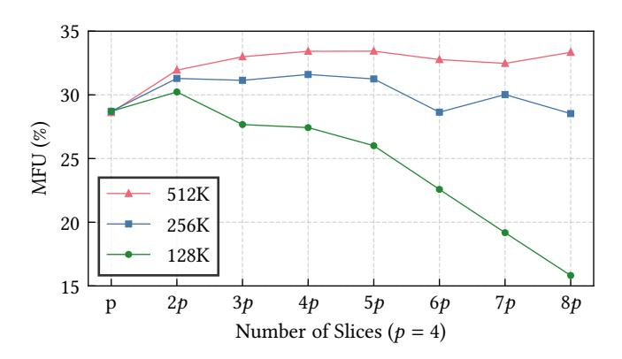
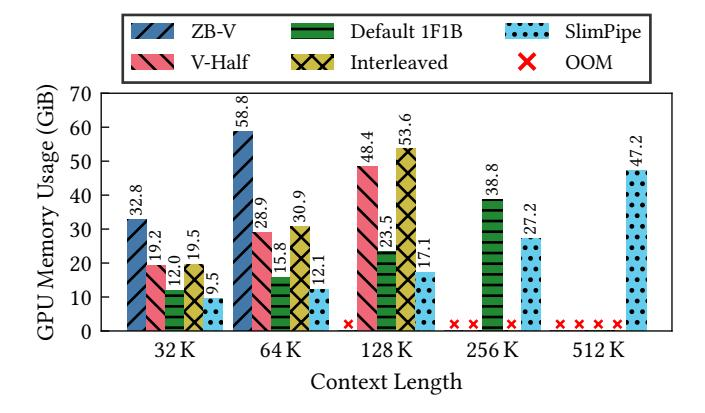

# 6.1 Experimental Settings

All experiments are conducted on a GPU cluster where each node is configured with two Intel Xeon Platinum CPUs and 1TB of memory. In each node, 8 NVIDIA Hopper 80GB GPUs are installed and interconnected via NVLink, whose bandwidth is 400GB/s per GPU. Besides that, every GPU is coupled with a 400Gbps NIC for

Table 3: Models used in evaluation.

| $\begin{array}{ c c c c c c c c c c c c c c c c c c c$ |    |    |   | h hidden dimension size $H$ FFN dimension size |       |                      |  |
|--------------------------------------------------------|----|----|---|------------------------------------------------|-------|----------------------|--|
| Model $ L a g h H$ #Parama                             |    |    |   |                                                |       |                      |  |
| Llama 13B                                              | 40 | 40 | - | 5120                                           | 13824 | $13.3 \times 10^{9}$ |  |
| Llama 70B                                              | 80 | 64 | 8 | 8192                                           | 28672 | $69.5 \times 10^9$   |  |
| Llama 149B                                             | 96 | 96 | 8 | 12288                                          | 32768 | $148.9 \times 10^9$  |  |
| Mixtral 8x7B                                           | 32 | 32 | 8 | 4096                                           | 14336 | $47.0 \times 10^{9}$ |  |
| Mixtral 8x22B                                          | 56 | 48 | 8 | 6144                                           | 16384 | $141.0 \times 10^9$  |  |

 $^\dagger$  Including parameters in the 128,000 sized vocabulary.

inter-node communication. Unless otherwise stated, TP, CP and EP should be deployed within a node, while PP and DP could be deployed across nodes. TP is always paired with SP.

Models of various architectures are used in evaluation. We select the Llama-like dense models and the Mixtral series MoE models. The specifications of the models are listed in Table 3. GQA [1] is applied to models except Llama 13B. In MoE layers, 2 out of 8 experts are routed for each token. The expert router is set to complete balance for performance measurement. Every model is coupled with a vocabulary of 128,000 entries. The training precision is *bfloat16* except that *float32* is used in loss calculation and gradient accumulation. The optimizer is Adam with *float32* internal states.

#### 6.2 Memory Saving

> **[图片提取文字 (无描述)]:**
> 60 GPU Memory Usage (GiB) 103.0/p (96 K) 50 78.0/p (64 K) 40 53.0/p(32 K)First PP device 30 Last PP device × 20 10 10 Pipeline Parallelism Size

Figure 10: The memory reduced by the PP size p. The measured values align well with our theoretical model.

We use a simple experiment to show how SlimPipe reduces the memory usage in training. We train the Llama 13B model with input sequence lengths of 32K, 64K and 96K. The TP size is 8 and the PP size increases from 2 to 8. The number of stages per device is set to L/p (i.e., maximum interleaving stages). We measure the memory usage of the first and the last pipeline devices, using the torch.cuda.max\_memory\_allocated method.

We draw the measured data as markers in Figure 10. We also draw a curve for each sequence length, whose formula is  $M_t/p$ , where  $M_t$  is the theoretical memory required to train the model without PP (only with 8-way TP). We use the memory modeling

method from previous works [19, 48]. As we can see, the memory usage for both devices decreases in close alignment with the theoretical curves. The total memory is nearly in an inverse proportional relationship to the PP size, as if distributed by PP. While classic PP distributes model states, SlimPipe additionally distributes activations. In particular, the activations of the output layer are also distributed, as evidenced by our measurements on the last device. The memory usage of the first device is slightly higher than that of the last device. The gap between them is formulated as  $2(p-1)M_a/nvp$ . We can claim that nearly all the memory used in LLM training is distributed in PP. The only existing technique that can achieve this is TP (with SP), but at significantly higher communication costs.

## 6.3 Insights into Slice Length

> **[图片提取文字 (无描述)]:**
> 35 30 MFU (%) 25 512K 20 256K 128K 15 2p3p5*p* 7*p* 8p 6*p* Number of Slices (p = 4)

Figure 11: MFU of training the Llama 13B model with different context lengths. The PP size is 4 and the numbers of slices increases from p to 8p.

As discussed in Section 4.1.1, fine-grained slicing can reduce the accumulated activations but also decrease the arithmetic intensity. So in this experiment, we will study how the value of n affects the training efficiency, and find an appropriate n for a given context length. We train the Llama 13B model with 2 microbatches per iteration. The three sets of input sequence lengths are 128K, 256K and 512K respectively. The parallelism configuration is 8-way TP combined with 4-way PP, and full checkpointing is enabled. The number of stages per pipeline device is 5, and the number of slices per sequence gradually increases from p to 8p. We use MFU to quantify the training efficiency.

As we can see in Figure 11, fine-grained slicing improves MFU initially (due to reduced bubbles) but harms it eventually (due to lower arithmetic intensity) as slices become shorter. The MFU of 128K context length drops sharply after n=2p, indicating that the arithmetic intensity is too weak. We also see that the transition point of n comes later for a longer context length. MFU of the 512K context length remains high even with 32 slices per sequence. In conclusion, we should choose a moderate value of n to maintain the training efficiency while saving memory.

> **[图片提取文字 (无描述)]:**
> DeepSpeed Megatron-LM No Configuration X SlimPipe OOM Mixtral 8x22B Llama 70B Llama 149B Mixtral 8x7B 1.19× 1.26× 1.36× 1.13× 128  $-1.32 \times$ 1.57× 1.03× 1.06× 1.02× 1.24× 1.03× MFU (%) #GPUs 3PUs = 256 MFU (%) 1.12× 1.15× 1.53×  $-1.45 \times$ 1.11× 1.43× 1.40×  $1.05 \times 1.08 \times 1.32 \times$  $1.08 \times$ 1.04× 1.09× 1.06× #GPUs 512  $1.20 \times$ 1.14× 1.25× -1.39× 1.45× 1.36× 1.40× 1.42× 1.41× 40 1.19× 1.09× 1.08× 1.11× 1.10× 1.04× MFU (%) #GPUs 64 K 128 K 256 K 512 K 64 K 128 K 256 K 512 K 64 K 128 K 256 K 512 K 64 K 128 K 256 K 512 K Context Length Context Length Context Length Context Length

Figure 12: System performance comparison between DeepSpeed, Megatron-LM, and SlimPipe across different models and GPU counts. The annotations above the bars for SlimPipe represent its relative speedup over Megatron-LM. A green triangle marker indicates that no viable configuration could be found under this condition, and a red cross indicates that all candidate configurations results in an Out-Of-Memory (OOM) error.

## 6.4 End-to-End Performance

When SlimPipe is integrated into a hybrid parallelism training system, it could introduce new optimization opportunities to other techniques. For example, the GPU memory saving could avoid the use of full checkpointing, thus increasing the system efficiency. In the main course, we compare the system performance between Megatron-LM and SlimPipe. For clarity, we refer to the baseline system with interleaved 1F1B PP as Megatron-LM, and the system with our innovative PP as SlimPipe. Prevalent parallelism techniques (TP, CP, EP, DP, and PP) are organically composed in both systems. The activation saving techniques mentioned in Section 5 are applied uniformly, while full or selective checkpointing [19, 48] is enabled on their demand. The selective checkpointing implemented by us just recomputes the up projection plus SwiGLU in an MLP layer. DeepSpeed [37] is also involved and is equipped with its Zero Redundancy Optimizer [36] and Ulysses Parallelism (UP). To exhibit the best performance of each system, their hybrid parallelism configurations are baked through grid search.

We select 4 models covering dense and MoE architectures, in various sizes. The input sequence length extends from 64K to 512K. The per-iteration token size is fixed to 4M, which means that there are fewer microbatches when the sequence length is longer. The total number of GPUs scales from 128 to 512. The comprehensive benchmark results are shown in Figure 12. SlimPipe outperforms the other two systems in training efficiency through all models, context lengths, and number of GPUs.

**Difference in Context Lengths.** SlimPipe demonstrates increasingly significant advantages when training with longer context

lengths. Extended contexts inherently demand greater activation memory consumption and incur more significant warm-up bubbles. As previously discussed, SlimPipe's fine-grained schedule minimizes bubbles overhead, thereby delivering substantial efficiency benefits. Moreover, leveraging its memory-thrifty design, which substantially reduces activation storage requirements, we maintain training efficiency without resorting to full checkpointing or expensive cross-node TP/CP communication. In contrast, the other two approaches progressively adopt inefficient full checkpointing and expensive cross-node communication as context lengths grow, ultimately encountering out-of-memory failures in many cases. For example, in the 512K context length scenario with 128 GPUs, SlimPipe achieves a 1.57× speedup over Megatron-LM when training Mixtral 8x7B. Meanwhile, it maintains high efficiency on other larger models, while Megatron-LM encounters OOM issues.

Difference in Scalability. DeepSpeed fails to run with a 512K context length on a total of 128 GPUs (no viable configuration), because the batch size 8 is not enough for a larger DP size. It cannot enlarge the UP size because there are only 8 query groups. This limitation of DeepSpeed becomes severer if running on more GPUs. When scaling to 512 GPUs, systems have to expand their DP size to saturate this amount of GPUs. A larger DP size leads to fewer microbatches, and thus to a shorter steady phase in the pipeline. Consequently, a larger bubble fraction hinders the scalability of Megatron-LM. Furthermore, if the DP size continues expanding, the number of microbatches left in PP will become even less than the PP size, breaking the minimum requirements by the interleaved 1F1B scheme. This fatal limitation prevents Megatron-LM from

scaling to more GPUs. In contrast, SlimPipe maintains quite high training efficiency with as few as 2 micorbatches in PP, because it effectively reduces the warm-up bubbles by fine-grained slicing.

**Difference in Models.** SlimPipe's advantages become increasingly pronounced with larger-scale models. For both dense and MoE architectures, SlimPipe demonstrates superior performance as model size grows. Crucially, SlimPipe eliminates the need for either full checkpointing or costly cross-node communication during large-model training. For example, in the 512 GPUs, 512K context length scenario, SlimPipe achieves a 1.41× speedup on the 8x22B model, while it only achieves a 1.04× speedup on the 8x7B model. This scalability advantage suggests that SlimPipe's performance lead over alternative systems would further widen with even larger models.

In a nutshell, SlimPipe demonstrates its outstanding aptitude to train long-context LLMs at any scale.

#### 6.5 Ultra Long Context

Table 4: System performance of training 4 LLMs with the maximum supported context length, by using at most 256 GPUs. The selective checkpointing is enabled uniformly while the offloading ratio is adaptive.

| Model                      | Context | t | с  | e | d | р  | n          | offload | MFU   |
|----------------------------|---------|---|----|---|---|----|------------|---------|-------|
| Llama 70B Llama 149B    | 2048K   | 4 | 4  | _ | 1 | 16 | 4 <i>p</i> | 75%     | 45.0% |
| Llama 149B                 | 1024K   | 4 | 2  | - | 1 | 32 | 2 <i>p</i> | 80%     | 43.7% |
| Mixtral 8x7B               | 4096K   | 1 | 16 | 8 | 1 | 16 | 4p         | 95%     | 40.0% |
| Mixtral 8x22B † | 2048K   | 1 | 8  | 8 | 1 | 28 | 4p         | 100%    | 42.0% |

† 224 GPUs are actually used because of the PP size 28.

512K context is not the very limit of SlimpPipe. To explore the extensibility of SlimPipe, we integrate the pipeline-parallelism-aware offloading [48] into our system. This technique saves GPU memory by transferring portions of the activations to the host memory. We train 4 large models with 16M tokens per iteration and extend the context length to the maximum supported by our system on 256 GPUs. The system configurations just follow those of Section 6.4, with an additional offload ratio.

The results in Table 4 show that SlimPipe maintains its high efficiency when training with spectacular context lengths. With the help of offloading, SlimPipe pushes the boundary of context length to an astonishing 4096K in training Mixtral 8x7B. It also delivers a remarkable MFU as high as 45.0% in training Llama 70B. Now we can say with confidence that we realize the ambitious goal of training LLMs with ultra long context.

## 6.6 Comparison of Pipeline Schemes

The dessert is a comparison between pipeline schemes on training LLMs with long context length. The model is Llama 13B and the per-iteration batch size is 4. The input sequence length increases from 32K to 512K. 8-way TP and full checkpointing are used to reduce the memory pressure. The number of stages per device is set to 5 for both interleaved 1F1B and SlimPipe. The number of slices is fixed to 4 for SlimPipe. The ZB-V and V-Half schemes use *float16* in place of *bfloat16*, for the latter is not yet supported.

> **[图片提取文字 (无描述)]:**
> ZB-V → Default 1F1B SlimPipe V-Half Interleaved 30 25 MFU (%) 20 15 10 32 K 64 K 128 K 256 K 512 K Context Length

Figure 13: Comparison of MFU across different PP schemes.

> **[图片提取文字 (无描述)]:**
> Default 1F1B SlimPipe ZB-V V-Half Interleaved OOM 70 GPU Memory Usage (GiB) 58.8 60 50 38.8 32.8 40 30 20 10 32 K 64 K 128 K 256 K 512 K Context Length

Figure 14: Comparison of GPU memory usage across different PP schemes.

The MFUs are drawn as dots in Figure 13, and the memory consumptions are drawn as bars in Figure 14. The ZB-V scheme goes out of memory quite early. It decouples the backward passes of inputs and weights and rearranges them in the pipeline schedule. Its built-in full checkpointing implementation does not work properly in this scheme. This flaw also restricts the maximum context length supported by the V-Half, which is designed to accumulate half the activations of the ZB-V. These V-shaped schemes both suffer from imbalance bubbles, caused by the diverged computation time of two decoupled backward passes. Although the default 1F1B sustains a fairly long context length of up to 256K, its efficiency is quite low due to relatively large warm-up bubbles. The interleaved 1F1B shows a competitive efficiency with short context lengths, but is still confined by its considerable memory overhead. SlimPipe delivers higher efficiency than others through all context lengths, demonstrating its outstanding ability to reduce both memory usage and pipeline bubbles.

#### 7 Conclusions

This paper introduces SlimPipe, a fine-grained pipeline parallelism with uniform slicing. Firstly, SlimPipe leverages uniform slicing to reduce GPU memory usage for activations proportionally as

the PP size increases. Additionally, this fine-grained pipeline parallelism schedule reduces bubbles during the warm-up and cooldown phases. Furthermore, we found that uniform slicing, due to the presence of causal attention, leads to workload imbalance between different slices. To avoid pipeline bubbles introduced by imbalanced workload, SlimPipe incorporates an attention context exchange mechanism. Our experiments demonstrate that SlimPipe can outperform state-of-the-art training systems.

