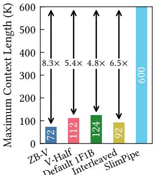
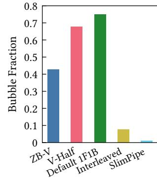

# SlimPipe: Memory-Thrifty and Efficient Pipeline Parallelism for Long-Context LLM Training

Zhouyang Li\*, Yuliang Liu\*†, Wei Zhang, Tailing Yuan, Bin Chen, Chengru Song, and Di Zhang

Kuaishou Technology Beijing, China

#### **Abstract**

Pipeline Parallelism (PP) serves as a crucial technique for training Large Language Models (LLMs), owing to its capability to alleviate memory pressure from model states with relatively low communication overhead. However, in long-context scenarios, existing pipeline parallelism methods fail to address the substantial activation memory pressure, primarily due to the peak memory consumption resulting from the accumulation of activations across multiple microbatches. Moreover, these approaches inevitably introduce considerable pipeline bubbles, further hindering efficiency.

To tackle these challenges, we propose SlimPipe, a novel approach to fine-grained pipeline parallelism that employs uniform sequence slicing coupled with one-forward-one-backward (1F1B) schedule. It reduces the accumulated activations from several microbatches to just one, which is split into several slices. Although the slices are evenly partitioned, the computation cost is not equal across slices due to causal attention. We develop a sophisticated workload redistribution technique to address this load imbalance. SlimPipe achieves (1) near-zero memory overhead and (2) minimal pipeline bubbles simultaneously. The effectiveness of SlimPipe has been proven by thorough testing with diverse model architectures, context window sizes, and SlimPipe-specific configurations. For example, compared to state-of-the-art methods, SlimPipe significantly boosts the Model FLOPs Utilization (MFU) to up to 1.57×. More notably, on Llama 70B with a context length of 2048K, it maintains over 45% MFU on 256 NVIDIA Hopper 80GB GPUs.

#### 1 Introduction

Autoregressive large language models, such as Llama [44, 45], Gemini [42], GPT [4], and Mixtral [16], have achieved dominant performance in many NLP tasks. At the same time, an increasing number of studies have found that context length plays a significant role in model applications, such as multi-turn dialogue and long-context understanding. However, as the model size and context length continue to grow, the storage requirements far exceed the capacity of modern accelerators. This memory demand comprises two primary components: (1) *model states*, including parameters, gradients, and optimizer states, which scale proportionally with model size, and (2) *activations*, whose memory footprint grows linearly with context length.

Pipeline Parallelism has become an indispensable component in hybrid parallelization strategies for training LLMs due to its ability to mitigate memory pressure from model states while maintaining

> **[图片提取文字 (无描述)]:**
> Model Activation 8 Classic PP SlimPipe 16 GPU Memory Usage

Figure 1: Comparison of GPU memory footprint between Classic PP [12, 22, 27, 28, 34] and SlimPipe across various pipeline parallelism sizes. While both approaches consume identical GPU memory for model parameters, SlimPipe's activation memory decreases proportionally as pipeline parallelism size increases, in contrast to Classic PP's constant

> **[图片提取文字 (无描述)]:**
> Maximum Context Length (K) 8.3× 5.4× 4.8× 6.5× V-Half 1F1B Default Interleased Slimpipe

activation memory requirements.

> **[图片提取文字 (无描述)]:**
> 0.8 0.7 0.6 **Bubble Fraction** 0.5 0.4 0.3 0.2 0.1 V-Half 1F1B V-Half 1F1B Default Interleased SlimPipe

Figure 2: Maximum context lengths supported by different PP schemes in training Llama 7B with 8-way TP and 8-way PP.

Figure 3: Theoretical bubble fractions of different PP schemes (PP size 8) in training Llama 13B with 4 microbatches and a 256K context length.

relatively low communication overhead. However, existing PP approaches exhibit significant limitations in handling the memory pressure caused by activations, which scales with context lengths. As illustrated in Figure 1, while the memory footprint of the model states decreases as the size of the PP increases, the activation memory remains constant. This limitation poses substantial challenges

\*Equal contribution.

&lt;sup>†Corresponding author: Yuliang Liu liuyuliang@kuaishou.com>.

for exploring long-context models. For instance, as shown in Figure [2,](#page-0-1) even with maximal TP utilization within NVLink domains, the maximum viable context length for Llama 13B models is limited to 124K. Further context length expansion requires either memorycomputation trade-offs through activation recomputing or sequence partitioning across nodes with low communication bandwidth, both of which significantly compromise training efficiency.

Beyond memory constraints, pipeline bubbles present another critical challenge in long-context scenarios. Both the 1F1B schedule [\[9,](#page-10-1) [27\]](#page-11-4) and its interleaved variant introduce warm-up bubbles due to the necessity of forward warm-up phases to fill the pipeline and corresponding backward cool-down phases before synchronization. In long-context settings, limited global batch sizes exacerbate the relative impact of these warm-up bubbles. ZB-V [\[33,](#page-11-7) [34\]](#page-11-6) addresses this issue by decoupling the computations of the activation gradient ( ) and the weight gradient () in the backward pass. When = = , where represents the forward computation time, ZB-V can achieve zero bubble. However, the time differences among , , and can be substantial. For instance, the core attention operation, which lacks weights, implies = 0, while is also significantly larger than . This difference introduces imbalance bubbles. The issues related to the imbalance bubbles of ZB-V will be thoroughly analyzed in the background and related work section. The current pipeline bubble characteristics are illustrated in Figure [3.](#page-0-1)

The fundamental limitation stems from the inherent nature of the classic PP design. Our key observation is that to achieve optimal throughput, the pipeline must accumulate computational units during the warm-up phase, where is the PP size. However, since existing PP methods operate at microbatch-level granularity, these methods require storing microbatches of activations simultaneously. Although the number of layers per pipeline stage is reduced by a factor of , the activation memory consumption remains constant due to the accumulation of microbatches. Inspired by TeraPipe [\[22\]](#page-11-3), we have developed a fine-grained 1F1B schedule that decomposes the conventional microbatch-level computing units into finer slice-level, where each slice represents a sliced segment of a microbatch. To maintain a stable memory footprint during the steady phase, we evenly divide the sequence into equal-length slices. This innovation enables us to minimize memory overhead, including those arising from accumulated activations, as depicted in Figure [1.](#page-0-0)

However, because mainstream LLMs employ causal attention, even though the slices are of equal length, the later slices impose higher computational cost than the earlier ones. This leads to pipeline imbalance bubbles. To counteract this, we design a novel method that equalizes memory usage and computational workload across different slices by redistributing the attention workload among different pipeline parallelism devices. The load imbalance with uniform slicing is primarily due to the attention calculation, so we redistribute an appropriate portion of the attention operation from heavily loaded devices to those with lighter load. This redistribution enables the less burdened devices to handle the additional attention computations and then send the outcomes back to the original devices. By employing this method, we maintain an equilibrium of computational and memory load across all uniform

slices. This means that imbalance bubbles are completely eliminated. Moreover, in LLM training, to maintain model performance, the global token size is constrained by the critical batch size [\[24\]](#page-11-8). Longer sequences reduce the batch size and inflate the pipeline bubble overhead. By operating at slice-level granularity instead of microbatch-level, we can significantly reduce the pipeline warm-up bubbles. To summarize, we address pipeline bubble issues through two key mechanisms: (1) context redistribution that eliminates imbalance bubbles, and (2) fine-grained scheduling that reduces warm-up bubbles, collectively achieving near-zero pipeline bubbles, as depicted in Figure [3.](#page-0-1)

To this end, we introduce SlimPipe, a fine-grained pipeline parallelism scheme that employs uniform sequence slicing combined with 1F1B scheduling. SlimPipe delivers three key advantages: (1) near-zero memory overhead, (2) minimal pipeline bubbles, and (3) enhanced computational efficiency by leveraging its memorythrifty design to minimize both activation recomputing and parallelism size requirements. Our evaluations on various models and context lengths demonstrate that SlimPipe can boost the LLM training throughput to up to 1.57× compared to state-of-the-art systems. In summary, our paper presents the following contributions:

- (1) Our analysis reveals two fundamental limitations in current pipeline parallelism approaches: memory inefficiency and significant pipeline bubble overhead. Moreover, we demonstrate that these issues exacerbate their difficulties in long-context training.
- (2) We propose SlimPipe, a novel approach to fine-grained pipeline parallelism that employs uniform sequence slicing coupled with 1F1B scheduling.
- (3) We propose a novel workload redistribution technique. By dynamically reallocating the attention workload between PP devices handling different slices, we achieve a balanced distribution of both computational and memory load among them.
- (4) Our extensive evaluation demonstrates that SlimPipe consistently outperforms state-of-the-art systems, such as Deep-Speed [\[14\]](#page-11-9) and Megatron-LM [\[28,](#page-11-5) [40\]](#page-11-10), achieving significant improvements in both memory utilization and throughput.

