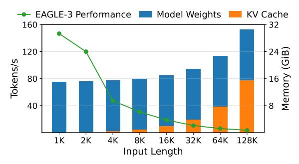

# **SpecExtend: A Drop-in Enhancement for Speculative Decoding of Long Sequences**

## Jungyoub Cha Hyunjong Kim Sungzoon Cho

## Seoul National University

{jungyoub.cha, hjkim0811, zoon}@snu.ac.kr

#### Abstract

Speculative decoding is a widely used technique for accelerating inference in large language models (LLMs), but its performance degrades as input length grows, with significant drops even at moderate lengths. Yet, this early degradation has remained largely underexplored. We introduce SpecExtend, a drop-in enhancement that improves speculative decoding on long sequences without additional training. SpecExtend integrates efficient attention mechanisms such as FlashAttention and Hybrid Tree Attention to accelerate prefill and verification steps. To improve both draft accuracy and speed on long inputs without retraining, we propose Cross-model Retrieval, a novel KV cache eviction strategy that leverages the target model's attention scores to dynamically select relevant context for the smaller draft model. Extensive evaluations show that SpecExtend accelerates speculative decoding by up to 2.84x on 16K-token long document summarization and up to 3.86× on long-form reasoning, while preserving the short-input performance of stateof-the-art frameworks. Our code is available at github.com/jycha98/SpecExtend.

#### 1 Introduction

Large Language Models (LLMs) have achieved remarkable success across a wide range of natural language processing (NLP) tasks. However, their practical deployment is often hindered by high inference latency, primarily caused by the autoregressive nature of decoding. To address this issue, various optimization techniques have been proposed, with speculative decoding emerging as an effective, lossless solution. Speculative decoding consists of two phases: First, a smaller draft model is used to efficiently generate candidate tokens. Then, the original target model verifies these tokens in parallel. This allows generating multiple tokens within a single target model decoding step, accelerating inference without altering the output distribution.

> **[图片提取文字 (无描述)]:**
> EAGLE-3 Performance Model Weights KV Cache 160 32 120 Tokens/s 80 40 1K 2K 4K 8K 16K 32K 64K 128K Input Length

Figure 1: Performance and memory usage of speculative decoding with Llama-3.1-8B-Instruct and EAGLE-3 across varying input lengths. Performance significantly declines well before the shift of memory bottleneck.

Despite these advantages, the performance of speculative decoding frameworks drops significantly as input length increases. When the input becomes extremely long, the memory bottleneck shifts from model weights to the KV cache. Prior work (Sun et al., 2024; Sadhukhan et al., 2024) has attempted to address this by using sparse KV caches of the target model for drafting. As shown in Figure 1, however, performance degradation arises much earlier than this bottleneck shift, and existing methods yield little speedup due to drafting with the slow base model that has large weights. Yet, this degradation in the moderatelength regime is largely underexplored. We identify two main causes: (1) increased latency in the forward passes of both target and draft models due to the quadratic complexity of standard attention, and (2) reduced draft accuracy, as the draft model is typically smaller and trained only on short sequences. To address this, a drop-in solution is desirable, since retraining draft models on long contexts is costly, while tasks like long-form generation begin with short inputs and gradually expand, requiring the solution to preserve short-input performance and the original benefits of existing state-of-the-art frameworks.

The theoretical speedup of speculative decoding

> **[图片提取文字 (无描述)]:**
> Long Input Sequence The Department of Defense Hybrid Tree Attention launched the Joint Exercise Program Target Model Joint Exercise Program . Verify 4 to improve ... Output Sequence Flash Attention Draft 4 Prefill 4 ... In its annual oversight report, Attention the Inspector General reviewed the Scores Chunk Draft Model 8 5 6 d . . . . . . . . . . . . . . . . . . . Target Model 8 ... Draft Model Draft Model KV Cache Cross-model Retrieval

Figure 2: Overview of SpecExtend. FlashAttention accelerates the prefill phases of both target and draft models, and Hybrid Tree Attention accelerates the verification phase. We use the target model's attention scores obtained from verification to select the most relevant input chunks to retain in the draft model's KV cache, enhancing both draft speed and accuracy on long inputs without additional training.

(Equation [1\)](#page-3-0) shows that in the moderate-length regime, it is critical to maintain high draft accuracy, as it reduces the number of verification steps required. A simple way to improve draft accuracy without retraining is to shrink the draft model's KV cache with an eviction policy such as StreamingLLM [\(Xiao et al.,](#page-9-2) [2023\)](#page-9-2), known to improve both generation quality and speed on long inputs. However, with such a static eviction policy, draft accuracy degrades when tasks require finergrained use of past context, such as the Needle Retrieval task (Section [3.2.3\)](#page-3-1), due to loss of important context and increased target-draft divergence.

To this end, we propose SpecExtend, a dropin enhancement for speculative decoding on long inputs (Figure [2\)](#page-1-0). We first incorporate efficient attention mechanisms (Section [3.1\)](#page-2-0) such as FlashAttention and Hybrid Tree Attention to accelerate the prefill and verification steps. To improve draft accuracy and speed without retraining, we introduce Cross-model Retrieval (Section [3.2\)](#page-2-1), a novel cache update strategy for speculative decoding. We dynamically update the smaller draft model's KV cache with globally relevant context, guided by the larger target model's attention scores. By enabling fine-grained alignment between draft and target models in long contexts, this improves the average accepted length by up to 2.55× on inputs of up to 16K tokens, outperforming static eviction strategies.

We evaluate SpecExtend on practical longsequence generation tasks where speculative decoding struggles. On long document summarization with inputs of up to 16K tokens (GovReport, PG- 19, BookSum), SpecExtend achieves up to 2.22× speedup with Vicuna-7B and 2.84× with Llama-3.1- 8B-Instruct, compared to standard speculative decoding. SpecExtend excels in long-form reasoning tasks due to its drop-in design, as it can be directly combined with powerful draft models optimized for short contexts (e.g., EAGLE-3), enabling strong performance across both short and long sequences. On AIME-24 with DeepSeek-R1-Distill-Llama-8B, applying SpecExtend to EAGLE-3 yields a 3.86× speedup, resulting in a 3.73× speedup over naive autoregressive decoding. SpecExtend is compatible with various speculative decoding setups and robust across input lengths.

Our main contributions are as follows:

- To the best of our knowledge, we are the first to tackle the largely underexplored problem of speculative decoding performance degradation in the moderate-length regime with a training-free solution.
- We propose *Cross-model Retrieval*, a novel KV cache eviction strategy that improves both draft accuracy (by up to 2.55×) and speed on long inputs, without additional training. It consistently outperforms static cache eviction policies, and we provide in-depth analysis of its effectiveness.
- We introduce *SpecExtend*, a drop-in solution that accelerates speculative decoding by up to 2.84× on 16K-token long document summarization and up to 3.86× on long-form reasoning, while preserving the short-input performance of state-ofthe-art frameworks.

