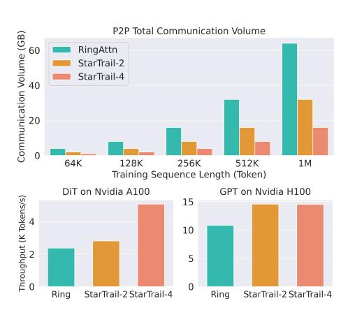

# 1 Introduction

Over the past decade, Transformer[\[38\]](#page-12-0) models have made remarkable strides in diverse fields, including computer vision (CV) and natural language processing (NLP). As the technology has evolved, the ability to efficiently process long sequences with Transformer has emerged as a pivotal challenge. For instance, in text summarization, the ability to handle extensive sequences is vital, as the content to be summarized can range from lengthy chapters to entire books [\[17,](#page-11-0) [3\]](#page-10-0). Similarly, chat-based applications, such as ChatGPT [\[1\]](#page-10-1), require the capacity to process extensive dialogue

∗Equal Contribution.

histories to ensure conversational consistency. There are also applications in other fields like video generation[\[5,](#page-10-2) [30\]](#page-11-1) and protein structure prediction[\[15,](#page-10-3) [7\]](#page-10-4).

The long context in the above scenarios has introduced several challenges for model training and inference: 1) Efficiency and Adaptability. The challenge of efficiency predominantly lies in handling long sequences that require quadratic computations during attention, and in addressing the large amount of communication during distributed processing. 2) Memory. Besides the major obstacle of storing the model weight and optimizer states, the activation has also exceeded the capacity of a single GPU and risen as a new memory challenge due to the extreme sequence length. 3) Scalability. Current Transformer models usually require thousands of GPUs for pre-training, even with datasets of regular lengths. For longer sequences, ensuring an acceptable scaling speedup rate with both the sequence length and the number of GPUs increasing is even more critical to reducing time and economic costs.

Traditional parallelisms such as Data Parallelism[\[12,](#page-10-5) [37,](#page-12-1) [22,](#page-11-2) [41\]](#page-12-2), Tensor Parallelism[\[37,](#page-12-1) [39,](#page-12-3) [40\]](#page-12-4), and Pipeline Parallelism[\[13,](#page-10-6) [10,](#page-10-7) [23,](#page-11-3) [25\]](#page-11-4) distribute the model, input batch, and the optimizer states, but can not directly address the large memory requirement of extremely long sequences as the sequence length dimension remains unchanged. To break through this obstacle, Sequence Parallelism has been introduced, splitting the input on the sequence length dimension. Mainstream Sequence Parallelism schemes can generally be classified into two categories, and are usually combined [\[11\]](#page-10-8) to complement each other's drawbacks. Methods like DeepSpeed Ulysses[\[14\]](#page-10-9), which are based on all-to-all communication, offer efficiency but require the splitting of attention heads. Consequently, these methods are limited in scalability and can not be scaled to more devices than the number of attention heads. On the other hand, peer-to-peer communication methods[\[24,](#page-11-5) [20\]](#page-11-6), such as Ring Attention[\[24\]](#page-11-5), do allow for near-infinite context lengths; however, they require the transmission of complete keys and values across all GPUs, leading to significantly high communication loads. In sum-

> **[图片提取文字 (无描述)]:**
> P2P Total Communication Volume Communication Volume (GB) 60 RingAttn StarTrail-2 StarTrail-4 40 20 0 64K 128K 256K 512K 1M Training Sequence Length (Token) DiT on Nvidia A100 GPT on Nvidia H100 Throughput (K Tokens/s) 15 10 5 0 Ring StarTrail-2 StarTrail-4 StarTrail-2 StarTrail-4 Ring

Figure 1: StarTrail-2 and StarTrail-4 theoretically save around 50% and 75% of total P2P communication volume for various sequence length and achieves up to 2x speedup in end-to-end training

.

mary, there remains a deficiency in communication-efficient methods that are capable of supporting near-infinite context lengths. In this paper, we focus on solving the communication inefficiency of ring-style sequence parallelism.

To solve these challenges, we introduce StarTrail, a novel near-infinite-context Transformer training system with concentric multi-ring sequence parallelism that incorporates an additional parallel dimension into the existing ring-style communication. Specifically, instead of including all GPUs in a single parallel group as done in Ring Attention [\[24\]](#page-11-5), StarTrail groups the GPUs into teams and divides the peer-to-peer communication within these teams. This approach fosters an efficient communication paradigm and provides extra tuning flexibility for communication arrangements. With very little additional memory cost, StarTrail parallelism significantly reduces the peer-topeer communication volume, as shown in Figure [1.](#page-1-0) Compared to previous works, StarTrail is not limited in supported sequence length by attention heads like DeepSpeed Ulysses[\[14\]](#page-10-9) and Megatron Sequence Parallelism[\[18\]](#page-11-7), and also shows better communication efficiency and scalability than Ring Attention[\[24\]](#page-11-5). We perform experiments on mainstream Transformer models, including GPT-style[\[33\]](#page-11-8) and DiT-style[\[31\]](#page-11-9), conducting performance and scaling tests across various computing clusters. Experiment results indicate that our StarTrail system outperforms Ring Attention by up to 77.12% on the GPT model and up to 114.33% on the DiT model, showcasing its efficiency and scalability.

