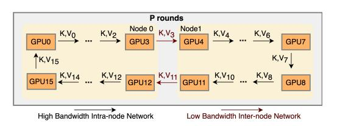
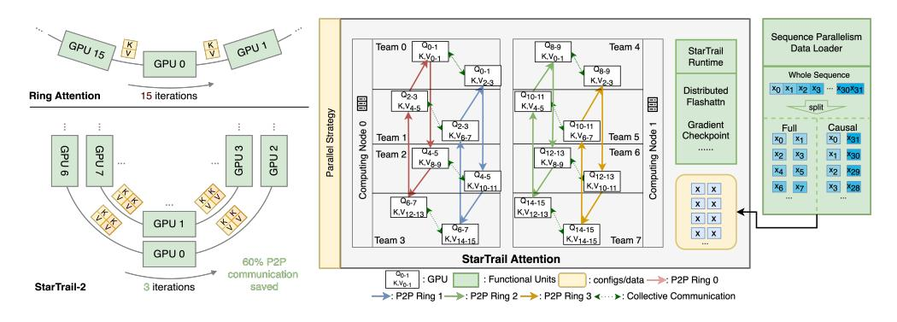

# 2.1.1 Ring-peer-to-peer-communication-based

The primary method in peer-to-peer-communicationbased strategies is Ring Attention[\[24\]](#page-11-5), which is also the main baseline of this work. Introduced in 2023, Ring Attention[\[24\]](#page-11-5) innovatively partitions the sequence dimension and utilizes a ring-style peer-to-peer (P2P) communication pattern to transfer Keys and Values across all GPUs. Each GPU receives the key and value matrices from the preceding rank, updates the local attention score, and then forwards them to the next rank, as is shown in Figure [2.](#page-2-0) This method employs an online-softmax and updates attention scores incrementally, allowing the computation of attention scores without retaining the full sequence length. Thus, it potentially supports infinite context, provided sufficient

> **[图片提取文字 (无描述)]:**
> P rounds GPU0 1K,V15 GPU15 K,V14 ... K,V12 GPU12 K,V11 GPU11 K,V10 ... K,V8 High Bandwidth Intra-node Network Low Bandwidth Inter-node Network

Figure 2: An example of Ring Attention Computation on 16 GPUs in two nodes. The Communication is largely limited by the inter-node bottleneck.

computing resources are available. However, the requirement for the same number of rounds of P2P communication as the number of GPUs renders this approach less efficient in environments with high-latency communication.

> **[图片提取文字 (无描述)]:**
> Sequence Parallelism GPU 15 GPU 1 Q0-1 Q8-9 Team 4 Team 0 Data Loader StarTrail K.V0-1 K,V0-1 GPU 0 Runtime Q0-1 Q8-9 Whole Sequence K,V2-3 K,V2-3 X0 X1 X2 X3 ··· X30X31 Distributed Ring Attention 15 iterations Q10-11 Q2-3 Flashattn K,V4-5 K,V4-5 split Strategy 0 Gradient Q2-3 Q10-11 Causal Full Computing Node Computing Node K,V6-7 K,V6-7 Team 5 Checkpoint x0 Team 1 ×o GPU 6 GPU 3 N Parallel Q12-13 Q4-5 Team 6 x2 X1 Team 2 хз GPU GPU K,Vg.9 K,V8-9 X2 X4 Q4-5 Q12-13 K,V10-11 K,V10-11 ×6 хз x x Q6-7 Q14-15 x x \*\*\* K,V12-13 K.V12-13 x x GPU 1 Q6-7 Q14-15 x x K,V14-15 K,V14-15 Team 3 Team 7 GPU 0 StarTrail Attention 60% P2P communication : GPU : Functional Units : configs/data ->>: P2P Ring 0 K.V0-1 StarTrail-2 3 iterations saved → : P2P Ring 1 → : P2P Ring 2 → : P2P Ring 3 < → : Collective Communication

(a) StarTrail-2 reduces 60% P2P communication volume on 16 GPUs compared with ring attention. (b) StarTrail divides one ring into four concentric sub-rings, with every two connected with collective communication.

Figure 3: An overview of the StarTrail Training System

### 2.1.2 Attention-Head-Sharding-Based

There are two representative methods, DeepSpeed-Ulysses and Megatron Sequence Parallelism in this category. DeepSpeed-Ulysses[\[14\]](#page-10-9) transitions from sequence parallelism to a method akin to tensor parallelism with two all-to-all communication. It divides the query, key, and value matrices across the attention heads, thereby preserving the original attention computation structure. Megatron Sequence Parallelism[\[18\]](#page-11-7) focuses on minimizing memory usage and reducing the necessity for activation recomputation rather than efficiency. The two methods both rely on the number of attention heads to split the sequence, thus limited in scalability, especially when employing techniques like grouped-query attention (GQA) [\[2\]](#page-10-10) or multi-query attention (MQA) [\[36\]](#page-12-5). As these two sequence parallelism methods are orthogonal to the ring-based method, they are usually combined with ring attention to enable longer sequences.

In this paper, we focus on optimizing ring-style sequence parallelism, noting that integrating it with DeepSpeed-Ulysses Parallelism does not interfere with the underlying ring process.

