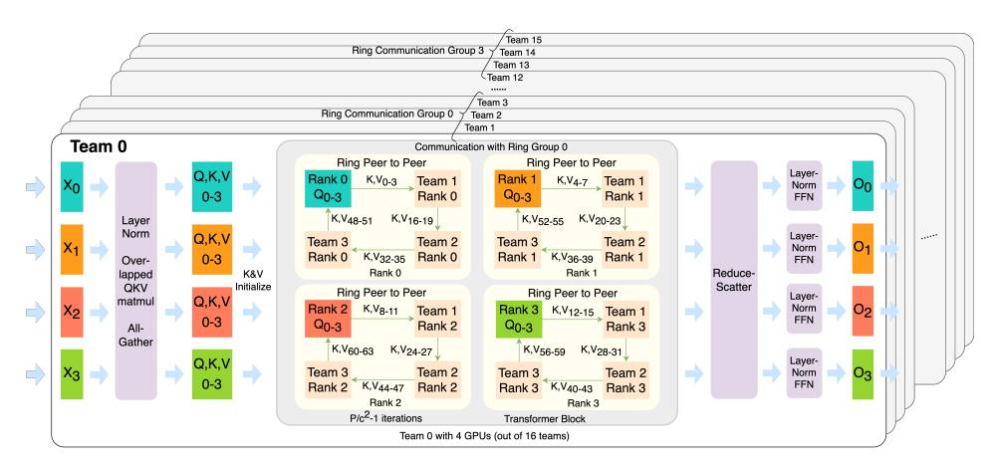
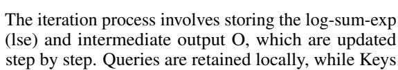
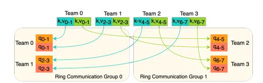

# 3 StarTrail Training System

<span id="page-3-0"></span>> **[图片提取文字 (无描述)]:**
> Team 15 Ring Communication Group 3 Team 14 Team 13 Team 12 Team 3 Ring Communication Group 0 Team 2 Team 1 Team 0 Communication with Ring Group 0 Ring Peer to Peer Ring Peer to Peer Layer-Rank 0 K,V<sub>0-3</sub> Team 1 Rank 1 K,V4-7 Team 1 Norm On Q0-3 Rank 1 Rank 0 Q<sub>0-3</sub> FFN K,V48-51 K,V<sub>20-23</sub> K,V16-19 K,V52-55 Layer Norm Layer-Q,K,V ..... Team 2 Team 3 Team 2 Team 3 Norm Rank 0 K, V<sub>32-35</sub> Rank 0 K,V36-39 Rank 1 0-3 Rank 1 Over-FFN K&V Rank 0 Rank 1 Reducelapped Initialize Scatter QKV Ring Peer to Peer Ring Peer to Peer Layermatmul Q,K,V Rank 2 K,V8-11 Rank 3 Norm K,V<sub>12-15</sub> Team 1 0, Team 1 FFN 0-3 Q0-3 Q<sub>0-3</sub> Rank 2 Rank 3 All-Gather K,V<sub>60-63</sub> K,V56-59 K,V24-27 K,V28-31 Layer-Q,K,V Team 3 Rank 2 K,V<sub>44-47</sub> Team 2 Team 3 Team 2 Norm 03 FFN Rank 2 Rank 3 K,V40-43 Rank 3 Rank 2 Rank 3 P/c<sup>2</sup>-1 iterations Transformer Block Team 0 with 4 GPUs (out of 16 teams)


Figure 4: An example of StarTrail Attention on 64 GPUs. Each team member forms a sub-ring with members with the same local rank from other teams in the same ring communication group, reducing the communication volume of each team member by 75%.

### 3.1 Motivation

Through observation, we identify two main drawbacks of Ring Attention. First, the communication overhead is exceedingly high because every GPU in the system must send and receive keys and values for nearly the entire sequence length before completing the attention computation. Second, variations in bandwidth between and within computing nodes can cause communication bottlenecks. As illustrated in Figure [2,](#page-2-0) the bandwidths between GPUs 3 and 4 and between GPUs 11 and 12 are lower than those between other GPUs in the ring. Despite this, the system is forced to operate in a complete circle, which can result in unnecessary idle times for other GPUs. To solve these drawbacks, we develop the StarTrail training system, which we will detail in the following section.

### 3.2 StarTrail Attention

As discussed in the previous section, a major limitation of Ring Attention is the extensive amount of peer-to-peer (P2P) communication required, which becomes problematic in environments with weak connections between computing nodes. We enhance the ring sequence parallelism by introducing an additional dimension. The fundamental idea of StarTrail is akin to a divide-and-conquer strategy. During attention, each token must compute its attention score with every other token in the sequence. While Ring Attention passes keys and values along a ring of P GPUs over P − 1 iterations, our ap-

Figure 5: Meanings of the symbols that are used in this paper

- P The number of GPUs
- C The parallel size of StarTrail (team size)
- H The hidden dimension size of the Transformer blocks
- N The total number of tokens within the whole sequence
- B The training batch size
- W The communication bandwidth between GPUs
- L The communication latency between GPUs

proach introduces the concept of a team. In this setting, each team member interacts only with a designated portion of the overall sequence, and the results are later aggregated using collective communication. Thus, StarTrail can be devided into three phases: **preprocessing**, **ring-phase**, and **postprocessing**.

For **preprocessing**, we duplicate the queries within a team using an all-gather operation. This ensures that when a GPU receives new keys and values, it can compute the attention scores for the entire team's queries. Similarly, gathering the keys and values allows us to reduce the number of P2P communication iterations by transmitting longer sequences per iteration. Following the preprocessing, we enter the **ring-style communication phase**. With the number of GPUs in one team being C, CN/P tokens are exchanged in each iteration, and each GPU is responsible for computing N/Ctokens. This leads to a number of iterations of  $\frac{N/C}{CN/P} = \frac{P}{C^2}$ , within a smaller ring, which we refer to as a subring. For convenience, we group  $\frac{P}{C^2}$  adjacent teams into a team group for subring communication, where GPUs sharing the same local team rank form the subring. An initial P2P communication step is executed to ensure that each team group has access to the complete set of keys and values for the sequence (details are provided in the Appendix). After completing the subring iterations, each GPU holds 1/C of the overall computation result for its team. With the help of online softmax, we then apply a simple reduce-scatter to combine these results while eliminating the duplicate tokens, which we refer to as the **postprocessing**. Throughout the attention process, asynchronous communication is employed alongside the early launch of communication kernels to maximize the overlap of computation and communication tasks. Now we will delve into more details in the StarTrail training process.

#### 3.2.1 Configurations of StarTrail Parallelism

In the StarTrail system, GPUs are grouped into *Teams* to coordinate computation and communication tasks more efficiently. StarTrail introduces an additional parameter, C, which determines the replication factor of the input and, consequently, the number of GPUs within each team. The range of C is from 1 to  $\sqrt{P}$ . When C equals one, the algorithm falls back to Ring Attention. When C equals  $\sqrt{P}$ , the algorithm becomes a completely collective-communication-based one with no rings. When  $1 < C < \sqrt{P}$ , it becomes a structure with multiple rings looping concurrently.

```
Algorithm 1 StarTrail Attention Block (Forward)
```

```
Require: Input sequence x, Linear Function query, key, and value, attention parallelism size c,
      global rank \mathbf{r}, global size \mathbf{g}\mathbf{s}, team process group \mathbf{p}\mathbf{g}, init send/recv target \mathbf{r}_{\text{send}} and \mathbf{r}_{\text{recv}}
 1: compute the gathered \mathbf{q}_{\mathrm{team}}, \mathbf{k}_{\mathrm{team}}, \mathbf{v}_{\mathrm{team}} = \text{AllGather\_QKVmatmul}(\mathbf{query}, \mathbf{key}, \mathbf{value}, \mathbf{x}, \mathbf{pg})
 2: launch the asynchronous send and receive request
 req_{\mathrm{send}} and req_{\mathrm{recv}}, sending k_{\mathrm{team}}, v_{\mathrm{team}} to r_{\mathrm{send}} and receiving k_{\mathrm{next}}, v_{\mathrm{next}} from r_{\mathrm{recv}} 3: get the ring P2P target r_{\mathrm{next}} and r_{\mathrm{last}} with get_P2P_ranks(r, gs, c)
 4: initialize attention score O, extra statistics lse to zero. // lse stands for log-sum-exp
 5: for 1 \le i \le \text{world\_size}/c^2 do
           wait for req<sub>send</sub> and req<sub>recv</sub>
 7:
           k_{\rm current} = k_{\rm next}, v_{\rm current} = v_{\rm next}
           launch req_{\rm send} to send k_{\rm current} and v_{\rm current} to r_{\rm next}, launch req_{\rm recv} to receive k_{\rm next} and v_{\rm next}
           from \mathbf{r}_{\mathrm{last}}
           calculate lse, O =
           forward_iteration(lse, O, q_{team}, k_{current}, v_{current})
11: compute O_{\text{final}} = \text{ReduceScatter\_combine}(\text{lse}, O, pg)
12: return \mathbf{O}_{\text{final}}
```

Forward Propagation. In Figure 4, we have an example of one team of four GPUs out of all the 64 GPUs performing StarTrail-style attention. Each training iteration begins with the dataloader splitting the entire input sequence of length N into N/P sub-sequences, which are then loaded onto each GPU. As previously mentioned, the next step involves computing the queries, keys, and values. These are computed separately via matrix multiplication, followed immediately by the launch of the all-gather kernel, which gathers the above QKVs within the team, allowing for the overlap of up to two-thirds of the communication with computation.

Once this phase is complete, each GPU within the team possesses the same Q, K, and V, each of a length of  $\frac{CN}{P}$ . To distribute the communication and computation tasks among the team members,

we divide the original workload based on four specific ranks assigned to each GPU. These ranks determine each GPU's partners and position within the P2P ring, as is shown in Figure 6.

Following the setup, the Keys and Values are dispatched to their designated locations within the cluster to establish the initial sub-ring, setting the stage for the multi-ring iteration phase of StarTrail attention. Given that each sub-sequence is  $\frac{CN}{P}$  long and each GPU is tasked with computing the attention score for  $\frac{1}{C}$  of the whole sequence, it results in  $\frac{N/C}{CN/P}-1=P/C^2-1$  rounds of communication. This implies that there are  $P/C^2$  GPUs in one ring.

> **[图片提取文字 (无描述)]:**
> The iteration process involves storing the log-sum-exp (lse) and intermediate output O, which are updated step by step. Oueries are retained locally, while Keys


<span id="page-5-0"></span>> **[图片提取文字 (无描述)]:**
> Team 0 Team 1 Team 2 Team 3 k,v2-3 k,v2-3 k-v4-5 k,v4-5 k, v6-7 k, v6-7 k,vo-1 k,vo-1 90-1 94-5 Team 0 Team 2 90-1 94-5 92-3 96-7 Team 1 Team 3 92-3 96-7 Ring Communication Group 0 Ring Communication Group 1


Figure 6: An example of ring initialization process of 8GPUs and 4 sub-rings in Star-Trail

and Values circulate through the ring via P2P communication. After completing the iterations, each team member accumulates the attention scores for the entire team's sub-sequence of Queries with 1/C of the Keys and Values from the full sequence.

A simple reduce-scatter operation is then employed to amalgamate the intermediate results and distribute them among the team members. Each GPU ultimately contains the final attention score for its portion of the sequence over the entire sequence.

**Backward Propagation**. The major distinction between backward and forward propagation is the inability to calculate queries independently during the backward phase. Unlike forward propagation, the backward phase requires the complete set of keys and values to calculate the gradient for queries, and vice versa. To manage this, we have structured the gradient calculation into two loops: the key & value outer loop and the query inner loop. In the outer loop, gradients for keys and values are tracked and maintained fixed on the corresponding GPUs within the sub-rings; these gradients do not transfer between GPUs. The inner loop, however, handles the gradients for queries, which start initialized as zero and are circulated along the sub-rings together with the Queries themselves. During each iteration, the approach mirrors the backward computation method used in FlashAttention[8], where the updated gradient of the current query shard is passed to the next GPU in the ring, while the gradients for keys and Values are retained for subsequent query shards.

### 3.2.2 Theoretical Analysis

During the analysis, we will employ a case study using the StarTrail system with an attention parallel size of C=4 on a llama-30B model, which consists of 64 layers. For this model, referred to as model M, the batch size = B is set to 1, the sequence length = N to 65536, the hidden dimension = H to 6656, and the number of GPUs = P to 64. Additionally, the computation will utilize bfloat16 precision.

**Communication Analysis**. Let's analyze the communication overhead within one forward Transformer block on a single GPU. For Ring Attention, the communication is primarily due to the ring P2P loop. As the total number of iterations done is P-1, the total communication overhead can be calculated as:

$$(P-1)(\frac{2BNH}{PW} + L) = \frac{2BNH(P-1)}{WP} + (P-1)L \tag{1}$$

and this overhead can be partially overlapped with the attention computation.

For StarTrail, the communication overhead comes from both collective and P2P. The collective overhead for all-gather and reduce-scatter is:

$$\frac{4BNH(C-1)}{PW} \tag{2}$$

while the P2P communication can be similarly computed as:

$$\left(\frac{P}{C^2} - 1\right)\left(\frac{2CBNH}{PW} + L\right) = \frac{(P - C^2)2BNH}{CPW} + \left(\frac{P}{C^2} - 1\right)L\tag{3}$$

The advantages of StarTrail over Ring Attention during the ring-P2P phase are evident in three main aspects: 1) **Reduced Communication and Latency**: Ring Attention requires C times more communication than StarTrail, significantly increasing the bandwidth requirement across the entire cluster. For the llama 30B model M, the total communication volume of ring P2P communication and collective communication volume for Ring Attention and StarTrail can be computed as 1.625 GB and 0.152 GB(collective) + 0.406GB (P2P) = 0.558GB. Furthermore, while Ring Attention necessitates P-1 iterations per attention block, StarTrail only requires  $\frac{P}{C^2}-1$ , reducing the latency overhead by around  $C^2$ . 2) **Localized Communication**: In scenarios like those depicted in Figure 3, StarTrail's ring P2P communication can be confined within the same computing node, where bandwidth is typically much higher than between computing nodes. Conversely, Ring Attention demands inter-node communication during every iteration, which can be less efficient. 3) **Enhanced Overlap of Communication and Computation**: During each iteration, the communication volume of StarTrail is C times higher than that of Ring Attention, while the computational volume during attention is approximately  $C^2$  times greater. This higher computation-to-communication ratio makes it easier for StarTrail to overlap P2P communication with computation, enhancing overall efficiency.

**Memory Analysis**. In this section, we estimate the theoretical peak memory requirements necessary to store the model weights, activations, and optimizer states. Our implementation utilizes the Adam Optimizer [16], bfloat16 precision, and Zero-2 optimization [34]. We name the memory cost for the model and optimizer as  $M_{m+o}$ . As for the activation, we refer to the size of one single activation of a sub-sequence on one GPU as

$$A = \frac{B \times N \times H}{P} \tag{4}$$

As we use the checkpointing scheme from [20], a model of Y layers needs to save Y+1 activations as checkpoints. Now we calculate the approximate peak memory after Q, K, and V are already calculated and before the attention computation at the last layer of the whole model. For Ring Attention and StarTrail, the peak memories are:

$$PM_{Ring} = M_{m+o} + (Y+4)A (5)$$

<span id="page-6-1"></span>
$$PM_{Star} = M_{m+o} + (Y + 3C + 1)A \tag{6}$$

, where C is the StarTrail attention dimension. And for the example model M, the peak memory would be  $M_{m+o}+68A$  and  $M_{m+o}+77A$ , and the extra memory cost compared with Ring Attention is a lot less than 13.2%, while the P2P communication volume is reduced by about 75%. In a word, the extra memory cost is acceptable as a tradeoff for the communication reduction.

