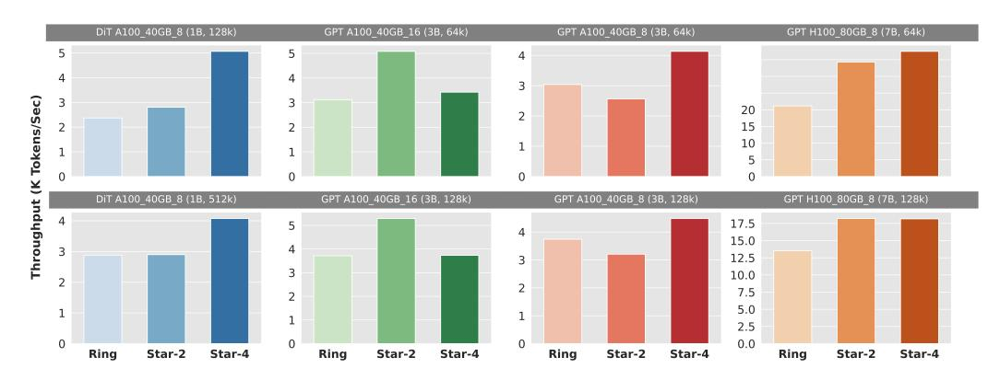

# 4 Evaluation

Table 1: Cluster and Model Configurations. All GPUs are connected with NVLink with computing nodes.

| GPU  | $\text{dev.} \times \text{node}$ | Mem. (GB) | inter-node bandwidth | Model  | #Heads | #Layers | Dim. |
|------|----------------------------------|-----------|----------------------|--------|--------|---------|------|
| H100 | $8 \times 8$                     | 80        | 8*400Gbps InfiniBand | GPT 3B | 12     | 16      | 4096 |
| A100 | $16 \times 2$                    | 40        | 100Gbps Ethernet     | GPT 7B | 32     | 32      | 4096 |
| A100 | $8 \times 4$                     | 40        | 100Gbps Ethernet     | DiT 1B | 24     | 24      | 1536 |
| A100 | $4 \times 8$                     | 40        | 100Gbps Ethernet     |        |        |         |      |

The computational resources we use in the experiments include a local Nvidia H100 cluster with eight nodes and three Nvidia A100 clusters, as listed in table 1. We utilize two model types of total three settings, as listed in table 1. For the DiT(Diffusion Transformer) model, we use similar configurations as those in Stable Diffusion 3[9]. We utilize the backbone Diffusion Transformer only, without other components like the text and image encoders. During training, both models use bfloat16 precision and a batch size of 1 to accommodate longer input sequences.

In the evaluation section, we aim to answer three major questions: 1) How much improvement in throughput can StarTrail bring? Additionally, how adaptable is StarTrail to clusters with both good and poor inter-node connections? 2) Is the additional memory cost incurred by StarTrail acceptable considering the throughput improvement it offers? 3) How does StarTrail perform in scenarios of weak and strong scaling? Specifically, does it outperform Ring Attention when scaled to handle longer inputs?

> **[图片提取文字 (无描述)]:**
> DIT A100 40GB 8 (1B, 128k) GPT A100 40GB 16 (3B, 64k) GPT A100 40GB 8 (3B, 64k) GPT H100 80GB 8 (7B, 64k) 5 5 4 4 Throughput (K Tokens/Sec) 3 3 20 2 15 10 0 DIT A100 40GB 8 (1B, 512k) GPT A100 40GB 16 (3B, 128k) GPT A100 40GB 8 (3B, 128k) GPT H100 80GB 8 (7B, 128k) 17.5 5 15.0 12.5 3 10.0 7.5 5.0 2.5 0.0 0 0 Ring Star-2 Star-4 Ring Star-2 Star-4 Ring Star-2 Star-4 Ring Star-2 Star-4

Figure 7: Throughput evaluation of Ring Attention and StarTrail on 32 GPUs from three different clusters. We place the performance of StarTrail with both C=2 and C=4 in the figure. The configurations are marked in the titles of the sub-figures. For instance, A100\_40GB\_8(1B, 512K) represents that the experiment is on machines with 8 Nvidia A100 40GB GPUs in each node, the model used has one billion parameters, and the sequence length is 512k.

