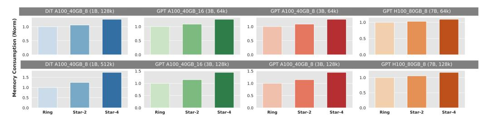

# 4.1 Throughput and Adaptability

Our first experiment aims to assess the performance of StarTrail and Ring Attention across different clusters with varying environments, testing the adaptability of both methods. There are several factors influencing the efficiency of ring-style attention computation:

Theoretical Computation-Communication Volume Ratio: Primarily determined by the sequence length used during training. Attention computation exhibits a computational complexity of O(N2 ·H), whereas P2P communication complexity is O(N · H). Thus, the model configuration does not impact this ratio; only the sequence length does. A larger N increases the computation-communication ratio, facilitating easier overlap of communication with computation.

Compute Capability and Connectivity of GPUs: The computing overhead, given a specific volume, affects the computation-communication overhead ratio. Higher compute capabilities make overlapping more challenging. We utilize two sets of GPUs in this evaluation: Nvidia A100 40GB and Nvidia H100 80GB, with the latter offering significantly higher theoretical tflops on bf16 computations. Connectivity is considered in two parts: intra-node and inter-node. Our clusters are equipped with NVLink, ensuring robust intra-node communication. For inter-node communication, our H100 nodes leverage InfiniBand with eight adapters per node for superior inter-node bandwidth, whereas the Google Cloud servers use Ethernet. The diversity in node configurations (8-GPU and 16-GPU nodes) allows us to assess adaptability across different topologies. This evaluation not only highlights the inherent differences between the schemes but also tests their flexibility in various hardware settings.

The results of our evaluation are illustrated in Figure [7.](#page-7-0) We measure throughput in thousands of tokens per second. To better demonstrate how to select the optimal configuration of StarTrail under each condition, we included two configurations, Star-2 and Star-4, in the figure. We omit configurations with lower performance for clarity. As indicated in the figure, in all six settings, at least one configuration of StarTrail achieves higher throughput than Ring Attention, with 2.114x, 1.414x, 1.629x, 1.425x, 1.360x, 1.199x, 1.771x, and 1.346x the throughput of Ring Attention. This advantage is primarily due to the additional parallel dimension that StarTrail introduces. Unlike Ring Attention, which requires inter-node P2P communication in each iteration, StarTrail's P2P communication is mostly confined intra-node, except for initial data transfers. This experiment clearly demonstrates StarTrail's superior performance across various environments. Another observation is that the optimal configuration for StarTrail may vary depending on the environment, reflecting differences in the computation-communication ratio and the trade-offs between collective and P2P communication.

> **[图片提取文字 (无描述)]:**
> DiT A100 40GB 8 (1B, 128k) GPT A100 40GB 16 (3B, 64k) GPT A100 40GB 8 (3B, 64k) GPT H100\_80GB\_8 (7B, 64k) 1.0 1.0 1.0 0.5 0.0 0.0 GPT A100 40GB 16 (3B, 128k) DiT A100 40GB 8 (1B, 512k) GPT A100 40GB 8 (3B, 128k) GPT H100 80GB 8 (7B, 128k) 1.5 1.5 1.0 1.0 0.5 0.5 0.0 0.0 0.0 0.0 Star-2 Ring Ring Star-2 Star-4 Ring Star-4 Star-2 Star-4 Ring Star-2 Star-4

Figure 8: The normalized relative memory cost of different configurations of StarTrail compared with Ring Attention on different clusters.

