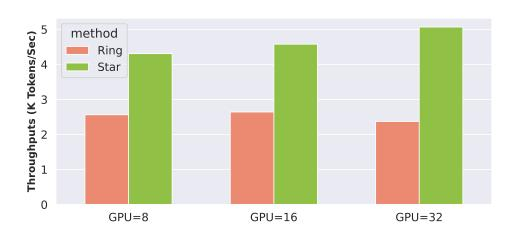
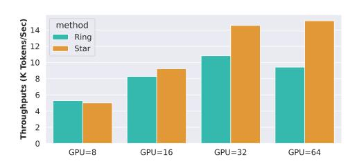

# 4.2 Memory Consumption

The memory results, displayed in Figure [8,](#page-8-0) reveal that for the configurations yielding the highest throughput, StarTrail consumes between 7.9% and 30.79% more GPU memory than RingAttention, while achieving 1.199x to 2.114x throughput. Moreover, in scenarios involving larger models, the relative increase in memory consumption due to QKV duplication diminishes. This reduction is explained by equation [6](#page-6-1) This phenomenon is further evidenced by the fact that the extra memory ratio for experiments with the 7B model is significantly smaller than that for the 3B and 1B model. Considering the substantial throughput gains provided by StarTrail, this tradeoff between memory usage and efficiency is deemed acceptable.

> **[图片提取文字 (无描述)]:**
> Throughputs (K Tokens/Sec) method Ring Star GPU=8 GPU=16 GPU=32

> **[图片提取文字 (无描述)]:**
> Throughputs (K Tokens/Sec)
> 
> Throughputs (K Tokens/Sec) method Ring Star GPU=8 GPU=16 GPU=32 GPU=64

- (a) DiT Strong Scaling on Nvidia A100 40GB GPUs. All configurations include inter-node communication.
- (b) GPT Strong Scaling on Nvidia H100 80GB GPUs.

Figure 9: Strong scaling experiments with fixed sequence length of 128K.

