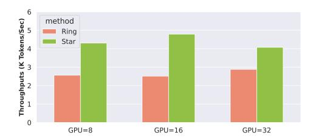
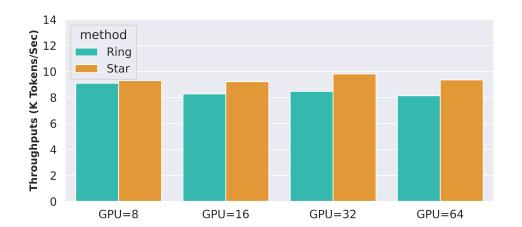

# 5 Conclusion

StarTrail represents an advanced near-infinite-context Transformer model training system, featuring a communication-optimized concentric ring sequence parallelism scheme. Through experiments, we

> **[图片提取文字 (无描述)]:**
> 6 method Throughputs (K Tokens/Sec) Ring Star GPU=8 GPU=16 GPU=32

> **[图片提取文字 (无描述)]:**
> 14 method Throughputs (K Tokens/Sec)
> 
> 7 10 8 0 1 2 2 2 2 2 2 2 2 2 2 2 2 2 2 2 2 2 2 Ring Star GPU=8 GPU=16 GPU=32 GPU=64

- (a) DiT Weak scaling on Nvidia A100 40GB GPUs of sequence length from 128K to 512K. All configurations include inter-node communication.
- (b) GPT Weak scaling on Nvidia H100 80GB GPUs of sequence length from 64K to 512K.

Figure 10: Weak scaling Experiments

demonstrate that our system not only achieves high efficiency across various training environments but also excels under both strong and weak scaling conditions for both CV and NLP models. Current limitations of StarTrail include that although orthogonal, we can still further improve the co-design of StarTrail and hybrid parallelism in future works. In an era increasingly demanding longer contexts for both NLP and CV, StarTrail is poised to make significant contributions to the industry and inspire innovative research in academia.

