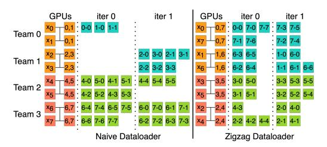

# A Technical Appendices and Supplementary Material

### A.1 Sequence Parallelism Dataloader

The causal masks present a challenge due to the unbalanced computational load across GPUs: subsequences at the beginning of a sequence require significantly more computation than those at the end. To address this imbalance and achieve load equilibrium among GPUs, we modify the ZigZag scheme introduced by [\[42\]](#page-12-7), illustrated in Figure [11.](#page-20-0) The figure illustrates the simplest case of zigzag load-balancing. Notably, the effectiveness of this strategy improves as the number of GPUs increases. This improvement correlates with the expanding difference in computation volume between the first and the last token, which escalates as the sequence length extends. This approach ensures that the total workload on each GPU is balanced, eliminating the need for additional communication mechanisms like those employed in DistFlashAttention[\[20\]](#page-11-6).

> **[图片提取文字 (无描述)]:**
> **GPUs GPUs** iter 0 iter 1 iter 0 iter 1 Team 0 Team 1 Team 2 X5 Team 3 Naive Dataloader Zigzag Dataloader

Figure 11: A comparison between naive and zigzag dataloader for 8 GPUs with attention parallel dimension of 2. The corresponding initialization can be found in Figure [6](#page-5-0) with the same configuration. The improvement of efficiency from load-balancing increases with the number of GPUs.

