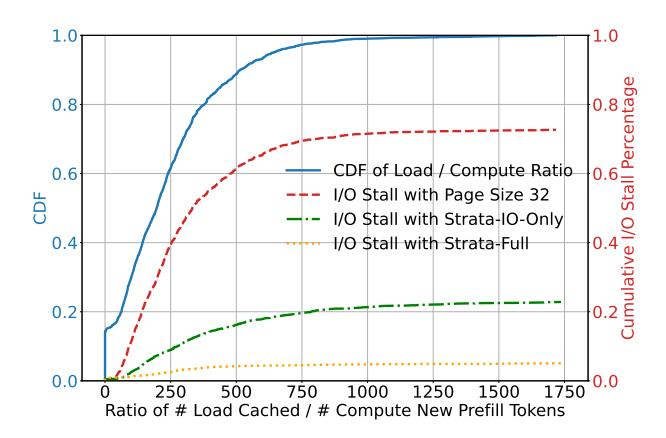
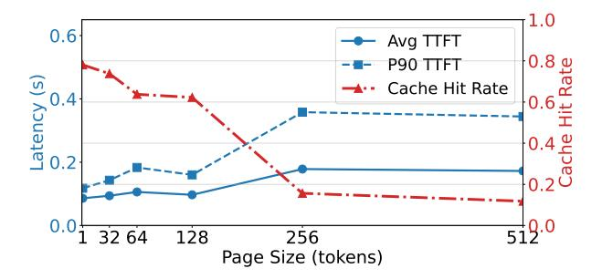
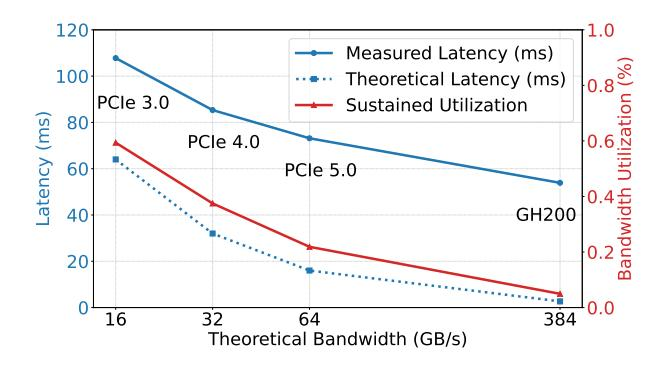

# 1 Introduction

Large Language Models (LLMs) represent a significant advancement in machine learning, achieving remarkable proficiency in understanding and generating natural language. Their adoption is now widespread, and they are rapidly evolving towards more robust problem-solving capabilities. A prominent trend in this evolution is the expansion of context windows, allowing LLMs to parse longer input prompts. This has enabled an important set of applications that require understanding large amounts of text, including coding assistants, retrieval-augmented generation (RAG), document analysis, and conversational AI agents. Leading models, including Google's Gemini series [\[15\]](#page-11-0) and the Qwen series [\[39\]](#page-12-0),

Christos Kozyrakis NVIDIA & Stanford University kozyraki@stanford.edu

already support context windows of up to one million tokens, with expectations of two million tokens emerging soon. Other frontier models like DeepSeek-V3 [\[9\]](#page-11-1), Llama3.1 and Llama-4 series [\[28,](#page-12-1) [29\]](#page-12-2), and Anthropic's Claude 3.5 [\[3\]](#page-11-2) also offer substantial context lengths, typically in the range of 128K to 200K tokens.

While long contexts enable new capabilities such as multiturn conversations, RAG, and document-centric tasks (e.g., querying books, manuals, or scripts), recomputing them from scratch is prohibitively expensive. Caching previously computed key–value (KV) states offers a practical solution, as these prefixes and sources are frequently reused across applications. This technique, often referred to as context or prefix caching [\[4,](#page-11-3) [8,](#page-11-4) [14,](#page-11-5) [35,](#page-12-3) [45\]](#page-12-4), avoids redundant prefill computation and significantly reduces response latency. However, the storage footprint of cached KV states is substantial. For example, 40 GB of GPU High-Bandwidth Memory (HBM) can only hold roughly 0.3M tokens for Llama-8B, which can be quickly consumed by a handful of documents or hundreds of conversation turns. As a result, production systems adopt hierarchical caching, storing KV states in CPU memory [\[44\]](#page-12-5), local SSDs [\[11\]](#page-11-6), or even remote memory pools [\[16,](#page-11-7) [36\]](#page-12-6) to extend capacity and preserve reuse benefits.

However, transferring large cached contexts back to the GPU introduces a major performance bottleneck. Bulk KV transfers often cause memory stall, directly inflating TTFT and degrading throughput. Figure [1](#page-1-0) illustrates this effect: when serving the LooGLE dataset [\[23\]](#page-11-8) with SGLang offloading KV caches to CPU memory, configured in line with standard practices reported in prior work [\[11\]](#page-11-6), 74% of prefill time is blocked on KV transfers (the red curve), resulting in up to a 4× throughput reduction. In these cases, I/O delays rather than compute become the dominant limiting factor. This inefficiency arises from two main sources.

First, as context lengths grow, the sheer volume of KV cache data requiring transfer between memory tiers (e.g.,

> **[图片提取文字 (无描述)]:**
> 1.0 0.8 CDF of Load / Compute Ratio 0.6 I/O Stall with Page Size 32 I/O \$tall with Strata-IO-Only 0.4 I/O Stall with Strata-Full 0.2 0.0 1750 250 500 750 1000 1250 1500 Ratio of # Load Cached / # Compute New Prefill Tokens

**Figure 1.** Benchmark profile for Qwen2.5-14B on the LooGLE dataset. The x-axis shows the Load / Compute Ratio (tokens loaded from CPU memory relative to new input tokens) per prefill batch. The right axis displays the I/O stall percentage, representing the amount of prefill execution time attributed to I/O stall. See §5.3 for full benchmark details.

CPU memory to GPU HBM) increases substantially. However, current systems achieve only a fraction of the maximum hardware bandwidth between memory tiers. As we further explore in §3.1, this is because current systems adopt PagedAttention [22] to reduce GPU memory fragmentation. However, paging causes *data* fragmentation, as the KV cache for a given sequence is spread across multiple non-contiguous pages. This leads to small data transfers, sometimes only a few kilobytes, which fail to saturate PCIe bandwidth.

In addition to the inefficient I/O, current schedulers fail to account for the fact that loading cached context itself can become a bottleneck. Specifically, existing systems [22, 33, 45] assumes that the computation needed to prefill new tokens is sufficient to hide the latency of loading historical KV cache from slower memory tiers. However, as context lengths grow, this assumption no longer holds: caching loading time can exceed the compute time needed for prefill, leaving the system loading-bound rather than compute-bound. Figure 1 highlights this effect. Even with our optimized I/O mechanism presented in §4.2, which removes the overhead of small page transfers (the green line), up to 24% of prefill execution time remains stalled on cache loading. Schedulers that ignore these I/O-bound characteristics generate imbalanced batches, unable to effectively hide cache-loading delays.

To address the critical bottlenecks identified above, we propose Strata, a hierarchical context caching framework designed for long context language model serving, without performance degradation in small context scenarios. Strata introduces a novel I/O mechanism to enable more efficient data transfer among GPU HBM, CPU memory, and disk storage. Specifically, Strata employs GPU-assisted data transfer to combat KV cache fragmentation and decouples the GPU's

memory layout from that of other memory tiers. Furthermore, Strata reduces long-context overheads through cacheaware request scheduling. It constructs balanced batches that pair sufficient prefill computation to cover I/O latency, and, when cache loading stalls are unavoidable, schedules insert useful complementary tasks (e.g., decoding batches) to fully utilize available compute resources. Together, these techniques ensure that scheduling remains efficient even under highly variable latency budgets.

Our implementation of Strata builds upon SGLang [45], a widely adopted open-source framework for LLM serving. Our system also has been deployed in production environments at a leading AI company. We conducted a comprehensive evaluation using popular long-context benchmarks, testing across a range of models and representative hardware platforms. The results demonstrate that Strata outperforms vLLM + LMCache [25], a state-of-the-art open-source hierarchical context caching solution on TTFT, by up to 5×, and NVIDIA's TensorRT-LLM, a highly optimized serving engine, by up to 3.75× on these demanding workloads, without performance degradation on short-context scenarios.

### 2 Background

#### 2.1 Long Context LLM Inference

LLM inference operates in two phases: *prefill* and *decode*. During prefill, the model typically processes both (i) new tokens from the user query and (ii) context tokens, drawn from sources such as documents or prior interactions. The intermediate outputs of this step, known as KV caches, are critical for efficiency, as they eliminate the prohibitive cost of recomputation. In the subsequent decode phase, the model generates tokens autoregressively, continually reusing and extending the KV cache. Thus, efficient cache management is essential to sustaining high-performance serving.

#### 2.2 Memory Management of KV Cache

Inspired by virtual memory, PagedAttention [22] avoids reserving large contiguous blocks for KV caches by using dynamic, page-based allocation. The cache is partitioned into small fixed-size pages that preserve logical sequence order but can be placed non-contiguously in memory, improving utilization. Typical page sizes are small—e.g., 32, 16, and 1 tokens in TensorRT-LLM, vLLM, and SGLang—where each token may span from tens of kilobytes to several megabytes. While such fine granularity is manageable for compute kernels, it poses serious efficiency challenges for data movement across memory tiers, as we will discuss in §3.1.

#### 2.3 Context Caching in LLM Serving

Beyond intra-request reuse, systems exploit *context caching* across requests by identifying common prefixes using structures like prefix trees or hash maps [22, 36], widely adopted

> **[图片提取文字 (无描述)]:**
> 1.0 0.6 Avg TTFT P90 TTFT Latency (s) Cache Hit Rate 32 64 128 256 Page Size (tokens)

**Figure 2.** Large page sizes decrease cache hit rate and increase TTFT, benchmarked on H200 for Mistral-24B using the ShareGPT dataset.

> **[图片提取文字 (无描述)]:**
> 120 Measured Latency (ms) 100 Theoretical Latency (ms) PCIe 3.0 Sustained Utilization Latency (ms) 80 PCIe 4.0 60 PCle 5.0 GH200 40 20 16 32 64 Theoretical Bandwidth (GB/s)

**Figure 3.** Latency and bandwidth utilization of loading KV caches of 8192 tokens (using page size 32) of Llama-3.1-8B from CPU to GPU on different platforms.

by providers such as OpenAI [35] and Google [14]. To extend capacity, caches are stored in slower tiers such as CPU memory [13, 19, 44], distributed memory pools [16, 24, 36], or even disk [11, 18, 25]. Recent systems, e.g., CachedAttention [11], overlap cache loading with computation on a layer-by-layer basis to minimize stalls, while asynchronously backing up newly generated caches to lower tiers.

#### 3 Challenges of Long Context Caching

This paper addresses the challenge of managing large context caches for long-context (i.e., prefill-dominated) workloads. While this is not the only LLM scenario (i.e., short context, long generation, or single-turn workloads exist), long-context workloads represent a significant set of important, real-world workloads [21, 23]. We next explore the systems challenges that arise in long-context workloads.

