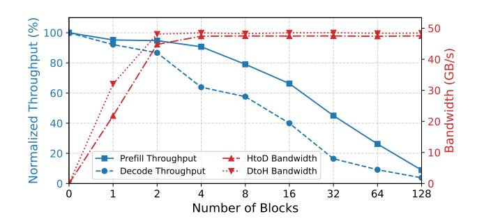
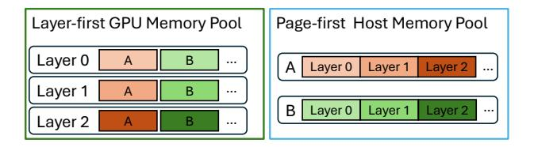
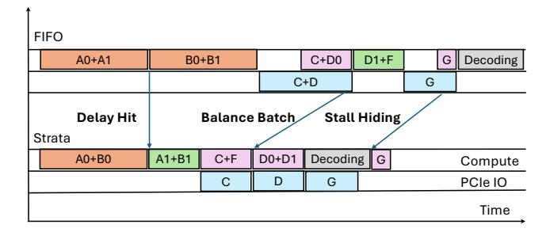

# 4 Strata's Design and Implementation

#### <span id="page-3-2"></span>4.1 Overview

Motivated by challenges discussed in [§3,](#page-2-3) we built Strata, a system with two key components. The Strata Cache Controller ([§4.2\)](#page-4-0) manages the data plane elements throughout the memory hierarchy. It introduces an optimized GPU-CPU data transfer mechanism and manages KV cache memory layouts to support efficient small page transfers as motivated in [§3.1.](#page-2-0) The Strata Scheduler ([§4.3\)](#page-5-1) implements the control plane that intelligently schedules requests in a cache resource-aware manner as motivated in [§3.2.](#page-3-0) It references a HiRadixTree, which is an extension to SGLang's RadixTree [\[45\]](#page-12-4), effectively serving as a page table and stores metadata about each KV cache page.

Figure [4](#page-3-1) presents the Strata architecture. When a request is submitted, it enters a request waiting queue. During the execution of the ongoing batch, the Scheduler continuously estimates available system resources and the resource demands of queued requests, and selects a subset to form the next batch. The Scheduler then sends this batch to GPU executor and initiates a KV cache loading request to the Cache Controller. During the execution of the prefill batch, the GPU executor synchronizes with Cache Controller to ensure that the KV cache of certain layer is available before the execution. Once prefill is complete, the prefilled requests are merged into a consolidated decoding batch via continuous batching [\[43\]](#page-12-16). Strata uses a P-D co-location design, alternating the execution of prefill and decoding batches temporally on the same GPU, and follows SGLang's practice to prioritize the execution of prefill batch for shorter response time (TTFT) and to form a larger decoding batch for higher throughput. Finally, the Cache Controller actively manages the backup and eviction of any KV cache pages to lower memory hierarchies asynchronously.

<span id="page-4-2"></span>> **[图片提取文字 (无描述)]:**
> Normalized Throughput Prefill Throughput HtoD Bandwidth Decode Throughput DtoH Bandwidth Number of Blocks


**Figure 5.** Performance interference vs. resources allocated to the KV-cache I/O kernel. Measurement on concurrently running Strata 's I/O kernel with a prefill pass (batch of two requests with 4k input each) and a decode pass (batch of 16 requests with 4k input each), respectively.

#### <span id="page-4-0"></span>4.2 Efficient KV Cache I/O

To address the limitations discussed in §3.1, inspired by established practices within the computer architecture community [30, 37], Strata leverages *GPU-assisted I/O* to transfer KV cache pages between CPU and GPU memory for low-latency I/O on small, fragmented data. Specifically, instead of invoking standard *cudaMemcpyAsync* API repetitively with small data transfers, a GPU-assisted I/O job operates by launching a CUDA kernel. This kernel spawns thousands of threads. Each thread is responsible for loading a small chunk of data from a source (either GPU global memory or CPU registered pinned memory) into its local register files and then streaming this data to a destination (which can also be GPU global memory or registered CPU pinned memory).

GPU-assisted I/O offers several advantages: First, it enables **enhanced concurrency** (*C*): GPUs provide massive, cost-effective parallelism, supporting thousands of concurrent I/O operations compared to typically only tens on CPUs. Second, it is **compatible with small transfers** (efficient *S*): the granularity required for efficient GPU-assisted I/O is only 128 bytes on most architectures [34], which is sufficiently fine for single-page KV caches (kilobytes), eliminating the need to inflate page size for efficiency. Finally, it allows **flexible memory layout**: since light computation in I/O kernels is virtually free, layout transformations between GPU and CPU memory can be performed at negligible cost, enabling flexible and efficient data organization (see §4.2.1 for details).

However, a challenge associated with GPU-assisted I/O, as highlighted in prior work [17], is runtime interference when co-running with other kernels. Without dedicated hardware handling the fine-grained I/O tasks, GPU threads consume valuable resources, such as register files and execution cycles, and can lead to cache pollution. Prior work [26] also demonstrated that GPU hardware schedulers often struggle to effectively manage this resource contention, potentially

<span id="page-4-3"></span>> **[图片提取文字 (无描述)]:**
> Page-first Host Memory Pool Layer-first GPU Memory Pool Layer 0 ... Layer 0 Laver 1 Layer 1 В ... Layer 0 Layer 2 ...


Figure 6. Layer-first v.s. Page-first layouts

degrading the performance of both the I/O operations and concurrent computational kernels.

We observe that efficient data transfer does not need to monopolize the entire GPU. Strata employs a strategy of launching a small number of large CUDA blocks to incentivize the GPU's hardware scheduler to confine these I/O kernels to a small subset of Streaming Multiprocessors (SMs), as few as 1. This targeted allocation, when combined with low-level instructions to bypass the cache and thereby mitigate pollution, minimizes interference with concurrent workloads. Moreover, with the ROCm backend [2], these kernel implementations are also compatible with AMD GPUs. To balance resources for overall efficiency, we conducted microbenchmarks co-running I/O kernels with prefill and decoding kernels on an NVIDIA H200 GPU. As shown in Figure 5, using only two CUDA blocks of 1024 threads each, Strata achieves nearly 50 GB/s transfer throughput while incurring less than 5% performance degradation on prefill and 10% on decoding. Based on these results, we select two blocks as the default quota for loading data from CPU to GPU (a critical path operation), and one block for backing up data from GPU to CPU (a non-critical path), where the bandwidth is already sufficient and overhead must be minimized. Our end-to-end evaluation confirms that this configuration sustains high I/O bandwidth while keeping overall performance impact under 5%, demonstrating that carefully tuned GPU-assisted I/O can be both efficient and non-intrusive.

<span id="page-4-1"></span>**4.2.1 Data Management Beyond Host Memory.** When external storage is involved, the cache controller opportunistically prefetches data from storage to host memory when a cache hit is detected at the storage layer. The latency of this prefetch overlaps the request's queuing delay. Once the scheduler dispatches the request for execution, the cache controller terminates any in-flight prefetch and leverages the available cache already in host or GPU memory. This best-effort approach is motivated by the significantly higher and less predictable latency of the storage layer compared to the data transfers between host and GPU memory, which Strata adopts a layer-wise overlapping approach.

Furthermore, the data transfer inefficiency caused by fragmented memory layout, as motivated in §3.1, also extends to other storage media. In addition to small pages, LLM serving systems also favor a layer-first memory layout in the GPU memory pool (shown in Figure 6), as it aligns with

<span id="page-5-0"></span>> **[图片提取文字 (无描述)]:**
> **FIFO** C+D0 A0+A1 B0+B1 D1+F Decoding C+D G Stall Hiding **Delay Hit** Balance Batch. Strata D0+D1 A1+B1 C+F Decoding A0+B0 G Compute D G PCIe IO Time


**Figure 7.** Scheduling Policies of Strata, where orange blocks indicate prefill batches experiencing cache miss, green indicates cache hit on device, purple indicates cache hit on host memory, blue indicates data transfer, and the one decoding batch is colored in gray.

the layer-wise nature of LLM computation. However, this layout further fragments data, hindering bulk data transfer efficiency. An alternative, transfer-friendly layout that arranges layers of a page contiguously would be ideal for I/O but would require an layer of indirection for computation, complicating kernel implementation.

By leveraging GPU-assisted I/O, Strata resolves this conflict by enabling a virtually free, on-the-fly transformation between the compute-friendly and transfer-friendly layouts. To perform the layout transformation, a thread simply applies one additional arithmetic operation to its assigned offset to calculate the correct destination address. This operation has negligible overhead. As illustrated in Figure 6, this capability decouples the layout requirements across the memory hierarchy: the GPU can maintain its computation-friendly layer-first layout, while other media, such as host memory and external storage, can adopt a page-first layout that maximizes transfer efficiency with larger, contiguous data blocks. In §5.3.4, we demonstrate how this decoupled layout strategy significantly reduces data loading time.

#### <span id="page-5-1"></span>4.3 Cache Aware Scheduling

As motivated in §3.2, the goal of the scheduler is to maximize caching benefit by avoiding delay hit and loading stall. The *Scheduler* does so through three stages. First, it identifies requests that are potentially susceptible to delay hits and **defer the execution** to right after the delay hit resolved. This eliminates unnecessary cache miss without impacting on TTFT. Secondly, it **formulates a balanced batch** that aims to pair with loading (from host memory) with sufficient computation to hide the loading latency. Finally, in the event that batches are still loading-bound, the *Scheduler* **hides I/O stalls** by inserting useful compute inside bubbles.

**4.3.1 Deferral on Delay Hit.** As discussed in §3.2, delay hits can cause redundant computation in two scenarios: (i) when multiple requests sharing the same cache miss are scheduled into the same batch (Figure 7), and (ii) when the

#### <span id="page-5-2"></span>Algorithm 1 Balanced Batch Formation

```
1: procedure AddBundleHit(Q, B)
       for each r in O do
 2:
           if B.is bundle hit(r) then
 3:
                B.add(r); Q \leftarrow Q - r
 4:
 5: function BATCHFORMATION(Q)
       B \leftarrow \text{Batch}(); D \leftarrow []
 6:
       B.add(Q.pop(0)); ADDBUNDLEHIT(Q, B)
 7:
       while |Q| > 0 and \neg B.is_full() do
 8:
 9:
           r \leftarrow Q.pop(0)
           if B.loading_bound(r) then
10:
                D.append(r)
11:
12.
13.
                B.add(r); ADDBUNDLEHIT(Q, B)
       for each r in D do
14:
           if B.is full() then break
15:
           B.add(r)
16:
       return B
17:
```

execution of a request is prepared asynchronously without awareness that the corresponding context cache is still being computed. To keep track of potential delay hit, we introduce transient nodes in the HiRadixTree. Similar to standard nodes, they use token IDs as traversal keys, but instead of pointing to memory indices, they carry one of two marks: in-queue, indicating that a request is referencing a new context, and in-flight, indicating that the cache for the corresponding tokens is under computation. When iterating over the request queue, Strata inserts transient nodes marked in-queue as needed. If a request matches existing transient nodes, it is deferred to the next scheduling round but placed at the front of the waiting queue to benefit from the soon-to-be-hot cache and minimize its impact on TTFT.

When a request proceeds to execution, its associated transient nodes are marked in-flight. Upon completion, the nodes are converted into standard nodes, with indices pointing to the ready context cached in memory. To prevent unnecessary deferrals, Strata uses a configurable threshold: a request is deferred only when the number of token matches on transient nodes exceeds this value. In practice, a default threshold of 100 active token matches proved effective.

**4.3.2 Balanced Batch Formation.** After removing candidates susceptible to delay hits, the scheduler selects requests to form the next prefill batch. In most LLM serving engines [22, 45], batch formation follows a FIFO policy by default, where requests are taken in arrival order until the batch is full (either reaching a preset token limit or exhausting GPU memory). To address the loading-bound issue discussed in §3.2, Strata introduces a new batch formation mechanism that balances data loading with sufficient computation. An example is illustrated in Figure 7, a batch containing requests C and D0 would require loading both contexts, causing a

loading stall. In contrast, forming a different batch (C, F) could get the loading of C overlapped. A special case worth noting is the other new batch (D0, D1): since they share the same context, batching them not only balances loading with compute but also reduces GPU memory usage and on-device bandwidth pressure, further improving efficiency. We refer to this as a bundle hit, on the opposite of delay hit.

The procedure is detailed in Algorithm [1.](#page-5-2) Before each batch is formed, the scheduler obtains the load and compute requirements of each request using the HiRadixTree. During batch formation, as it iterates through the queue, the scheduler checks whether adding a request would reach the loading-bound limit ('loading\_bound' in line 11), defined as the ratio of aggregated load to compute. When this ratio exceeds a threshold, the batch is considered loading-bound. This threshold is hardware- and model-dependent and thus can be profiled separately; in practice, Strata uses a default ratio of 100, corresponding to the point where stalls begin to appear showed in Figure [1.](#page-1-0) If the request would fit into the batch without making it loading-bound, it will be added into the batch, then the scheduler will iterate through all the rest requests to preferentially add requests that bundle-hit with it. Otherwise, the request is moved to a deprioritized list. If the batch is not full till the end of the queue, the scheduler supplements it with deprioritized requests (line 17). To prevent starvation, deprioritized requests retain their original order, and each batch formation always begins with the first request in the queue.

4.3.3 Hide Loading Stall with Bubble Filling. Even with balanced batching, some batches can still be loadingbound. The final strategy of the scheduler is bubble filling that overlaps loading stalls with useful computation. An example is illustrated in Figure [7,](#page-5-0) when request G requires a long context load, the scheduler defers computation of the prepared prefill batch and instead issues a decoding batch to the model executor to run concurrently with the context loading. This strategy complements SGLang's default prefillfirst policy (as discussed in [§4.1\)](#page-3-2), allowing some flexibilities when choosing between prefill and decoding for improved overall utilization. Although decoding batches are also I/Obound, they primarily saturate HBM bandwidth, whereas loading tasks saturate PCIe bandwidth. This distinction enables the two operations to overlap with minimal resource contention. It is also possible to insert an prefill batch to fill the bubble if available, which will be more applicable to P-D disaggregated systems [\[46\]](#page-12-19).

