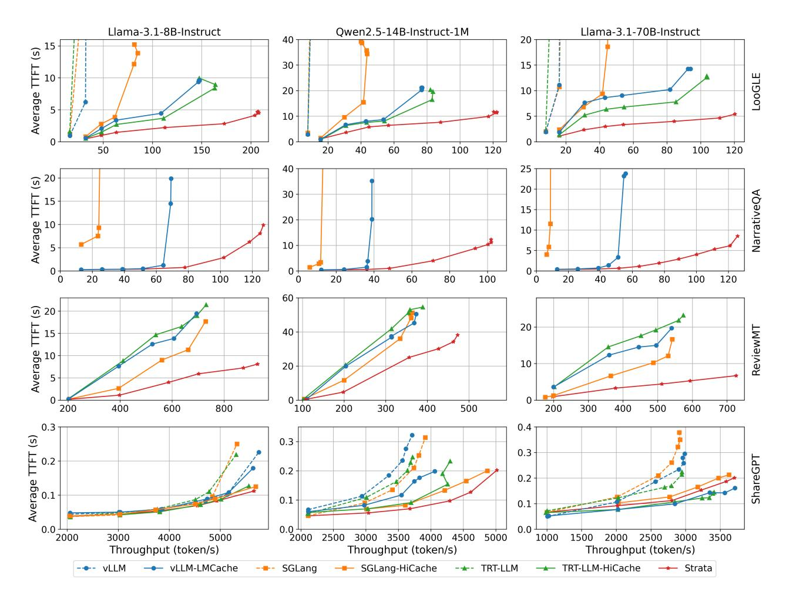

# 5.2.1 How does the performance of Strata compare to state-of-the-art LLM serving systems on long-context

workloads? Figure 8 presents the achieved token throughput and corresponding average TTFT for each system under varying request rates across three models and four datasets. First, we observe that hierarchical caching is essential for high-performance long-context serving. Across all three models, non-hierarchical caching solutions perform poorly on LooGLE. Without hierarchical caching, long-context workloads rapidly exhaust GPU memory capacity, leading to frequent cache misses during prefills. This, in turn, triggers repeated recomputation, resulting in low throughput and high latency. By contrast, systems equipped with hierarchical caching achieve substantially higher throughput and lower latency, consistently reaching approximately 95% cache hit rate by leveraging CPU memory.

Second, Strata delivers substantial improvements over existing hierarchical caching solutions. For Llama-8B on LooGLE, Strata achieves up to 3.2×, 2.6×, and 1.9× higher throughput at the same TTFT compared to SGLang-HiCache, vLLM-LMCache, and TensorRT-HiCache, respectively. Similar gains are observed for Qwen-14B and Llama-70B: with Qwen-14B, Strata achieves up to 3.9×, 2.1×, and 1.9× improvements; with Llama-70B, the gains reach 5×, 5×, and 3.75×. A consistent trend is seen on ReviewMT. Despite longer decoding reduces the dominance of prefill time, with Llama-8B, Strata outperforms vLLM-LMCache by 2.3×, TensorRT-HiCache by 2.3× and SGLang-HiCache by 1.7×. These performance gains stem from Strata 's enhanced I/O efficiency and scheduling mechanisms, as further analyzed in §5.3.1.

5.2.2 How does Strata perform with a warm cache at **steady state?** NarrativeQA presents much longer average context lengths, resulting in an extensive prefill phase that made non-hierarchical caching solutions impractical. Because this scenario presented the highest amount of memory pressure, we augmented this experiment to better understand steady-state performance characteristics (i.e., after the cache hierarchy has been filled)1. In this setup, we first warmed up the CPU memory by pre-computing KV caches for all contexts in the evaluation set and then flush the KV cache on GPU memory to set initial state. Second row of Figure 8 reports the throughput-latency curve after restarting the workload post-warmup. We report Strata, SGLang-HiCache, and vLLM-LMCache, as TensorRT-HiCache does not support prewarming. In this setting, Strata achieves up to 2.3×, 2.6× and 2.5× throughput compared with vLLM-LMCache on Llama-8B, Qwen-14 and Llama-70B models respectively.

5.2.3 How does the performance of Strata compare to state-of-the-art LLM serving systems on short-context workloads? Strata was explicitly designed for long-context

&lt;sup>1NarrativeQA without pre-warming achieves similar results to the Loogle workload. We omit results for this scenario due to space.

> **[图片提取文字 (无描述)]:**
> Llama-3.1-8B-Instruct Llama-3.1-70B-Instruct Qwen2.5-14B-Instruct-1M Average TTFT (s) LooGLE Average TTFT (s) 2 0 1 2 1 2 1 2 1 2 1 2 1 2 1 2 1 2 1 2 NarrativeQA Average TTFT (s) 20 21 21 22 22 ReviewMT 0.3 0.4 Average TTFT (s) 0.3 0.3 ShareGPT 0.2 0.2 0.2 0.1 0.1 0.0 1 4 4 4 4 4 4 4 4 4 4 4 4 4 4 4 4 4 4 0.0 0.0 2000 2500 Throughput (token/s) Throughput (token/s) Throughput (token/s) - vLLM-LMCache SGLang -- SGLang-HiCache -★- TRT-LLM → TRT-LLM-HiCache --- vLLM → Strata

Figure 8. End-to-end benchmark performance comparison on H200.

workloads. To understand the performance of Strata on short-context workloads, the final row of Figure 8 shows the average TTFT of the baseline systems, across three models, on the ShareGPT dataset. Note that underlying SGLang engine exhibits a slight performance disadvantage compared to the base engines of vLLM and TensorRT-LLM on the Llama-8B and -70B models due to kernel differences. Taking this into account, *Strata demonstrates comparable performance to the other state-of-the-art systems on short-context workloads*.

