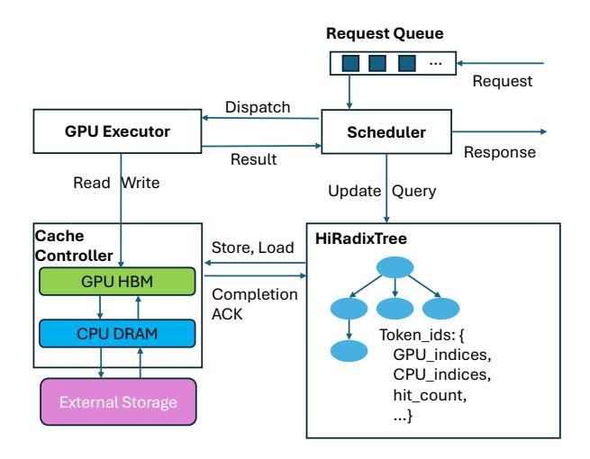

# 3.1 Low Bandwidth Utilization in KV Cache Transfers

The achievable throughput of an I/O subsystem is fundamentally constrained by the relationship described by Little's Law. Let  $\lambda$  be the arrival rate of I/O operations, C be the average number of concurrent I/O operations, and L be the average latency per operation. According to Little's Law, we

have  $C = \lambda \cdot L$ . Let X represent the sustained data throughput (e.g., in GB/s), S be the average data size per I/O operation, the throughput can be described as  $X = \lambda \cdot S$ . Combining with Little's law we have  $X = C \cdot S/L$  describing attainable throughput in a stable state. This equation highlights that maximizing data throughput (X) requires either high concurrency (C), large transfer sizes (S), or low latency (L).

To transfer data between CPU and GPU memory, asynchronous operations like cudaMemcpyAsync are typically used to engage the GPU's Direct Memory Access (DMA) engine [30]. However, the latency (L) in this scenario includes non-negligible CPU-GPU communication overhead and scheduling delays [17]. While concurrency (C) can be increased by launching numerous asynchronous I/O operations, practical limits arise from the available applicationlevel parallelism (e.g., on the CPU) and the queue capacities within the GPU driver (e.g., CUDA driver) and hardware [30, 37]. Consequently, increasing the transfer size (S) often becomes the most practical lever for improving bandwidth utilization. Saturating modern high-bandwidth interconnects underscores this point; for example, achieving 75-80% of theoretical PCIe 5.0 bandwidth necessitates transfer sizes (S) in the megabyte range (i.e., 1-2MB). This principle is not limited to CPU-GPU transfers; achieving high throughput on other media like SSDs or network interfaces often demands even large transfer sizes [6, 10, 27].

Cost of Large Pages. However, contrary to requirement of transfer efficiency, LLM inference systems favor small granularity. Smaller pages, e.g., in the range of 1-32 tokens, generally lead to better memory utilization [22] and can improve cache hit rate [31], as cache matching is performed on a per-page basis. While increasing the page size (i.e., compacting more tokens into a single continuous page and effectively increasing S) may appear to improve bandwidth utilization based on the formula, it introduces substantial performance penalties for LLM inference. To demonstrate this trade-off, we benchmarked a Mistral-24B model using the popular ShareGPT dataset, varying the KV cache page size from 1 to 1024 on the SGLang framework. As shown in Figure 2, increasing the page size leads to a significant drop in the KV cache hit rate. This degradation directly results in a substantial increase in both the average and P90 TTFT, which rise by up to  $2\times$  and  $2.9\times$ , respectively, at the largest page sizes tested. We also observed similar trends in long context benchmarking scenario as shown in Figure 10.

This preference for small pages results in significantly small effective transfer sizes (*S*) for KV cache operations, leading to severely underutilized I/O bandwidth. As illustrated in Figure 3, transferring KV cache data for 8192 tokens, achieves only approximately 22% of the theoretical PCIe 5.0 bandwidth. Page size is set to 32, a value recommended in prior works on hierarchical KV cache [11, 16, 18, 44] and a maximum supported size in vLLM for CUDA GPUs [41]. This underutilization is exacerbated on platforms with even

higher interconnect bandwidths, falling to as low as 5% on systems like NVIDIA's Grace-Hopper platform that replaces PCIe with NVLink and offers 6x higher peak bandwidth. This fundamental trade-off between transfer efficiency and caching benefit underscores the need for a more effective I/O mechanism that can achieve the best of both worlds.

#### 3.2 Resource Orchestration and Delay Hits

Typical LLM serving engines often treat GPU compute and HBM as first-class resources, since sub-tasks are usually either compute-bound (e.g., dense and attention computation in prefill) or memory-bound (e.g., decoding). With the introduction of hierarchical KV caching, this picture largely remains unchanged. Existing works either regard KV cache loading from CPU to GPU as negligible [\[11,](#page-11-6) [44\]](#page-12-5), assuming the latency of loading cache data of layer + 1 via PCIe can be effectively hidden by overlapping I/O with the computation of layer ; or else opt for recomputation when the cost is justified [\[20\]](#page-11-18). However, when serving requests with long cached contexts but relatively few new tokens to prefill, this assumption breaks down. On one hand, the latency of bulk KV cache transfers can exceed what layer-level computation can hide; on the other hand, recomputation becomes increasingly costly as context length grows, making it an unattractive alternative. Consequently, layer-wise overlapped prefill can degrade into a PCIe bandwidth–bound task. Figure [1](#page-1-0) illustrates this bottleneck: even with an I/O mechanism achieving 75% of theoretical PCIe bandwidth, stalls still account for up to 24% of prefill execution time.

Compounding this challenge is the delay hit phenomenon [\[5\]](#page-11-19), previously studied in the networking community, which arises when multiple requests for the same data object arrive and queue while an initial cache miss is still being resolved. We observe an analogous effect in LLM serving: under high traffic, multiple requests may target the same (or a prefix of the same) context. As illustrated in Figure [7,](#page-5-0) when such requests are grouped into the same batch, redundant prefill computation occurs. This problem is exacerbated by the asynchronous schedulers widely adopted in modern serving engines [\[40,](#page-12-14) [47\]](#page-12-15), which prepare the next batch before the ongoing one completes, extending the cache-miss resolution window to the full execution time of a batch and making delay hits more likely. The impact is especially severe in long-context scenarios, where both recomputation cost and cache-miss resolution time scale unfavorably.

These observation highlight the need to re-think scheduling policies in LLM serving. In particular, schedulers must explicitly treat CPU-GPU bandwidth as a first-class resource, balancing computation and data transfer when batching requests, more strategically overlapping I/O with compute, and mitigating delay hits to avoid redundant work while sustaining throughput.

> **[图片提取文字 (无描述)]:**
> Request Queue Request Dispatch **GPU Executor** Scheduler Response Result Read Write Update Query Cache HiRadixTree Store, Load Controller **GPU HBM** Completion ACK **CPU DRAM** Token\_ids: { GPU\_indices, CPU indices, hit\_count, External Storage

Figure 4. System Architecture of Strata

