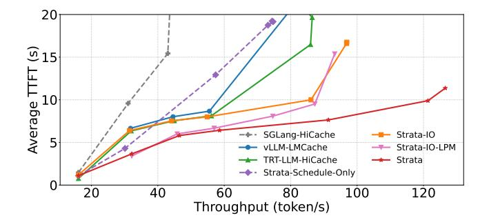
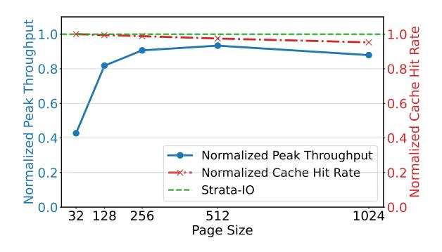

# 5.3 In-depth Performance Analysis

In this section, we conduct several breakdown analyses to better understand the performance benefits offered by Strata. All analyses presented here were conducted using the Qwen-14B model on an H200 platform.

**5.3.1** How much does efficient I/O and scheduling benefit Strata? Figure 9 presents the throughput-latency curves of Strata compared to three baselines. On top of *SGLang-HiCache*, we build and evaluate three ablated variants: *Strata-IO*, which incorporates the GPU-assisted I/O

> **[图片提取文字 (无描述)]:**
> 20 ණ 15 Average T SGLang-HiCache Strata-IO vLLM-LMCache Strata-IO-LPM TRT-LLM-HiCache - Strata Strata-Schedule-Only 20 40 60 100 120 80 Throughput (token/s)

Figure 9. Breakdown of I/O and scheduling of Strata.

mechanism from §4.2, *Strata-Schedule-Only*, which applies the scheduling policy from §4.3, and *Strata-IO-LPM*, which integrates a longest prefix match (LPM) policy [45].

The results show that both the *Strata-scheduling* and *Strata-IO* components significantly improves the baseline hierarchical design, achieving up to 1.8× and 2.3× higher peak

> **[图片提取文字 (无描述)]:**
> Normalized Peak Throughput
> 0.0 Normalized Peak Throughput Normalized Cache Hit Rate Strata-IO 0.0 1024 256 128 512 Page Size

**Figure 10.** Performance comparison between Strata +IO and SGLang+HiCache with different page sizes.

throughput, respectively. Each component alleviates the loading stall problem from a different perspective. Under low request rates, *Strata-scheduling* tends to deliver greater gains than *Strata-IO*, since smaller batch sizes generate lighter I/O pressure that can be more effectively mitigated by advanced scheduling. As the request rate increases, however, the I/O subsystem becomes the dominant bottleneck, making the GPU-assisted I/O mechanisms essential for sustaining high throughput.

We further compare vLLM-LMCache and TensorRT-HiCache directly with Strata-IO, since all three employ CUDA kernels to accelerate KV-cache I/O. As shown in Figure 9, their performance is comparable at low request rates, but Strata-IO maintains higher throughput as the request rate rises, indicating more effective mitigation of interference at scale. We also compare Strata with Strata-IO-LPM, which increases the reuse count of on-device pages, thereby indirectly reducing host-side loading pressure and improving performance under low request rates. However, at higher request rates, it fails to sustain performance gains due to more frequent cache evictions. In contrast, Strata consistently delivers improvements because it explicitly accounts for bandwidth resources in its design.

