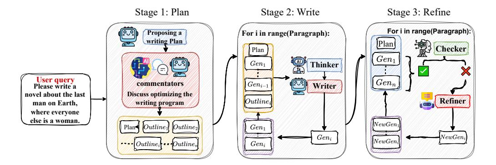

# 2 *SuperWriter*-Agent

While current LLM training corpora provide abundant supervision data reflecting intermediate "*thinking*" processes—such as mathematical reasoning and code generation [\[12\]](#page-10-2); however, they contain remarkably little data of this kind for writing tasks [\[48\]](#page-14-3). Most pretraining data [\[33,](#page-13-1) [57\]](#page-15-3) consists of finished texts like articles and books, which largely omit the underlying process of planning, structuring, and thinking involved in writing. However, writing—particularly long-form writing—inherently presents a complex cognitive task, where explicit thinking steps are crucial for maintaining coherence, logical flow, and structural consistency.

To address this gap, we propose the *SuperWriter*-agent (illustrated in Figure [2\)](#page-2-0), a framework designed to generate high-quality, thought-enriched supervised fine-tuning data for writing. The *SuperWriter*-

> **[图片提取文字 (无描述)]:**
> Stage 2: Write Stage 1: Plan Stage 3: Refine For i in range(Paragraph): Proposing a For i in range(Paragraph): writing Plan Plan Checker Plan  $Gen_1$  $Gen_1$ Thinker User query Please write a  $Gen_n$ commentators  $Gen_{i-}$ Writer Discuss optimizing the novel about the last Refiner  $Outline_i$ man on Earth, writing program where everyone else is a woman. NewGen Outline | Outline  $Gen_1$  $Gen_i$  $NewGen_i$ NewGen Gen:

Figure 2: This figure illustrates a three-stage agent framework for long-form generation. In Stage 1 (Plan), the framework proposes a structured writing plan through discussions between AI commentators and a writer. In Stage 2 (Write), the text is incrementally generated using a thinker-writer collaboration, and in Stage 3 (Refine), a checker and refiner iteratively improve the generated text to enhance coherence and quality.

agent enables structured content generation through three coordinated stages: careful planning, targeted paragraph-level writing, and iterative refinement. This process explicitly embeds intermediate thinking signals into the writing pipeline, thereby enhancing the fluency, coherence, and narrative consistency of the generated text.

## 2.1 Stage 1: Plan

Inspired by the widely adopted pedagogical technique in writing education known as the Story Workshop[2](#page-2-1) [\[46,](#page-14-4) [51,](#page-15-4) [47\]](#page-14-5), Stage 1 of *SuperWriter*-agent begins with oral narration and iterative dialogue aimed at distilling and expanding initial ideas. In practice, this planning stage guides discussion agents to articulate core themes, central arguments, character background settings (for genres like fiction), and paragraph-level content structures—collectively forming the Background component. By systematically allocating word counts and associating key ideas with specific paragraph units, this step builds a comprehensive and detailed outline for downstream writing. This structured process significantly enhances the overall coherence and organization of the text. With such a framework in place, discussion agents can strategically develop and refine their ideas, resulting in more focused, coherent, and well-developed written outputs. Appendix [A.1](#page-17-0) provides the detailed prompt for the planning stage.

