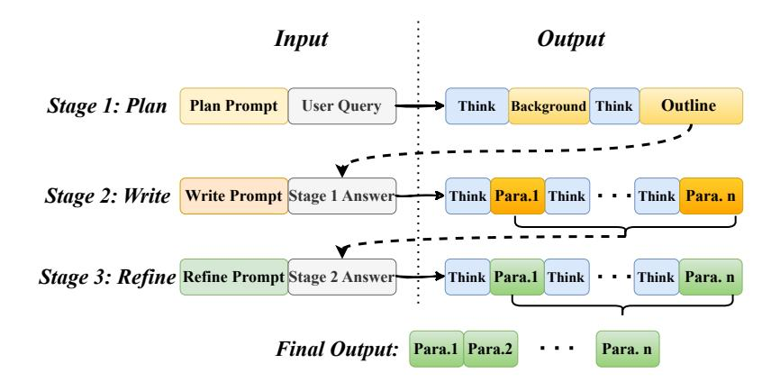
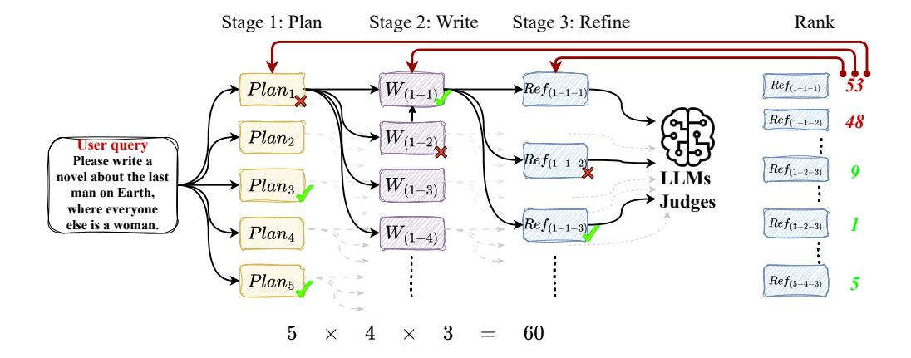

# 3 *SuperWriter*-LM

Following the development of the *SuperWriter*-agent, which introduces structured thinking and iterative discussion mechanisms to significantly enhance text generation quality, we are motivated to explore a central research question: *Can large language models, when guided by the thinking paradigm provided by the SuperWriter-agent data, internalize the ability to generate high-quality long-form content through substantially fewer inference steps—rather than relying on 30 to 40 separate agent calls per sample?*

To answer this question, we conduct targeted model training experiments. Our objective is not merely to extend output length, but to fundamentally improve coherence, relevance, and depth by distilling the agent's structured thinking process directly into the model itself. In the following sections, we describe the construction of our high-quality training dataset and the strategic methodology for training LLMs to acquire and internalize the *SuperWriter*-agent's structured thinking and writing capabilities.

## 3.1 SFT-Training

Our training dataset is sourced from two real-world instruction tuning datasets: English-language and Chinese-language instructions from WildChat-1M [\[68\]](#page-16-1) and LMSYS-Chat-1M [\[69\]](#page-16-2). To ensure the quality and relevance of the selected instructions for long-form writing tasks, we apply a filtering process using the DeepSeek-R1-Distill-Qwen-32B model [\[12\]](#page-10-2) (the filtering method is detailed in Appendix [A.7\)](#page-25-0).

We generate SFT data using the *SuperWriter*-agent (powered by GPT-4o-2024-08-06 [\[31\]](#page-12-2)) based on 4,000 filtered instructions. Each data instance follows a structured pipeline: query → outline → draft → final output. We explicitly segment this pipeline into three stages that align with the internal structure of the *SuperWriter*-agent: *plan* (query → outline), *write* (outline → draft), and *refine* (draft → final output). Rather than training the model directly on full instruction-to-answer SFT pairs, we adopt stage-wise training (illustrated in Fig [3\)](#page-4-0) for two key reasons. First, it better accommodate to real-world user workflows, where users may wish to review and revise intermediate results (e.g., the outline) before progressing to subsequent stages. Second, the complete outputs generated by the agent can be extremely long—some exceeding 100K tokens—posing significant challenges for existing long-context models. By breaking the generation process into stages, we ensure that each training sample remains within 32K tokens, making it more tractable for current models. Putting them all together, each of the three stages—*plan*, *write*, and *refine*—contains exactly 4,000 data instances, resulting in a total of 12,000 high-quality training data. During inference, the model performs the generation in three sequential stages to produce the final output.

> **[图片提取文字 (无描述)]:**
> Input Output Stage 1: Plan **Plan Prompt** User Query Outline Background Think Think Stage 2: Write Write Prompt Stage 1 Answer Think Para.1 Think · · · Think Para. n Stage 3: Refine Refine Prompt Stage 2 Answer Think Para. 1 Think Para. 1 Final Output: Para.1 Para.2 Para. n

Figure 3: Format of the SFT dataset constructed by the *SuperWriter*-agent. The agent generates training data across three stages—planning, writing, and refining—each incorporating intermediate "Think" steps. During inference, the output of Stage 3 is used as the final answer.

We train our *SuperWriter*-LM model based on Qwen2.5-7B [63], which supports a context window of up to 128K tokens, making it well-suited for long-form text generation. To improve training efficiency, we adopt the packing-based training strategy with loss weighting, as proposed by Bai et al. [5]. Training is conducted on a single node equipped with 8×H800 80GB GPUs using DeepSpeed with ZeRO-3 and CPU offloading [42]. The training setup includes a batch size of 32, a learning rate of  $2 \times 10^{-5}$ , and a context window of 32K tokens. We train the model for four epochs in total.

#### 3.2 Hierarchical DPO for Multi-Stage Generation

Direct Preference Optimization (DPO) has demonstrated effectiveness in aligning policies directly with pairwise human (or proxy-model) preferences for *single-pass* generation tasks [40]. However, in our scenario, the writing process unfolds sequentially over three distinct stages: *planning*, *drafting*, and *refinement*. Applying conventional DPO exclusively to final outputs neglects the valuable preference signals inherently present in earlier stages. To address this gap, we introduce a hierarchical multi-stage DPO framework that combines structured preference-data construction with systematic evaluation, inspired by process-annotation methods such as TPO [26], CHIP [15], and Math-Shepherd [54].

Specifically, as depicted in Figure 4, the writing process is structured as a tree explored through Monte-Carlo Tree Search. Each path through this tree, labeled (i,j,k), corresponds sequentially to Stage-1 ( $plan\ i$ ), Stage-2 ( $draft\ j$ ), and Stage-3 ( $refinement\ k$ ). We embed two key assumptions: well-structured initial plans lead to higher-quality draft (Stage-1  $Plan\ \to Stage-2$  Write) and well-refined drafts typically yield better final outputs ( $Stage-2\ Write\ \to Stage-2\ Refine$ ). Consequently, we back-propagate quality signals from leaf nodes (final outputs) upwards through intermediate stages, ensuring the policy learns from decisions at every level rather than only from final outcomes.

**Structured evaluation** (*Write-judge*). To score the final output at each leaf, we introduce *Write-judge*3, a six-dimension rubric (0–10 each) chosen from a larger pool of twenty dimensions according to the instruction type (e.g. creativity vs. logical coherence). Following best practice to curb evaluation bias, we use the QwQ-32B model [53] to score every output three times under the same temperature settings and take the average. Then we propagate scores from the leaf nodes upward to construct DPO pairs as follows.

**Step 1: Leaf-score discretization.** Let  $s_{ijk}$  denote the averaged raw evaluation score assigned to leaf (i, j, k), and let N represent the total number of leaf nodes. We define the ranking and percentile

&lt;sup>3Pipeline details and prompts appear in App. A.4.

> **[图片提取文字 (无描述)]:**
> Stage 1: Plan Stage 2: Write Rank Stage 3: Refine  $\rho Ref_{(1-1-1)}$ 53  $Plan_1$  $Ref_{(1-1-1)}$  $Ref_{(1-1-2)}$ 48  $\bullet |W_{(1-2)}|$  $Plan_2$ User query  $\rightarrow Ref_{(1-1-2)}$ Please write a  $Ref_{(1-2-3)}$ LLMs novel about the last  $W_{(1-3)}$  $Plan_3$ man on Earth, Judges where everyone  $\rightarrow Ref_{(1-1-3)}$  $Ref_{(3-2-3)}$ else is a woman.  $W_{(1-4)}$  $Plan_4$ Plan5  $Ref_{(5-4-3)}$ 60 5

Figure 4: The MCTS begins with 5 distinct writing plans, each leading to 4 written drafts, totaling 20 initial outputs. Each draft is then refined 3 times, resulting in 60 unique final outputs for a single root. A judge LLM ranks these final outputs, and the rankings are back-propagated through the refinement and planning stages. This scoring mechanism helps identify the most effective planning and writing strategies, thereby optimizing the overall writing process.

for each leaf node as follows:

$$\operatorname{rank}_{ijk} = 1 + \left| \{ (p, q, r) \mid s_{pqr} > s_{ijk} \} \right|, \quad \pi_{ijk} = \frac{\operatorname{rank}_{ijk}}{N}.$$

The percentile scores πijk are subsequently discretized into ordinal rewards rijk:

$$r_{ijk} = \begin{cases} +2, & \pi_{ijk} \le \frac{1}{6}, \\ +1, & \frac{1}{6} < \pi_{ijk} \le \frac{2}{6}, \\ 0, & \frac{2}{6} < \pi_{ijk} \le \frac{4}{6}, \\ -1, & \frac{4}{6} < \pi_{ijk} \le \frac{5}{6}, \\ -2, & \pi_{ijk} > \frac{5}{6}. \end{cases}$$

Step 2: Reward aggregation. Ordinal rewards are propagated upwards through the tree by averaging across child nodes at each intermediate stage:

$$\hat{r}_{ij} = \frac{1}{|\{k\}|} \sum_{k} r_{ijk}$$
 (Stage 2 node)  $\hat{r}_i = \frac{1}{|\{i\}|} \sum_{k} \hat{r}_{ij}$  (Stage 1 node)

Step 3: Preference-pair construction. We harvest pairwise preferences at *every* hierarchy level, ensuring that each decision contributes to the optimization at every step.

L1. Stage 1 (Plan). Let B = arg maxi rˆi be the best plan and W1, W2 the worst two.

j

|{j}|

$$P_1 = \{(B, W_1), (B, W_2)\}\$$

L2. Stage 2 (Write). For the best two plans i ∈ {B, S} (with S being the second best),

$$P_2(i) = \left(\arg\max_j \hat{r}_{ij}, \arg\min_j \hat{r}_{ij}\right), \qquad P_2 = \bigcup_i P_2(i).$$

L3. Stage 3 (Refine). For each (i, j⋆ ) ∈ P2,

$$P_3(i, j^*) = \left(\arg\max_k s_{ijk}, \arg\min_k s_{ijk}\right), \qquad P_3 = \bigcup_{(i, j^*)} P_3(i, j^*).$$

The complete preference dataset is therefore

$$\mathcal{D}_{DPO} = P_1 \cup P_2 \cup P_3.$$

| Models                   | Avg         | Languages |     |     |            | Domains |            |            |     | Requirements |     |     |     |     |     |
|--------------------------|-------------|-----------|-----|-----|------------|---------|------------|------------|-----|--------------|-----|-----|-----|-----|-----|
|                          |             | ZH        | EN  | D1  | D2         | D3      | D4         | D5         | D6  | R1           | С   | R2  | C   | R3  | С   |
| Proprietary LLMs         |             |           |     |     |            |         |            |            |     |              |     |     |     |     |     |
| ChatGPT-40-latest        | 8.16        | 8.3       | 8.1 | 8.1 | 8.1        | 8.2     | 8.1        | 8.4        | 8.1 | 8.3          | 8.7 | 8.2 | 8.9 | 8.2 | 8.3 |
| o1-Preview               | 8.15        | 8.1       | 8.2 | 8.0 | 8.1        | 8.2     | 8.2        | 8.4        | 8.1 | 8.2          | 8.6 | 8.2 | 8.8 | 8.2 | 8.2 |
| Claude-3.5-Sonnet        | 7.71        | 7.7       | 7.7 | 7.6 | 7.5        | 7.6     | 7.7        | 7.9        | 8.0 | 7.9          | 8.5 | 7.7 | 8.5 | 7.9 | 8.0 |
| Gemini-1.5-Pro           | 7.78        | 7.8       | 7.7 | 7.7 | 7.5        | 7.8     | 7.9        | 8.0        | 7.9 | 7.9          | 8.6 | 7.9 | 8.8 | 7.9 | 8.0 |
| Qwen-Max                 | 8.37        | 8.4       | 8.3 | 8.3 | 8.3        | 8.4     | <u>8.4</u> | <u>8.5</u> | 8.4 | 8.5          | 8.7 | 8.4 | 9.0 | 8.4 | 8.5 |
| Open-source LLMs         |             |           |     |     |            |         |            |            |     |              |     |     |     |     |     |
| Deepseek-R1              | 8.55        | 8.7       | 8.5 | 8.5 | 8.5        | 8.6     | 8.6        | 8.7        | 8.6 | 8.7          | 8.9 | 8.6 | 9.0 | 8.6 | 8.7 |
| Deepseek-V3              | 7.95        | 8.0       | 7.9 | 7.9 | 7.8        | 8.0     | 7.8        | 8.2        | 8.0 | 8.1          | 8.6 | 8.0 | 8.9 | 8.0 | 8.2 |
| Mistral-Large-Instruct   | 7.64        | 7.6       | 7.7 | 7.7 | 7.6        | 7.8     | 7.3        | 7.9        | 7.6 | 7.7          | 8.2 | 7.7 | 8.7 | 7.7 | 7.9 |
| Qwen-2.5-72B-Instruct    | 7.90        | 8.0       | 7.9 | 8.0 | 7.8        | 8.1     | 7.7        | 8.2        | 7.8 | 8.0          | 8.3 | 8.0 | 8.8 | 7.9 | 8.0 |
| Qwen-2.5-7B-Instruct     | 7.43        | 7.3       | 7.5 | 7.7 | 7.4        | 7.6     | 6.9        | 7.8        | 7.3 | 7.5          | 7.9 | 7.6 | 8.6 | 7.4 | 7.5 |
| Llama-3.3-70B-Instruct   | 7.01        | 6.7       | 7.3 | 7.0 | 6.9        | 7.0     | 6.8        | 7.3        | 7.3 | 7.1          | 7.8 | 7.1 | 8.2 | 7.0 | 7.2 |
| Llama-3.1-8B-Instruct    | 6.35        | 5.7       | 6.9 | 6.6 | 6.4        | 6.1     | 6.0        | 6.7        | 6.6 | 6.4          | 7.0 | 6.4 | 7.6 | 6.3 | 6.4 |
| Capability-enhanced LLMs |             |           |     |     |            |         |            |            |     |              |     |     |     |     |     |
| Suri-I-ORPO              | 4.97        | 4.4       | 5.5 | 5.6 | 5.3        | 5.0     | 4.1        | 5.0        | 5.1 | 4.8          | 5.2 | 5.0 | 5.4 | 4.5 | 4.0 |
| LongWriter-8B            | 7.91        | 7.9       | 7.9 | 8.0 | 8.1        | 8.1     | 7.7        | 8.1        | 7.6 | 7.9          | 8.2 | 8.1 | 8.8 | 7.7 | 7.7 |
| Writing-Model-Qwen-7B    | 8.49        | 8.6       | 8.4 | 8.4 | 8.4        | 8.6     | 8.4        | 8.6        | 8.5 | 8.6          | 8.8 | 8.5 | 9.0 | 8.5 | 8.6 |
| Writing-Model-Llama-7B   | 8.49        | 8.6       | 8.4 | 8.5 | 8.4        | 8.6     | 8.4        | 8.6        | 8.5 | 8.6          | 8.8 | 8.5 | 8.9 | 8.5 | 8.5 |
| SuperWriter-LM (ours)    | <u>8.51</u> | 8.6       | 8.5 | 8.6 | <b>8.7</b> | 8.7     | 8.2        | 8.7        | 8.2 | 8.4          | 8.5 | 8.6 | 8.4 | 8.0 | 6.3 |

Table 1: WritingBench performance of different LLMs across 6 domains and 3 writing requirements evaluated with our critic model (scale: 1-10). The six domains include: (D1) Academic & Engineering, (D2) Finance & Business, (D3) Politics & Law, (D4) Literature & Art, (D5) Education, and (D6) Advertising & Marketing. The three writing requirements assessed are: (R1) Style, (R2) Format, and (R3) Length. Here, "C" indicates category-specific score.

**Optimization objective.** Finally, we optimize the policy  $\pi_{\theta}$  using the standard DPO loss:

$$\mathcal{L}_{\text{DPO}} = -\mathbb{E}_{(x,y^+,y^-)\sim\mathcal{D}_{\text{DPO}}} \Big[ \log \sigma \Big( \beta \left[ s_{\theta}(x,y^+) - s_{\theta}(x,y^-) \right] \Big) \Big].$$

Using the above method, we obtained a DPO preference dataset and employed 360-LLaMA-factory [20] to continue context-parallel DPO training of the supervised fine-tuned *SuperWriter*-LM with a batch size of 32 and a learning rate of  $1 \times 10^{-6}$ .

