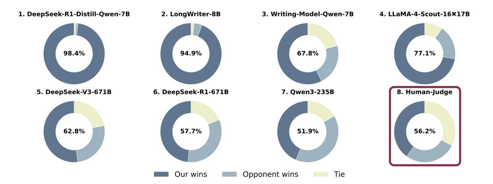

# 4.1 Experiment Setup

**Inference Setup.** We utilize the SGLang [71] system, which optimizes key-value (KV) cache memory for efficient large-scale inference. This system is crucial for handling long-form generation efficiently, reducing memory overhead, and maximizing inference throughput. Inferences are performed using BFloat16 precision on 8×NVIDIA H800 GPUs. This setup ensured consistency and efficiency in the inference process.

**Benchmark Setup.** We conduct our experiments on two datasets. The first is WritingBench [60], a comprehensive benchmark designed to evaluate large language models across six major writing domains and 100 sub-domains, encompassing creative, persuasive, informational, and technical tasks. The benchmark comprises 1,200 real-world writing prompts, each paired with five instance-specific evaluation criteria. WritingBench adopts a query-dependent evaluation framework and leverages a Qwen2.5-7B critic model fine-tuned on 50K human-labeled samples to produce fine-grained assessments of style, format, and length, achieving an 83% agreement rate with human judgments.

The second dataset includes approximately 200 real-world user instructions manually curated by us. We evaluate model performance through pairwise comparisons across several baselines (Win-rate), including LongWriter-8B [6], DeepSeek-R1-Distill-Qwen-7B [12], Writing-Model-Qwen-7B [60]4,

&lt;sup>4This refers to the SFT model obtained via rejection sampling using the WritingBench critic model.

> **[图片提取文字 (无描述)]:**
> 1. DeepSeek-R1-Distill-Qwen-7B 2. LongWriter-8B 3. Writing-Model-Qwen-7B 4. LLaMA-4-Scout-16×17B 94.9% 98.4% 67.8% 77.1% 8. Human-Judge 5. DeepSeek-V3-671B 6. DeepSeek-R1-671B 7. Qwen3-235B 62.8% 57.7% 51.9% 56.2% Our wins Opponent wins Tie

Figure 5: This figure presents eight donut charts comparing the win rates of our model against seven different baselines. The win-rate in the 8th chart is evaluated by human (Ours vs. Writing-Model-Qwen-7B) while the rest are evaluated by GPT-4.1. Each chart shows the proportions of wins, losses, and ties, with the central percentage indicating the overall win rate. When calculating the win rate, a tie is counted as 0.5 win for both sides.

Qwen3 [\[52\]](#page-15-8), LLaMA-4-Scout [\[1\]](#page-9-0), DeepSeek-V3 [\[13\]](#page-10-4), and DeepSeek-R1 [\[12\]](#page-10-2). All models are evaluated using consistent decoding configurations (temperature = 0.6, top-p = 0.95), and win rates are calculated to quantify comparative performance.

## 4.2 WritingBench Result

We evaluate our 7B sized *SuperWriter*-LM model on the WritingBench benchmark. As shown in Tab [1,](#page-6-1) *SuperWriter*-LM achieves an overall performance (Avg) of 8.51—second-best among all models, closely following DeepSeek-R1 [\[12\]](#page-10-2). It demonstrates strong capabilities in both Chinese–8.6 and English–8.5, even matching DeepSeek-R1 in English performance.

Across different domains, *SuperWriter*-LM achieves the highest scores in three major areas: (D1) Academic & Engineering–8.6, (D2) Finance & Business–8.7, (D3) Politics & Law–8.7 and (D5) Education–8.7, even slightly outperforming the DeepSeek-R1 model. Additionally, *SuperWriter*-LM satisfies various special writing requirements, except the length\_C setting. This discrepancy is primarily due to the nature of agent-generated data, which tends to produce longer outputs even for short-text tasks—an issue that does not affect long-form generations.

## 4.3 Win-Rate Result

WritingBench adopts a critic model to evaluate model outputs by assigning scores (ranging from 1 to 10) across 4–5 distinct dimensions. However, this evaluation approach has several limitations. First, due to the relatively small size of the critic model, it may be vulnerable to some word/sentence hacking. Second, we observe that WritingBench primarily focuses on formal or professional writing tasks—such as summaries and reports—whereas our analysis of real-world data from *WildChat* [\[68\]](#page-16-1) and *LMSYS-Chat-1M* [\[69\]](#page-16-2) reveals that creative writing (e.g., storytelling, fiction) constitutes a significant portion of user queries. To address these concerns, we adopt a more direct and interpretable evaluation metric: win-rate. We evaluate model performance on nearly 200 real-world user queries collected from the aforementioned datasets. For each query, responses are generated by *SuperWriter*-LM and six baseline models.

LLM Evaluation. For automatic evaluation, we adopt LLM-as-a-judge [\[4,](#page-9-1) [70\]](#page-16-4) to perform pairwise comparison using GPT-4.1-2025-04-14 [\[30\]](#page-12-4). To mitigate positional bias, we conduct two evaluations per pair by swapping the response order: Evaluation\_Prompt + A + B and Evaluation\_Prompt + B + A. Based on the two judgments, we categorize the results into win, loss, or tie and compute win-rate results[5](#page-7-0) .

5Evaluation prompts are provided in Appendix [A.5.](#page-22-0)

As shown in Figure [5,](#page-7-1) *SuperWriter*-LM demonstrates a substantial performance lead among models of the same size (models 1, 2, and 3). Furthermore, in comparisons against larger-sized models (models 4, 5, 6, and 7), *SuperWriter*-LM remains competitive and, in some cases, even slightly outperforms state-of-the-art LLMs. Taken together, these results suggest that *SuperWriter*-LM sets a new performance benchmark among 7B-scale models and even challenges the capabilities of existing state-of-the-art systems. We also present several case studies in Appendix [A.6.](#page-23-0)

Human Evaluation. To mitigate potential inaccuracies in automatic evaluation, we conduct an human supplementary assessment on approximately 200 real-world user queries, comparing *Super-Writer*-LM with Writing-Model-Qwen-7B [\[60\]](#page-15-2). For each query, three independent annotators with undergraduate degrees. were tasked with evaluating and determining the preferred response, with outcomes categorized as win, loss, or tie—following the same standard as the automatic evaluation. The aggregated results are shown in Figure [5](#page-7-1) (8), and *SuperWriter*-LM demonstrates stronger performance under human judgment. However, due to the annotators' tendency to assign a tie when the differences between two responses are subtle, the overall win rate appears slightly lower.

## 4.4 Ablation Study

Finally, we conduct an ablation study comprising four different setups evaluated on the WritingBench benchmark. The first setup uses the base model, *Qwen2.5-Instruct*, as the performance baseline. The second setup, *SuperWriterfinal-answer*, takes the user query as input and produces the final output from the Stage-3 *refine* step of the *SuperWriter*-agent—this is a onepass generation without any explicit thinking process and achieves an average score of 8.21

| Model                      | Avg  | ZH  | EN  |
|----------------------------|------|-----|-----|
| Qwen2.5-7B-Instruct        | 7.43 | 7.3 | 7.5 |
| + SuperWriter final output | 8.21 | 8.3 | 8.2 |
| + Three-Stage              | 8.47 | 8.5 | 8.4 |
| + Hierarchical DPO         | 8.51 | 8.6 | 8.5 |

Figure 6: Performance comparison on Writing-Bench [\[60\]](#page-15-2) – Avg, ZH and EN.

(ZH: 8.3, EN: 8.2). The third setup, *+Three-Stage*, corresponds to our SFT-trained model, which explicitly performs planning, drafting, and refining in a chained, multi-stage manner, incorporating structured thinking. This setup further improves performance to 8.47 (ZH: 8.5, EN: 8.4). The final setup is the full model further enhanced with our hierarchical DPO optimization, reaching the highest score of 8.51 (ZH: 8.6, EN: 8.5). As shown in Table [6,](#page-8-0) each additional component leads to consistent performance improvements, demonstrating the effectiveness of our proposed approach in structured writing tasks.

