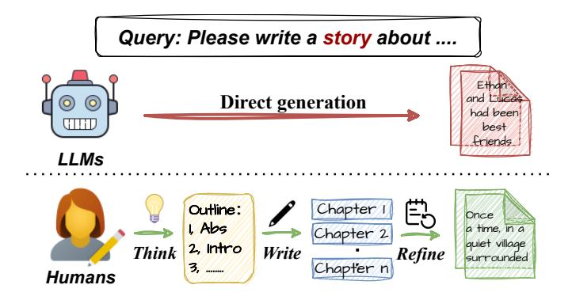

# **Abstract**

Long-form text generation remains a significant challenge for large language models (LLMs), particularly in maintaining coherence, ensuring logical consistency, and preserving text quality as sequence length increases. To address these limitations, we propose SuperWriter-Agent, an agent-based framework designed to enhance the quality and consistency of long-form text generation. SuperWriter-Agent introduces explicit structured thinking—through planning and refinement stages—into the generation pipeline, guiding the model to follow a more deliberate and cognitively grounded process akin to that of a professional writer. Based on this framework, we construct a supervised fine-tuning dataset to train a 7B SuperWriter-LM. We further develop a hierarchical Direct Preference Optimization (DPO) procedure that uses Monte Carlo Tree Search (MCTS) to propagate final quality assessments and optimize each generation step accordingly. Empirical results across diverse benchmarks demonstrate that SuperWriter-LM achieves state-of-the-art performance, surpassing even larger-scale baseline models in both automatic evaluation and human evaluation. Furthermore, comprehensive ablation studies demonstrate the effectiveness of hierarchical DPO and underscore the value of incorporating structured thinking steps to improve the quality of long-form text generation. Our code & models are at: https://github.com/mozhu621/SuperWriter.

> **[图片提取文字 (无描述)]:**
> Query: Please write a story about .... Ethan and Luca **Direct generation** had been best friends LLMs Chapter 1 Chapter 2 Outline: Once 1, Abs a time, in a quiet village 2, Intro Think Refine Write Chapter n surrounded Humans

Figure 1: Current LLMs directly generate long text in a single pass, while human writers follow an iterative process of *thinking*, *outlining*, *writing*, and *refining* to ensure coherence and quality.

\*Equal contribution.

