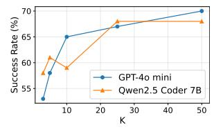
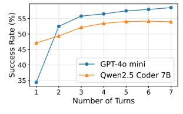
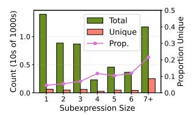
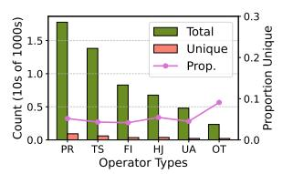
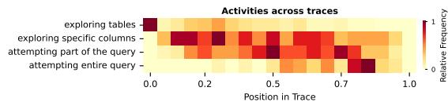

# Supporting Our AI Overlords: Redesigning Data Systems to be Agent-First

Shu Liu, Soujanya Ponnapalli, Shreya Shankar, Sepanta Zeighami, Alan Zhu Shubham Agarwal, Ruiqi Chen, Samion Suwito, Shuo Yuan, Ion Stoica, Matei Zaharia Alvin Cheung, Natacha Crooks, Joseph E. Gonzalez, Aditya G. Parameswaran University of California, Berkeley

### Abstract

Large Language Model (LLM) agents, acting on their users' behalf to manipulate and analyze data, are likely to become the dominant workload for data systems in the future. When working with data, agents employ a high-throughput process of exploration and solution formulation for the given task, one we call agentic speculation. The sheer volume and inefficiencies of agentic speculation can pose challenges for present-day data systems. We argue that data systems need to adapt to more natively support agentic workloads. We take advantage of the characteristics of agentic speculation that we identify, i.e., scale, heterogeneity, redundancy, and steerability—to outline a number of new research opportunities for a new agentfirst data systems architecture, ranging from new query interfaces, to new query processing techniques, to new agentic memory stores.

### 1 Introduction

Powered by Large Language Models (LLMs) that can reason, invoke tools, author code, and communicate with each other, we are on the precipice of a new agentic revolution that will transform how data systems are used. Modern LLMs are far more efficient internally, matching the capabilities of those orders of magnitude larger just a year ago, and growing ever more effective at understanding and manipulating both structured and unstructured data. As they become both cheap and capable, future LLM agents will act on users' behalf: extracting, analyzing, transforming, and updating data—potentially becoming the dominant workload for data systems.

While LLM agents may match human reasoning capabilities, they won't possess grounding—an awareness of the underlying data and characteristics of the data systems on which the data is stored. However, they can make up for this lack of grounding by tirelessly working through possible solutions to a given data transformation task, far more than any human could or would. Each individual LLM agent can theoretically issue hundreds or thousands of requests a second[1](#page-0-0) , with this rate scaling with the number of LLM agents. Many of these requests are not attempts at a solution, but are instead part of an exploratory process of metadata discovery (e.g., table schemas, column statistics), coupled with partial solutions and validation. We refer to this combination of discovery and solution formulation as agentic speculation—i.e., high-throughput, exploratory querying to identify the best course of action.

Agentic speculation represents a substantial departure from present-day data systems workloads, which are either more intermittent (e.g., from humans or tools operating on their behalf) or more targeted (e.g., from end-user applications). Consider an army

of LLM agents tasked with finding reasons for why profits in coffee bean sales in Berkeley was low this year relative to last. Since they are not limited by human cognitive bandwidth and response times, an army of agents could employ an enormous volume of queries to data systems, far more than any human could—all for a single task. Many of these queries are likely wasteful, and are simply providing the agents grounding. As another example, if an LLM agent is tasked with identifying a new crew for a delayed flight, it would need to consider various hypothetical transactions to surface to a human decision maker, each with dozens of updates to various databases.[2](#page-0-1) For such tasks, agents may explore many alternatives in parallel by forking database state, running speculative updates, and rolling back branches. Overall, as agentic workloads become more and more prevalent, the sheer scale and inefficiencies of agentic speculation will become the bottleneck, and our data systems will need to evolve in response.

So we ask the question: how can data systems evolve to better support agentic workloads? In particular, can data systems natively and efficiently—support agentic speculation, helping LLM agents determine the best course of action? This question—which, as we argue, our community is well-equipped to answer—holds the key to unlocking unimaginable productivity gains from agents being the primary mechanism we use to interact with data.

Thankfully, while agentic speculation represents a new challenge for data systems, its characteristics present new opportunites for the redesign of data systems. As we show, agentic speculation:

- (1) can be high throughput, benefiting from a lot of requests to the backend systems, issued in sequence and/or in parallel, to determine how to solve the given task.
- (2) is heterogeneous, spanning coarse-grained data and metadata exploration, partial and complete solution formulation, and validation allowing LLM agents to make progress with approximate or incomplete outputs in early stages.
- (3) has redundancy: many requests may access similar data or perform overlapping operations, offering opportunities to share computation or eliminate redundant work.
- (4) is steerable: since speculation is fundamentally exploratory, if we move beyond the query-answer paradigm and allow data systems to more directly communicate with LLM agents, it could help steer LLM requests toward the most promising directions.

In this paper, we propose a new research vision for our community around redesigning data systems for agents, by leveraging the aforementioned characteristics of speculation—scale, heterogeneity, redundancy, and steerability. In Sec. [2,](#page-1-0) we illustrate through case studies the characteristics of present-day agentic speculation.

1https://developer.nvidia.com/deep-learning-performance-training-inference/aiinference

2Example thanks to Keshav Murthy at Couchbase.

In Sec. 3, we propose a new architecture for agent-first data systems. In Sec. 4, 5, and 6, we identify new research opportunities in the interface, query processing, and storage layers, respectively.

#### 2 Case Studies

In this section we explore the characteristics of agentic workloads through two case studies—and identify patterns in these queries that present optimization opportunities. While these case studies are simple, they are easier to evaluate for correctness.

> **[图片提取文字 (无描述)]:**
> Success Rate (%) GPT-40 mini Qwen2.5 Coder 7B 30

> **[图片提取文字 (无描述)]:**
> Success Rate (%) 6 4 5 6 55 GPT-40 mini Qwen2.5 Coder 7B Number of Turns

(a) Success @ K

(b) Success vs. Turns

Figure 1: Results on the BIRD dataset

We use the BIRD text2SQL benchmark [10] in our first study. We wanted to explore if present-day LLMs benefit from increasing the number of requests—in parallel or in sequence. We used DuckDB as our backend, and GPT-40-mini and Qwen2.5-Coder-7B-Instruct as two LLMs. To first evaluate parallel requests, we simulated the behavior of an LLM agent "in charge," with a number of "field" agents each independently attempting the task, followed by the agent-in-charge picking one among the corresponding solutions. We plot the average success rate versus the number of LLM attempts in Figure 1a. To instead evaluate sequential requests, we had a single LLM agent issue queries until it was satisfied and once again plot the success rate versus the number of steps taken in Figure 1b. We find that:

Agentic speculation—in sequence or in parallel—helps improve accuracy.

The success rate of agentic workloads increases as a function of requests, and by 14%-70% in our case study.

> **[图片提取文字 (无描述)]:**
> Count (10s of 1000s) Total Unique Prop. Subexpression Size

> **[图片提取文字 (无描述)]:**
> 0.3 Count (10s of 1000s) O.2 Onida Total Unique Prop. PR TS UA Operator Types

(a) versus subexpression size.

(b) versus root operation.

Figure 2: Total vs. unique subexpressions (count and proportion) across 50 attempts generated by GPT-40-mini per problem, aggregated over the full BIRD dataset. Here, PR=Projection, TS=Scan, FI=Filter, HJ=Hash Join, UA=Aggregate, OT=other operations.

Next, we quantify the degree to which work sharing is possible across requests. We focus our attention on the parallel setting, with 50 independent attempts—and evaluate the redundancy across these attempts. We plot the total number and distinct number of sub-plans or sub-expressions of each size in the 50 query plans generated for a given task, aggregated across the full BIRD dataset, in Figure 2a. We present a similar plot for sub-plans grouped by root operator type in Figure 2b. We find:

> **[图片提取文字 (无描述)]:**
> Activities across traces exploring tables exploring specific columns attempting part of the query attempting entire guery -0.2 Position in Trace

Figure 3: Labeled agent activities, with x-axis showing normalized position in the trace, and each row (activity) normalized independently. Agents first explore table and columns then formulate queries, with phases often overlapping.

Table 1: Mean activity counts per agent trace, averaged across all traces, with and without human expert-provided hints.

| Activity                     | Avg (No Hints) | Avg (w/ Hints) | Reduction (%) |
|------------------------------|----------------|----------------|---------------|
| exploring tables             | 3.44           | 2.95           | -14.2         |
| exploring specific columns   | 3.56           | 2.57           | -27.7         |
| attempting part of the query | 4.28           | 2.71           | -36.6         |
| attempting entire query      | 1.26           | 1.05           | -16.6         |
| all SQL queries              | 12.67          | 10.38          | -18.1         |

