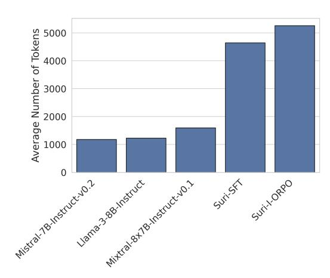
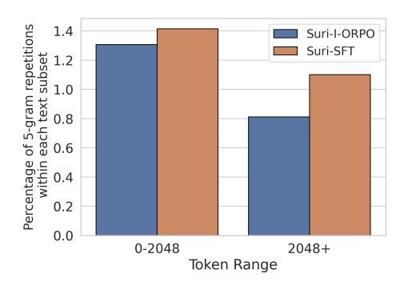

# 4 Automatic Evaluation

Our automatic assessment demonstrates that both Suri-I-ORPO and Suri-SFT increase the length of the generated texts while maintaining a reasonable level of repetition. Compared to baseline models, Suri-I-ORPO is more likely to assign higher log probabilities to tokens in the response given the correct instruction than the corrupted instruction.

## 4.1 **Suri**-I-ORPO and **Suri**-SFT generate substantially longer text.

We measure the average number of tokens[9](#page-5-0) in generations from our fine-tuned models (Suri-I-ORPO and Suri-SFT) and compare them to baseline models, including Mistral-7B-Instruct-v0.2, Llama-3- 8B-Instruct [\(AI@Meta,](#page-9-10) [2024\)](#page-9-10), and Mixtral-8x7B-Instruct-v0.1 [\(Jiang et al.,](#page-10-11) [2024\)](#page-10-11). For faster inference, we use vLLM [\(Kwon et al.,](#page-10-12) [2023\)](#page-10-12) to generate outputs from the backtranslated instruction xw. [10](#page-5-1) Proprietary models like GPT-4 and Claude are excluded due to their maximum generation output limit of 4,096 tokens,[11](#page-5-2) whereas open-weight models allow for outputs of arbitrary maximum length.

> **[图片提取文字 (无描述)]:**
> Average Number of Tokens motes 8x18 instruction 1 Metal. B. Hetrut. vo. 2 0 Llana 388 Herrick Suril Oppo Suri-SFT

Figure 4: Average number of tokens in generations from baseline open-source models (Llama-3-8B-Instruct, Mixtral-8x7B-Instruct-v0.1, Mistral-7B-Instruct-v0.2) and our fine-tuned models (Suri-I-ORPO, Suri-SFT).

Our fine-tuned models, Suri-SFT and Suri-I-ORPO, generate significantly longer outputs compared to the open-weight baselines, with an average of approximately 4,800 and 5,100 tokens per generation, respectively (Figure [4\)](#page-5-3). These lengths exceed the maximum generation capacity of proprietary models, which is limited to around 4,096 tokens. Among the baselines, Mixtral produces the longest generations, averaging over 1,500 tokens, while Mistral-Instruct generates the shortest outputs, around 1,100 tokens per generation.

## 4.2 **Suri**-I-ORPO and **Suri**-SFT do not degenerate into repetitions at longer sequences.

We analyze the presence of repetitions in model generations. Since LLMs often degrade into repetitions over longer sequences, this measurement helps us identify when and how the model starts producing repetitive content. Previous work [\(Li](#page-10-13) [et al.,](#page-10-13) [2016;](#page-10-13) [See et al.,](#page-11-5) [2019\)](#page-11-5) measures unigram, bigram, and trigram repetitions. However, we are interested in sentence-level repetitions, such as when the same phrase is repeated in a dialogue at the start of each sentence. Therefore, we measure 5- and 10-gram repetitions to capture these higher-level patterns. We count a repetition when a specific n-gram appears at least three times in the text.

|         | I ORPO | SFT | Mistral Instruct | Llama Instruct | Mixtral Instruct |
|---------|-----------|-----|---------------------|-------------------|---------------------|
| 5-gram  | 24%       | 29% | 12%                 | 26%               | 31%                 |
| 10-gram | 3%        | 3%  | 1%                  | 2%                | 5%                  |

Table 2: Percentage of generations containing n-gram repetitions out of 5K generations from the test set (rounded to the nearest whole number).

> **[图片提取文字 (无描述)]:**
> Percentage of 5-gram repetitions within each text subset 0.0 0.4 0.0 0.9 0.0 0.4 0.5 0.0 0.4 0.5 0.5 0.5 0.5 0.5 0.5 0.5 0.5 0.5 0.5 Suri-I-ORPO Suri-SFT 0.0 2048 +0 - 2048Token Range

Figure 5: Average percentage of 5-gram repetitions before and after 2,048 tokens in each generation from I-ORPO and SFT models.

Despite having the longest generations, Suri-I-ORPO and Suri-SFT maintain a low percentage of generations with n-gram repetitions (Table [2\)](#page-5-4). Among the baseline models, Mistral-Instruct has the lowest percentage of generations with repetition, possibly because its generations are also the shortest. Surprisingly, Llama-Instruct and Mixtral-Instruct, with their short generations, possess a greater proportion of generations with n-gram repetitions compared to our fine-tuned models.

We further examine the percentage of 5-gram repetitions, normalized by the length of each text,

9Measured using tiktoken package ([https://github.](https://github.com/openai/tiktoken) [com/openai/tiktoken](https://github.com/openai/tiktoken)) with "o200k\_base" encoding.

10Experiment done using greedy decoding, max\_token=10K. Inference prompts specify that 5K tokens should be generated.

11[Claude documentation;](https://docs.anthropic.com/en/docs/models-overview) [OpenAI documentation](https://platform.openai.com/docs/api-reference/audio)

generated by our fine-tuned models. As shown in Figure [5,](#page-5-5) the percentage of 5-gram repetitions does not increase after 2,048 tokens, indicating that our fine-tuned models do not exhibit degradation in longer sequences.

### 4.3 I-ORPO improves ranking accuracy

To understand the capabilities of models to differentiate between correct and corrupted instructions, we evaluate ranking accuracy [\(See et al.,](#page-11-5) [2019;](#page-11-5) [Chen et al.,](#page-9-11) [2024a\)](#page-9-11). This involves measuring the percentage of cases in which the model assigns a higher probability to the gold response under the correct instruction than under the corrupted version. We calculate the sum of token log probabilities in the response given the previous tokens, denoted by logps(y|x), and determine accuracy based on the proportion of times when logps(y|xw) > logps(y|xl). A higher accuracy indicates that the model is more sensitive to the instructions and can determine which instruction is the correct instruction for the given response.

We use Hugging Face's Transformers [\(Wolf](#page-14-4) [et al.,](#page-14-4) [2020\)](#page-14-4) to access the probability distribution over vocabulary and measure the impact of instruction specificity on ranking accuracy across five different settings, which are defined by the number of all constraints included (M constraints in total) and the number of those included constraints that are corrupted: (M,M), (M,M/2), (M,1), (M/2,M/2), (1,1). For example, in the (M, M/2) setting, both instructions include all constraints, but only half of the constraints are violated.

| Instruction | I     | SFT  | Mistral  | Llama    | Mixtral  |
|-------------|-------|------|----------|----------|----------|
| Specificity | ORPO  |      | Instruct | Instruct | Instruct |
| (M,M)       | 100.0 | 99.8 | 90.6     | 65.7     | 66.5     |
| (M,M/2)     | 100.0 | 99.2 | 92.1     | 57.5     | 60.4     |
| (M,1)       | 98.3  | 91.0 | 90.4     | 47.7     | 55.2     |
| (M/2,M/2)   | 99.9  | 97.8 | 79.7     | 60.0     | 57.4     |
| (1,1)       | 98.4  | 81.2 | 62.5     | 50.9     | 48.5     |

Table 3: Ranking accuracy on the Suri test set across five levels of instruction specificity. Percentages are rounded to one decimal place.

Suri-I-ORPO shows at least a 10% improvement in ranking accuracy over the baseline Mistral-Instruct across all instruction specificity settings, with Suri-SFT following closely (Table [3\)](#page-6-0). Mistral-Instruct remains a strong baseline, achieving the highest ranking accuracy among the three baseline models. In contrast, Llama-3-7b-Instruct and Mixtral-8x7b-Instruct perform the worst, trailing Suri-I-ORPO by up to 50%. We observe that settings with more constraints in the instruction, namely (M,M), (M,M/2), and (M,1), generally lead to better performance. This trend suggests that seeing more constraints helps the model better differentiate between correct and corrupted constraints.

