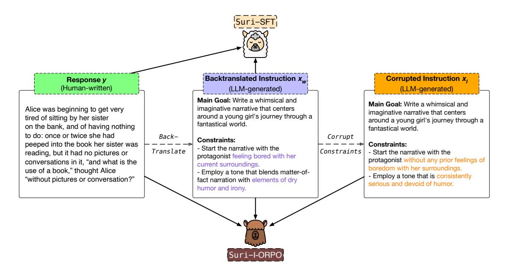
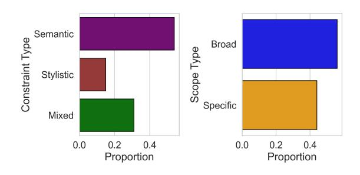
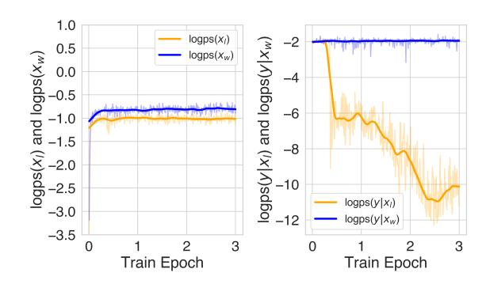

# Chau Minh Pham Simeng Sun\* Mohit Iyyer

University of Massachusetts Amherst {ctpham,simengsun,miyyer}@cs.umass.edu

## Abstract

Existing research on instruction following largely focuses on tasks with simple instructions and short responses. In this work, we explore multi-constraint instruction following for generating long-form text. We create Suri, a dataset with 20K human-written long-form texts paired with LLM-generated backtranslated instructions that contain multiple complex constraints. Because of prohibitive challenges associated with collecting human preference judgments on long-form texts, preferencetuning algorithms such as DPO are infeasible in our setting; thus, we propose Instructional ORPO (I-ORPO), an alignment method based on the ORPO algorithm. Instead of receiving negative feedback from dispreferred *responses*, I-ORPO obtains negative feedback from synthetically corrupted *instructions* generated by an LLM. Using Suri, we perform supervised and I-ORPO fine-tuning on Mistral-7b-Instruct-v0.2. The resulting models, Suri-SFT and Suri-I-ORPO, generate significantly longer texts (∼5K tokens) than base models without significant quality deterioration. Our human evaluation shows that while both SFT and I-ORPO models satisfy most constraints, Suri-I-ORPO generations are generally preferred for their coherent and informative incorporation of the constraints.[1](#page-0-0)

### 1 Introduction

Improving the instruction-following abilities of modern large language models (LLMs) is critical to increasing their effectiveness and generalizability for many practical applications. However, most existing instruction-following datasets (e.g., Alpaca) contain only simple instructions that can be solved by short model generations [\(Taori et al.,](#page-11-0) [2023;](#page-11-0) [Conover et al.,](#page-9-0) [2023;](#page-9-0) [Köpf et al.,](#page-10-0) [2023\)](#page-10-0). What

about tasks with complex, multi-constraint instructions that can only be satisfied with *long-form* outputs (i.e., thousands of tokens), such as creating detailed technical reports or writing engaging fictional narratives?

We explore this question by conducting the first in-depth study of long-form instruction following with multi-constraint instructions. To facilitate our experiments, we create a new dataset, Suri, [2](#page-0-1) using instruction backtranslation [\(Li et al.,](#page-10-1) [2023;](#page-10-1) [Kök](#page-10-2)[sal et al.,](#page-10-2) [2023\)](#page-10-2). This process involves feeding a human-written long-form text (e.g., chapters from a novel) into an LLM to generate instructions that could have been followed to create the text. The resulting dataset, Suri, consists of 20K texts paired with LLM-generated instructions, each containing ≈10 semantic and stylistic constraints (Figure [1\)](#page-1-0).

How can we use Suri to improve an LLM's longform instruction following abilities? While supervised fine-tuning (SFT) has been quite effective for short-form datasets [\(Mishra et al.,](#page-10-3) [2022;](#page-10-3) [Wang](#page-14-0) [et al.,](#page-14-0) [2022;](#page-14-0) [Sanh et al.,](#page-11-1) [2022;](#page-11-1) [Wei et al.,](#page-14-1) [2022;](#page-14-1) [Chung et al.,](#page-9-1) [2022\)](#page-9-1), we observe that fine-tuned Suri models often generate texts that are incoherent and fail to satisfy constraints towards the end in the instructions. Preference tuning methods such as DPO [\(Rafailov et al.,](#page-10-4) [2023\)](#page-10-4) and RLHF [\(Ouyang](#page-10-5) [et al.,](#page-10-5) [2022\)](#page-10-5) are challenging to use in this setting due to difficulties and cost in obtaining preference judgments on long-form texts [\(Touvron et al.,](#page-14-2) [2023;](#page-14-2) [Xu et al.,](#page-15-0) [2023c\)](#page-15-0). Specifically, when annotating preferences for long texts, human annotators may struggle to determine if different sections of the text are faithful to the instructions while simultaneously considering multiple aspects of the text, such as coherence and informativeness.

Motivated by this, we devise an alignment method that relies on synthetically *corrupted* instructions. Specifically, we take the backtranslated

\*Now at NVIDIA

1Code & Data are available at [https://github.com/](https://github.com/chtmp223/suri) [chtmp223/suri](https://github.com/chtmp223/suri)

2 Suri is an alpaca breed known for its long, lustrous hair.

> **[图片提取文字 (无描述)]:**
> Backtranslated Instruction x,,, Corrupted Instruction x, Response y (Human-written) (LLM-generated) (LLM-generated) Main Goal: Write a whimsical and Main Goal: Write a whimsical and imaginative narrative that centers Alice was beginning to get very imaginative narrative that centers around a young girl's journey through a tired of sitting by her sister around a young girl's journey through a fantastical world. on the bank, and of having nothing fantastical world. to do: once or twice she had Back-Corrupt Constraints: peeped into the book her sister was Constraints: - Start the narrative with the Translate Constraints Start the narrative with the reading, but it had no pictures or protagonist feeling bored with her protagonist without any prior feelings of conversations in it, "and what is the current surroundings. boredom with her surroundings. use of a book," thought Alice - Employ a tone that blends matter-of-- Employ a tone that is consistently "without pictures or conversation?" fact narration with elements of dry serious and devoid of humor. humor and irony.

Figure 1: Our work consists of two stages. First, we construct the Suri dataset using gold responses sampled from three existing datasets that include creative writing and open web text, along with backtranslated instruction xw and corrupted instruction xl . Second, we fine-tune Mistral-7B-Instruct-v0.2 on Suri, resulting in two variations: Suri-I-ORPO (via I-ORPO) and Suri-SFT (via supervised fine-tuning).

instruction xw and corrupt its constraints using an LLM such that the gold response does not satisfy the corrupted constraints (for example, see xl in Figure [1\)](#page-1-0). We then develop a variant of the Odds Ratio Preference Optimization objective [\(Hong](#page-9-2) [et al.,](#page-9-2) [2024,](#page-9-2) ORPO) to use these corrupted instructions as negative feedback. We refer to this alignment method as Instructional ORPO, or I-ORPO for short.

We conduct a series of automatic and human evaluations on generations from SFT and I-ORPOtuned models to validate our method. Compared to the base model, Mistral-7b-Instruct-v0.2 [\(Jiang](#page-10-6) [et al.,](#page-10-6) [2023\)](#page-10-6), both SFT and I-ORPO significantly increase the generation length from 1K to 5K tokens. Our fine-tuned models also improve the ability to differentiate between correct and corrupted instructions by at least 10% while maintaining low levels of n-gram repetitions in the text. We find that LLM judges, such as GPT-4o [\(Ope](#page-10-7)[nAI,](#page-10-7) [2024\)](#page-10-7), Gemini-1.5-Pro [\(Team et al.,](#page-11-2) [2024\)](#page-11-2), and Claude-3.5-Sonnet [\(Anthropic,](#page-9-3) [2024\)](#page-9-3), cannot reliably evaluate long-form responses, which makes human evaluation crucial for assessing the constraint-following capabilities of our generations. Annotators note that our fine-tuned models effectively follow given constraints, with I-ORPO being preferred to our SFT model for its ability to incorporate constraints coherently, informatively, and enjoyably.

## 2 The **Suri** Dataset

We focus on the task of long-form writing, both fictional and non-fictional, under multiple constraints. When using an LLM for a complex writing task, users might have many constraints in mind and expect lengthy, detailed responses in the form of books, blog posts, etc. This task is particularly challenging for current LLMs, which struggle with generating coherent long-form outputs [\(Guan](#page-9-4) [et al.,](#page-9-4) [2021;](#page-9-4) [Wang et al.,](#page-14-3) [2023a\)](#page-14-3), and this difficulty can be amplified when multiple constraints are involved. Recent instruction-following datasets have featured multi-constraint instructions [\(Xu et al.,](#page-15-1) [2024;](#page-15-1) [Malaviya et al.,](#page-10-8) [2024\)](#page-10-8) and long-form responses [\(Köksal et al.,](#page-10-2) [2023;](#page-10-2) [Chen et al.,](#page-9-5) [2024b\)](#page-9-5), but none has integrated these two elements (Table [1\)](#page-2-0). We bridge this gap by creating Suri, which features complex instructions with multiple constraints and lengthy gold responses (2-5K words, about 3-6K tokens).

We collect human-written English text samples, such as books, religious texts, and blog posts, to serve as gold responses (y). Since gathering humanwritten instructions for such lengthy responses is difficult and expensive, we turn to *instruction backtranslation* [\(Li et al.,](#page-10-1) [2023;](#page-10-1) [Köksal et al.,](#page-10-2) [2023\)](#page-10-2), in which an LLM is provided with a human-written text (e.g., a short story) and prompted to generate instructions (xw) that could have been followed to create that text. We further corrupt the con-

| Category                                                | Dataset                                                                  | Size        | Domain                                               | Prompt Length | Response Length |
|---------------------------------------------------------|--------------------------------------------------------------------------|-------------|------------------------------------------------------|------------------|--------------------|
| Writing Instructions                                    | ROCStory (Mostafazadeh et al., 2016) WritingPrompt (Fan et al., 2018) | 50K 300K | Creative Writing Creative Writing                 | 36 28         | 8 735           |
| Instruction following                                | Alpaca (Taori et al., 2023)                                              | 52K         | General Q&As                                         | 13               | 44                 |
| Long-form                                               | LongForm-C (Köksal et al., 2023)                                         | 28K         | CommonCrawl, Wikipedia, StackExchange, Wikihow | 149              | 298                |
| Instruction-following                                   | LongAlpaca-16K (Chen et al., 2024b)                                      | 12K         | Science, Creative Writing, Wiki, General Q&As     | 5945             | 218                |
|                                                         | Scrolls (Shaham et al., 2022)                                            | 120K        | Legal, Science, Entertainment                        | 33506            | 97                 |
| Multi-constraint Instructions                        | Dolomites (Malaviya et al., 2024)                                        | 2K          | 25 Academic Fields                                   | 235              | 343                |
| Multi-constraint, Long-form Instruction-following | Suri (this work)                                                         | 20K         | CommonCrawl, Creative Writ ing                    | 347              | 4371               |

Table 1: Comparison of Suri with other single-turn datasets in terms of relevant data features, including writing instructions, instruction-following datasets, and constrained instructions. The data size as well as the average length of prompts and responses is either quoted from the original paper or calculated from publicly available subsets. Suri is the only dataset featuring both constrained instructions and long responses (> 4K tokens) specifically designed for text generation.

straints in xw to obtain synthetically corrupted instructions (xl) for our I-ORPO alignment method. In total, Suri contains 20K single-turn examples, each consisting of a backtranslated instruction xw, corrupted instruction xl , and a human-written response y. In this section, we detail our approach to selecting high-quality text samples (§[2.1\)](#page-2-1) and creating backtranslated instructions (§[2.2\)](#page-2-2). We also validate our generated instructions (§[2.3\)](#page-3-0) and analyze the resulting dataset (§[2.4\)](#page-3-1).

## 2.1 Collecting Responses

Obtaining long-form gold responses y through crowdsourcing or hiring experts requires significant cost and effort. As an alternative, we sample human-written texts in equal proportions from three existing datasets: ChapterBreak [\(Sun et al.,](#page-11-4) [2022\)](#page-11-4), Books3 [\(Presser,](#page-10-10) [2020;](#page-10-10) [Gao et al.,](#page-9-7) [2020\)](#page-9-7), and RedPajama-Data-v2 [\(Computer,](#page-9-8) [2023\)](#page-9-8). We truncate the sampled texts to between 2,048 and 5,024 words, making them significantly longer than those in existing instruction-following datasets (Table [1\)](#page-2-0). The final Suri dataset is divided into training, validation, and test sets in a 10K/5K/5K split.

ChapterBreak ChapterBreak (AO3 split) contains 7,355 fanfiction stories on Archive of Our Own (AO3), of which 6,656 texts are sampled for Suri. We merge the individual chapters from the cleaned text into a single document.

Books3 Books3 contains 197K books on Bibliotik,[3](#page-2-3) of which 6,698 texts are sampled. We use regular expressions to filter out irrelevant metadata, such as tables of contents and acknowledgments.

RedPajama-Data-v2 RedPajama contains over 100 billion documents from 84 CommonCrawl dumps. Unlike ChapterBreak and Books3, which consist primarily of books and literary narratives, RedPajama captures the style of everyday writing with informal textual content such as blog posts, obituaries, and more. We apply a set of quality filters (see Appendix [A\)](#page-16-0) on the 2023-06 and 2023- 14 snapshots to obtain a subset of ≈ 300K highquality, non-duplicated documents written in English, from which 6,646 texts are sampled.

### 2.2 Creating Instructions via Backtranslation

Suri includes backtranslated instructions (xw) and corrupted instructions (xl). To create xl , constraints from xw are minimally edited to be partially violated while still faithful to the overall main goal of the instruction. These corrupted instructions xl , along with xw and y, serve as inputs for our I-ORPO preference tuning experiments.

Backtranslating Instructions Our extracted gold responses do not come with accompanying

3Due to copyright concerns, we only release the titles and IDs of the sampled data from this dataset. We provide a Python script to extract and clean the text so that users with access to Books3 can recreate the samples included in Suri.

instructions. Gathering these instructions can be costly and time-consuming, as annotators have to synthesize the instructions from long texts. Therefore, we use instruction backtranslation [\(Li et al.,](#page-10-1) [2023;](#page-10-1) [Köksal et al.,](#page-10-2) [2023\)](#page-10-2) to generate the missing instructions. Specifically, we prompt GPT-4-turbo[4](#page-3-2) with a gold response y to generate a corresponding instruction xw that contains a main goal, which summarizes the content of the text, and a list of ≈10 constraints (Table [9\)](#page-18-0). These constraints can focus on stylistic elements (how something is communicated through tone, language, sentence structure), semantic elements (what topics, meanings, and concepts are included), or a combination of both. Constraints can also be broad, applying to large portions of the text, or specific, addressing elements that occur only once. The result is a set of highly detailed, multi-constraint instructions that cover different parts of the text (xw in Figure [1\)](#page-1-0).

Corrupting Instructions We want to use Suri in our alignment experiments, which traditionally rely on preference judgments (e.g., labeled yw and yl pairs). However, obtaining these judgments for long-form outputs is challenging due to the many competing aspects to consider (e.g., faithfulness to instructions, overall coherence, etc.). Therefore, we focus on learning from a corrupted instruction xl instead of from yl . To create xl , we prompt GPT-4-turbo[5](#page-3-3) to *minimally* edit each constraint in xw while preserving the original main goal (Table [10\)](#page-19-0). The resulting instructions average 386 tokens, closely matching the average length of gold instructions at approximately 411 tokens.[6](#page-3-4)

### 2.3 Validating Instructions

To validate whether the backtranslated instructions faithfully represent the original text, we conduct a human evaluation on a sample of 30 (xw, y) pairs. Three Upwork[7](#page-3-5) annotators are asked to read through the (xw, y) pairs, highlight all text spans in the response that support the given constraints, and determine if the response supports the instruction (Figure [6\)](#page-24-0).

Our findings indicate that, on average, about 87% of the constraints are fully satisfied, with the remaining constraints being partially satisfied (see Appendix [F](#page-24-1) for agreement statistics). We conclude that the backtranslated instructions are generally faithful to the original text.

### 2.4 Instruction Diversity

Instructions in Suri focus primarily on long-form text generation, particularly crafting narratives or articles. Therefore, the key element that introduces diversity across these instructions is the accompanying list of constraints. Here, we measure the proportion of constraints being broad/specific or focusing on semantic/stylistic elements. We prompt Mistral-7B-Instruct-v0.2 [\(Jiang et al.,](#page-10-6) [2023\)](#page-10-6),[8](#page-3-6) to assign each constraint to the applicable category. We find that semantic constraints account for more than half of each instruction, followed by mixed constraints (Figure [2\)](#page-3-7). Broad constraints, on the other hand, make up 56% of the total constraints. Overall, the distribution of constraint types is relatively balanced, with a stronger emphasis on broad and semantic constraints.

> **[图片提取文字 (无描述)]:**
> Semantic Constraint Type Broad Scope Type Stylistic Specific Mixed 0.0 0.2 0.4 0.0 0.2 0.4 Proportion Proportion

Figure 2: Average percentage of different constraint types within each instruction. The left figure categorizes the constraints based on their content, and the right figure refers to constraint scopes.

## 3 Aligning language models with **Suri**

Our goal is to assess whether Suri helps improve the instruction-following capabilities of Mistral-7B-Instruct-v0.2 for long-form text generation.

We experiment with two methods of fine-tuning Mistral-7B-Instruct-v0.2 on Suri: supervised finetuning (SFT) using (xw, y) pairs and a modified ORPO alignment [\(Hong et al.,](#page-9-2) [2024\)](#page-9-2) using (xw, xl , y) triplets. We emphasize that preference judgments are difficult to obtain for long-form responses due to numerous aspects of the text that

4GPT-4-turbo refers to gpt-4-0215-preview. Experiment done using temperature=0.6 and top\_p=0.9.

5Experiment done using model=gpt-4-0125-preview, temperature=0.0, top\_p=0.0 to ensure deterministic results.

6The first author manually reviews a random subset of 50 corrupted claims by comparing them to their corresponding original versions, and confirms that the corruptions are minimal and effective in invalidating the original constraints.

7 See Appendix [F](#page-24-1) for recruitment and compensation details.

8Experiment done using greedy decoding. The first author manually verifies an output subset.

must be considered with respect to the instructions. Therefore, we perform model alignment with correct instruction xw and corrupted instruction xl instead. Full details on fine-tuning libraries, hardware configurations, and hyperparameters can be found in Appendix [C.](#page-20-0)

**Suri**-I-ORPO Odds Ratio Preference Optimization (ORPO) [\(Hong et al.,](#page-9-2) [2024\)](#page-9-2) combines SFT and preference alignment by incorporating a log odds ratio term into the negative log-likelihood loss. We choose ORPO due to its simplicity, competitive performance with other preference tuning algorithms and the ease with which we can modify for our setting.

The original algorithm learns from preference judgments, requiring access to chosen and rejected responses in the (x, yw, yl) format. Since our dataset contains gold and corrupted instructions instead, we modify ORPO so that the algorithm accepts (xw, xl , y). We refer to this modified method as Instructional Odds Ratio Preference Optimization (I-ORPO), where the modified loss is calculated as:

$$\mathcal{L}_{\text{I-ORPO}} = \mathbb{E}_{(x_w, x_l, y)} \left[ \mathcal{L}_{\text{SFT}} + \lambda \cdot \mathcal{L}_{\text{I-OR}} \right] \quad (1)$$

where

$$\mathcal{L}_{\text{I-OR}} = -\log \sigma \left(\log \frac{\text{odds}_{\theta}(y|x_w)}{\text{odds}_{\theta}(y|x_l)}\right) \quad (2)$$

$$\mathbf{odds}_{\theta}(y|x) = \frac{P_{\theta}(y|x)}{1 - P_{\theta}(y|x)} \quad (3)$$

In the original ORPO formulation, the model is learning if the log probability of Pθ(yw|x), denoted logps(yw|x), increases and log probability of Pθ(yl |x), denoted logps(yl |xw), decreases after a number of training steps, resulting in the log odds ratio increasing. In I-ORPO, the same y is used for both instruction types. Therefore, the model is learning if the log probabilities logps(y|xw) and logps(y|xl) diverge while logps(xw) and logps(xl) remain stable. We observe this trend in Figure [3.](#page-4-0)

Loss derivation and analysis are in Appendix [D.](#page-21-0)

We perform I-ORPO fine-tuning with LoRA on Mistral-7B-Instruct-v0.2 for two epochs, using a learning rate of 5e-5, λ of 0.4, and a LoRA rank and alpha of 16. We do not observe signs of the model learning with full-model tuning, so we choose to use LoRA fine-tuning instead. To minimize noise and improve the model's ability to distinguish between gold and corrupted instructions, we include a single constraint in each instruction, xw and xl .

> **[图片提取文字 (无描述)]:**
> 1.0  $logps(x_i)$ logps( $V|X_n$ ) and logps( $V|X_m$ ) 0.5  $logps(x_w)$ 0.0 0.5 - 1.0 - 1.5 - 2.5 - 3.0 - 3.0  $logps(y|x_i)$  $logps(y|x_w)$ -3.5 3 3 Train Epoch Train Epoch

Figure 3: ORPO training curve. Left figure documents the log probability of the chosen and rejected prompts over 3 epochs. Right figure shows the log probability of the response given the chosen and rejected prompts over 3 epochs. A divergence between logps(y|xw) and logps(y|xl) is observed after 0.5 training epoch.

**Suri**-SFT We perform LoRA supervised finetuning [\(Hu et al.,](#page-9-9) [2021\)](#page-9-9) on Mistral-7B-Instruct-v0.2 for two epochs using a learning rate of 5e-5, with a LoRA rank and alpha of 16. For each instruction xw, we include a varying number of constraints to expose the model to different instruction formats. We do not use full-model tuning to match the I-ORPO training setting.

For both Suri-SFT and Suri-I-ORPO, we set the number of epochs to 2, which is determined by a manual inspection of model generations at each epoch checkpoint. We observe that as the number of epochs increases from 1 to 5, both the response length and the number of 5-gram repetitions increase, indicating a trade-off between response length and repetition. After reviewing 30 generations at each epoch, we select the configuration that produces the most coherent responses and minimal repetition. Based on these criteria, the optimal number of epochs is 2, which balances the trade-off between response length and response quality.

