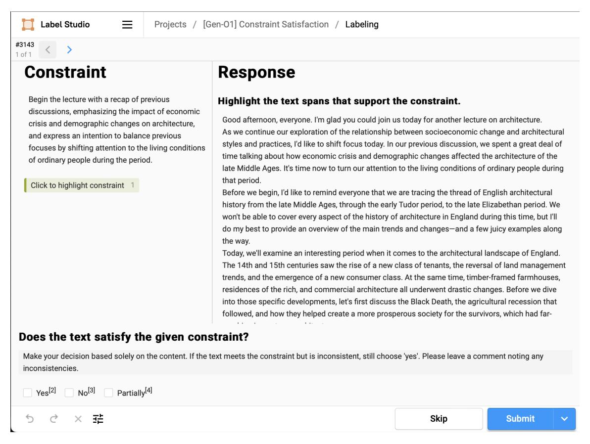

# Ethical Considerations

Our human evaluation receives approval from an institutional review board. All annotators (US-based, fluent in English) gave their informed consent and participated with an hourly compensation of \$16, which meets the minimum wage in our state. Scientific artifacts are implemented according to their intended usage.

### Acknowledgements

We extend special gratitude to the Upwork annotators for their hard work and to the members of Unsloth, r/LocalLLaMA, and Together.ai community for helpful fine-tuning advice. We also thank Scott Niekum, Dzung Pham, and members of the UMass NLP lab for their insights on the project. This project was partially supported by awards IIS-2202506 and IIS-2312949 from the National Science Foundation (NSF) and an award from Open Philanthropy.

## References

- <span id="page-9-10"></span>AI@Meta. 2024. [Llama 3 model card.](https://github.com/meta-llama/llama3/blob/main/MODEL_CARD.md)
- <span id="page-9-3"></span>Anthropic. 2024. [Introducing Claude 3.5 Sonnet.](https://www.anthropic.com/news/claude-3-5-sonnet)
- <span id="page-9-12"></span>Amanda Askell, Yuntao Bai, Anna Chen, Dawn Drain, Deep Ganguli, Tom Henighan, Andy Jones, Nicholas Joseph, Ben Mann, Nova DasSarma, Nelson Elhage, Zac Hatfield-Dodds, Danny Hernandez, Jackson Kernion, Kamal Ndousse, Catherine Olsson, Dario Amodei, Tom Brown, Jack Clark, Sam McCandlish, Chris Olah, and Jared Kaplan. 2021. [A General](https://doi.org/10.48550/arXiv.2112.00861) [Language Assistant as a Laboratory for Alignment.](https://doi.org/10.48550/arXiv.2112.00861) *arXiv preprint*. ArXiv:2112.00861 [cs].
- <span id="page-9-17"></span>Yuntao Bai, Saurav Kadavath, Sandipan Kundu, Amanda Askell, Jackson Kernion, Andy Jones, Anna Chen, Anna Goldie, Azalia Mirhoseini, Cameron McKinnon, Carol Chen, Catherine Olsson, Christopher Olah, Danny Hernandez, Dawn Drain, Deep Ganguli, Dustin Li, Eli Tran-Johnson, Ethan Perez, Jamie Kerr, Jared Mueller, Jeffrey Ladish, Joshua Landau, Kamal Ndousse, Kamile Lukosuite, Liane Lovitt, Michael Sellitto, Nelson Elhage, Nicholas Schiefer, Noemi Mercado, Nova DasSarma, Robert Lasenby, Robin Larson, Sam Ringer, Scott Johnston, Shauna Kravec, Sheer El Showk, Stanislav Fort, Tamera Lanham, Timothy Telleen-Lawton, Tom Conerly, Tom Henighan, Tristan Hume, Samuel R. Bowman, Zac Hatfield-Dodds, Ben Mann, Dario Amodei, Nicholas Joseph, Sam McCandlish, Tom Brown, and Jared Kaplan. 2022. [Constitutional ai: Harmlessness](https://arxiv.org/abs/2212.08073) [from ai feedback.](https://arxiv.org/abs/2212.08073) *Preprint*, arXiv:2212.08073.
- <span id="page-9-13"></span>Yushi Bai, Xin Lv, Jiajie Zhang, Yuze He, Ji Qi, Lei Hou, Jie Tang, Yuxiao Dong, and Juanzi Li. 2024. [LongAlign: A Recipe for Long Context Align](http://arxiv.org/abs/2401.18058)[ment of Large Language Models!](http://arxiv.org/abs/2401.18058) *arXiv preprint*. ArXiv:2401.18058 [cs].
- <span id="page-9-15"></span>BernhardClemm. 2023. [ercexpo/us-news-domains:](https://doi.org/10.5281/zenodo.7651047) [v2.0.0 \(v2.0.0\).](https://doi.org/10.5281/zenodo.7651047)
- <span id="page-9-18"></span>Dallas Card, Peter Henderson, Urvashi Khandelwal, Robin Jia, Kyle Mahowald, and Dan Jurafsky. 2020. [With little power comes great responsibility.](https://doi.org/10.18653/v1/2020.emnlp-main.745) In *Proceedings of the 2020 Conference on Empirical Methods in Natural Language Processing (EMNLP)*, pages 9263–9274, Online. Association for Computational Linguistics.
- <span id="page-9-11"></span>Angelica Chen, Sadhika Malladi, Lily H. Zhang, Xinyi Chen, Qiuyi Zhang, Rajesh Ranganath, and Kyunghyun Cho. 2024a. [Preference learning algo](https://arxiv.org/abs/2405.19534)[rithms do not learn preference rankings.](https://arxiv.org/abs/2405.19534) *Preprint*, arXiv:2405.19534.
- <span id="page-9-5"></span>Yukang Chen, Shengju Qian, Haotian Tang, Xin Lai, Zhijian Liu, Song Han, and Jiaya Jia. 2024b. [Lon](https://arxiv.org/abs/2309.12307)[glora: Efficient fine-tuning of long-context large lan](https://arxiv.org/abs/2309.12307)[guage models.](https://arxiv.org/abs/2309.12307) *Preprint*, arXiv:2309.12307.
- <span id="page-9-1"></span>Hyung Won Chung, Le Hou, Shayne Longpre, Barret Zoph, Yi Tay, William Fedus, Yunxuan Li, Xuezhi

- Wang, Mostafa Dehghani, Siddhartha Brahma, Albert Webson, Shixiang Shane Gu, Zhuyun Dai, Mirac Suzgun, Xinyun Chen, Aakanksha Chowdhery, Alex Castro-Ros, Marie Pellat, Kevin Robinson, Dasha Valter, Sharan Narang, Gaurav Mishra, Adams Yu, Vincent Zhao, Yanping Huang, Andrew Dai, Hongkun Yu, Slav Petrov, Ed H. Chi, Jeff Dean, Jacob Devlin, Adam Roberts, Denny Zhou, Quoc V. Le, and Jason Wei. 2022. [Scaling instruction-finetuned](https://arxiv.org/abs/2210.11416) [language models.](https://arxiv.org/abs/2210.11416) *Preprint*, arXiv:2210.11416.
- <span id="page-9-8"></span>Together Computer. 2023. [Redpajama: an open dataset](https://github.com/togethercomputer/RedPajama-Data) [for training large language models.](https://github.com/togethercomputer/RedPajama-Data)
- <span id="page-9-0"></span>Mike Conover, Matt Hayes, Ankit Mathur, Jianwei Xie, Jun Wan, Sam Shah, Ali Ghodsi, Patrick Wendell, Matei Zaharia, and Reynold Xin. 2023. [Free dolly:](https://www.databricks.com/blog/2023/04/12/dolly-first-open-commercially-viable-instruction-tuned-llm) [Introducing the world's first truly open instruction](https://www.databricks.com/blog/2023/04/12/dolly-first-open-commercially-viable-instruction-tuned-llm)[tuned llm.](https://www.databricks.com/blog/2023/04/12/dolly-first-open-commercially-viable-instruction-tuned-llm)
- <span id="page-9-16"></span>Tri Dao. 2024. FlashAttention-2: Faster attention with better parallelism and work partitioning. In *International Conference on Learning Representations (ICLR)*.
- <span id="page-9-14"></span>Kawin Ethayarajh, Winnie Xu, Niklas Muennighoff, Dan Jurafsky, and Douwe Kiela. 2024. [Kto:](https://arxiv.org/abs/2402.01306) [Model alignment as prospect theoretic optimization.](https://arxiv.org/abs/2402.01306) *Preprint*, arXiv:2402.01306.
- <span id="page-9-6"></span>Angela Fan, Mike Lewis, and Yann Dauphin. 2018. [Hierarchical neural story generation.](https://arxiv.org/abs/1805.04833) *Preprint*, arXiv:1805.04833.
- <span id="page-9-7"></span>Leo Gao, Stella Biderman, Sid Black, Laurence Golding, Travis Hoppe, Charles Foster, Jason Phang, Horace He, Anish Thite, Noa Nabeshima, Shawn Presser, and Connor Leahy. 2020. The Pile: An 800gb dataset of diverse text for language modeling. *arXiv preprint arXiv:2101.00027*.
- <span id="page-9-19"></span>Leo Gao, Jonathan Tow, Baber Abbasi, Stella Biderman, Sid Black, Anthony DiPofi, Charles Foster, Laurence Golding, Jeffrey Hsu, Alain Le Noac'h, Haonan Li, Kyle McDonell, Niklas Muennighoff, Chris Ociepa, Jason Phang, Laria Reynolds, Hailey Schoelkopf, Aviya Skowron, Lintang Sutawika, Eric Tang, Anish Thite, Ben Wang, Kevin Wang, and Andy Zou. 2024. [A framework for few-shot language model](https://doi.org/10.5281/zenodo.12608602) [evaluation.](https://doi.org/10.5281/zenodo.12608602)
- <span id="page-9-4"></span>Jian Guan, Xiaoxi Mao, Changjie Fan, Zitao Liu, Wenbiao Ding, and Minlie Huang. 2021. [Long text gener](https://arxiv.org/abs/2105.08963)[ation by modeling sentence-level and discourse-level](https://arxiv.org/abs/2105.08963) [coherence.](https://arxiv.org/abs/2105.08963) *Preprint*, arXiv:2105.08963.
- <span id="page-9-2"></span>Jiwoo Hong, Noah Lee, and James Thorne. 2024. [Orpo:](https://arxiv.org/abs/2403.07691) [Monolithic preference optimization without refer](https://arxiv.org/abs/2403.07691)[ence model.](https://arxiv.org/abs/2403.07691) *Preprint*, arXiv:2403.07691.
- <span id="page-9-9"></span>Edward J. Hu, Yelong Shen, Phillip Wallis, Zeyuan Allen-Zhu, Yuanzhi Li, Shean Wang, Lu Wang, and Weizhu Chen. 2021. [Lora: Low-rank adaptation of](https://arxiv.org/abs/2106.09685) [large language models.](https://arxiv.org/abs/2106.09685) *Preprint*, arXiv:2106.09685.

- <span id="page-10-6"></span>Albert Q. Jiang, Alexandre Sablayrolles, Arthur Mensch, Chris Bamford, Devendra Singh Chaplot, Diego de las Casas, Florian Bressand, Gianna Lengyel, Guillaume Lample, Lucile Saulnier, Lélio Renard Lavaud, Marie-Anne Lachaux, Pierre Stock, Teven Le Scao, Thibaut Lavril, Thomas Wang, Timothée Lacroix, and William El Sayed. 2023. [Mistral 7b.](https://arxiv.org/abs/2310.06825) *Preprint*, arXiv:2310.06825.
- <span id="page-10-11"></span>Albert Q. Jiang, Alexandre Sablayrolles, Antoine Roux, Arthur Mensch, Blanche Savary, Chris Bamford, Devendra Singh Chaplot, Diego de las Casas, Emma Bou Hanna, Florian Bressand, Gianna Lengyel, Guillaume Bour, Guillaume Lample, Lélio Renard Lavaud, Lucile Saulnier, Marie-Anne Lachaux, Pierre Stock, Sandeep Subramanian, Sophia Yang, Szymon Antoniak, Teven Le Scao, Théophile Gervet, Thibaut Lavril, Thomas Wang, Timothée Lacroix, and William El Sayed. 2024. [Mix](https://arxiv.org/abs/2401.04088)[tral of experts.](https://arxiv.org/abs/2401.04088) *Preprint*, arXiv:2401.04088.
- <span id="page-10-14"></span>Yekyung Kim, Yapei Chang, Marzena Karpinska, Aparna Garimella, Varun Manjunatha, Kyle Lo, Tanya Goyal, and Mohit Iyyer. 2024. [Fables: Evaluat](https://arxiv.org/abs/2404.01261)[ing faithfulness and content selection in book-length](https://arxiv.org/abs/2404.01261) [summarization.](https://arxiv.org/abs/2404.01261) *Preprint*, arXiv:2404.01261.
- <span id="page-10-16"></span>Julia Kreutzer, Joshua Uyheng, and Stefan Riezler. 2018. [Reliability and learnability of human bandit feedback](https://doi.org/10.18653/v1/P18-1165) [for sequence-to-sequence reinforcement learning.](https://doi.org/10.18653/v1/P18-1165) In *Proceedings of the 56th Annual Meeting of the Association for Computational Linguistics (Volume 1: Long Papers)*, pages 1777–1788, Melbourne, Australia. Association for Computational Linguistics.
- <span id="page-10-12"></span>Woosuk Kwon, Zhuohan Li, Siyuan Zhuang, Ying Sheng, Lianmin Zheng, Cody Hao Yu, Joseph E. Gonzalez, Hao Zhang, and Ion Stoica. 2023. Efficient memory management for large language model serving with pagedattention. In *Proceedings of the ACM SIGOPS 29th Symposium on Operating Systems Principles*.
- <span id="page-10-2"></span>Abdullatif Köksal, Timo Schick, Anna Korhonen, and Hinrich Schütze. 2023. [LongForm: Optimizing In](http://arxiv.org/abs/2304.08460)[struction Tuning for Long Text Generation with Cor](http://arxiv.org/abs/2304.08460)[pus Extraction.](http://arxiv.org/abs/2304.08460) *arXiv preprint*. ArXiv:2304.08460 [cs].
- <span id="page-10-0"></span>Andreas Köpf, Yannic Kilcher, Dimitri von Rütte, Sotiris Anagnostidis, Zhi-Rui Tam, Keith Stevens, Abdullah Barhoum, Nguyen Minh Duc, Oliver Stanley, Richárd Nagyfi, Shahul ES, Sameer Suri, David Glushkov, Arnav Dantuluri, Andrew Maguire, Christoph Schuhmann, Huu Nguyen, and Alexander Mattick. 2023. [Openassistant conversations – democ](https://arxiv.org/abs/2304.07327)[ratizing large language model alignment.](https://arxiv.org/abs/2304.07327) *Preprint*, arXiv:2304.07327.
- <span id="page-10-18"></span>Harrison Lee, Samrat Phatale, Hassan Mansoor, Kellie Lu, Thomas Mesnard, Colton Bishop, Victor Carbune, and Abhinav Rastogi. 2023. Rlaif: Scaling reinforcement learning from human feedback with ai feedback. *arXiv preprint arXiv:2309.00267*.

- <span id="page-10-13"></span>Jiwei Li, Michel Galley, Chris Brockett, Jianfeng Gao, and Bill Dolan. 2016. [A diversity-promoting ob](https://doi.org/10.18653/v1/N16-1014)[jective function for neural conversation models.](https://doi.org/10.18653/v1/N16-1014) In *Proceedings of the 2016 Conference of the North American Chapter of the Association for Computational Linguistics: Human Language Technologies*, pages 110–119, San Diego, California. Association for Computational Linguistics.
- <span id="page-10-1"></span>Xian Li, Ping Yu, Chunting Zhou, Timo Schick, Luke Zettlemoyer, Omer Levy, Jason Weston, and Mike Lewis. 2023. Self-alignment with instruction backtranslation. *arXiv preprint arXiv:2308.06259*.
- <span id="page-10-15"></span>Hao Liu, Carmelo Sferrazza, and Pieter Abbeel. 2023. [Chain of hindsight aligns language models with feed](https://arxiv.org/abs/2302.02676)[back.](https://arxiv.org/abs/2302.02676) *Preprint*, arXiv:2302.02676.
- <span id="page-10-8"></span>Chaitanya Malaviya, Priyanka Agrawal, Kuzman Ganchev, Pranesh Srinivasan, Fantine Huot, Jonathan Berant, Mark Yatskar, Dipanjan Das, Mirella Lapata, and Chris Alberti. 2024. Dolomites: Domainspecific long-form methodical tasks. In *arXiv*.
- <span id="page-10-17"></span>Sourab Mangrulkar, Sylvain Gugger, Lysandre Debut, Younes Belkada, Sayak Paul, and Benjamin Bossan. 2022. Peft: State-of-the-art parameterefficient fine-tuning methods. [https://github.](https://github.com/huggingface/peft) [com/huggingface/peft](https://github.com/huggingface/peft).
- <span id="page-10-3"></span>Swaroop Mishra, Daniel Khashabi, Chitta Baral, and Hannaneh Hajishirzi. 2022. [Cross-task generaliza](https://arxiv.org/abs/2104.08773)[tion via natural language crowdsourcing instructions.](https://arxiv.org/abs/2104.08773) *Preprint*, arXiv:2104.08773.
- <span id="page-10-9"></span>Nasrin Mostafazadeh, Nathanael Chambers, Xiaodong He, Devi Parikh, Dhruv Batra, Lucy Vanderwende, Pushmeet Kohli, and James Allen. 2016. [A corpus](https://doi.org/10.18653/v1/N16-1098) [and cloze evaluation for deeper understanding of](https://doi.org/10.18653/v1/N16-1098) [commonsense stories.](https://doi.org/10.18653/v1/N16-1098) In *Proceedings of the 2016 Conference of the North American Chapter of the Association for Computational Linguistics: Human Language Technologies*, pages 839–849, San Diego, California. Association for Computational Linguistics.
- <span id="page-10-7"></span>OpenAI. 2024. [Model release blog: GPT-4o.](https://openai.com/index/hello-gpt-4o/) Technical report, OpenAI. Accessed: 2024-05-23.
- <span id="page-10-5"></span>Long Ouyang, Jeff Wu, Xu Jiang, Diogo Almeida, Carroll L. Wainwright, Pamela Mishkin, Chong Zhang, Sandhini Agarwal, Katarina Slama, Alex Ray, John Schulman, Jacob Hilton, Fraser Kelton, Luke Miller, Maddie Simens, Amanda Askell, Peter Welinder, Paul Christiano, Jan Leike, and Ryan Lowe. 2022. [Training language models to follow instructions with](https://doi.org/10.48550/arXiv.2203.02155) [human feedback.](https://doi.org/10.48550/arXiv.2203.02155) *arXiv preprint*. ArXiv:2203.02155 [cs].

<span id="page-10-10"></span>Shawn Presser. 2020. [Books3.](https://twitter.com/theshawwn/status/1320282149329784833)

<span id="page-10-4"></span>Rafael Rafailov, Archit Sharma, Eric Mitchell, Stefano Ermon, Christopher D. Manning, and Chelsea Finn. 2023. [Direct preference optimization: Your lan](https://arxiv.org/abs/2305.18290)[guage model is secretly a reward model.](https://arxiv.org/abs/2305.18290) *Preprint*, arXiv:2305.18290.

- <span id="page-11-6"></span>Nazneen Rajani, Lewis Tunstall, Edward Beeching, Nathan Lambert, Alexander M. Rush, and Thomas Wolf. 2023. No robots. [https://huggingface.co/](https://huggingface.co/datasets/HuggingFaceH4/no_robots) [datasets/HuggingFaceH4/no\\_robots](https://huggingface.co/datasets/HuggingFaceH4/no_robots).
- <span id="page-11-8"></span>Rajkumar Ramamurthy, Prithviraj Ammanabrolu, Kianté Brantley, Jack Hessel, Rafet Sifa, Christian Bauckhage, Hannaneh Hajishirzi, and Yejin Choi. 2023. [Is reinforcement learning \(not\) for natural lan](https://arxiv.org/abs/2210.01241)[guage processing: Benchmarks, baselines, and build](https://arxiv.org/abs/2210.01241)[ing blocks for natural language policy optimization.](https://arxiv.org/abs/2210.01241) *Preprint*, arXiv:2210.01241.
- <span id="page-11-9"></span>Jeff Rasley, Samyam Rajbhandari, Olatunji Ruwase, and Yuxiong He. 2020. [Deepspeed: System opti](https://doi.org/10.1145/3394486.3406703)[mizations enable training deep learning models with](https://doi.org/10.1145/3394486.3406703) [over 100 billion parameters.](https://doi.org/10.1145/3394486.3406703) In *Proceedings of the 26th ACM SIGKDD International Conference on Knowledge Discovery & Data Mining*, KDD '20, page 3505–3506, New York, NY, USA. Association for Computing Machinery.
- <span id="page-11-1"></span>Victor Sanh, Albert Webson, Colin Raffel, Stephen H. Bach, Lintang Sutawika, Zaid Alyafeai, Antoine Chaffin, Arnaud Stiegler, Teven Le Scao, Arun Raja, Manan Dey, M Saiful Bari, Canwen Xu, Urmish Thakker, Shanya Sharma Sharma, Eliza Szczechla, Taewoon Kim, Gunjan Chhablani, Nihal Nayak, Debajyoti Datta, Jonathan Chang, Mike Tian-Jian Jiang, Han Wang, Matteo Manica, Sheng Shen, Zheng Xin Yong, Harshit Pandey, Rachel Bawden, Thomas Wang, Trishala Neeraj, Jos Rozen, Abheesht Sharma, Andrea Santilli, Thibault Fevry, Jason Alan Fries, Ryan Teehan, Tali Bers, Stella Biderman, Leo Gao, Thomas Wolf, and Alexander M. Rush. 2022. [Multi](https://arxiv.org/abs/2110.08207)[task prompted training enables zero-shot task gener](https://arxiv.org/abs/2110.08207)[alization.](https://arxiv.org/abs/2110.08207) *Preprint*, arXiv:2110.08207.
- <span id="page-11-5"></span>Abigail See, Aneesh Pappu, Rohun Saxena, Akhila Yerukola, and Christopher D. Manning. 2019. [Do](https://arxiv.org/abs/1909.10705) [massively pretrained language models make better](https://arxiv.org/abs/1909.10705) [storytellers?](https://arxiv.org/abs/1909.10705) *Preprint*, arXiv:1909.10705.
- <span id="page-11-3"></span>Uri Shaham, Elad Segal, Maor Ivgi, Avia Efrat, Ori Yoran, Adi Haviv, Ankit Gupta, Wenhan Xiong, Mor Geva, Jonathan Berant, and Omer Levy. 2022. [Scrolls: Standardized comparison over long language](https://arxiv.org/abs/2201.03533) [sequences.](https://arxiv.org/abs/2201.03533) *Preprint*, arXiv:2201.03533.
- <span id="page-11-7"></span>Nisan Stiennon, Long Ouyang, Jeff Wu, Daniel M. Ziegler, Ryan Lowe, Chelsea Voss, Alec Radford, Dario Amodei, and Paul Christiano. 2022. [Learn](https://arxiv.org/abs/2009.01325)[ing to summarize from human feedback.](https://arxiv.org/abs/2009.01325) *Preprint*, arXiv:2009.01325.
- <span id="page-11-4"></span>Simeng Sun, Katherine Thai, and Mohit Iyyer. 2022. Chapterbreak: A challenge dataset for long-range language models. *arXiv preprint arXiv:2204.10878*.
- <span id="page-11-0"></span>Rohan Taori, Ishaan Gulrajani, Tianyi Zhang, Yann Dubois, Xuechen Li, Carlos Guestrin, Percy Liang, and Tatsunori B. Hashimoto. 2023. Stanford alpaca: An instruction-following llama model. [https://](https://github.com/tatsu-lab/stanford_alpaca) [github.com/tatsu-lab/stanford\\_alpaca](https://github.com/tatsu-lab/stanford_alpaca).

<span id="page-11-2"></span>Gemini Team, Petko Georgiev, Ving Ian Lei, Ryan Burnell, Libin Bai, Anmol Gulati, Garrett Tanzer, Damien Vincent, Zhufeng Pan, Shibo Wang, Soroosh Mariooryad, Yifan Ding, Xinyang Geng, Fred Alcober, Roy Frostig, Mark Omernick, Lexi Walker, Cosmin Paduraru, Christina Sorokin, Andrea Tacchetti, Colin Gaffney, Samira Daruki, Olcan Sercinoglu, Zach Gleicher, Juliette Love, Paul Voigtlaender, Rohan Jain, Gabriela Surita, Kareem Mohamed, Rory Blevins, Junwhan Ahn, Tao Zhu, Kornraphop Kawintiranon, Orhan Firat, Yiming Gu, Yujing Zhang, Matthew Rahtz, Manaal Faruqui, Natalie Clay, Justin Gilmer, JD Co-Reyes, Ivo Penchev, Rui Zhu, Nobuyuki Morioka, Kevin Hui, Krishna Haridasan, Victor Campos, Mahdis Mahdieh, Mandy Guo, Samer Hassan, Kevin Kilgour, Arpi Vezer, Heng-Tze Cheng, Raoul de Liedekerke, Siddharth Goyal, Paul Barham, DJ Strouse, Seb Noury, Jonas Adler, Mukund Sundararajan, Sharad Vikram, Dmitry Lepikhin, Michela Paganini, Xavier Garcia, Fan Yang, Dasha Valter, Maja Trebacz, Kiran Vodrahalli, Chulayuth Asawaroengchai, Roman Ring, Norbert Kalb, Livio Baldini Soares, Siddhartha Brahma, David Steiner, Tianhe Yu, Fabian Mentzer, Antoine He, Lucas Gonzalez, Bibo Xu, Raphael Lopez Kaufman, Laurent El Shafey, Junhyuk Oh, Tom Hennigan, George van den Driessche, Seth Odoom, Mario Lucic, Becca Roelofs, Sid Lall, Amit Marathe, Betty Chan, Santiago Ontanon, Luheng He, Denis Teplyashin, Jonathan Lai, Phil Crone, Bogdan Damoc, Lewis Ho, Sebastian Riedel, Karel Lenc, Chih-Kuan Yeh, Aakanksha Chowdhery, Yang Xu, Mehran Kazemi, Ehsan Amid, Anastasia Petrushkina, Kevin Swersky, Ali Khodaei, Gowoon Chen, Chris Larkin, Mario Pinto, Geng Yan, Adria Puigdomenech Badia, Piyush Patil, Steven Hansen, Dave Orr, Sebastien M. R. Arnold, Jordan Grimstad, Andrew Dai, Sholto Douglas, Rishika Sinha, Vikas Yadav, Xi Chen, Elena Gribovskaya, Jacob Austin, Jeffrey Zhao, Kaushal Patel, Paul Komarek, Sophia Austin, Sebastian Borgeaud, Linda Friso, Abhimanyu Goyal, Ben Caine, Kris Cao, Da-Woon Chung, Matthew Lamm, Gabe Barth-Maron, Thais Kagohara, Kate Olszewska, Mia Chen, Kaushik Shivakumar, Rishabh Agarwal, Harshal Godhia, Ravi Rajwar, Javier Snaider, Xerxes Dotiwalla, Yuan Liu, Aditya Barua, Victor Ungureanu, Yuan Zhang, Bat-Orgil Batsaikhan, Mateo Wirth, James Qin, Ivo Danihelka, Tulsee Doshi, Martin Chadwick, Jilin Chen, Sanil Jain, Quoc Le, Arjun Kar, Madhu Gurumurthy, Cheng Li, Ruoxin Sang, Fangyu Liu, Lampros Lamprou, Rich Munoz, Nathan Lintz, Harsh Mehta, Heidi Howard, Malcolm Reynolds, Lora Aroyo, Quan Wang, Lorenzo Blanco, Albin Cassirer, Jordan Griffith, Dipanjan Das, Stephan Lee, Jakub Sygnowski, Zach Fisher, James Besley, Richard Powell, Zafarali Ahmed, Dominik Paulus, David Reitter, Zalan Borsos, Rishabh Joshi, Aedan Pope, Steven Hand, Vittorio Selo, Vihan Jain, Nikhil Sethi, Megha Goel, Takaki Makino, Rhys May, Zhen Yang, Johan Schalkwyk, Christina Butterfield, Anja Hauth, Alex Goldin, Will Hawkins, Evan Senter, Sergey Brin, Oliver Woodman, Marvin Ritter, Eric Noland, Minh Giang, Vijay Bolina, Lisa Lee, Tim Blyth, Ian Mackinnon, Machel Reid,

Obaid Sarvana, David Silver, Alexander Chen, Lily Wang, Loren Maggiore, Oscar Chang, Nithya Attaluri, Gregory Thornton, Chung-Cheng Chiu, Oskar Bunyan, Nir Levine, Timothy Chung, Evgenii Eltyshev, Xiance Si, Timothy Lillicrap, Demetra Brady, Vaibhav Aggarwal, Boxi Wu, Yuanzhong Xu, Ross McIlroy, Kartikeya Badola, Paramjit Sandhu, Erica Moreira, Wojciech Stokowiec, Ross Hemsley, Dong Li, Alex Tudor, Pranav Shyam, Elahe Rahimtoroghi, Salem Haykal, Pablo Sprechmann, Xiang Zhou, Diana Mincu, Yujia Li, Ravi Addanki, Kalpesh Krishna, Xiao Wu, Alexandre Frechette, Matan Eyal, Allan Dafoe, Dave Lacey, Jay Whang, Thi Avrahami, Ye Zhang, Emanuel Taropa, Hanzhao Lin, Daniel Toyama, Eliza Rutherford, Motoki Sano, HyunJeong Choe, Alex Tomala, Chalence Safranek-Shrader, Nora Kassner, Mantas Pajarskas, Matt Harvey, Sean Sechrist, Meire Fortunato, Christina Lyu, Gamaleldin Elsayed, Chenkai Kuang, James Lottes, Eric Chu, Chao Jia, Chih-Wei Chen, Peter Humphreys, Kate Baumli, Connie Tao, Rajkumar Samuel, Cicero Nogueira dos Santos, Anders Andreassen, Nemanja Rakicevi ´ c, Dominik Grewe, ´ Aviral Kumar, Stephanie Winkler, Jonathan Caton, Andrew Brock, Sid Dalmia, Hannah Sheahan, Iain Barr, Yingjie Miao, Paul Natsev, Jacob Devlin, Feryal Behbahani, Flavien Prost, Yanhua Sun, Artiom Myaskovsky, Thanumalayan Sankaranarayana Pillai, Dan Hurt, Angeliki Lazaridou, Xi Xiong, Ce Zheng, Fabio Pardo, Xiaowei Li, Dan Horgan, Joe Stanton, Moran Ambar, Fei Xia, Alejandro Lince, Mingqiu Wang, Basil Mustafa, Albert Webson, Hyo Lee, Rohan Anil, Martin Wicke, Timothy Dozat, Abhishek Sinha, Enrique Piqueras, Elahe Dabir, Shyam Upadhyay, Anudhyan Boral, Lisa Anne Hendricks, Corey Fry, Josip Djolonga, Yi Su, Jake Walker, Jane Labanowski, Ronny Huang, Vedant Misra, Jeremy Chen, RJ Skerry-Ryan, Avi Singh, Shruti Rijhwani, Dian Yu, Alex Castro-Ros, Beer Changpinyo, Romina Datta, Sumit Bagri, Arnar Mar Hrafnkelsson, Marcello Maggioni, Daniel Zheng, Yury Sulsky, Shaobo Hou, Tom Le Paine, Antoine Yang, Jason Riesa, Dominika Rogozinska, Dror Marcus, Dalia El Badawy, Qiao Zhang, Luyu Wang, Helen Miller, Jeremy Greer, Lars Lowe Sjos, Azade Nova, Heiga Zen, Rahma Chaabouni, Mihaela Rosca, Jiepu Jiang, Charlie Chen, Ruibo Liu, Tara Sainath, Maxim Krikun, Alex Polozov, Jean-Baptiste Lespiau, Josh Newlan, Zeyncep Cankara, Soo Kwak, Yunhan Xu, Phil Chen, Andy Coenen, Clemens Meyer, Katerina Tsihlas, Ada Ma, Juraj Gottweis, Jinwei Xing, Chenjie Gu, Jin Miao, Christian Frank, Zeynep Cankara, Sanjay Ganapathy, Ishita Dasgupta, Steph Hughes-Fitt, Heng Chen, David Reid, Keran Rong, Hongmin Fan, Joost van Amersfoort, Vincent Zhuang, Aaron Cohen, Shixiang Shane Gu, Anhad Mohananey, Anastasija Ilic, Taylor Tobin, John Wieting, Anna Bortsova, Phoebe Thacker, Emma Wang, Emily Caveness, Justin Chiu, Eren Sezener, Alex Kaskasoli, Steven Baker, Katie Millican, Mohamed Elhawaty, Kostas Aisopos, Carl Lebsack, Nathan Byrd, Hanjun Dai, Wenhao Jia, Matthew Wiethoff, Elnaz Davoodi, Albert Weston, Lakshman Yagati, Arun Ahuja, Isabel Gao, Golan Pundak, Susan Zhang, Michael Azzam,

Khe Chai Sim, Sergi Caelles, James Keeling, Abhanshu Sharma, Andy Swing, YaGuang Li, Chenxi Liu, Carrie Grimes Bostock, Yamini Bansal, Zachary Nado, Ankesh Anand, Josh Lipschultz, Abhijit Karmarkar, Lev Proleev, Abe Ittycheriah, Soheil Hassas Yeganeh, George Polovets, Aleksandra Faust, Jiao Sun, Alban Rrustemi, Pen Li, Rakesh Shivanna, Jeremiah Liu, Chris Welty, Federico Lebron, Anirudh Baddepudi, Sebastian Krause, Emilio Parisotto, Radu Soricut, Zheng Xu, Dawn Bloxwich, Melvin Johnson, Behnam Neyshabur, Justin Mao-Jones, Renshen Wang, Vinay Ramasesh, Zaheer Abbas, Arthur Guez, Constant Segal, Duc Dung Nguyen, James Svensson, Le Hou, Sarah York, Kieran Milan, Sophie Bridgers, Wiktor Gworek, Marco Tagliasacchi, James Lee-Thorp, Michael Chang, Alexey Guseynov, Ale Jakse Hartman, Michael Kwong, Ruizhe Zhao, Sheleem Kashem, Elizabeth Cole, Antoine Miech, Richard Tanburn, Mary Phuong, Filip Pavetic, Sebastien Cevey, Ramona Comanescu, Richard Ives, Sherry Yang, Cosmo Du, Bo Li, Zizhao Zhang, Mariko Iinuma, Clara Huiyi Hu, Aurko Roy, Shaan Bijwadia, Zhenkai Zhu, Danilo Martins, Rachel Saputro, Anita Gergely, Steven Zheng, Dawei Jia, Ioannis Antonoglou, Adam Sadovsky, Shane Gu, Yingying Bi, Alek Andreev, Sina Samangooei, Mina Khan, Tomas Kocisky, Angelos Filos, Chintu Kumar, Colton Bishop, Adams Yu, Sarah Hodkinson, Sid Mittal, Premal Shah, Alexandre Moufarek, Yong Cheng, Adam Bloniarz, Jaehoon Lee, Pedram Pejman, Paul Michel, Stephen Spencer, Vladimir Feinberg, Xuehan Xiong, Nikolay Savinov, Charlotte Smith, Siamak Shakeri, Dustin Tran, Mary Chesus, Bernd Bohnet, George Tucker, Tamara von Glehn, Carrie Muir, Yiran Mao, Hideto Kazawa, Ambrose Slone, Kedar Soparkar, Disha Shrivastava, James Cobon-Kerr, Michael Sharman, Jay Pavagadhi, Carlos Araya, Karolis Misiunas, Nimesh Ghelani, Michael Laskin, David Barker, Qiujia Li, Anton Briukhov, Neil Houlsby, Mia Glaese, Balaji Lakshminarayanan, Nathan Schucher, Yunhao Tang, Eli Collins, Hyeontaek Lim, Fangxiaoyu Feng, Adria Recasens, Guangda Lai, Alberto Magni, Nicola De Cao, Aditya Siddhant, Zoe Ashwood, Jordi Orbay, Mostafa Dehghani, Jenny Brennan, Yifan He, Kelvin Xu, Yang Gao, Carl Saroufim, James Molloy, Xinyi Wu, Seb Arnold, Solomon Chang, Julian Schrittwieser, Elena Buchatskaya, Soroush Radpour, Martin Polacek, Skye Giordano, Ankur Bapna, Simon Tokumine, Vincent Hellendoorn, Thibault Sottiaux, Sarah Cogan, Aliaksei Severyn, Mohammad Saleh, Shantanu Thakoor, Laurent Shefey, Siyuan Qiao, Meenu Gaba, Shuo yiin Chang, Craig Swanson, Biao Zhang, Benjamin Lee, Paul Kishan Rubenstein, Gan Song, Tom Kwiatkowski, Anna Koop, Ajay Kannan, David Kao, Parker Schuh, Axel Stjerngren, Golnaz Ghiasi, Gena Gibson, Luke Vilnis, Ye Yuan, Felipe Tiengo Ferreira, Aishwarya Kamath, Ted Klimenko, Ken Franko, Kefan Xiao, Indro Bhattacharya, Miteyan Patel, Rui Wang, Alex Morris, Robin Strudel, Vivek Sharma, Peter Choy, Sayed Hadi Hashemi, Jessica Landon, Mara Finkelstein, Priya Jhakra, Justin Frye, Megan Barnes, Matthew Mauger, Dennis Daun, Khuslen Baatarsukh, Matthew Tung,

Wael Farhan, Henryk Michalewski, Fabio Viola, Felix de Chaumont Quitry, Charline Le Lan, Tom Hudson, Qingze Wang, Felix Fischer, Ivy Zheng, Elspeth White, Anca Dragan, Jean baptiste Alayrac, Eric Ni, Alexander Pritzel, Adam Iwanicki, Michael Isard, Anna Bulanova, Lukas Zilka, Ethan Dyer, Devendra Sachan, Srivatsan Srinivasan, Hannah Muckenhirn, Honglong Cai, Amol Mandhane, Mukarram Tariq, Jack W. Rae, Gary Wang, Kareem Ayoub, Nicholas FitzGerald, Yao Zhao, Woohyun Han, Chris Alberti, Dan Garrette, Kashyap Krishnakumar, Mai Gimenez, Anselm Levskaya, Daniel Sohn, Josip Matak, Inaki Iturrate, Michael B. Chang, Jackie Xiang, Yuan Cao, Nishant Ranka, Geoff Brown, Adrian Hutter, Vahab Mirrokni, Nanxin Chen, Kaisheng Yao, Zoltan Egyed, Francois Galilee, Tyler Liechty, Praveen Kallakuri, Evan Palmer, Sanjay Ghemawat, Jasmine Liu, David Tao, Chloe Thornton, Tim Green, Mimi Jasarevic, Sharon Lin, Victor Cotruta, Yi-Xuan Tan, Noah Fiedel, Hongkun Yu, Ed Chi, Alexander Neitz, Jens Heitkaemper, Anu Sinha, Denny Zhou, Yi Sun, Charbel Kaed, Brice Hulse, Swaroop Mishra, Maria Georgaki, Sneha Kudugunta, Clement Farabet, Izhak Shafran, Daniel Vlasic, Anton Tsitsulin, Rajagopal Ananthanarayanan, Alen Carin, Guolong Su, Pei Sun, Shashank V, Gabriel Carvajal, Josef Broder, Iulia Comsa, Alena Repina, William Wong, Warren Weilun Chen, Peter Hawkins, Egor Filonov, Lucia Loher, Christoph Hirnschall, Weiyi Wang, Jingchen Ye, Andrea Burns, Hardie Cate, Diana Gage Wright, Federico Piccinini, Lei Zhang, Chu-Cheng Lin, Ionel Gog, Yana Kulizhskaya, Ashwin Sreevatsa, Shuang Song, Luis C. Cobo, Anand Iyer, Chetan Tekur, Guillermo Garrido, Zhuyun Xiao, Rupert Kemp, Huaixiu Steven Zheng, Hui Li, Ananth Agarwal, Christel Ngani, Kati Goshvadi, Rebeca Santamaria-Fernandez, Wojciech Fica, Xinyun Chen, Chris Gorgolewski, Sean Sun, Roopal Garg, Xinyu Ye, S. M. Ali Eslami, Nan Hua, Jon Simon, Pratik Joshi, Yelin Kim, Ian Tenney, Sahitya Potluri, Lam Nguyen Thiet, Quan Yuan, Florian Luisier, Alexandra Chronopoulou, Salvatore Scellato, Praveen Srinivasan, Minmin Chen, Vinod Koverkathu, Valentin Dalibard, Yaming Xu, Brennan Saeta, Keith Anderson, Thibault Sellam, Nick Fernando, Fantine Huot, Junehyuk Jung, Mani Varadarajan, Michael Quinn, Amit Raul, Maigo Le, Ruslan Habalov, Jon Clark, Komal Jalan, Kalesha Bullard, Achintya Singhal, Thang Luong, Boyu Wang, Sujeevan Rajayogam, Julian Eisenschlos, Johnson Jia, Daniel Finchelstein, Alex Yakubovich, Daniel Balle, Michael Fink, Sameer Agarwal, Jing Li, Dj Dvijotham, Shalini Pal, Kai Kang, Jaclyn Konzelmann, Jennifer Beattie, Olivier Dousse, Diane Wu, Remi Crocker, Chen Elkind, Siddhartha Reddy Jonnalagadda, Jong Lee, Dan Holtmann-Rice, Krystal Kallarackal, Rosanne Liu, Denis Vnukov, Neera Vats, Luca Invernizzi, Mohsen Jafari, Huanjie Zhou, Lilly Taylor, Jennifer Prendki, Marcus Wu, Tom Eccles, Tianqi Liu, Kavya Kopparapu, Francoise Beaufays, Christof Angermueller, Andreea Marzoca, Shourya Sarcar, Hilal Dib, Jeff Stanway, Frank Perbet, Nejc Trdin, Rachel Sterneck, Andrey Khorlin, Dinghua Li, Xihui Wu, Sonam Goenka, David

Madras, Sasha Goldshtein, Willi Gierke, Tong Zhou, Yaxin Liu, Yannie Liang, Anais White, Yunjie Li, Shreya Singh, Sanaz Bahargam, Mark Epstein, Sujoy Basu, Li Lao, Adnan Ozturel, Carl Crous, Alex Zhai, Han Lu, Zora Tung, Neeraj Gaur, Alanna Walton, Lucas Dixon, Ming Zhang, Amir Globerson, Grant Uy, Andrew Bolt, Olivia Wiles, Milad Nasr, Ilia Shumailov, Marco Selvi, Francesco Piccinno, Ricardo Aguilar, Sara McCarthy, Misha Khalman, Mrinal Shukla, Vlado Galic, John Carpenter, Kevin Villela, Haibin Zhang, Harry Richardson, James Martens, Matko Bosnjak, Shreyas Rammohan Belle, Jeff Seibert, Mahmoud Alnahlawi, Brian McWilliams, Sankalp Singh, Annie Louis, Wen Ding, Dan Popovici, Lenin Simicich, Laura Knight, Pulkit Mehta, Nishesh Gupta, Chongyang Shi, Saaber Fatehi, Jovana Mitrovic, Alex Grills, Joseph Pagadora, Dessie Petrova, Danielle Eisenbud, Zhishuai Zhang, Damion Yates, Bhavishya Mittal, Nilesh Tripuraneni, Yannis Assael, Thomas Brovelli, Prateek Jain, Mihajlo Velimirovic, Canfer Akbulut, Jiaqi Mu, Wolfgang Macherey, Ravin Kumar, Jun Xu, Haroon Qureshi, Gheorghe Comanici, Jeremy Wiesner, Zhitao Gong, Anton Ruddock, Matthias Bauer, Nick Felt, Anirudh GP, Anurag Arnab, Dustin Zelle, Jonas Rothfuss, Bill Rosgen, Ashish Shenoy, Bryan Seybold, Xinjian Li, Jayaram Mudigonda, Goker Erdogan, Jiawei Xia, Jiri Simsa, Andrea Michi, Yi Yao, Christopher Yew, Steven Kan, Isaac Caswell, Carey Radebaugh, Andre Elisseeff, Pedro Valenzuela, Kay McKinney, Kim Paterson, Albert Cui, Eri Latorre-Chimoto, Solomon Kim, William Zeng, Ken Durden, Priya Ponnapalli, Tiberiu Sosea, Christopher A. Choquette-Choo, James Manyika, Brona Robenek, Harsha Vashisht, Sebastien Pereira, Hoi Lam, Marko Velic, Denese Owusu-Afriyie, Katherine Lee, Tolga Bolukbasi, Alicia Parrish, Shawn Lu, Jane Park, Balaji Venkatraman, Alice Talbert, Lambert Rosique, Yuchung Cheng, Andrei Sozanschi, Adam Paszke, Praveen Kumar, Jessica Austin, Lu Li, Khalid Salama, Wooyeol Kim, Nandita Dukkipati, Anthony Baryshnikov, Christos Kaplanis, Xiang-Hai Sheng, Yuri Chervonyi, Caglar Unlu, Diego de Las Casas, Harry Askham, Kathryn Tunyasuvunakool, Felix Gimeno, Siim Poder, Chester Kwak, Matt Miecnikowski, Vahab Mirrokni, Alek Dimitriev, Aaron Parisi, Dangyi Liu, Tomy Tsai, Toby Shevlane, Christina Kouridi, Drew Garmon, Adrian Goedeckemeyer, Adam R. Brown, Anitha Vijayakumar, Ali Elqursh, Sadegh Jazayeri, Jin Huang, Sara Mc Carthy, Jay Hoover, Lucy Kim, Sandeep Kumar, Wei Chen, Courtney Biles, Garrett Bingham, Evan Rosen, Lisa Wang, Qijun Tan, David Engel, Francesco Pongetti, Dario de Cesare, Dongseong Hwang, Lily Yu, Jennifer Pullman, Srini Narayanan, Kyle Levin, Siddharth Gopal, Megan Li, Asaf Aharoni, Trieu Trinh, Jessica Lo, Norman Casagrande, Roopali Vij, Loic Matthey, Bramandia Ramadhana, Austin Matthews, CJ Carey, Matthew Johnson, Kremena Goranova, Rohin Shah, Shereen Ashraf, Kingshuk Dasgupta, Rasmus Larsen, Yicheng Wang, Manish Reddy Vuyyuru, Chong Jiang, Joana Ijazi, Kazuki Osawa, Celine Smith, Ramya Sree Boppana, Taylan Bilal, Yuma Koizumi, Ying Xu, Yasemin Altun, Nir Shabat,

Ben Bariach, Alex Korchemniy, Kiam Choo, Olaf Ronneberger, Chimezie Iwuanyanwu, Shubin Zhao, David Soergel, Cho-Jui Hsieh, Irene Cai, Shariq Iqbal, Martin Sundermeyer, Zhe Chen, Elie Bursztein, Chaitanya Malaviya, Fadi Biadsy, Prakash Shroff, Inderjit Dhillon, Tejasi Latkar, Chris Dyer, Hannah Forbes, Massimo Nicosia, Vitaly Nikolaev, Somer Greene, Marin Georgiev, Pidong Wang, Nina Martin, Hanie Sedghi, John Zhang, Praseem Banzal, Doug Fritz, Vikram Rao, Xuezhi Wang, Jiageng Zhang, Viorica Patraucean, Dayou Du, Igor Mordatch, Ivan Jurin, Lewis Liu, Ayush Dubey, Abhi Mohan, Janek Nowakowski, Vlad-Doru Ion, Nan Wei, Reiko Tojo, Maria Abi Raad, Drew A. Hudson, Vaishakh Keshava, Shubham Agrawal, Kevin Ramirez, Zhichun Wu, Hoang Nguyen, Ji Liu, Madhavi Sewak, Bryce Petrini, DongHyun Choi, Ivan Philips, Ziyue Wang, Ioana Bica, Ankush Garg, Jarek Wilkiewicz, Priyanka Agrawal, Xiaowei Li, Danhao Guo, Emily Xue, Naseer Shaik, Andrew Leach, Sadh MNM Khan, Julia Wiesinger, Sammy Jerome, Abhishek Chakladar, Alek Wenjiao Wang, Tina Ornduff, Folake Abu, Alireza Ghaffarkhah, Marcus Wainwright, Mario Cortes, Frederick Liu, Joshua Maynez, Andreas Terzis, Pouya Samangouei, Riham Mansour, Tomasz K˛epa, François-Xavier Aubet, Anton Algymr, Dan Banica, Agoston Weisz, Andras Orban, Alexandre Senges, Ewa Andrejczuk, Mark Geller, Niccolo Dal Santo, Valentin Anklin, Majd Al Merey, Martin Baeuml, Trevor Strohman, Junwen Bai, Slav Petrov, Yonghui Wu, Demis Hassabis, Koray Kavukcuoglu, Jeffrey Dean, and Oriol Vinyals. 2024. [Gemini 1.5: Unlocking multimodal](https://arxiv.org/abs/2403.05530) [understanding across millions of tokens of context.](https://arxiv.org/abs/2403.05530) *Preprint*, arXiv:2403.05530.

- <span id="page-14-10"></span>The Association of Religion Data Archives. 2023. Religion dictionary. [https://www.thearda.](https://www.thearda.com/research/religion-dictionary) [com/research/religion-dictionary](https://www.thearda.com/research/religion-dictionary). Accessed: 2024/01/15.
- <span id="page-14-2"></span>Hugo Touvron, Louis Martin, Kevin Stone, Peter Albert, Amjad Almahairi, Yasmine Babaei, Nikolay Bashlykov, Soumya Batra, Prajjwal Bhargava, Shruti Bhosale, et al. 2023. Llama 2: Open foundation and fine-tuned chat models. *arXiv preprint arXiv:2307.09288*.
- <span id="page-14-12"></span>Lewis Tunstall, Edward Beeching, Nathan Lambert, Nazneen Rajani, Shengyi Huang, Kashif Rasul, Alexander M. Rush, and Thomas Wolf. 2023. The alignment handbook. [https://github.com/](https://github.com/huggingface/alignment-handbook) [huggingface/alignment-handbook](https://github.com/huggingface/alignment-handbook).
- <span id="page-14-11"></span>Leandro von Werra, Younes Belkada, Lewis Tunstall, Edward Beeching, Tristan Thrush, Nathan Lambert, and Shengyi Huang. 2020. Trl: Transformer reinforcement learning. [https://github.](https://github.com/huggingface/trl) [com/huggingface/trl](https://github.com/huggingface/trl).
- <span id="page-14-3"></span>Rose E Wang, Esin Durmus, Noah Goodman, and Tatsunori Hashimoto. 2023a. [Language modeling via](https://arxiv.org/abs/2203.11370) [stochastic processes.](https://arxiv.org/abs/2203.11370) *Preprint*, arXiv:2203.11370.
- <span id="page-14-9"></span>Yizhong Wang, Hamish Ivison, Pradeep Dasigi, Jack Hessel, Tushar Khot, Khyathi Raghavi Chandu,

- David Wadden, Kelsey MacMillan, Noah A. Smith, Iz Beltagy, and Hannaneh Hajishirzi. 2023b. [How far](https://arxiv.org/abs/2306.04751) [can camels go? exploring the state of instruction tun](https://arxiv.org/abs/2306.04751)[ing on open resources.](https://arxiv.org/abs/2306.04751) *Preprint*, arXiv:2306.04751.
- <span id="page-14-6"></span>Yizhong Wang, Yeganeh Kordi, Swaroop Mishra, Alisa Liu, Noah A. Smith, Daniel Khashabi, and Hannaneh Hajishirzi. 2023c. [Self-instruct: Aligning language](https://arxiv.org/abs/2212.10560) [models with self-generated instructions.](https://arxiv.org/abs/2212.10560) *Preprint*, arXiv:2212.10560.
- <span id="page-14-0"></span>Yizhong Wang, Swaroop Mishra, Pegah Alipoormolabashi, Yeganeh Kordi, Amirreza Mirzaei, Anjana Arunkumar, Arjun Ashok, Arut Selvan Dhanasekaran, Atharva Naik, David Stap, Eshaan Pathak, Giannis Karamanolakis, Haizhi Gary Lai, Ishan Purohit, Ishani Mondal, Jacob Anderson, Kirby Kuznia, Krima Doshi, Maitreya Patel, Kuntal Kumar Pal, Mehrad Moradshahi, Mihir Parmar, Mirali Purohit, Neeraj Varshney, Phani Rohitha Kaza, Pulkit Verma, Ravsehaj Singh Puri, Rushang Karia, Shailaja Keyur Sampat, Savan Doshi, Siddhartha Mishra, Sujan Reddy, Sumanta Patro, Tanay Dixit, Xudong Shen, Chitta Baral, Yejin Choi, Noah A. Smith, Hannaneh Hajishirzi, and Daniel Khashabi. 2022. [Super-naturalinstructions: Generalization via](https://arxiv.org/abs/2204.07705) [declarative instructions on 1600+ nlp tasks.](https://arxiv.org/abs/2204.07705) *Preprint*, arXiv:2204.07705.
- <span id="page-14-5"></span>Jason Wei, Maarten Bosma, Vincent Y Zhao, Kelvin Guu, Adams Wei Yu, Brian Lester, Nan Du, Andrew M Dai, and Quoc V Le. 2021. Finetuned language models are zero-shot learners. *arXiv preprint arXiv:2109.01652*.
- <span id="page-14-1"></span>Jason Wei, Maarten Bosma, Vincent Y. Zhao, Kelvin Guu, Adams Wei Yu, Brian Lester, Nan Du, Andrew M. Dai, and Quoc V. Le. 2022. [Finetuned](https://arxiv.org/abs/2109.01652) [language models are zero-shot learners.](https://arxiv.org/abs/2109.01652) *Preprint*, arXiv:2109.01652.
- <span id="page-14-4"></span>Thomas Wolf, Lysandre Debut, Victor Sanh, Julien Chaumond, Clement Delangue, Anthony Moi, Pierric Cistac, Tim Rault, Rémi Louf, Morgan Funtowicz, Joe Davison, Sam Shleifer, Patrick von Platen, Clara Ma, Yacine Jernite, Julien Plu, Canwen Xu, Teven Le Scao, Sylvain Gugger, Mariama Drame, Quentin Lhoest, and Alexander M. Rush. 2020. [Transform](https://www.aclweb.org/anthology/2020.emnlp-demos.6)[ers: State-of-the-art natural language processing.](https://www.aclweb.org/anthology/2020.emnlp-demos.6) In *Proceedings of the 2020 Conference on Empirical Methods in Natural Language Processing: System Demonstrations*, pages 38–45, Online. Association for Computational Linguistics.
- <span id="page-14-8"></span>Wenhan Xiong, Jingyu Liu, Igor Molybog, Hejia Zhang, Prajjwal Bhargava, Rui Hou, Louis Martin, Rashi Rungta, Karthik Abinav Sankararaman, Barlas Oguz, Madian Khabsa, Han Fang, Yashar Mehdad, Sharan Narang, Kshitiz Malik, Angela Fan, Shruti Bhosale, Sergey Edunov, Mike Lewis, Sinong Wang, and Hao Ma. 2023. [Effective Long-Context Scaling of Foun](http://arxiv.org/abs/2309.16039)[dation Models.](http://arxiv.org/abs/2309.16039) *arXiv preprint*. ArXiv:2309.16039 [cs].
- <span id="page-14-7"></span>Can Xu, Qingfeng Sun, Kai Zheng, Xiubo Geng, Pu Zhao, Jiazhan Feng, Chongyang Tao, and

- Daxin Jiang. 2023a. [Wizardlm: Empowering large](https://arxiv.org/abs/2304.12244) [language models to follow complex instructions.](https://arxiv.org/abs/2304.12244) *Preprint*, arXiv:2304.12244.
- <span id="page-15-3"></span>Canwen Xu, Daya Guo, Nan Duan, and Julian McAuley. 2023b. Baize: An open-source chat model with parameter-efficient tuning on self-chat data. *arXiv preprint arXiv:2304.01196*.
- <span id="page-15-1"></span>Fangyuan Xu, Kyle Lo, Luca Soldaini, Bailey Kuehl, Eunsol Choi, and David Wadden. 2024. [KIWI: A](http://arxiv.org/abs/2403.03866) [Dataset of Knowledge-Intensive Writing Instructions](http://arxiv.org/abs/2403.03866) [for Answering Research Questions.](http://arxiv.org/abs/2403.03866) *arXiv preprint*. ArXiv:2403.03866 [cs].
- <span id="page-15-0"></span>Fangyuan Xu, Yixiao Song, Mohit Iyyer, and Eunsol Choi. 2023c. [A critical evaluation of evalua](https://arxiv.org/abs/2305.18201)[tions for long-form question answering.](https://arxiv.org/abs/2305.18201) *Preprint*, arXiv:2305.18201.
- <span id="page-15-4"></span>Da Yin, Xiao Liu, Fan Yin, Ming Zhong, Hritik Bansal, Jiawei Han, and Kai-Wei Chang. 2023. Dynosaur: A dynamic growth paradigm for instruction-tuning data curation. *arXiv preprint arXiv:2305.14327*.
- <span id="page-15-2"></span>Chunting Zhou, Pengfei Liu, Puxin Xu, Srinivasan Iyer, Jiao Sun, Yuning Mao, Xuezhe Ma, Avia Efrat, Ping Yu, Lili Yu, et al. 2024. Lima: Less is more for alignment. *Advances in Neural Information Processing Systems*, 36.
- <span id="page-15-5"></span>Wangchunshu Zhou, Yuchen Eleanor Jiang, Ethan Wilcox, Ryan Cotterell, and Mrinmaya Sachan. 2023. [Controlled text generation with natural language in](https://arxiv.org/abs/2304.14293)[structions.](https://arxiv.org/abs/2304.14293) *Preprint*, arXiv:2304.14293.
- <span id="page-15-6"></span>Daniel M. Ziegler, Nisan Stiennon, Jeffrey Wu, Tom B. Brown, Alec Radford, Dario Amodei, Paul Christiano, and Geoffrey Irving. 2020. [Fine-tuning lan](https://arxiv.org/abs/1909.08593)[guage models from human preferences.](https://arxiv.org/abs/1909.08593) *Preprint*, arXiv:1909.08593.

### <span id="page-16-0"></span>A Quality Filters for RedPajama-Data-v2

Upon initial examination, we observe a significant presence of news and religious text in the corpus. Therefore, in addition to the following quality filters, we also downsample news and religious articles by excluding any article containing a source domain on our blocklist [\(BernhardClemm,](#page-9-15) [2023\)](#page-9-15) or more than 0.05% of words from a religious dictionary [\(The Association of Religion Data Archives,](#page-14-10) [2023\)](#page-14-10) to ensure the diversity of the gold responses. Table [7](#page-16-1) and [8](#page-17-0) show the quality filters used in RedPajama-Data-v2.

<span id="page-16-1"></span>

| Tags                       | Values       | Descriptions                                                                                                                                                                                                                                                                                                                                                                        | Categories              |
|----------------------------|--------------|-------------------------------------------------------------------------------------------------------------------------------------------------------------------------------------------------------------------------------------------------------------------------------------------------------------------------------------------------------------------------------------|-------------------------|
| ccnet_language_score       | ><br>0.65    | score<br>of<br>the<br>language<br>identification<br>model                                                                                                                                                                                                                                                                                                                           | CCNet                   |
| ccnet_perplexity           | (35,<br>350) | perplexity<br>of<br>an<br>LM<br>trained<br>on<br>Wikipedia                                                                                                                                                                                                                                                                                                                          | CCNet                   |
| rps_doc_books_importance   | ><br>0       | Given a bag of {1,2}-wordgram model<br>trained on Books p, and a model trained<br>on the source domain q, This is the log<br>arithm of the ratio p(doc)/q(doc).                                                                                                                                                                                                                     | ML<br>Heuris<br>tics    |
| rps_doc_curly_bracket      | 0            | The ratio between the number of oc<br>currences of '{' or '}' and the number<br>of characters in the raw text.<br>Some<br>pages<br>inadvertently<br>contained<br>code.<br>Since the curly bracket, "{" appears<br>in many programming languages (such<br>as Javascript, widely used on the web)<br>but not in natural text, we removed any<br>pages that contained a curly bracket. | Natural<br>Lan<br>guage |
| rps_doc_frac_no_alph_words | 0.3          | The fraction of words that contain no<br>alphabetical character.                                                                                                                                                                                                                                                                                                                    | Natural<br>Lan<br>guage |
| rps_doc_lorem_ipsum        | 0            | The ratio between the number of occur<br>rences of 'lorem ipsum' and the number<br>of characters in the content after nor<br>malisation.                                                                                                                                                                                                                                            | Natural<br>Lan<br>guage |
| rps_doc_unigram_entropy    | ≥<br>3       | The entropy of the unigram distribution<br>of the content. This measures the diver<br>sity of the content and is computed us<br>ing sum(-x / total * log(x / total)) where<br>the sum is taken over counts of unique<br>words in the normalised content.                                                                                                                            | Natural<br>Lan<br>guage |

Table 7: Quality Signals used to filter RedPajamas Dataset - Part 1

<span id="page-17-0"></span>

| Tags                                                                                                                                                                                                                                                                                                      | Values<br>Descriptions                                             |                                                                                                                                                                                                                                                                                                                                                                                       | Categories                         |
|-----------------------------------------------------------------------------------------------------------------------------------------------------------------------------------------------------------------------------------------------------------------------------------------------------------|--------------------------------------------------------------------|---------------------------------------------------------------------------------------------------------------------------------------------------------------------------------------------------------------------------------------------------------------------------------------------------------------------------------------------------------------------------------------|------------------------------------|
| rps_doc_word_count                                                                                                                                                                                                                                                                                        | (2048,<br>5024)                                                    | The number of words in the content<br>after normalisation.                                                                                                                                                                                                                                                                                                                            | Natural<br>Lan<br>guage            |
| rps_lines_javascript_counts                                                                                                                                                                                                                                                                               | 0                                                                  | The number of occurrences of the<br>word "javascript" in each line. Many<br>of the scraped pages contained warn<br>ings stating that Javascript should be<br>enabled so we removed any line with<br>the word Javascript.                                                                                                                                                              | Natural<br>Lan<br>guage            |
| rps_doc_frac_chars_dupe_10grams<br>rps_doc_frac_chars_dupe_5grams<br>rps_doc_frac_chars_dupe_6grams<br>rps_doc_frac_chars_dupe_7grams<br>rps_doc_frac_chars_dupe_8grams<br>rps_doc_frac_chars_dupe_9grams<br>rps_doc_frac_chars_top_2gram<br>rps_doc_frac_chars_top_3gram<br>rps_doc_frac_chars_top_4gram | 0.1<br>0.15<br>0.14<br>0.13<br>0.12<br>0.11<br>0.2<br>0.18<br>0.16 | The fraction of characters in duplicate<br>word ngrams.                                                                                                                                                                                                                                                                                                                               | Repeti<br>tiveness                 |
| rps_doc_ldnoobw_words                                                                                                                                                                                                                                                                                     | 0                                                                  | The<br>number<br>of<br>sequences<br>of<br>words<br>that<br>are<br>contained<br>in<br>the<br>List-of-Dirty-Naughty<br>Obscene-and-Otherwise-Bad<br>Words<br>blocklist.<br>The<br>block<br>https:<br>list<br>is<br>obtained<br>from<br>//github.com/LDNOOBW/List<br>of-Dirty-Naughty-Obscene-and<br>Otherwise-Bad-Words                                                                 | Sensitive<br>/<br>toxic<br>content |
| rps_doc_ut1_blacklist                                                                                                                                                                                                                                                                                     | 0                                                                  | A<br>categorical<br>id<br>corresponding<br>to<br>the<br>list<br>of<br>categories<br>of<br>the<br>domain of the document.<br>Cate<br>gories are obtained from the UT1<br>blacklist. The list is obtained from<br>https://dsi.ut-capitole.fr/<br>blacklists/: ['adults', 'phishing',<br>'dating', 'gambling', 'filehosting',<br>'aggressif', 'ddos', 'mixed_adult',<br>'chat', 'arjel'] | Sensitive<br>/<br>toxic<br>content |

Table 8: Quality Signals used to filter RedPajamas Dataset - Part 2

### B Prompts

In this section, we show prompts to generate and analyze Suri in Table [9,](#page-18-0) [10,](#page-19-0) [11,](#page-19-1) [12.](#page-28-0) Table [16](#page-30-0) shows the prompt used for our experiment with LLM judges.

#### <span id="page-18-0"></span>Prompt: Instruction Backtranslation/Reverse-engineering

Assume the author of the provided text followed a detailed set of instructions to produce their work. Your task is to infer what those original instructions may have been by composing your own set of instructions that could recreate key aspects of the given text.

Your response must include:

- 1. An overarching instruction under the "Main Instruction" section that summarizes the goal of the instructions.
- 2. One bulleted list of specific constraints under the "Constraints" section that reflect the order of happenings/ideas in the original text. Constraints should focus on either stylistic elements (how something is communicated through tone, language, sentence structure), semantic elements (what topics, meanings, and concepts are included), or a combination of both. You should include specific elements from the text, but avoid using direct quotes. Aim for a fair balance of semantic, stylistic and mixed constraints.
  - Examples of stylistic constraints are "incorporate humor when discussing serious topics" or "use short, choppy sentences for emphasis."
  - Examples of semantic constraints are "describe a supportive mother and absent father" or "mention an impressionist painting with a leopard."
  - Mixed constraints blend stylistic and semantic elements, like "discuss impressionist art with an enthusiastic tone."

### Document: {text}

### Your response:

Table 9: Prompt to reverse-engineer/backtranslate instructions. The placeholder {text} will be replaced with collected gold responses. Our instruction backtranslation experiment cost ≈ \$2K US dollars.

#### <span id="page-19-0"></span>Prompt: Corrupt backtranslated instructions

You are given an instruction text that includes a main instruction and a list of constraints. Your task is to make minimal edits to violate each constraint. Your resulting constraints should be coherent with one another and also with the main instruction.

#### [Examples]

Main Instruction: Write a story on the life and death of Bob, who is a run-of-the-mill blue-collar worker in Texas, USA. Constraints:

- Use a first-person perspective that centers on the protagonist's perspective. → Use a third-person perspective that ensures a broad and neutral view of the narrative.
- Include cliffhangers at the end of each chapter to encourage readers to continue reading. → Do not include cliffhangers at the end of each chapter to encourage smooth readings.

### [Provided Instruction]

{instructions}

When modifying the constraints, keep the following in mind:

- 1. Ensure that your resulting constraints are coherent with one another and also with the main instruction. However, the original and modified constraints should be mutually exclusive and difficult to achieve simultaneously.
- 2. Modify every constraint, but leave the main instruction unchanged.
- 3. Your response should contain the original main instruction, followed by each original constraint and your minimally modified version. Format each constraint as: Original constraint → Your modified constraint.

[Your response]

Table 10: Prompt used to violate backtranslated instructions. The placeholder {instructions} are replaced with instructions that are produced with Prompt [9.](#page-18-0)

#### <span id="page-19-1"></span>Prompt: Assign constraint type (semantic, stylistic, mixed) to each constraint

You are a helpful assistant. You are given a constraint that you need to determine if it is a stylistic, semantic, or mixed constraint. Stylistic constraint emphasizes stylistic elements (how something is communicated through tone, language, sentence structure). Stylistic constraints focus on semantic elements (what topics, meanings, and concepts are included). Mixed constraints include both stylistic and semantic elements.

#### ### Examples:

Constraint: Incorporate humor when discussing the morbid, gut-wrenching scene of the protagonist's death. Use short, choppy sentences to create a sense of urgency and panic.

Your response: Stylistic

Constraint: The story must end with the protagonist's death in a car accident.

Your response: Semantic

Constraint: Using a first-person perspective, write a story on the life and death of Bob, a blue-collar worker in Texas, USA.

Your response: Mixed

Constraint: Include cliffhangers at the end of each chapter to encourage readers to continue reading.

Your response: Stylistic

### Constraints:

Constraint: {constraint}

### Your response:

Table 11: Prompt to assign constraint type (semantic, stylistic, mixed) to each constraint. The placeholder {constraint} will be replaced with a single constraint in each backtranslated instruction.

### <span id="page-20-0"></span>C Modeling Experiment Details

All experiments are done using Flash-Attention 2 [\(Dao,](#page-9-16) [2024\)](#page-9-16), DeepSpeed ZeRO 3 [\(Rasley et al.,](#page-11-9) [2020\)](#page-11-9), PEFT [\(Mangrulkar et al.,](#page-10-17) [2022\)](#page-10-17), TRL library [\(von Werra et al.,](#page-14-11) [2020\)](#page-14-11), and Alignment Handbook [\(Tunstall](#page-14-12) [et al.,](#page-14-12) [2023\)](#page-14-12). Chat templates are as follows:

```
<| user | >
{ Instruction } </s >
<| assistant | >
{ Response } </s >
```

The training configurations (Table [13\)](#page-28-1) are mostly similar for SFT and ORPO. We vary the learning rate (5e-4 to 5e-7), optimizer (8-bit vs. 32-bit), LoRA rank, and alpha (8 to 64), but none of these hyperparameters results in better generations.

### <span id="page-21-0"></span>**D** I-ORPO Loss Derivation

The derivation of  $\mathcal{L}_{\text{I-OR}}$  closely resembles that of the original ORPO loss, with  $d = (x_w, x_l, y) \sim D$ .

$$\nabla_{\theta} \mathcal{L}_{\text{I-OR}} = \delta(d) \cdot h(d) \tag{4}$$

$$\delta(d) = \left(1 + \frac{\text{odds}_{\theta}(y|x_w)}{\text{odds}_{\theta}(y|x_l)}\right)^{-1}$$
(5)

$$h(d) = \frac{\nabla_{\theta} \log P_{\theta}(y|x_w)}{1 - P_{\theta}(y|x_w)} - \frac{\nabla_{\theta} \log P_{\theta}(y|x_l)}{1 - P_{\theta}(y|x_l)}$$
(6)

The gradient of  $\mathcal{L}_{\text{I-OR}}$  is the product of two terms:  $\delta(d)$ , which regulates the strength of parameter updates, and h(d), which widens the contrast between  $\operatorname{logps}(y|x_w)$  and  $\operatorname{logps}(y|x_l)$ . Specifically, as the odds ratio increases,  $\delta(d)$  converges to 0. On the other hand, h(d) has two gradients:  $\nabla_{\theta} \operatorname{log} P_{\theta}(y|x_w)$ , which minimizes  $\operatorname{log} P_{\theta}(y|x_w)$ , and  $\nabla_{\theta} \operatorname{log} P_{\theta}(y|x_l)$ , which maximizes  $\operatorname{log} P_{\theta}(y|x_l)$ . Additionally,  $1 - P_{\theta}(y|x_w)$  accelerates the update in the direction that maximizes  $P_{\theta}(y|x_w)$ . Following ORPO (Hong et al., 2024), suppose that  $g(x_w, x_l, y) = \frac{\operatorname{odds}_{\theta}(y|x_w)}{\operatorname{odds}_{\theta}(y|x_l)}$ , we derive the loss as in 22.

$$\nabla_{\theta} \mathcal{L}_{I-OR} = \nabla_{\theta} \log \sigma \left( \log \left( \frac{\mathbf{odds}_{\theta}(y|x_w)}{\mathbf{odds}_{\theta}y|x_l)} \right) \right)$$
(7)

$$= \frac{1}{\sigma(\log g(x_w, x_l, y))} \cdot \nabla_{\theta} \sigma(\log g(x_w, x_l, y))$$
(8)

$$= \frac{1}{\sigma(\log g(x_w, x_l, y))} \cdot \sigma(\log g(x_w, x_l, y)) (1 - \sigma(\log g(x_w, x_l, y))) \nabla_{\theta} \log g(x_w, x_l, y)$$
(9)

$$= (1 - \sigma(\log g(x_w, x_l, y))) \cdot \nabla_{\theta} \log g(x_w, x_l, y)$$
(10)

$$= \sigma(-\log g(x_w, x_l, y)) \cdot \nabla_\theta \log g(x_w, x_l, y) \tag{11}$$

$$= \left(1 + \frac{\operatorname{odds}_{\theta}(y|x_w)}{\operatorname{odds}_{\theta}(y|x_l)}\right)^{-1} \cdot \nabla_{\theta} \log \frac{\operatorname{odds}_{\theta}(y|x_w)}{\operatorname{odds}_{\theta}(y|x_l)}$$
(12)

$$= \left(1 + \frac{\operatorname{odds}_{\theta}(y|x_w)}{\operatorname{odds}_{\theta}(y|x_l)}\right)^{-1} \cdot \nabla_{\theta} \log \left(\frac{P(y|x_w)}{1 - P(y|x_w)} \frac{1 - P(y|x_l)}{P(y|x_l)}\right) \tag{13}$$

∇ log P(y|xw) 1−P(y|xw) 1−P(y|xl) P(y|xl) can be rewritten as:

$$= \nabla_{\theta} \log \left( \frac{P(y|x_w)}{P(y|x_l)} \frac{1 - P(y|x_l)}{1 - P(y|x_w)} \right) \tag{14}$$

$$= \nabla_{\theta} \log \left( \frac{P(y|x_w)}{P(y|x_l)} \frac{1 - P(y|x_l)}{1 - P(y|x_w)} \right) \tag{15}$$

$$= \nabla_{\theta} \log \frac{P(y|x_w)}{P(y|x_l)} - (\nabla_{\theta} \log(1 - P_{\theta}(y|x_w)) - \nabla_{\theta} \log(1 - P_{\theta}(y|x_l)))$$

$$\tag{16}$$

$$= \nabla_{\theta} \log \frac{P(y|x_w)}{P(y|x_l)} - \left( \frac{\nabla_{\theta} (1 - P_{\theta}(y|x_w))}{1 - P_{\theta}(y|x_w)} - \frac{\nabla_{\theta} (1 - P_{\theta}(y|x_l))}{1 - P_{\theta}(y|x_l)} \right)$$
(17)

$$= \nabla_{\theta} \log \frac{P(y|x_w)}{P(y|x_l)} - \left(\frac{-\nabla_{\theta}(P_{\theta}(y|x_w))}{1 - P_{\theta}(y|x_w)} - \frac{-\nabla_{\theta}(P_{\theta}(y|x_l))}{1 - P_{\theta}(y|x_l)}\right) \tag{18}$$

$$= \nabla_{\theta} \log \frac{P(y|x_w)}{P(y|x_l)} - \left(\frac{-P_{\theta}(y|x_w)\nabla_{\theta} \log P_{\theta}(y|x_w)}{1 - P_{\theta}(y|x_w)} - \frac{-P_{\theta}(y|x_l)\nabla_{\theta} \log P_{\theta}(y|x_l)}{1 - P_{\theta}(y|x_l)}\right)$$
(19)

$$= \nabla_{\theta} \log \frac{P(y|x_w)}{P(y|x_l)} - (-\mathbf{odds}_{\theta}(y|x_w) \cdot \nabla_{\theta} \log P_{\theta}(y|x_w) + \mathbf{odds}_{\theta}(y|x_l) \cdot \nabla_{\theta} \log P_{\theta}(y|x_l))$$
(20)

$$= \nabla_{\theta} \log P_{\theta}(y|x_w)(1 + \mathbf{odds}_{\theta}(y|x_w)) - \nabla_{\theta} \log P_{\theta}(y|x_l)(1 + \mathbf{odds}_{\theta}(y|x_l))$$
(21)

The final equation is:

$$\nabla_{\theta} \mathcal{L}_{I-OR} = \left(1 + \frac{\operatorname{odds}_{\theta}(y|x_w)}{\operatorname{odds}_{\theta}(y|x_l)}\right)^{-1} \cdot (\nabla_{\theta} \log P_{\theta}(y|x_w)(1 + \operatorname{odds}_{\theta}(y|x_w)) -$$
(22)

∇<sup>θ</sup> log Pθ(y|xl)(1 + oddsθ(y|xl)))

<span id="page-22-0"></span>
$$= \frac{1 + \operatorname{odds}_{\theta}(y|x_w)}{1 + \frac{\operatorname{odds}_{\theta}(y|x_w)}{\operatorname{odds}_{\theta}(y|x_l)}} \cdot \nabla_{\theta} \log P_{\theta}(y|x_w) - \frac{1 + \operatorname{odds}_{\theta}(y|x_l)}{1 + \frac{\operatorname{odds}_{\theta}(y|x_w)}{\operatorname{odds}_{\theta}(y|x_l)}} \cdot \nabla_{\theta} \log P_{\theta}(y|x_l)$$
(23)

$$= \left(1 + \frac{\operatorname{odds}_{\theta}(y|x_w)}{\operatorname{odds}_{\theta}(y|x_l)}\right)^{-1} \cdot \left(\frac{\nabla_{\theta} \log P_{\theta}(y|x_w)}{1 - P_{\theta}(y|x_w)} - \frac{\nabla_{\theta} \log P_{\theta}(y|x_l)}{1 - P_{\theta}(y|x_l)}\right)$$
(24)

### E Preference Prompting

In this evaluation, we provide the model with the gold response y and both instructions x<sup>w</sup> and x<sup>l</sup> . We then prompt the model to choose the instruction most relevant to the gold text, following [Bai et al.](#page-9-17) [\(2022\)](#page-9-17) and [Lee et al.](#page-10-18) [\(2023\)](#page-10-18). The model should output '1' if the first instruction generates the text and '2' otherwise (Table [14\)](#page-29-0). Next, we compare the log probabilities of the model outputting '1' and '2'. If the log probability for '1' is higher, we assume the model prefers whichever instruction came first in the prompt. The performance metric is determined by how often the model prefers the correct instruction, regardless of the order in which the correct instruction is presented. We experiment with Mistral-7b-Instruct-v0.2, Suri-I-ORPO, Suri-SFT, Mixtral-8x7b-Instruct-v0.1, Llama-3-7b-Instruct. All experiments use the Huggingface implementation with greedy decoding.

We observe that all models suffer from "first instruction bias", where the model always outputs the first instruction as the correct instruction, regardless of whether that instruction is actually x<sup>w</sup> or not.

## <span id="page-24-1"></span>F Human Evaluation

### F.1 Recruitment

We recruit human annotators, all of whom are fluent in English, from Upwork ([https://www.upwork.](https://www.upwork.com) [com](https://www.upwork.com)) for our human evaluation. Each task is assigned to two annotators, except for Instruction Validation, which involves three annotators. Annotators are compensated at a rate of \$16 per hour and generally work an average of 12 hours per task. All annotators have signed consent forms, and our study has been approved by our institutional review boards (IRB).

### F.2 Annotation

Figure [6](#page-24-0) shows the LabelStudio interface for annotating instruction validity/constraint satisfaction. Figure [7](#page-25-0) features the interface for comparing text generations based on how they satisfy a given constraint. Annotators note that the interfaces are user-friendly.

<span id="page-24-0"></span>> **[图片提取文字 (无描述)]:**
> **Label Studio** Projects / [Gen-O1] Constraint Satisfaction / Labeling #3143 1 of 1 Constraint Response Begin the lecture with a recap of previous Highlight the text spans that support the constraint. discussions, emphasizing the impact of economic Good afternoon, everyone. I'm glad you could join us today for another lecture on architecture. crisis and demographic changes on architecture, As we continue our exploration of the relationship between socioeconomic change and architectural and express an intention to balance previous styles and practices, I'd like to shift focus today. In our previous discussion, we spent a great deal of focuses by shifting attention to the living conditions time talking about how economic crisis and demographic changes affected the architecture of the of ordinary people during the period. late Middle Ages. It's time now to turn our attention to the living conditions of ordinary people during that period. Click to highlight constraint 1 Before we begin, I'd like to remind everyone that we are tracing the thread of English architectural history from the late Middle Ages, through the early Tudor period, to the late Elizabethan period. We won't be able to cover every aspect of the history of architecture in England during this time, but I'll do my best to provide an overview of the main trends and changes—and a few juicy examples along the way. Today, we'll examine an interesting period when it comes to the architectural landscape of England. The 14th and 15th centuries saw the rise of a new class of tenants, the reversal of land management trends, and the emergence of a new consumer class. At the same time, timber-framed farmhouses, residences of the rich, and commercial architecture all underwent drastic changes. Before we dive into those specific developments, let's first discuss the Black Death, the agricultural recession that followed, and how they helped create a more prosperous society for the survivors, which had far-Does the text satisfy the given constraint? Make your decision based solely on the content. If the text meets the constraint but is inconsistent, still choose 'yes'. Please leave a comment noting any inconsistencies. No[3] Partially[4] Skip Submit


Figure 6: LabelStudio interface for annotating the validity of instructions. Annotators begin by carefully reading through the provided constraint and highlighting all the relevant text spans in the response supporting the constraint specified in the instruction. They then indicate whether the highlighted text satisfies the given constraint in the follow-up question.

### F.3 Annotator agreement in the instruction validity and constraint satisfaction evaluation

### F.3.1 Power Analysis

We conduct a power analysis [\(Card et al.,](#page-9-18) [2020\)](#page-9-18) on our human evaluation data to estimate the number of text generations needed to achieve a power of 0.80 with a significance cutoff of 0.05 for our evaluation.

1. Evaluation 1 - Annotators rate text on constraint satisfaction (yes, no, partially): For this task, we estimated the effect size using Cohen's w and employed a Chi-square goodness of fit test to determine the necessary number of text samples. We found that only 14.99 samples are needed to achieve a

<span id="page-25-0"></span>

| Constraint                                                                                                                                                                                                                                                                                                                                                                                                                                                                                                                  |                                                                                                                                                                                                                                                                                                                                                                                                                                                                                                                                                                                                                                          |
|-----------------------------------------------------------------------------------------------------------------------------------------------------------------------------------------------------------------------------------------------------------------------------------------------------------------------------------------------------------------------------------------------------------------------------------------------------------------------------------------------------------------------------|------------------------------------------------------------------------------------------------------------------------------------------------------------------------------------------------------------------------------------------------------------------------------------------------------------------------------------------------------------------------------------------------------------------------------------------------------------------------------------------------------------------------------------------------------------------------------------------------------------------------------------------|
| Introduce the Black Death and agricultural recession as pivotal events that led to significant changes in the standards and economic opportunities.                                                                                                                                                                                                                                                                                                                                                                         | e countryside, including depopulation and its surprising benefits for the survivors in terms of improved living                                                                                                                                                                                                                                                                                                                                                                                                                                                                                                                          |
| Highlight Text 1 1 Highlight Text 2 2                                                                                                                                                                                                                                                                                                                                                                                                                                                                                       |                                                                                                                                                                                                                                                                                                                                                                                                                                                                                                                                                                                                                                          |
| Text 1                                                                                                                                                                                                                                                                                                                                                                                                                                                                                                                      | Text 2                                                                                                                                                                                                                                                                                                                                                                                                                                                                                                                                                                                                                                   |
| Ladies and Gentlemen, I'm glad you could join me today as we delve deeper into the fascinating world of English architecture during the late Middle Ages and early Tudor period. In our previous discussions, we've explored how economic crisis and demographic changes shaped the architectural landscape, focusing mainly on the perspectives of the wealthy and powerful. Today, I'd like to take a different approach and shine a light on the living conditions of ordinary people, the unsung heroes of this period. | Good afternoon, everyone. I'm glad you could join us today for another lecture on architecture.  As we continue our exploration of the relationship between socioeconomic change and architectural styles and practices, I'd like to shift focus today. In our previous discussion, we spent a great deal of time talking about how economic crisis and demographic changes affected the architecture of the late Middle Ages. It's time now to turn our attention to the living conditions of ordinary people during that period.  Before we begin, I'd like to remind everyone that we are tracing the thread of English architectural |
| Let's begin by recalling the devastating impact of the Black Death, which struck England in the mid-<br>14th century, decimating entire communities and leaving vast swathes of land depopulated. This<br>terrible scourge led to numerous socioeconomic changes, some of which yielded surprising benefits<br>for the survivors, in terms of both living standards and economic opportunities.                                                                                                                             | history from the late Middle Ages, through the early Tudor period, to the late Elizabethan period. We won't be able to cover every aspect of the history of architecture in England during this time, but I'll do my best to provide an overview of the main trends and changes—and a few juicy examples along the way.  Today, we'll examine an interesting period when it comes to the architectural landscape of England.                                                                                                                                                                                                             |
| One such benefit was a reversal of land management trends among the nobility. Landowners, who formerly relied on labor-intensive agriculture to maximize their income, increasingly chose to lease their lands to tenants in return for a steady rent. This shift paved the way for the emergence of a new class of tenant farmers, who profoundly influenced the architectural landscape, particularly in the countryside.                                                                                                 | The 14th and 15th centuries saw the rise of a new class of tenants, the reversal of land management trends, and the emergence of a new consumer class. At the same time, timber-framed farmhouses, residences of the rich, and commercial architecture all underwent drastic changes. Before we dive into those specific developments, let's first discuss the Black Death, the agricultural recession that followed, and how they helped create a more prosperous society for the survivors, which had farreaching impacts on architecture.                                                                                             |
| Informativeness                                                                                                                                                                                                                                                                                                                                                                                                                                                                                                             |                                                                                                                                                                                                                                                                                                                                                                                                                                                                                                                                                                                                                                          |
| Which text provides the most detailed information about the given constraint?                                                                                                                                                                                                                                                                                                                                                                                                                                               |                                                                                                                                                                                                                                                                                                                                                                                                                                                                                                                                                                                                                                          |
| Text 1 <sup>[3]</sup> Text 2 <sup>[4]</sup>                                                                                                                                                                                                                                                                                                                                                                                                                                                                                 |                                                                                                                                                                                                                                                                                                                                                                                                                                                                                                                                                                                                                                          |
| Coherence                                                                                                                                                                                                                                                                                                                                                                                                                                                                                                                   |                                                                                                                                                                                                                                                                                                                                                                                                                                                                                                                                                                                                                                          |
| Which text incorporates the constraint in the most coherent manner? Choose the text that best integrates to                                                                                                                                                                                                                                                                                                                                                                                                                 | he constraint with other parts of the text.                                                                                                                                                                                                                                                                                                                                                                                                                                                                                                                                                                                              |
| ☐ Text 1 <sup>[5]</sup> ☐ Text 2 <sup>[6]</sup>                                                                                                                                                                                                                                                                                                                                                                                                                                                                             |                                                                                                                                                                                                                                                                                                                                                                                                                                                                                                                                                                                                                                          |
| Enjoyability                                                                                                                                                                                                                                                                                                                                                                                                                                                                                                                |                                                                                                                                                                                                                                                                                                                                                                                                                                                                                                                                                                                                                                          |
| Choose the text that you enjoy reading the most overall.                                                                                                                                                                                                                                                                                                                                                                                                                                                                    |                                                                                                                                                                                                                                                                                                                                                                                                                                                                                                                                                                                                                                          |
| □ Text 1 <sup>[7]</sup> □ Text 2 <sup>[8]</sup>                                                                                                                                                                                                                                                                                                                                                                                                                                                                             |                                                                                                                                                                                                                                                                                                                                                                                                                                                                                                                                                                                                                                          |
| Overall Assessment                                                                                                                                                                                                                                                                                                                                                                                                                                                                                                          |                                                                                                                                                                                                                                                                                                                                                                                                                                                                                                                                                                                                                                          |
| Which text best satisfies the constraint?                                                                                                                                                                                                                                                                                                                                                                                                                                                                                   |                                                                                                                                                                                                                                                                                                                                                                                                                                                                                                                                                                                                                                          |
| ☐ Text 1 <sup>[9]</sup> ☐ Text 2 <sup>[0]</sup>                                                                                                                                                                                                                                                                                                                                                                                                                                                                             |                                                                                                                                                                                                                                                                                                                                                                                                                                                                                                                                                                                                                                          |
| Please comment on your choices                                                                                                                                                                                                                                                                                                                                                                                                                                                                                              |                                                                                                                                                                                                                                                                                                                                                                                                                                                                                                                                                                                                                                          |
| Type your comments here and hit Enter to submit.                                                                                                                                                                                                                                                                                                                                                                                                                                                                            |                                                                                                                                                                                                                                                                                                                                                                                                                                                                                                                                                                                                                                          |

Figure 7: LabelStudio interface for comparing generated text. Annotators begin by carefully reading through the provided constraint. They then highlight all the relevant text spans in the response that support the constraint specified in the instruction. After that, annotators answer questions on the informativeness, enjoyability, and coherence of the provided texts. We shuffle the generations in each task to prevent bias.

- power of 0.80. In addition, with our current sample size of 30, we achieve a power of 0.9820, which exceeds the acceptable threshold of 0.80.
- 2. Evaluation 2 Annotators indicate preference between text from model 1 and model 2: For this task, we estimated the effect size using Cohen's h and used a z-test to calculate the required number of text samples. We determined that 23.17 samples are needed to reach a power of 0.80. With our sample size of 30, we achieve a power of 0.8902, which is above the acceptable threshold of 0.80.

While we evaluate 30 text samples for the first task, each text sample is evaluated with respect to approximately 10 constraints from the instructions, as we aim to account for constraints towards the end that are often missed by the models. Therefore, each annotator must evaluate a total of 321 (constraint, text) samples. This process is costly, with each annotator compensated \$200 and taking ≈ 15 hours to complete the task.

### F.3.2 Annotators' Agreement

We note that Krippendorff's Alpha remains low across evaluation tasks, suggesting little to no agreement among the annotators. We attribute this pattern to the fact that our generations are long (≈4k words on average), making it hard for annotators to follow the narrative sometimes. Final statistics reported in the paper is averaged between the annotators.

Table [15](#page-29-1) further shows disagreement types for the instruction validity and constraint satisfaction evaluation.

## G Generations from Mistral-Instruct, **Suri**-SFT, and **Suri**-ORPO

We show generations from Mistral-Instruct, Suri-SFT, and Suri-ORPO in Table [17.](#page-31-0)

## H Comparable training setup for **Suri**-SFT and **Suri**-I-ORPO

Here, we report the results for Suri-SFT-single, where we fine-tune Mistral-Instruct-7B-v0.2 using the same instruction setup as I-ORPO (including only one constraint in the instruction). Table [18](#page-31-1) demonstrates that Suri-SFT-single underperforms Suri-I-ORPO in all aspects. While Suri-SFT-single does generate longer text compared to the baseline models, it exhibits more repetitions and lower ranking accuracy than both Suri-I-ORPO and Suri-SFT. Our qualitative analysis of 30 text samples generated by Suri-SFTsingle shows that the generations contain more gibberish, satisfy fewer constraints, and are generally harder to read. These findings reinforce our original claim that I-ORPO outperforms SFT.

